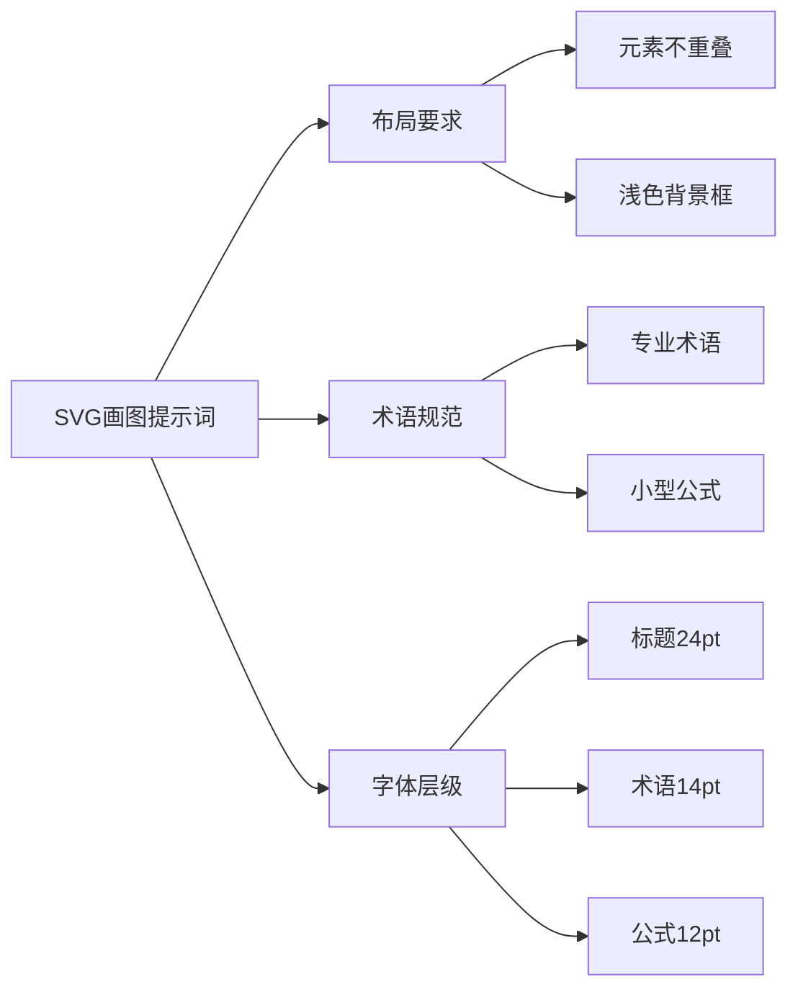

> **摘要** — Claude 3.7 SVG 画图提示词模板：元素不重叠、添加小型公式解释关键计算、使用精确专业术语、字体规范（架构标题 Fira Code Bold + 思源宋体 Bold 24pt、技术术语 JetBrains Mono + 方正书宋 14pt、数学公式 Latin Modern Math 12pt）。



```markmap height=280
# 画图提示词
## Claude 3.7 Sonnet
## 提示词模板
- 元素不重叠
- 添加小型公式
- 精确专业术语
## 字体规范
- 架构标题：Fira Code Bold + 思源宋体 Bold 24pt
- 技术术语：JetBrains Mono + 方正书宋 14pt
- 数学公式：Latin Modern Math 12pt
## 背景
- 浅色背景框
```

---

## 模型

**claude-3.7-sonnet**

### 提示词

提示词模板:

```
绘制 xxx 结构图（SVG）
- 元素不重叠，避免内容过于拥挤
- 添加小型公式来解释关键计算
- 使用精确的专业术语
- 数学公式使用公式字体，英文使用 time news roman 字体，中文使用宋体
```

**示例:**

```
以架构师的视角绘制Nginx核心架构图（SVG）
要求：
- 元素不重叠，避免内容过于拥挤
- 如有必要，则添加小型公式来解释关键计算
- 使用精确的专业术语
- 架构标题    Fira Code Bold + 思源宋体 Bold    24pt
- 技术术语    JetBrains Mono + 方正书宋    14pt
- 数学公式    Latin Modern Math    12pt
- 浅色背景框
```
