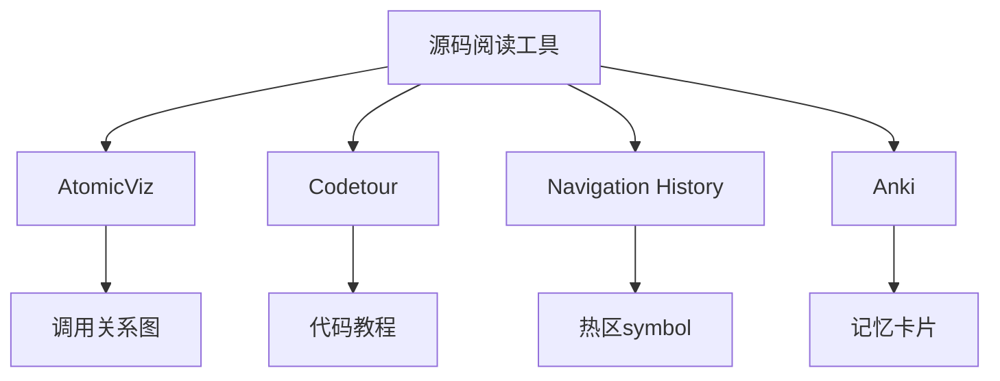

> **摘要** — 源码阅读工具推荐：AtomicViz 生成函数调用关系图、Codetour 录制代码教程、Navigation History 记录跳转历史并统计热区 symbol。参考书目《代码阅读》《程序员超强大脑》。Anki 记忆卡片配合 LLM 生成 flashcard。



```markmap height=280
# 源码阅读工具
## AtomicViz
- 函数/类/模块调用关系图
- 找到入口方法和依赖关系
## Codetour
- 录制代码教程笔记
- 跟随 git branch
## Navigation History
- 记录跳转历史
- 统计访问次数找热区
## Anki
- 记忆卡片软件
- LLM 生成 flashcard
```

---

## 参考书目

- 代码阅读: 作者 Diomidis Spinellis, 豆瓣评分 7.0, 推荐新手阅读
- 程序员超强大脑: 作者 Felienne Hermans, 豆瓣评分 7.5
