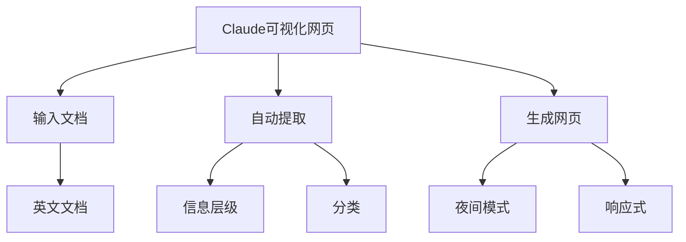

> **摘要** — 利用 Claude AI 将文档（Stripe 年度总结等英文长文）转化为美观易读的可视化网页。Claude 自动提取信息层级和分类，生成支持夜间模式和移动端响应式的可视化页面。核心技巧来自提示词工程 + Linear App 设计语言。



```markmap height=280
# Claude 可视化网页
## 核心技巧
- AI 提取信息层级
- 自动分类整理
- 参考 Linear App 设计
## 功能
- 夜间模式
- 移动端响应式
- 中英文转换
## 提示词要点
- 内容要求中文
- 设计风格参考 Linear
- 添加作者社交媒体
```

---

上次分享完如何用 Claude 写出好看的界面之后发现，这套逻辑还能解决另一个打工人更加紧迫的问题。
