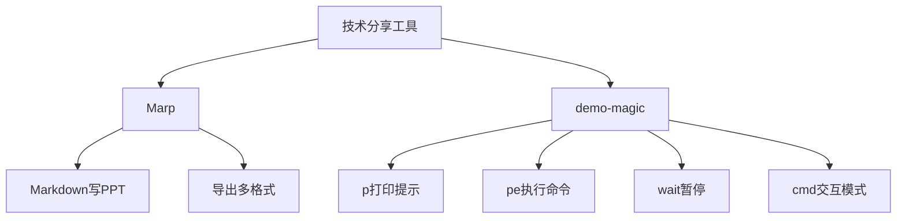

> **摘要** — 技术分享工具推荐：Marp（Markdown PPT 工具，无需在意样式，支持导出 pptx/pdf/png）、demo-magic（脚本演示控制工具，提供 p/pe/wait/cmd 四个 bash 函数控制脚本执行节奏）。参考 GitHub 仓库 jeremyxu2010/k8s-share。



```markmap height=280
# 技术分享工具
## Marp
- Markdown 格式写 PPT
- 不需在意样式
- 导出 pptx/pdf/png
- 安装 Marp for VS Code
## demo-magic
- 脚本演示控制
- 4 个 bash 函数
- p/pe/wait/cmd
- 模拟人输入过程
## 参考仓库
- jeremyxu2010/k8s-share
```

---

首先要介绍的一个工具是 Marp。进行技术分享时少不了做一个简单的 ppt，对着 ppt 给小伙伴讲讲技术。
