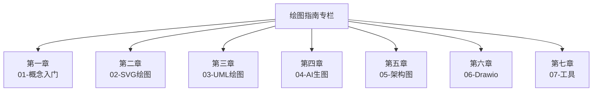

> **摘要** — 绘图指南专栏涵盖 SVG 绘图、UML 图绘制、AI 生成图片、架构图制作、Drawio 使用、绘图工具合集等内容。帮助程序员和知识工作者掌握各种绘图技能，让复杂信息可视化。



```markmap height=350
# 绘图指南专栏
## 第一章：01-概念入门
- 图言图语 / Markdown 可以做什么
## 第二章：02-SVG绘图
- Claude 架构图 / SVG 提示词
## 第三章：03-UML绘图
- PlantUML 活动图 / 技巧 / Graphviz
## 第四章：04-AI生图
- 封面图 / DeepSeek / 地图运势
## 第五章：05-架构图
- L0-L4 分层 / 架构三部曲
- 业务模型 / Prompt 搞定架构图
## 第六章：06-Drawio
- 快捷键操作指南
## 第七章：07-工具
- Markdown 模板 / 个人工具 / 写作工具链
- 画图提示词 / 源码阅读工具
- Claude 可视化网页
```

---

# 绘图指南

> 绘图指南专栏涵盖 SVG 绘图、UML 图绘制、AI 生成图片、架构图制作、Drawio 使用、绘图工具合集等内容。帮助程序员和知识工作者掌握各种绘图技能，让复杂信息可视化。

---

## 第一章：01-概念入门

- [01-01 图言图语](./01-01-intro/01-01-tu-yan-tu-yu.md) — 用图形化方式表达思想
- [01-02 Markdown 可以做什么](./01-01-intro/01-02-markdown-intro.md) — Markdown 绘图基础

---

## 第二章：02-SVG 绘图

- [02-01 Claude 架构图、原型图样样精通](./02-02-svg-drawing/02-01-claude-architecture.md) — 用 Claude 生成 SVG 架构图
- [02-02 Claude 3.7 的 SVG 绘图提示词分享](./02-02-svg-drawing/02-02-claude3.7-svg.md) — SVG 绘图提示词技巧

---

## 第三章：03-UML 绘图

- [03-01 PlantUML 绘制活动图](./03-03-uml-drawing/03-01-plantuml-activity.md) — PlantUML 活动图绘制教程
- [03-02 PlantUML 的几个技巧](./03-03-uml-drawing/03-02-plantuml-tips.md) — PlantUML 常用技巧
- [03-03 使用 Graphviz 和 PlantUML 画图](./03-03-uml-drawing/03-03-graphviz-plantuml.md) — Graphviz 与 PlantUML 结合

---

## 第四章：04-AI 生图

- [04-01 一套提示词帮你实现小红书、公众号封面自由](./04-04-ai-image/04-01-cover-prompt.md) — AI 生成封面图提示词
- [04-02 DeepSeek 制作公众号封面图太惊艳了](./04-04-ai-image/04-02-deepseek-cover.md) — DeepSeek 生图实践
- [04-03 用提示词画地图、算运势](./04-04-ai-image/04-03-map-fortune.md) — 创意生图应用

---

## 第五章：05-架构图

- [05-01 怎么画好架构图，如何分 L0～L4 级别](./05-05-architecture/05-01-architecture-layers.md) — 架构图分层指南
- [05-02 架构三部曲：架构设计方法与视图](./05-05-architecture/05-02-architecture-trilogy.md) — 架构设计方法论
- [05-03 架构实操：画好一张业务模型图](./05-05-architecture/05-03-business-model.md) — 业务模型图绘制
- [05-04 一个 Prompt 搞定架构图和思维模型](./05-05-architecture/05-04-prompt-architecture.md) — AI 辅助绘制架构图


---

## 第六章：06-Drawio

- [06-01 Drawio 快捷键全览操作指南与教程](./06-06-drawio/06-01-drawio-shortcuts.md) — Drawio 快捷键大全

---

## 第七章：07-工具

- [07-01 Markdown VScode Template](./07-07-tools/07-01-markdown-vscode.md) — Markdown VSCode 模板
- [07-02 个人工具合集](./07-07-tools/07-02-personal-tools.md) — 绘图相关工具合集
- [07-03 我的个人写作工具链](./07-07-tools/07-03-writing-tools.md) — 写作与绘图工具链
- [07-04 画图提示词](./07-07-tools/07-04-drawing-prompts.md) — 常用绘图提示词模板
- [07-05 源码阅读工具流程和方法论](./07-07-tools/07-05-source-code-tools.md) — 源码阅读工具
- [07-06 还在用 PPT？教你用 Claude 生成惊艳同事的文档可视化网页](./07-07-tools/07-06-claude-visual网页.md) — Claude 可视化网页
- [07-07 技术分享之工具推荐 Jeremy](./07-07-tools/07-07-jeremy-tools.md) — Jeremy 技术工具推荐
