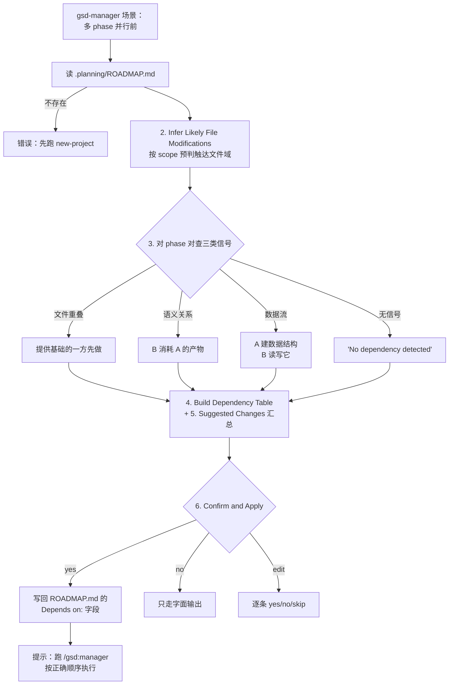

# analyze-dependencies

> 并行执行前的预体检：扫 ROADMAP 里各 phase 会改哪些文件、谁消费谁的数据结构，把该写没写 `Depends on` 的关系一条条算出来并让你确认写回——防止 `/gsd:manager` 并行执行时互相踩文件。

<!-- more -->

## 5W1H

| 项 | 内容 |
|---|---|
| **Who（谁用）** | 准备用 `/gsd:manager` 并行跑多个 phase、但 ROADMAP 里各 phase 没（或只没判）填 `Depends on:` 字段的规划者；以及手工并行 worktree 想提前知道哪几条 phase 不能同时动的人。 |
| **What（做什么）** | `1. Load ROADMAP.md`（无则 error "run /gsd:new-project first"）→ `2. Infer Likely File Modifications`（按 scope 启发式推断每个 phase 触及什么文件域）→ `3. Detect Dependency Relationships`（文件重叠 / 语义 / 数据流三类信号）→ `4. Build Dependency Table` → `5. Summarize Suggested Changes` → `6. Confirm and Apply`（yes 全写回 / no 纯文本输出 / edit 逐条确认）。产物：依赖表 + （确认后）ROADMAP.md 里的 `Depends on:` 字段。 |
| **When（何时用）** | 进入并行执行之前的规划卫生动作：ROADMAP 刚写好、正在决定哪些 phase 可以并行、或 milestone 后期想补依赖标注；也可以在 manager 报冲突文件时回头补源头。 |
| **Where（在哪里）** | `~/.claude/get-shit-done/workflows/analyze-dependencies.md`（96 行）。**零 agent 派发**——全部是文本/启发式分析加一次 ROADMAP.md 写回，7 个工作流里最轻的一个。 |
| **Why（为什么存在）** | 消除"phase 独立执行靠文件系统巧合"这个翻车点：两个 phase 都改 `prisma/schema.prisma` 却没人写 `Depends on` 时，manager 的并行调度给它们两个 worktree，merge 必炸。把"这些阶段你在语义上明明说了要在 X 之后做"（"after X is complete"、"using the X from Phase N"）从宣言变成本地文件里的机器可读字段。 |
| **How（怎么做）** | 三类信号判定：文件重叠（同一文件或同一文件域：数据库迁移/schema、API 路由与 handler、前端组件/页面、auth 中间件、配置/CI、测试 fixture、共享 lib 均有内置推断规则）；语义关系（Phase B 说 "calls/consumes/extends X that Phase A creates"、"after X is complete"、"using the X from Phase N"）；数据流（A 建数据结构/schema/API contract，B 消费或实现客户端）。每对 phase 检查后产出 `→ Depends on: <Phase M> — reason: ...`；无信号的明确报告 "No dependency detected between Phase X and Phase Y"。 |

## 工作原理

关键设计：分三层信号而不是一张大表——文件重叠是最硬的（两个 phase 改同一个文件必须串行），语义关系靠短语匹配（"once X is built"、"calls X"）谨慎捕获，数据流是最容易漏的一类，因为 A 和 B 描述的是同一件事的两半但词面完全不同。写回边界清晰：只改 `Depends on:` 字段，保留其他 phase 内容不动、不重排序、逐条确认后才落盘；应用后工作流只负责跑一句"Run /gsd:manager to execute phases in the correct order"——真正按依赖顺序串起 worktree 的是 manager，不是本工作流。

## 产出与影响

| 项 | 内容 |
|---|---|
| **读取** | `.planning/ROADMAP.md`（并从已有 `Depends on:` 字段装载现状） |
| **写入** | 确认 yes / edit 后往 ROADMAP.md 的各 phase 条目里写入或更新 `Depends on:` 字段；确认 no 时零写入，产物即屏幕上的依赖表 |
| **派发 agent** | 零。全部是内联文本分析和一次 ROADMAP.md 修改 |
| **成功标准** | 依赖表明晰（谁依赖谁 + 原因归类为 overlap/semantic/data-flow）、建议变化有汇总 diff、确认 no / edit 逐条走、无依赖的 phase 对明确标注 "no change needed / independent scope"、写回后提示跑 manager |

## 适用场景

- ROADMAP 里有 5+ 个 phase 准备交给 `/gsd:manager` 并行跑前先过一遍依赖卫生
- 发现 execute-phase 之后 verify 阶段批量判"verifier 报'引用了未实现的 schema/endpoint'"这种语义级踩脚，从源头补 `Depends on`
- milestone 复盘时确认"哪些 phase 事实上互不依赖，可拆给多个 worktree"
- 尚未开 phase 前（只有 goal 句）就初判依赖格局，作为讨论阶段对齐输入的一部分

## 反模式与陷阱

- **文件修改靠启发式推断**：源码第 2 步对没有显式 `files_modified` 的 phase 按类别规则（api→route/controller，db→migration…）猜文件域——这是"读字面意图"不是 grep 代码库，推断错了依赖理由就跟着错。
- **没检测到信号 ≠ "真的独立"**：报告里 "No dependency detected" 是本轮证据为空的诚实声明，不保证真正独立——隐式耦合要靠你手工补 `Depends on`，工具不会追问。
- **Confirm and Apply 选 no 不写文件**：no 只把建议当文本输出并结束——退出后 ROADMAP 不变，manager 看不到这些依赖。
- **它不改 phase 执行顺序本身**：只写 `Depends on:` 字段、不重排 phases——真正按依赖调度并行 worktree 的是 `/gsd:manager`，别把"依赖分析完成"当作"依赖问题解决"。

## 参见

- [index.md](./index.md) — 专栏总纲：三层架构、Gate 四分类、主链状态机
- [plan-phase](./plan-phase.md) — 主链规划端：依赖写入后由 manager 按顺序派发
- [spec-phase](./spec-phase.md) — 另一种前置盘点工具：量化需求的清晰度
- GitHub: [get-shit-done](https://github.com/gsd-build/get-shit-done)
- 源码：`~/.claude/get-shit-done/workflows/analyze-dependencies.md`（GSD 1.42.3）
