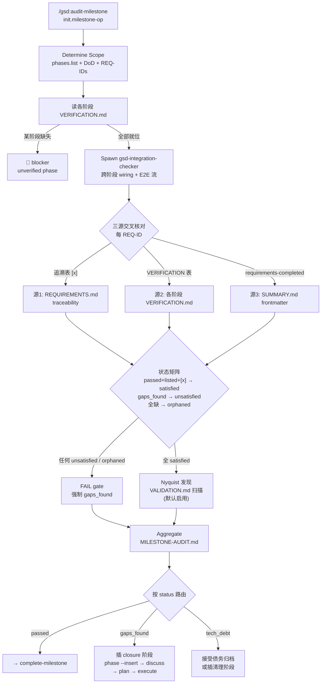

# audit-milestone

> 里程碑级验收：聚合各阶段的 VERIFICATION.md、派集成检查器查跨阶段接线、用三源交叉核对需求覆盖，产出 MILESTONE-AUDIT.md——单阶段验证看不到的断裂在这里现形。

<!-- more -->

## 5W1H

| 项 | 内容 |
|---|---|
| **Who（谁用）** | 里程碑所有阶段跑完、准备 complete-milestone 归档的人。关心的是"这个版本整体能不能交付"，而不是某个阶段内部质量。 |
| **What（做什么）** | 初始化里程碑上下文 → 确定范围（阶段清单 + DoD + 需求映射）→ 逐个读阶段 VERIFICATION.md（缺失 = blocker）→ 派 gsd-integration-checker 查跨阶段接线与 E2E 流 → 三源交叉核对需求（REQUIREMENTS 追溯表 / VERIFICATION 需求表 / SUMMARY frontmatter）→ FAIL gate + orphan 检测 → Nyquist 合规发现 → 聚合成 `v{version}-MILESTONE-AUDIT.md` → 按状态路由下一步。 |
| **When（何时用）** | `/gsd:audit-milestone {version}`。前置条件：里程碑内每个阶段都跑过 verify（否则"unverified phase"直接是 blocker）；里程碑需求在 REQUIREMENTS.md 追溯表里映射到阶段。 |
| **Where（在哪里）** | 工作流实现 `~/.claude/get-shit-done/workflows/audit-milestone.md`（357 行）。派发 **1 个 gsd-integration-checker**（步骤 3，携带全部阶段目录、SUMMARY 导出、API 路由与 `MILESTONE_REQ_IDS`）。步骤用编号组织（0–7），无 `<step name>` 标签。 |
| **Why（为什么存在）** | 单阶段验证天然盲区：跨阶段接线断裂、需求在追溯表里打了 `[x]` 但从没被任何阶段验证过（orphan）、技术债跨阶段堆积。它把"需求满足"从"阶段自说自话"变成"三源互相印证"——任何单一来源撒谎都会被另两个戳穿。 |
| **How（怎么做）** | 八个编号步骤：`0. Initialize Milestone Context`（init.milestone-op + resolve-model）→ `1. Determine Milestone Scope`（phases.list + DoD + 需求映射）→ `2. Read All Phase Verifications`（缺 VERIFICATION.md 即 flag blocker）→ `3. Spawn Integration Checker` → `4. Collect Results` → `5. Check Requirements Coverage`（5a 追溯表 / 5b VERIFICATION 表 / 5c SUMMARY frontmatter / 5d 状态矩阵 / 5e **FAIL gate**：任何 unsatisfied 强制 gaps_found + orphan 检测）→ `5.5 Nyquist Compliance Discovery`（`workflow.nyquist_validation` 默认启用，只发现不自动修）→ `6. Aggregate into v{version}-MILESTONE-AUDIT.md`（status: passed / gaps_found / tech_debt）→ `7. Present Results`。 |

## 工作原理

关键设计取舍：5e 的 **FAIL gate 是硬规则**——一个 unsatisfied 需求就能把整个里程碑打成 gaps_found，没有"其他阶段都过了就放行"的商量余地。与之配套的 orphan 检测专门抓"追溯表里有、所有 VERIFICATION 里都没有"的需求：被分配过、从未被验证过，直接按 unsatisfied 处理。而 Nyquist 部分刻意只做**发现**——源码明写"never auto-calls /gsd:validate-phase"，避免审计流程擅自触发重验证的副作用。

## 产出与影响

| 项 | 内容 |
|---|---|
| **读取** | `init.milestone-op`、`phases.list`、`find-phase`、各阶段 `*-VERIFICATION.md`、`*-SUMMARY.md`（`requirements_completed` 字段）、`REQUIREMENTS.md` 追溯表、`ROADMAP.md` DoD、各 `*-VALIDATION.md`（Nyquist） |
| **写入** | `.planning/v{version}-MILESTONE-AUDIT.md`（frontmatter 含 scores / gaps / tech_debt 结构化对象，正文含需求/阶段/集成/技术债四张表）。注：源码 aggregate 模板行写的是 `v{version}-v{version}-MILESTONE-AUDIT.md`（双前缀），而同文件其余 4 处展示路径都是单前缀——这是源码自身的命名不一致，不是稳定 API 契约 |
| **派发 agent** | gsd-integration-checker × 1（携带 MILESTONE_REQ_IDS，要求每个集成发现映射到受影响的 REQ-ID） |
| **成功标准** | 范围识别；全部 VERIFICATION.md 已读；SUMMARY frontmatter 已提取；追溯表已解析；三源交叉核对完成；orphan 已检测；技术债与延期 gap 已聚合；集成检查器带需求 ID 派发；AUDIT.md 含结构化需求 gap 对象；FAIL gate 强制执行；Nyquist 扫描（如启用）；缺 VALIDATION.md 的阶段被标记并建议 validate-phase；结果带可执行下一步呈现 |

## 适用场景

- 里程碑收尾前，确认"所有需求真的被满足过"而不只是追溯表里打了勾
- 跨阶段接线怀疑断裂（Phase 2 建的 API，Phase 5 的前端从没接上）
- 归档前想给技术债一个正式清单，决定"接受归档"还是"插清理阶段"
- 有 VALIDATION.md 的里程碑：Nyquist 合规盘点，找出 partial/missing 的阶段
- 需求被分配但从未验证的疑似 orphan 场景

## 反模式与陷阱

- **缺失 VERIFICATION.md 不是警告是 blocker**：步骤 2 明确"flag it as unverified phase — this is a blocker"。阶段没验证过就跳过审计，等于默认它通过——这条路径被源码堵死。
- **orphan 需求的判定很暴力**：追溯表里存在但**所有**阶段 VERIFICATION.md 都找不到的 REQ-ID，直接按 unsatisfied 处理，不会因为"可能在某阶段隐式完成了"就放过。被分配过就要有验证记录。
- **Nyquist 只发现不修**：`workflow.nyquist_validation` 默认启用，但审计只输出 `nyquist: {compliant, partial, missing, overall}` YAML 并建议 `/gsd:validate-phase {N}`，绝不自动调用——看到 MISSING 别等它自己修。
- **三个 status 是三岔路不是两岔**：`tech_debt`（无 blocker 但有堆积债）是独立第三态，路由到"接受归档"或"插清理阶段"二选一——不是 gaps_found 的弱化版，是"可以归档但债要入册"的正式判定。
- **集成检查器要求发现→需求映射**：派发 prompt 里" MUST map each integration finding to affected requirement IDs"——集成问题若挂不上任何 REQ-ID，说明需求追溯表本身有洞，这也是审计要暴露的信号。

## 参见

- [index.md](./index.md) — 专栏总纲：三层架构、Gate 四分类、主链状态机、依赖关系
- [verify-phase](./verify-phase.md) — 本页聚合的每阶段 VERIFICATION.md 的来源
- [verify-work](./verify-work.md) — 用户侧 UAT，阶段验证的另一种形态
- [undo](./undo.md) — 里程碑验收发现要回滚阶段/计划时用
- GitHub: [get-shit-done](https://github.com/gsd-build/get-shit-done)
- 源码：`~/.claude/get-shit-done/workflows/audit-milestone.md`（GSD 1.42.3）