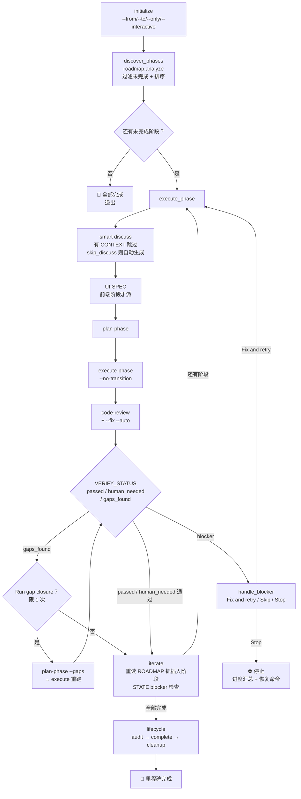

# autonomous

> 自主驱动里程碑阶段——逐个阶段 discuss → plan → execute 循环，只在灰区接受、blocker、验证请求处暂停；全部完成后自动 audit → complete → cleanup。

<!-- more -->

## 5W1H

| 项 | 内容 |
|---|---|
| **Who（谁用）** | 想"一键跑完剩余所有阶段"的项目作者；或只跑某个范围（`--from N`/`--to N`）、单阶段（`--only N`）的人；`--interactive` 时希望后台 build 的同时继续回答讨论问题的人。 |
| **What（做什么）** | `initialize` 解析 flags + `init.milestone-op` → `discover_phases` 用 `roadmap.analyze` 过滤未完成阶段并按数值排序 → 逐阶段 `execute_phase`：smart discuss（有 CONTEXT 跳过；`skip_discuss=true` 自动生成最小 CONTEXT；interactive 用 gsd-discuss-phase）→ 前端阶段生成 UI-SPEC（gsd-ui-phase）→ plan（interactive 时后台 agent）→ execute（`--no-transition`）→ code-review + `--fix --auto` → 读 VERIFICATION.md 按状态路由（passed 自动续 / human_needed 问人 / gaps_found 三选 + 限 1 次 gap closure）→ UI review（前端阶段）→ `iterate`（重读 ROADMAP 抓动态插入阶段；STATE blocker 检查）→ 全部完成后 `lifecycle`（audit → complete → cleanup）。产物：每阶段 CONTEXT/PLAN/SUMMARY/VERIFICATION + 里程碑归档 `v{X}-ROADMAP.md` + 清理。 |
| **When（何时用）** | 里程碑有未完成阶段、想无人值守跑完时；或只想跑 `5.1` 这类 gap 阶段（`--only`）。前置：ROADMAP.md 与 STATE.md 必须存在（任一缺失 → 报错建议 `new-milestone`）。flag：`--from N` / `--to N` / `--only N`（同时设 FROM）/ `--interactive`。 |
| **Where（在哪里）** | 工作流实现 `~/.claude/get-shit-done/workflows/autonomous.md`（789 行）。**Skill 平铺派发**（非 Agent）：`gsd-discuss-phase`（仅 interactive）→ `gsd-ui-phase`（前端阶段）→ `gsd-plan-phase` → `gsd-execute-phase --no-transition` → `gsd-code-review` + `--fix --auto` → `gsd-plan-phase --gaps` → `gsd-ui-review` → `gsd-audit-milestone` → `gsd-complete-milestone` → `gsd-cleanup`。**Agent 派发仅 interactive 模式**：2 个后台 Agent（plan 与 execute，`run_in_background=true`）。 |
| **Why（为什么存在）** | 消除"阶段间人肉交接"的摩擦——主链每条 Skill 边界都要人点头的模式不适合批量推进。它只在真正需要人决策的点暂停（灰区/blocker/验证/gap/审计），其余自动；gap closure 限 1 次防死循环；每阶段后重读 ROADMAP 抓中途插入的 decimal 阶段（如 5.1）。 |
| **How（怎么做）** | 7 个 step：`initialize` → `discover_phases` → `execute_phase`（含 3a/3a.5/3b/3c/3c.5/3d/3d.5 子步）→ `smart_discuss` → `iterate` → `lifecycle` → `handle_blocker`。判定逻辑：`has_context` 是权威——一旦 true 不再重跑 discuss（单趟原则）；VERIFY_STATUS 路由表（`passed`→iterate、`human_needed`→问 Validate now/Continue、`gaps_found`→Run gap closure/Continue/Stop）；AUDIT_STATUS（`passed` 无暂停自动续，`gaps_found`/`tech_debt` 问人）；`--only` 跳过 lifecycle；`--to` 到达即停。 |

## 工作原理

关键设计：所有**用户交互点都显式列举**——smart discuss 的批量表格提案（逐项接受/覆盖）、human_needed 验证请求、gaps_found 三选、审计 gap/tech debt——除此之外一律不停。gap closure 被硬编码限 1 次重试（"prevents infinite loops"）。`--interactive` 是流水线并行：Phase N 的 plan+execute 在后台 agent 里跑，主上下文只积累讨论对话，边答 Phase N+1 的问题边等 N 构建完。注意边界——它只把**当前阶段**的 plan/execute 放后台并允许主会话讨论下一阶段，**不会**绕过当前阶段 plan→execute 的依赖，也**不会**同时执行多个阶段的代码构建。

## 产出与影响

| 项 | 内容 |
|---|---|
| **读取** | `$ARGUMENTS`、`init.milestone-op`、`roadmap.analyze`、`init.phase-op`、STATE.md、VERIFICATION.md、`.planning/v{X}-MILESTONE-AUDIT.md` |
| **写入** | 每阶段 CONTEXT/PLAN/SUMMARY/VERIFICATION、UI-SPEC/UI-REVIEW、里程碑归档 `.planning/milestones/v{X}-ROADMAP.md`、cleanup 后的目录结构 |
| **派发 agent** | 默认模式零 Agent（全靠 Skill() 平铺调用）；`--interactive` 模式派 2 个后台 Agent（plan-phase 代理、execute-phase 代理，`run_in_background=true`） |
| **成功标准** | 所有未完成阶段按序执行（smart discuss → ui-phase → plan → execute → ui-review）；smart discuss 批量表格逐项接受/覆盖；execute-phase 以 `--no-transition` 调用（transition 由本工作流管理）；验证按状态路由；gap closure 限 1 次；每阶段后重读 ROADMAP；STATE blocker 检查；全部完成后 lifecycle 被调用而非手动建议；`--only` 跳过 lifecycle；`--to` 提前停止；`--interactive` 流水线并行 |

## 适用场景

- 里程碑收尾，批量跑完剩余全部阶段
- 只跑一个阶段：`--only 5.1`（gap 阶段单跑，跳过 lifecycle）
- 指定范围：`--from 3 --to 6`
- 前端密集的里程碑：自动 UI-SPEC 生成 + 执行后 UI review 链
- 交互监督模式：`--interactive` 边答讨论边后台构建

## 反模式与陷阱

- **discuss 单趟**：`has_context` 是权威，一旦 true 绝不重跑 discuss（"MUST NOT loop"）——别以为重跑能补 context，那只会浪费一轮。
- **`--only` 跳过 lifecycle**：audit/complete/cleanup 不会跑，需要全部完成后重新 `/gsd:autonomous`（不带 `--only`）才触发。
- **gap closure 限 1 次**：一次 closure 后仍 gaps_found 就问 "Continue anyway / Stop autonomous mode"——防死循环的硬上限。
- **进度条 T 是里程碑总阶段数不是剩余数**：阶段 63 号、里程碑共 7 阶段时显示 "Phase 63/7"，不是 63/3（剩余 3 个会误导）。
- **CTRL-01 例外**：audit `passed` 时无用户暂停直接进 complete；cleanup 的内部 dry-run 确认被显式视为可接受暂停。
- **interactive 的 execute 用 `--no-transition`**：transition 由 autonomous 自己管理，不要手动加 transition 调用——那是 execute-phase 内部的事。

## 参见

- [index.md](./index.md) — 专栏总纲：三层架构、Gate 四分类、主链状态机、依赖关系
- [execute-phase](./execute-phase.md) — 被 Skill 调用的执行体（`--no-transition` 链）
- [discuss-phase](./discuss-phase.md) — smart discuss 的源头：标准讨论阶段
- [complete-milestone](./complete-milestone.md) — lifecycle 中的收尾环节
- GitHub: [get-shit-done](https://github.com/gsd-build/get-shit-done)
- 源码：`~/.claude/get-shit-done/workflows/autonomous.md`（GSD 1.42.3）