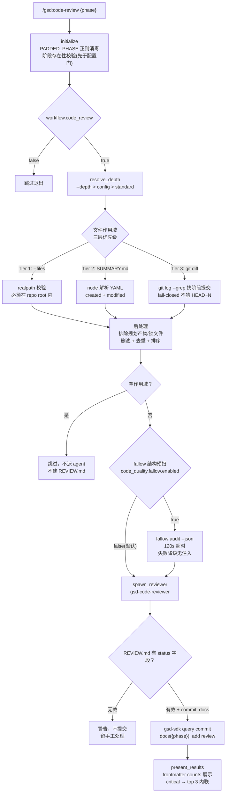

# code-review

> 阶段源码质量审查：先算准"该审哪些文件"（三层作用域，宁可失败关闭也不瞎猜），再派 gsd-code-reviewer 找 bug/安全问题，REVIEW.md 入库并展示结论。

<!-- more -->

## 5W1H

| 项 | 内容 |
|---|---|
| **Who（谁用）** | 阶段执行完、想在自己代码进入下一阶段前过一遍质量关的项目作者。不关心测试通过与否（那是 verify 的事），关心"有没有 bug、有没有安全洞、有没有烂代码"。 |
| **What（做什么）** | 初始化（输入消毒 + 阶段校验**先于**配置门）→ 配置门（`workflow.code_review` 默认开）→ 解析深度（--depth > config > standard）→ 计算文件作用域（--files > SUMMARY.md > git diff 三层，含排除/删滤/去重/排序）→ 空作用域即退出 → 可选 fallow 结构预扫 → 派 gsd-code-reviewer 写 REVIEW.md → 校验 frontmatter 后提交 → 内联展示 findings。 |
| **When（何时用）** | `/gsd:code-review {phase}`，execute 之后、归档之前。`--files=file1,file2` 覆盖作用域、`--depth=quick|standard|deep` 覆盖深度。配置 `workflow.code_review=false` 时显式跳过。 |
| **Where（在哪里）** | 工作流实现 `~/.claude/get-shit-done/workflows/code-review.md`（613 行）。派发 **1 个 gsd-code-reviewer**（`spawn_reviewer` 步骤，携带文件清单/depth/review_path/diff_base）。步骤：`initialize` → `check_config_gate` → `resolve_depth` → `compute_file_scope` → `check_empty_scope` → `structural_pre_pass` → `spawn_reviewer` → `commit_review` → `present_results`。 |
| **Why（为什么存在）** | 消除"审查范围靠猜"的特例：SUMMARY.md 没写文件路径、或写的路径不存在时，靠 `git log --grep` 找阶段提交算 diff base——**fail closed**，找不到可靠 base 就明说"用 --files 指定"，绝不回退到任意的 `HEAD~N`。同时挡住路径遍历（--files 必须落在 repo root 内）和空审查（没文件就不派 agent、不建 REVIEW.md）。 |
| **How（怎么做）** | 九步串行。关键判定：`compute_file_scope` 三层优先级 D-01/D-02/D-08——Tier 1 `--files`（realpath 校验在仓库内）＞ Tier 2 SUMMARY.md 的 `key_files.created/modified`（node YAML 解析，避开 awk 脆弱解析）＞ Tier 3 git diff（`git log --oneline --all --grep={padded_phase}` 取末提交的父作 base）；后处理统一排除 `.planning/`、`ROADMAP.md`、`STATE.md`、`*-SUMMARY/VERIFICATION/PLAN.md` 与锁文件，过滤已删除文件、去重、排序。`spawn_reviewer` 里 agent 失败则**不建空 REVIEW.md 直接退出**。`commit_review` 校验 REVIEW.md 有 `status` 字段才提交，否则警告并留手工处理。`present_results` 只从 frontmatter 提 counts，critical/warning 时内联 top 3（`### CR-`/`### BL-`/`### WR-` 前缀）。 |

## 工作原理

关键设计取舍：作用域三层不是"尽力而为"，而是**显式优先级契约**——`--files` 给了就跳过 SUMMARY/git 两层（D-08 最高优先）；SUMMARY 能提取到路径就不用 git（D-01）；git 层是最后兜底且 fail closed。fallow 结构预扫（`structural_pre_pass`）默认**关闭**、opt-in，且任何失败（二进制缺失/超时/非零退出）都降级为"不注入 structural_findings"，审查照常跑——可选的增强不能变成主流程的故障点。

## 产出与影响

| 项 | 内容 |
|---|---|
| **读取** | `init.phase-op`、`workflow.code_review` / `workflow.code_review_depth` / `code_quality.fallow.*` 配置、各 `*-SUMMARY.md`（node YAML 提取）、`git log --grep` 阶段提交、fallow JSON |
| **写入** | `{PHASE_DIR}/{PADDED_PHASE}-REVIEW.md`（由 gsd-code-reviewer 写），`commit_docs=true` 时提交；可选 `{PHASE_DIR}/FALLOW.json` |
| **派发 agent** | gsd-code-reviewer × 1（`spawn_reviewer`）；失败时不产出 REVIEW.md、不提交、直接退出 |
| **成功标准** | 阶段校验在配置门之前；配置门检查；深度解析并校验（quick\|standard\|deep）；三层作用域计算；畸形/缺失 SUMMARY 优雅回退；已删文件滤除；去重排序；空作用域跳过（不派 agent）；agent 携带文件清单/depth/review_path/diff_base 派发；agent 失败无部分提交；REVIEW.md 创建则提交；内联展示结果并给下一步 |

## 适用场景

- 阶段改动文件明确（SUMMARY.md 有 key_files）——走 Tier 2，精准审查
- SUMMARY 没写文件路径或写的路径失效——Tier 3 git diff 兜底，但仍要求阶段提交存在
- 只想复审某几个文件（`--files`），或想快速过一遍（`--depth=quick`）
- 配了 fallow 的项目想先做结构预扫再喂给 reviewer（`code_quality.fallow.enabled=true`）
- 审查后发现问题，用 `--fix` 让 gsd-code-reviewer 自动修（present_results 提示的下一步）

## 反模式与陷阱

- **`--files` 有路径遍历防护**：`realpath -m` 后的绝对路径必须以 `REPO_ROOT` 开头，否则打印 "File path outside repository, skipping"。macOS 无 GNU coreutils 时 `realpath -m` 不可用，路径校验**fail-closed**（无法验证的路径一律拒绝）——不是报错，是安全兜底。
- **大作用域自动降级**：文件数 > 50 会警告"large review scope"，且 `--depth=deep` 被**强制降回 standard**——别指望 200 个文件还能得到 deep 级审查。
- **REVIEW.md 没 status 字段就不提交**：`commit_review` 用 node 校验 frontmatter，无效时只警告"Not committing. Review manually"，留下手工处理路径——提交闸是结构性的，不是看内容好坏。
- **git diff 层可能根本无文件可审**：没有找到阶段提交（`git log --grep {padded}` 为空）时打印 "Cannot determine reliable diff scope" 并建议 `--files`——这是显式的 fail-closed 设计，不是 bug。空作用域直接跳过审查。
- **Windows 依赖 Git Bash/WSL**：源码 platform_notes 明确"Native PowerShell is not supported"；bash 数组与进程替换是硬依赖。CI 矩阵在 Windows runner 上也跑 Git Bash 才兼容。

## 参见

- [index.md](./index.md) — 专栏总纲：三层架构、Gate 四分类、主链状态机、依赖关系
- [verify-phase](./verify-phase.md) — 目标导向验证（查"交付了吗"，本页查"代码好吗"）
- [diagnose-issues](./diagnose-issues.md) — 审查发现的缺陷可走并行根因诊断
- GitHub: [get-shit-done](https://github.com/gsd-build/get-shit-done)
- 源码：`~/.claude/get-shit-done/workflows/code-review.md`（GSD 1.42.3）