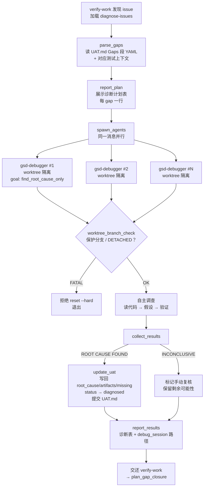

# diagnose-issues

> 并行根因诊断：UAT 报出症状后，每个 gap 派一个 gsd-debugger 独立查根因，再把真实诊断写回 UAT.md 交给 plan-phase --gaps——先搞清楚"为什么坏"，再谈怎么修。

<!-- more -->

## 5W1H

| 项 | 内容 |
|---|---|
| **Who（谁用）** | 不是直接命令——它是 verify-work 在 UAT 发现 issue 后**自动进入**的内部工作流（`diagnose_issues` 步骤加载它）。orchestrator 保持精简：只解析 gaps、派 agent、收结果、更新 UAT。 |
| **What（做什么）** | 从 UAT.md 的 Gaps 段（YAML）解析每个 gap 及对应测试上下文 → 读 worktree 配置并向用户报告诊断计划 → **同一消息内并行**派发每个 gap 一个 gsd-debugger（症状预填、worktree 隔离）→ 收集根因（`## ROOT CAUSE FOUND` 或 `## INVESTIGATION INCONCLUSIVE`）→ 把 `root_cause`/`artifacts`/`missing`/`debug_session` 写回 UAT.md gaps，frontmatter status 置 `diagnosed` 并提交 → 展示诊断表并交还 verify-work。 |
| **When（何时用）** | verify-work 的 `diagnose_issues` 步骤在 UAT 会话结束后自动触发（"Diagnosis runs automatically - no user prompt"）。agent 超时后可用 `/gsd:debug` 恢复部分进度。 |
| **Where（在哪里）** | 工作流实现 `~/.claude/get-shit-done/workflows/diagnose-issues.md`（240 行）。派发：**每 gap 一个 gsd-debugger，全部在同一消息内并行 spawn**；`USE_WORKTREES != "false"`（默认 true）时加 `isolation="worktree"`。调试会话写入 `.planning/debug/DEBUG-{slug}.md`（DEBUG_DIR）。步骤：`parse_gaps` → `report_plan` → `spawn_agents` → `collect_results` → `update_uat` → `report_results`。 |
| **Why（为什么存在）** | 消除"猜修复"成本：UAT 只告诉 WHAT 坏了（症状），不告诉 WHY。没有诊断时 "Comment doesn't refresh" → 猜一个修复 → 可能修错；有诊断 → "useEffect missing dependency" → 精确修复。核心原则一句话：**Diagnose before planning fixes**。 |
| **How（怎么做）** | 六步串行。`spawn_agents` 关键逻辑：模板填充 `{truth}/{expected}/{actual}/{errors}/{reproduction}/{timeline}`，`{goal}` 固定为 `find_root_cause_only`（只诊断不修，修复归 plan-phase --gaps）；prompt 内嵌 `<worktree_branch_check>` 硬闸——先断言 HEAD 在 disposable worktree 分支上，`DETACHED` 或 `main|master|develop|trunk|release/*` 直接 FATAL 拒绝 `reset --hard`，非 `worktree-agent-*` 命名空间也拒绝，base 不一致才 reset。`collect_results` 对 `INCONCLUSIVE` 返回标记"手动复核"并保留剩余可能性。`update_uat` 提交 "docs({phase}): add root causes from diagnosis"。`report_results` 明写 "Do NOT offer manual next steps - verify-work handles the rest"。 |

## 工作原理

关键设计取舍：并行是**同一消息内全部 spawn**（"All agents spawn in single message"），配合 ORCHESTRATOR RULE——派发后 orchestrator 立即停止读文件/改代码，等全部 subagent 返回，从机制上杜绝重复编辑。worktree_branch_check 把"可安全 `reset --hard`"约束成三重条件（非保护分支 + `worktree-agent-*` 命名空间 + base 匹配），只对不一致的 base 才 reset——这是"诊断 agent 有破坏力，但破坏被锁在一次性工作树里"的设计。

## 产出与影响

| 项 | 内容 |
|---|---|
| **读取** | `{phase_dir}/{phase_num}-UAT.md`（Gaps + Tests 段）、`.planning/STATE.md`、`agent-skills gsd-debugger`、`workflow.use_worktrees` 配置 |
| **写入** | `.planning/debug/DEBUG-{slug}.md`（agent 调查会话）、UAT.md gaps 的 `root_cause/artifacts/missing/debug_session` 字段 + frontmatter `status: diagnosed`、`gsd-sdk query commit` |
| **派发 agent** | gsd-debugger × N（每个 gap 一个，同一消息并行，worktree 隔离，goal=`find_root_cause_only`） |
| **成功标准** | gaps 从 UAT.md 解析；debug agent 并行派发；全部 agent 的根因已收集；UAT.md gaps 更新 artifacts 与 missing；调试会话存入 `.planning/debug/`；交还 verify-work 自动规划 |

## 适用场景

- UAT 报出多个互不相关的 issue——并行诊断把总耗时压到最慢那个 agent 的时间
- 症状明确但根因藏在接线层（"能显示但刷新后才出现"这类 useEffect/依赖问题）
- 需要给 plan-phase --gaps 提供真实根因而非猜测，减少修复计划返工
- 单 agent 超时后想找回 `.planning/debug/` 里的部分进度继续查

## 反模式与陷阱

- **diagnose 只查因不修因**：`{goal}` 固定 `find_root_cause_only`，agent 绝不应用修复——修复由 plan-phase --gaps 规划、execute-phase 执行。指望诊断 agent 顺手改代码，流程会错位。
- **worktree 有硬性安全闸**：`<worktree_branch_check>` 要求 HEAD 必须匹配 `worktree-agent-*` 命名空间，`DETACHED` 或 `main/master/develop/trunk/release/*` 直接 FATAL——这是显式设计（防 EnterWorktree 从 main 建分支导致的数据损失），不是过度防御。`USE_WORKTREES=false` 时隔离被取消，但分支检查仍在。
- **INCONCLUSIVE 会被如实上报**：agent 返回 `## INVESTIGATION INCONCLUSIVE` 时 root_cause 记为 "manual review needed" 并保留剩余可能性——诊断失败不会阻塞其他 gap，但也不会被粉饰成根因。
- **全 agent 失败有降级路径**：`failure_handling` 规定全部失败视为系统性原因（权限、git），回退到 plan-phase --gaps **不带根因**规划——精度下降但流程不中断。看到"less precise"的修复计划，先回头查是不是系统性故障。
- **它不给你手动下一步**：`report_results` 明写"Do NOT offer manual next steps - verify-work handles the rest"。想介入得在 verify-work 层停，而不是在这条链里插话。

## 参见

- [index.md](./index.md) — 专栏总纲：三层架构、Gate 四分类、主链状态机、依赖关系
- [verify-work](./verify-work.md) — 本工作流的调用方（UAT → 诊断 → 规划修复链）
- [code-review](./code-review.md) — 静态质量审查，与运行时根因诊断互补
- GitHub: [get-shit-done](https://github.com/gsd-build/get-shit-done)
- 源码：`~/.claude/get-shit-done/workflows/diagnose-issues.md`（GSD 1.42.3）