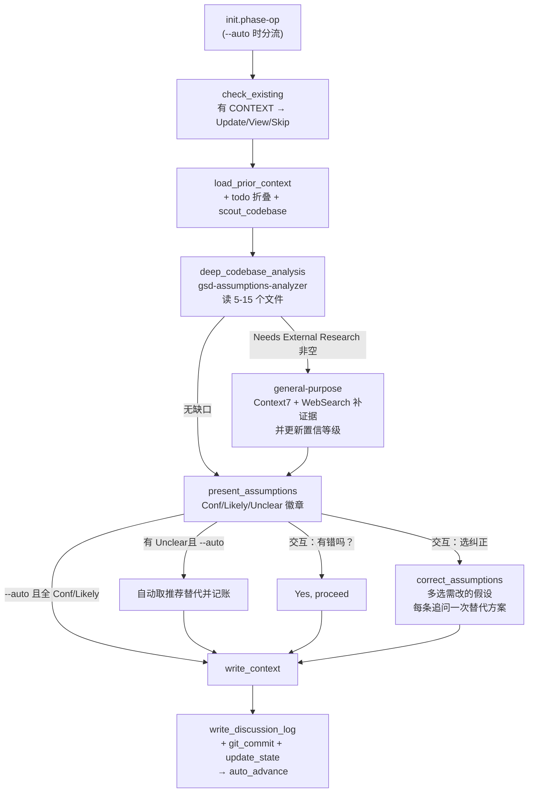

# discuss-phase-assumptions

> discuss-phase 的代码先行变体：不先问"你想怎么实现"，而是先派 agent 深读代码库形成有依据的假设，再让你只纠正错的部分——把 ~15–20 个问答压成 ~2–4 个纠正。

<!-- more -->

## 5W1H

| 项 | 内容 |
|---|---|
| **Who（谁用）** | 想在已有代码库上动工、决策偏好明确但没耐心被访谈的项目作者——环境不是从零开始，存量模式本身就是答案来源——上下游产物与标准 discuss-phase 完全一致，可直接互换入口。 |
| **What（做什么）** | `initialize`（解析 `--auto` 分流）→ `check_existing` → `load_prior_context` → `cross_reference_todos` → `load_methodology` → `scout_codebase` → `deep_codebase_analysis`（派 `gsd-assumptions-analyzer` 读 5–15 个文件返回结构化假设）→ 可选 `external_research`（代码证据不够时派 general-purpose 补库/生态信息）→ `present_assumptions`（带 Confident/Likely/Unclear 置信徽章）→ `correct_assumptions`（选中即改）→ `write_context`（同 CONTEXT.md 格式）→ `write_discussion_log` / `git_commit` / `update_state` / `confirm_creation` / `auto_advance`。 |
| **When（何时用）** | 与 discuss-phase 同门，只是交互形态不同：`--auto` 下流程一气推到写 CONTEXT（Assumptions 全 Confident/Likely 则跳过确认门；Unclear 的自动取 recommended 默认）；交互模式下每条假设各给一次纠错。 |
| **Where（在哪里）** | `~/.claude/get-shit-done/workflows/discuss-phase-assumptions.md`（674 行）。派发 agent 两个，按顺序：`gsd-assumptions-analyzer`（`deep_codebase_analysis`，可选 calibration tier: full_maturity / standard / minimal_decisive）→ `general-purpose`（`external_research`，仅当 analyzer 报告 `Needs External Research` 非空）。 |
| **Why（为什么存在）** | 消除"把代码里已写明的事拿来问你"这个浪费源——大多实现约定在代码里已经摆着，问用户等于审讯不必要的事。哲学段原话：先读代码、再形成观点、只问真正不清楚的；每条假设必须带证据文件路径 + 错了会有什么后果 + 置信等级，没依据的错误假设在写 CONTEXT 之前就被挡下。 |
| **How（怎么做）** | 假设的结构即判定逻辑：每条带 `Assumption / Why this way (带文件路径) / If wrong (后果) / Confidence`。Calibration tier 优先级：config 的 `preferences.vendor_philosophy` → USER-PROFILE 的 Vendor Choices 评分 → default "standard"；conservative/thorough-evaluator 映射 full_maturity（3–5 区域每项 2–3 备选），opinionated 映射 minimal_decisive（2–3 区域每项一锤定音）。外部研究段用 Context7 先解析 ID 再查 docs，WebSearch 补生态最佳实践，命中后回填置信等级与来源。 |

## 工作原理

关键设计：读代码的重活放进了 subagent（`deep_codebase_analysis` 段明说"把原始文件内容挡在主上下文外保 token 预算"），主会话只拿结构化的假设清单；`external_research` 默认跳过（大多数阶段不触发），只在 codebase 证据不足时填"库版本兼容、生态惯例"这类只靠本地代码回答不了的题。与标准 discuss-phase 的交互密度差是硬指标：源码写明 `~2-4 corrections vs ~15-20 questions`，这就是模式的身份边界——讨论的总输入从"用户知道的东西"换成了"代码里已经决定的事"。

## 产出与影响

| 项 | 内容 |
|---|---|
| **读取** | ROADMAP/PROJECT/REQUIREMENTS/STATE.md、既有 CONTEXT.md、`todo.match-phase`、RESEARCH.md（has_research）、USER-PROFILE.md（calibration tier）、codebase 本身 |
| **写入** | `*-CONTEXT.md`（标准格式，含 decisions/deferred/specifics/code_context/canonical_refs）、`*-DISCUSSION-LOG.md`、STATE.md、git commit |
| **派发 agent** | `gsd-assumptions-analyzer`（deep_codebase_analysis）→ `general-purpose`（external_research，条件性） |
| **成功标准** | 每条假设带 file-path 证据 + If wrong 后果 + Confidence；scope creep 转 deferred；CONTEXT.md 与 discuss-phase 同格式（下游不用改动就能消费）；无交互模式 --auto 支持；引导用户确认后落盘 |

## 适用场景

- 在已有代码库上加 phase，希望以"我猜你想这么做，对不对"的对话来落实决策而不是几十条提问
- 想在 CONTEXT.md 生成前拿到"哪些假设我可以直接信任、哪些必须明说有风险"的结构化清单
- 给 --auto/chain 全自动链路上装一个零人工的理想入口（全 Conf/Likely 时确实一次不问）
- 想在决策阶段引入外部库资料（Context7 + WebSearch）而不把烂摊子推迟到 research 阶段

## 反模式与陷阱

- **`--auto` 下 Unclear 假设不会停下来**：present_assumptions 的 --auto 分支是"WARN + 自动选 recommended alternative"，等你本人回看才知道哪条拿默认拍脑袋了；审计要靠 CONTEXT.md 里 `[auto] Unclear assumptions auto-resolved` 行。
- **general-purpose 是例外不是常规 subagent**：`available_agent_types` 段明确说用 `gsd-assumptions-analyzer`、别回落到 general-purpose——但 external_research 步骤**设计的**就是用 general-purpose，别把这条当成 bug。
- **假设的 If wrong 段不是装饰**：correct_assumptions 的多选 label 是假设本身、description 是"If wrong: 后果"——选哪条不读 consequence 就是白设计；正确用法是先看每条猜错的具体后果再决定改谁。
- **来自代码库的答案不一定代表产品口味**：所有假设以代码为"当下的事实"出发；如果规划的是一个和现状大幅偏离的重构方向，可以在 correct_assumptions 阶段用自定义 alt替换——沉默放走是最大风险。

## 参见

- [index.md](./index.md) — 专栏总纲：三层架构、Gate 四分类、主链状态机
- [discuss-phase](./discuss-phase.md) — 本工作流的兄弟交互版本，产物格式相同
- [discuss-phase-power](./discuss-phase-power.md) — 异步离线模式本体
- [plan-phase](./plan-phase.md) — 下游：拿 CONTEXT.md + RESEARCH.md 生成 PLAN
- GitHub: [get-shit-done](https://github.com/gsd-build/get-shit-done)
- 源码：`~/.claude/get-shit-done/workflows/discuss-phase-assumptions.md`（GSD 1.42.3）
