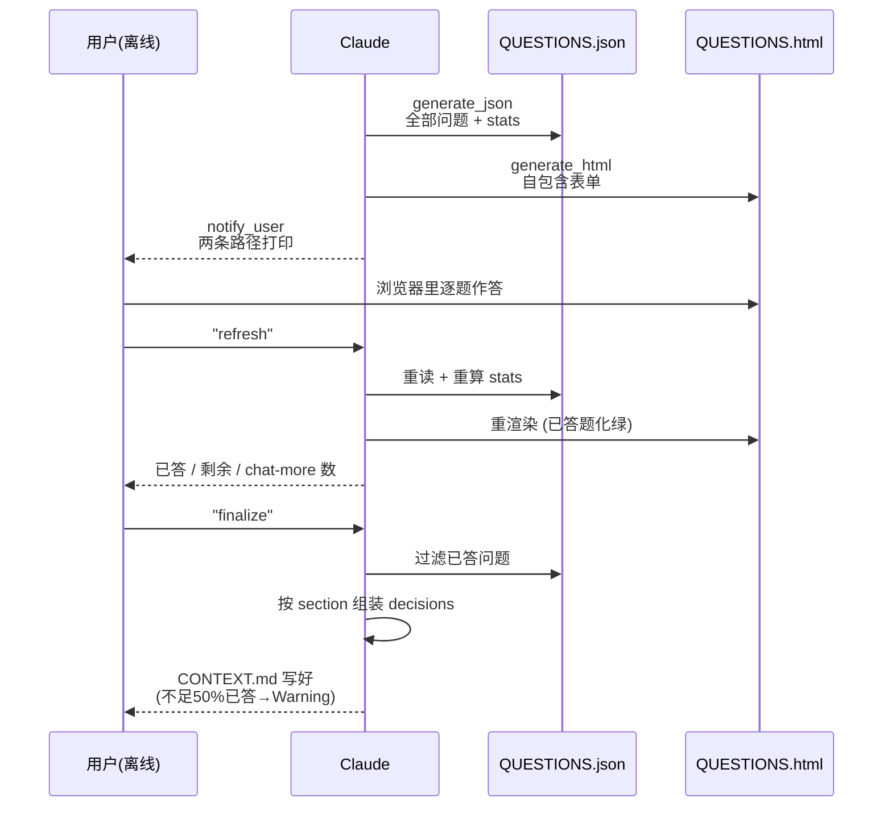

# discuss-phase-power

> discuss-phase 的 `--power` 模式本体：不是一问一答，而是一次性把所有问题生成成 JSON + HTML 两份文件，你离线慢慢答，回来一句 "refresh" 增量处理、一句 "finalize" 一次过生成 CONTEXT.md。

<!-- more -->

## 5W1H

| 项 | 内容 |
|---|---|
| **Who（谁用）** | 两个处境的人：phase 灰区多到几十个问题不想在聊天窗口里逐题消耗上下文的人；和想把答题当成离线仪式——在浏览器/IDE 里开 HTML 表单、按自己节奏答、偶尔来一句"refresh"看进度的人。 |
| **What（做什么）** | 与标准模式同源跑一遍 `analyze`（灰区识别、2–4 个带 tradeoff 的选项）后完全分岔：`generate_json`（写 `*-QUESTIONS.json` 带统计字段）→ `generate_html`（自包含 HTML 表单）→ `notify_user` → `wait_loop`（监听 refresh / finalize / explain Q-N / exit power mode 四种命令）→ `finalize`（从 JSON 过滤已答题，按标准模板生成 CONTEXT.md）。 |
| **When（何时用）** | 想异步、离线、批量化讨论时；讨论半径大、想把答题时间和你烧上下文的时间彻底分开时。由 `/gsd:discuss-phase {N} --power` 触发。 |
| **Where（在哪里）** | `~/.claude/get-shit-done/workflows/discuss-phase-power.md`（291 行）——保持原路径不迁移是为了让既有 `@`-reference 继续解析；现代版入口是 `discuss-phase/modes/power.md`（lazy-loaded dispatcher），读它后 Read 并端到端执行本文件。**零 agent 派发**。 |
| **Why（为什么存在）** | 消除"讨论的答案被锁死在聊天会话里"这个特例。标准模式的决策只存在于一次会话；power mode 把问题与答案固化成一个可反复读写、支持增量统计的状态文件（JSON），答题变成可暂停、可恢复、可离线的打开-编辑-保存动作。 |
| **How（怎么做）** | 六个 step 串行：`analyze`（不问用户，全部内部捕获）→ `generate_json`（stats.total/answered/chat_more/remaining 四个字段维护在 JSON 顶部，question 里附 context + with tradeoff options）→ `generate_html`（各 section 抽屉、勾选卡、"Chat more"文本域：有内容边框变橙 #f97316）→ `notify_user`（两个路径并列告诉用户各自的文件）→ `wait_loop`（refresh 重算 stats 并重渲染 HTML 高亮已答题；finalize 走下一步；exit power mode 把已答项转入标准 discuss_areas 继续）→ `finalize`（不足 50% 已答时给 Warning，未答题归 `deferred_ideas` 不静默丢失）。 |

## 工作原理

关键设计：进度由文件本身承载而不是由会话记忆承载——每次 `"refresh"` 是"读 JSON → 重算 stats → 写回 → 重渲染 HTML"这条幂等链，Claude 崩了随时重跑。两个 exit 方向决定了模式边界：`exit power mode` 往回走标准互动流（已答项无缝 carry over 进 discuss_areas），`finalize` 往前走产物生成——两条路都不重复问已答过的题。HTML 的设计目标是"无服务器也能用"——自包含单文件，浏览器里开就行。

## 产出与影响

| 项 | 内容 |
|---|---|
| **读取** | phase_dir 内既有产物（ROADMAP/PROJECT 等，经 discuss-phase 的初始化传入）、`*-QUESTIONS.json`（刷新和 finalize 时重读） |
| **写入** | `{phase_dir}/{padded_phase}-QUESTIONS.json`、`*-QUESTIONS.html`、`*-CONTEXT.md`（finalize 时） |
| **派发 agent** | 无（零 agent 派发，本文件内 `subagent_type` 出现 0 次） |
| **成功标准** | 问题结构化进 JSON、HTML 自包含无服务器可用、stats 在每次 refresh 后准确、已答题 HTML 里高亮绿、CONTEXT.md 与标准 discuss-phase 同格式、未答题保留为 deferred 而非静默丢弃、canonical_refs 必现 |

## 适用场景

- phase 灰区多（二三十个题），不愿在聊天窗口里烧上下文逐题往返
- 想离线在浏览器/IDE 里填表单、按自己节奏答，甚至跨天答
- 大工作量阶段：长时间保持一个可手动 refresh 的挂起状态
- 标准模式讨论到一半想转离线：带着已答条目切到 power mode

## 反模式与陷阱

- **`--power` 与 `--auto` 是二选一**：`modes/power.md` 里的 Combination rules 说 power wins（离线作答模式本质上不兼容自动推荐），但 finalize 之后 chain 的自动推进逻辑**照常生效**——不是死了。
- **wait_loop 对未识别命令只做兜底回应**：wait_loop 对出现不当命令只礼貌回应并提示可用命令列表——不会帮你回滚 JSON——所有状态变化都发生在你按保存后的文件里。
- **答案低于 50% 不拒绝产 CONTEXT.md**：是给 Warning 而非硬闸——你说 finalize 它就真的最终化，只是把余下的题写进 `deferred_ideas` 区，不会一个个问回来；低于这个比例时规划价值显著下降——半数未答本身就是"该重新一轮讨论"的信号。
- **Questions HTML 会被重生成覆盖**：refresh 的动作包含"重新生成 HTML"——你就算在 HTML 里改了题目内容，一刷新也会被 JSON 的状态覆盖回去；意见建议或补充说明通过 `chat_more` 走，不改题面。

## 参见

- [index.md](./index.md) — 专栏总纲：三层架构、Gate 四分类、主链状态机
- [discuss-phase](./discuss-phase.md) — 父工作流：本文件是它的 `--power` 模式具体化
- [discuss-phase-assumptions](./discuss-phase-assumptions.md) — 另一种非一问一答的导向：靠代码先开出假设
- GitHub: [get-shit-done](https://github.com/gsd-build/get-shit-done)
- 源码：`~/.claude/get-shit-done/workflows/discuss-phase-power.md`（GSD 1.42.3）
