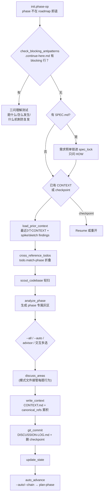

# discuss-phase

> 是一个 thinking partner 不是访谈员：找出"能走多种路线且走错会改变结果"的实现灰区，让用户多选哪些要聊，逐区问到位为止——决策记录专供下游的 researcher 和 planner 使用。

<!-- more -->

## 5W1H

| 项 | 内容 |
|---|---|
| **Who（谁用）** | roadmap 里已有某个 phase、还没有 CONTEXT.md 的项目作者——他知道自己想要的产品感觉和取舍偏好，但被明令不问他代码模式和实现路径；以及想增量更新已有 CONTEXT 或离线批量答题的人。 |
| **What（做什么）** | 初始化校验 → 反模式自检 → SPEC 感知 → 既有 CONTEXT/PLAN 冲突检测（含 checkpoint 断点恢复）→ 载入历史决策 → 折叠匹配待办 → 轻扫代码 → 生成 phase 专属灰区 → 用户多选 → 按模式逐区问答 → 写 `*-CONTEXT.md` + `*-DISCUSSION-LOG.md` → 提交、写 STATE、可选自动推进。期间每聊完一个灰区立刻写一次 `*-DISCUSS-CHECKPOINT.json`。 |
| **When（何时用）** | 每个 phase 进 plan-phase 之前。flag：`--power`、`--all`、`--auto`、`--chain`、`--text`、`--batch`、`--analyze`；叠加层排序固定为 `--analyze → --batch → --text`；若存在 `$HOME/.claude/get-shit-done/USER-PROFILE.md` 自动进 advisor 模式。PRD 在手可走 plan-phase `--prd` 快车道整体跳过讨论。 |
| **Where（在哪里）** | `~/.claude/get-shit-done/workflows/discuss-phase.md`（499 行）——为卡在 500 行工作流预算内刻意做成壳。**零 agent 派发**——但按 flag 惰性加载 `workflows/discuss-phase/modes/` 下共 9 个模式文件（default/all/power/auto/text/batch/analyze/chain/advisor），运行时另读 `templates/` 下 3 个产物模板（context、discussion-log、checkpoint）。 |
| **Why（为什么存在）** | 消除"下游规划时没人替实现方式拍板"的静默漂移。scope_guardrail 把"要不要加搜索/评论"重新定义为越界记入 Deferred Ideas——不丢想法但不扩范围；gray_area_identification 禁用 UI/UX 这类通用标签，强制生成 auth 阶段那种 session handling / 多设备策略级别的具体问题，从源头把访谈题从"分类空泛"拉到"一种会改变结果的具体取舍"。 |
| **How（怎么做）** | 主文件步骤：`initialize` → `check_blocking_antipatterns`（`.continue-here.md` 有 blocking 反模式时必须书面回答"是什么/怎么发生/什么机制防复发"三问才放行）→ `check_spec` → `check_existing` → `load_prior_context`（最近 3 个 CONTEXT + spike/sketch findings）→ `cross_reference_todos` → `scout_codebase` → `analyze_phase` → `present_gray_areas` → `discuss_areas`（模式接管）→ `write_context` → `confirm_creation` → `git_commit` → `update_state` → `auto_advance`。灰区多选不给"跳过"或"你决定"选项，这是设计约束不是疏忽。 |

## 工作原理

关键设计：讨论行为全部委托给 9 个惰性加载的模式文件，主文件只保留通用硬闸、scope guardrail 和产物组装；叠加 flag 有固定的应用顺序（`--analyze` 最外层策略表、`--batch` 分组出题、`--text` 落地成数字选项）。checkpoint 是增量的、CONTEXT 是终稿——两者角色分离，写终稿的同一动作就删除 checkpoint。`--auto` 有明确的单 pass 上限：CONTEXT 写完即定稿，禁止自己回头找"缺口"再跑第二轮，因为那会自产自销地无限循环。

## 产出与影响

| 项 | 内容 |
|---|---|
| **读取** | ROADMAP.md、PROJECT/REQUIREMENTS/STATE.md、最近 3 个 CONTEXT.md、`.continue-here.md`、SPEC.md、`todo.match-phase`、spike/sketch findings、codebase 精选 map |
| **写入** | `*-CONTEXT.md`、`*-DISCUSSION-LOG.md`、每区一记 `*-DISCUSS-CHECKPOINT.json`（CONTEXT 落成即删）、STATE.md、git commit |
| **派发 agent** | 零 agent。9 个 `modes/*.md` 外加 3 个 `templates/*` 是讨论行为和产物格式的完整定义处 |
| **成功标准** | CONTEXT.md 捕获实际决策而非空泛愿景、canonical_refs 与 code_context 段必备、scope creep 转 Deferred Ideas、不重复已在其他阶段做出的决策、会话可从 checkpoint 恢复、per-mode body 惰性加载守住父文件行数预算（`tests/workflow-size-budget.test.cjs`） |

## 适用场景

- 开始一个新 phase 前想和规划者说清取舍偏好，产出直接喂 plan-phase
- 灰区多、问题多时用 `--power` 离线在 HTML 表单里一次性答完
- 给闭门造车的 auto/chain 流程加一个固定的机会窗口：在写 CONTEXT.md 这里统一处理，之后自动进 plan
- `--analyze` 想在每个决策前看 trade-off 表一格变了再选

## 反模式与陷阱

- **SPEC.md 能把讨论从"要不要做成啥"缩到"怎么做"**：`check_spec` 见到 `*-SPEC.md` 就照单锁定需求，不让用户关上"需求锁定"这个门；如果你本想讨论 WHAT，事后才添加 SPEC 是逆行的。
- **checkpoint 不是备份文件**：终结 `write_context` 落到 CONTEXT.md 后会 `rm` 掉 `*-DISCUSS-CHECKPOINT.json`——中途拿它兜底会扑空；恢复降级必须走"重进 `check_existing`"路径而不是手工翻文件。
- **默认模式每区固定 4 问为一轮**：`modes/default.md` 的行为不是"问到天荒地老"——每区问满 4 个问题后要用户确认是否继续，期待连续追问的人反而会觉得被赶工。
- **多选没有"你跳过"选项是设计不是缺陷**：gray areas 的 AskUserQuestion 明文禁止加 "skip" 或 "you decide" 选项——源码的理由是"用户跑这条命令就是为了讨论"；想免答题就用 `--auto` 显式声明，工具不支持静默跳题。

## 参见

- [index.md](./index.md) — 专栏总纲：三层架构、Gate 四分类、主链状态机
- [discuss-phase-power](./discuss-phase-power.md) — `--power` 离线模式完整文件
- [discuss-phase-assumptions](./discuss-phase-assumptions.md) — 换风格的兄弟工作流：只问"我猜错了哪些"
- [spec-phase](./spec-phase.md) — 上游：SPEC.md 把 WHAT 锁起来才让本工作流专问 HOW
- [plan-phase](./plan-phase.md) — 下游：把 CONTEXT 决策落到 PLAN 的消费方
- GitHub: [get-shit-done](https://github.com/gsd-build/get-shit-done)
- 源码：`~/.claude/get-shit-done/workflows/discuss-phase.md`（GSD 1.42.3）
