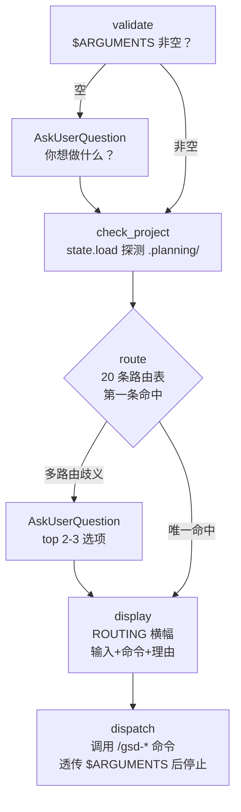

# do

> 解析自由文本意图并路由到最合适的 GSD 命令——纯 dispatcher，自身绝不做活，匹配意图 → 确认路由 → 交接给被派发的命令。

<!-- more -->

## 5W1H

| 项 | 内容 |
|---|---|
| **Who（谁用）** | 记不住 88 个命令名、只会用自然语言描述意图的人——"这东西坏了"、"帮我起个项目"、"我想试个想法能不能成"。GSD 命令面太大，路由表就是给这类人用的记忆替代品。 |
| **What（做什么）** | `validate` 校验输入（空则 AskUserQuestion 反问）→ `check_project` 用 `gsd-sdk query state.load` 探测 `.planning/` 是否存在 → `route` 按 20 条路由表**第一条匹配**规则选定命令（歧义则问 top 2-3 选项）→ `display` 打印 ROUTING 横幅（输入前 80 字符 + 目标命令 + 理由）→ `dispatch` 调对应 `/gsd-*` 命令并透传 `$ARGUMENTS` 后停止。产物：一条可见的路由决策 + 一次命令调用。 |
| **When（何时用）** | 意图无法一眼对应命令、或想用自然语言触发 GSD 时。前置：路由目标若需要 `.planning/`（除 `new-project`/`map-codebase`/`spike`/`sketch`/`help` 外的全部），而项目不存在，则建议先跑 `new-project`。常见 flag：`--text`（TEXT_MODE，非 Claude 运行时用纯文本编号列表替代 AskUserQuestion）。 |
| **Where（在哪里）** | 工作流实现 `~/.claude/get-shit-done/workflows/do.md`（110 行）。**零 agent 派发**——它只调用 `/gsd-*` 命令，活全交给被派发的命令，自身只做意图匹配。 |
| **Why（为什么存在）** | 消除"意图 → 命令映射靠人肉记忆"这个特例。20 条路由规则把最常见的意图一网打尽（起项目、查 bug、试想法、画原型、补测试、收里程碑……），歧义交给用户 2-3 选 1 而不是猜。它让 GSD 的命令面可以继续膨胀而不增加用户记忆负担。 |
| **How（怎么做）** | 五个步骤串行：`validate`（输入非空）→ `check_project`（探测 `.planning/`，部分路由依赖它）→ `route`（表格从上到下**第一条命中**即选；可多路由匹配时 AskUserQuestion 给 2-3 个选项）→ `display`（先展示决策再执行，路由可见性是硬要求）→ `dispatch`（调命令、透传参数、然后停止——被派发命令接管一切）。 |

## 工作原理

关键设计：路由判定是**顺序敏感的**——表格从上到下第一条命中即选，所以 "bug" 类描述若同时像 "spike"（试可行性），会先命中更靠上的 bug 路由行。另一个取舍是 display 先于 dispatch：路由决策必须先可见再执行，避免"黑盒派发"；同时歧义绝不猜测，必须问人。

## 产出与影响

| 项 | 内容 |
|---|---|
| **读取** | `$ARGUMENTS`、`gsd-sdk query state.load`（探测 `.planning/` 存在性） |
| **写入** | 无直接写入——只调用被路由的命令，写入全在被派发命令侧 |
| **派发 agent** | 无。`do` 自己不派 subagent，只做命令级 dispatch |
| **成功标准** | 输入已验证非空；意图精确匹配一个命令；歧义经用户问题解决；需要 `.planning/` 的路由检查过项目存在性；dispatch 前展示路由决策；命令以合适参数被调用；自身零直接工作 |

## 适用场景

- "set up" / "initialize" → `/gsd:new-project`（起新项目）
- "a bug, error, crash, something broken" → `/gsd:debug`（系统性排查）
- "test if" / "will this work" / "experiment" → `/gsd:spike`（验证可行性的抛掷实验）
- "where am I" / 进度查询 → `/gsd:progress`
- "write tests" / "test coverage" → `/gsd:add-tests`

## 反模式与陷阱

- **路由依赖 `.planning/` 是常态**：20 条路由里 15 条要求项目存在，唯独 `new-project`/`map-codebase`/`spike`/`sketch`/`help` 例外。项目不存在且路由需要它时，只建议先 `new-project`，不自动建。
- **第一条匹配 = 表格顺序即优先级**：路由规则严格从上往下扫，命中即停。"test if this bug fix works" 会先命中更靠上的 bug 行而不是 spike 行——顺序就是决策。
- **歧义必须问，不能猜**：表格明确 "If the text could reasonably match multiple routes, ask the user"——给 top 2-3 选项，而不是自作主张选一个。
- **dispatch 后立即停止**：被派发的命令从此刻起接管一切，`do` 不再干预、不跟踪结果。
- **`/gsd:capture` 是路由名，不是物理文件**：路由表里"记个笔记、想法、remember to"指向 `/gsd:capture`，但 `workflows/` 下**没有 `capture.md`**——只有 `note.md`。capture 是伞形外壳名（收编 `note` / `add-todo` / `add-backlog` / `plant-seed` / `check-todos`），别去找同名工作流文件。
- **它不执行任何工作**：把 `do` 当执行器用只会看到一条路由横幅，真正的活在被派发命令里。

## 参见

- [index.md](./index.md) — 专栏总纲：三层架构、Gate 四分类、主链状态机、依赖关系
- [fast](./fast.md) — 琐碎任务内联执行，`do` 路由表里小任务的目标命令是 quick
- [quick](./quick.md) — 小任务走完整 GSD 保障的单命令管线
- GitHub: [get-shit-done](https://github.com/gsd-build/get-shit-done)
- 源码：`~/.claude/get-shit-done/workflows/do.md`（GSD 1.42.3）