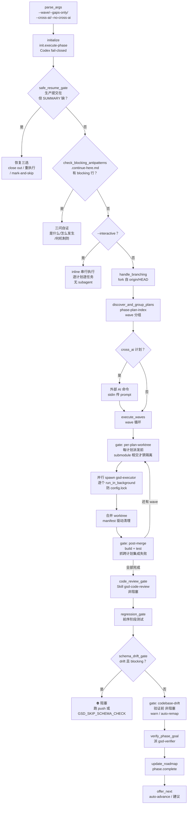

# execute-phase

> 以 wave 并行执行某阶段全部计划——编排器只协调不写码，把每个计划派给隔离 worktree 里的 executor，wave 内并行、wave 间串行，三个 gate 守合并后质量。

<!-- more -->

## 5W1H

| 项 | 内容 |
|---|---|
| **Who（谁用）** | GSD 阶段执行者——要在一个阶段里跑多个计划的人；gap closure 时只想跑 gap 计划的人（`--gaps-only`）；或想单独跑某个 wave 的人（`--wave N`）。编排器自身不写一行实现代码，全派给 subagent。 |
| **What（做什么）** | `parse_args`（`--wave`/`--gaps-only`/`--cross-ai`/`--no-cross-ai`）→ `initialize`（`init.execute-phase` + 运行时/子模块/worktree 配置，Codex 环境 fail-closed）→ `safe_resume_gate` → `check_blocking_antipatterns` → `check_interactive_mode`（`--interactive` 转 inline 串行）→ `handle_branching`（fork 自 origin/HEAD，#2916）→ `validate_phase`（`state.begin-phase`）→ `discover_and_group_plans`（`phase-plan-index` wave 分组）→ `cross_ai_delegation`（可选外部 AI）→ `execute_waves`（wave 循环 + checkpoint 心跳 + 三 gate）→ `checkpoint_handling` → `aggregate_results` → `tdd_review_checkpoint` → `handle_partial_wave_execution` → `code_review_gate`（必须）→ `close_parent_artifacts`（小数阶段关父 UAT）→ `regression_gate` → `schema_drift_gate`（可阻塞）→ `codebase_drift_gate`（非阻塞）→ `verify_phase_goal`（派 gsd-verifier）→ `update_roadmap` → `auto_copy_learnings` → `close_phase_todos` → `update_project_md` → `offer_next`。产物：每计划 SUMMARY.md + 合并 commits + VERIFICATION.md + 全套跟踪文件更新。 |
| **When（何时用）** | 阶段有 ≥1 个未完成计划时（`plan_count` 为 0 直接报错）；重跑时 `discover` 跳过已有 SUMMARY 的计划，从第一个未完成处续。flag：`--wave N`、`--gaps-only`、`--cross-ai`、`--no-cross-ai`、`--interactive`、`--auto`、`--no-transition`、`--mvp`。 |
| **Where（在哪里）** | 工作流实现 `~/.claude/get-shit-done/workflows/execute-phase.md`（1800 行）+ 懒加载子目录 `steps/` 三个 gate 文件（`per-plan-worktree-gate.md` 94 行、`post-merge-gate.md` 116 行、`codebase-drift-gate.md` 81 行），分别在 `execute-phase.md:500`、`:914`（Read and execute）与 `:1443`（Load and follow the full step spec）拉入。**派发顺序**：wave 内每计划 1× `gsd-executor`（`isolation="worktree"`，逐个 `run_in_background` 发）→ 末尾 1× `gsd-verifier`（`verify_phase_goal`）→ 仅 codebase-drift auto-remap 分支派 `gsd-codebase-mapper`；另有 `Skill(skill="gsd-code-review")`。 |
| **Why（为什么存在）** | 消除"多计划阶段串行执行"的墙钟成本与"合并冲突"风险——wave 内并行把时间除以并行度，每计划在独立 worktree 提交后统一合并。三个 gate 依次补掉三个盲区：单 agent 自检盲区（自检 PASS 但合并即失败，来自 Anthropic harness 工程研究）、schema 假阳性（类型来自 config 而非活库）、结构漂移（代码结构变了文档没更新）。编排器只拿路径不拿内容，上下文压在 ~10-15%。 |
| **How（怎么做）** | 25 个 step，关键判定：`discover_and_group_plans` 的 wave 安全（`--wave N` 时低 wave 仍有未完成计划 → STOP）；`execute_waves` 内 files_modified 重叠检查（同一文件被两个计划声明 → 该 wave 强制串行并标记规划缺陷）；post-merge gate 判定（build/test exit 124 超时非阻塞、非零递增 `WAVE_FAILURE_COUNT`、失败不标完成）；失败分类 `agent.classify-failure`（`quota-exceeded` 不 offer retry-now、`classify-handoff-bug` spot-check 通过即算成功、`unknown-failure` 问继续/停）；MVP+TDD gate（`is-behavior-adding` 且缺 RED commit → exit 1）。 |

## 工作原理

三个 gate 守在不同挂点：`per-plan-worktree-gate` 在**每个计划派发前**做计划级决策（只有触及 submodule 路径的计划才降级 sequential，其余照常并行，`#2772`）；`post-merge-gate` 在**每个 wave 合并后**跑 build + test（直指 "agents reliably report Self-Check: PASSED even when merging their work creates failures" 这个自检盲区）；`codebase-drift-gate` 在**全部执行后、验证前**跑，且按契约非阻塞（任何内部错误都必须落到 `verify_phase_goal`，阶段永不被它判失败）。主链上的两个前置闸（safe_resume、anti-patterns）则是"先查再跑"：对处于异常状态的项目派发执行器只会把错误往后推。

## 产出与影响

| 项 | 内容 |
|---|---|
| **读取** | `init.execute-phase`、`phase-plan-index`、STATE.md、ROADMAP.md、`.gitmodules`、计划文件、config（runtime/use_worktrees/stall 阈值/context_window） |
| **写入** | 每计划 SUMMARY.md、wave 合并 commits、VERIFICATION.md、ROADMAP/STATE/PROJECT.md/REQUIREMENTS.md、REVIEW.md、LEARNINGS.md → `~/.gsd/knowledge/`（`features.global_learnings` 开启时）、todos 从 pending 移 completed |
| **派发 agent** | `gsd-executor`（wave 内每计划 1 个，`isolation="worktree"`）→ `gsd-verifier`（1 个，验证阶段目标）→ `gsd-codebase-mapper`（仅 codebase-drift `auto-remap` 分支）；另有 `Skill(skill="gsd-code-review")` |
| **成功标准** | 源码有两组 `<success_criteria>`。worktree 模式（634-639 行）：全部任务执行、每任务独立提交、SUMMARY.md 建在计划目录、**不修改共享编排器产物**（编排器统一做 wave 后共享文件写入）。sequential 模式（663-669 行）同前三条，另加 STATE.md 与 ROADMAP.md 更新 |

## 适用场景

- 阶段有多个相互独立计划时的 wave 内并行执行（墙钟除以并行度）
- 跨计划集成验证：post-merge build + test 抓合并冲突（类型定义、共享 import、API 契约）
- gap closure：`--gaps-only` 只跑 `gap_closure: true` 的计划
- 只想跑特定 wave：`--wave N`（先完成低 wave，`WAVE_FILTER` 安全检查拦截跳 wave）
- 交互监督：`--interactive` 逐计划逐任务给人检查、随时干预

## 反模式与陷阱

- **Codex 环境 fail-closed**：`RUNTIME=codex` 且 `use_worktrees != false` 直接 FATAL 退出——Codex 的 `spawn_agent` 没有 `isolation="worktree"` 映射，不 fail-closed 就会在主 checkout 上误写。
- **同一 message 发多个 Agent 调用 → `.git/config.lock` 竞争**：并行 wave 也必须逐个 `run_in_background: true` 派发，否则 worktree 创建互相踩锁。
- **per-plan 决策不是项目级**：`.gitmodules` 存在不再全局禁用 worktree 隔离（`#2772`），只有触及 submodule 路径的计划才降级 sequential——别以为有子模块就全部串行。
- **post-merge 测试失败不标完成**：`TEST_EXIT != 0`（含 124 超时视为 inconclusive）时跳过 ROADMAP/STATE 跟踪更新，计划保持 in-progress——不会在集成测试失败时标记完成。
- **`quota-exceeded` 不 offer retry-now**：`#3095` 分类后正确动作是等配额重置再 resume，立即重试只会再撞限。
- **wave 内 files_modified 重叠即串行**：两个计划声明修改同一文件 → 该 wave 强制串行并标记为规划缺陷（planner 本该避免）。
- **`--wave N` 时低 wave 未完成 → STOP**：不让 wave 2+ 跑在残缺地基上，先完成前置 wave。

## 参见

- [index.md](./index.md) — 专栏总纲：三层架构、Gate 四分类、主链状态机、依赖关系
- [execute-plan](./execute-plan.md) — 被派发执行体：单计划执行 + SUMMARY 产出
- [autonomous](./autonomous.md) — 批量驱动者：以 `--no-transition` 调用本工作流
- [next](./next.md) — 主链路由：Route 4 判定"有 PLAN 但 SUMMARY 不全"→ 调本工作流
- GitHub: [get-shit-done](https://github.com/gsd-build/get-shit-done)
- 源码：`~/.claude/get-shit-done/workflows/execute-phase.md`（GSD 1.42.3）