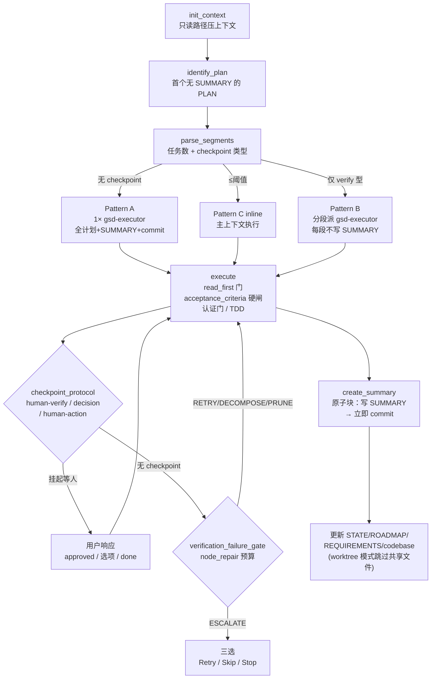

# execute-plan

> 执行单个 PLAN.md 并产出 SUMMARY.md——execute-phase 派发的 executor 的执行体，也是交互/内联模式下主上下文直接跑的逻辑。

<!-- more -->

## 5W1H

| 项 | 内容 |
|---|---|
| **Who（谁用）** | 被 `execute-phase` 以 `Agent(subagent_type="gsd-executor")` 派发到全新 worktree 的 executor 子代理——它带干净上下文读 PLAN.md 逐任务执行并原子提交；也可能是 `--interactive` 模式下在主上下文 inline 跑它的编排器本身。 |
| **What（做什么）** | `init_context` 只读路径（压编排器上下文）→ `identify_plan` 找第一个无 SUMMARY 的 PLAN → `record_start_time` → `parse_segments` 按任务数路由（阈值内 inline，否则按 checkpoint 类型分 A/B/C）→ `execute` 逐任务执行（`read_first` 门 + acceptance_criteria 硬闸 + 认证门 + deviation 规则 + TDD）→ `checkpoint_protocol` 挂起等人 → `verification_failure_gate`（node-repair 自救）→ `create_summary`（原子块：写 SUMMARY → 立即 commit）→ 更新 STATE/ROADMAP/REQUIREMENTS/codebase map → `offer_next`。产物：每任务一个原子 commit + SUMMARY.md + 跟踪文件更新。 |
| **When（何时用）** | 被 execute-phase 在 wave 中派发时、或交互模式 inline 执行时。前置：`.planning/` 存在（缺失即报错）。flag：yolo/interactive 模式、`--text`（TEXT_MODE）。 |
| **Where（在哪里）** | 工作流实现 `~/.claude/get-shit-done/workflows/execute-plan.md`（525 行，24 个 step）。**派发 gsd-executor**：Pattern A 派 1 个（全计划 + SUMMARY + commit，`isolation="worktree"` 依 `workflow.use_worktrees`）；Pattern B 按 segment 派多个（只做分配任务，不写 SUMMARY）；Pattern C 零派发（inline）。它也是 execute-phase 各 executor 的 `<execution_context>` 引用对象。 |
| **Why（为什么存在）** | 消除"每个任务都要完整上下文"的成本——executor 用全新上下文读文件（只把路径交给 subagent），把编排器上下文压在 ~10-15%；同时把 close-out 顺序定为硬不变量 `atomic_close_out_invariant`（production commits → SUMMARY commit → STATE/ROADMAP 更新），杜绝"有生产提交但没 SUMMARY"的非法半态。 |
| **How（怎么做）** | 24 个 step，关键判定：`parse_segments` 用 `workflow.inline_plan_threshold`（默认 2）做任务数路由，≤2 任务走 Pattern C inline（省 ~14K token subagent 开销）；`execute` 里 acceptance_criteria 是**硬闸**（失败先修、2 次修复不成就记 deviation、不能静默跳过、阻塞进入下一任务）；`checkpoint_protocol` 按类型表处理（human-verify 90% / decision 9% / human-action 1%）；`verification_failure_gate` 按 `workflow.node_repair` 调用 node-repair 的 RETRY/DECOMPOSE/PRUNE，预算耗尽 ESCALATE 回三选。 |

## 工作原理

关键设计：`create_summary` 强调**原子块**——Write SUMMARY 与 commit 之间不允许任何叙事输出（截断是已知失败模式 #2070，execute-phase 的 rescue 逻辑是最后防线而非主防御）。另一个取舍是 worktree 模式自动检测（`.git` 是文件即 worktree）：此时跳过 STATE/ROADMAP 更新，共享文件由编排器集中写（单写者契约 #1486），避免多 worktree 各自写导致分叉。

## 产出与影响

| 项 | 内容 |
|---|---|
| **读取** | `init.execute-phase` JSON、PLAN.md（即执行指令）、STATE.md、CONTEXT.md（若有）、前序阶段 SUMMARY |
| **写入** | 代码文件 + 每任务原子 commit、SUMMARY.md、STATE.md、ROADMAP.md、REQUIREMENTS.md、USER-SETUP.md（若 frontmatter 有 user_setup）、`.planning/codebase/*`（若 map 存在且结构有变） |
| **派发 agent** | Pattern A：1× `gsd-executor`；Pattern B：每 segment 1× `gsd-executor`；Pattern C：零派发 |
| **成功标准** | PLAN.md 全部任务完成；全部验证通过；user_setup 存在则生成 USER-SETUP.md；SUMMARY.md 有实质内容；STATE/ROADMAP 更新（并行模式除外，编排器处理）；codebase map 更新（如有显著变更）；USER-SETUP 在完成输出中突出展示 |

## 适用场景

- 被 execute-phase 的 wave 派发时，在独立 worktree 里执行单个计划
- 小计划（≤2 任务）在编排器上下文直接 inline 执行，省 subagent 开销
- 含 checkpoint 的计划：human-verify / decision / human-action 挂起等人后再续
- `type: tdd` 计划的 RED-GREEN-REFACTOR 门序列执行
- 任务验证失败时，走 node-repair 自主修复链（RETRY/DECOMPOSE/PRUNE）

## 反模式与陷阱

- **SUMMARY 原子块不可破坏**：Write SUMMARY 与 commit 之间不能有任何叙事输出——截断是已知失败模式（#2070），"先写再叙述"的顺序是硬要求。
- **worktree 模式自动跳过 STATE/ROADMAP**：`.git` 是文件即视为并行模式，跳过共享文件更新（编排器集中写）；在 worktree 里手动改 STATE.md 会造成 merge 冲突。
- **acceptance_criteria 是硬闸不是建议**：失败必须修复并重跑全部 criteria，2 次修复不成就记 deviation——"A task with failing acceptance criteria is an incomplete task"，且阻塞进入下一任务。
- **`read_first` 门不可跳过**：任务带 `<read_first>` 字段时必须先读全部列出的文件再动手——"Do not skip files because you already know what's in them"。
- **node-repair 有预算**：默认 `REPAIR_BUDGET=2`，耗尽后 ESCALATE 回人工三选（Retry / Skip / Stop），不是无限重试。
- **前序阶段检查先于执行**：前序 SUMMARY 有未解决 issues/blockers 时会问 "Proceed anyway / Address first / Review previous"，不会静默带病执行。

## 参见

- [index.md](./index.md) — 专栏总纲：三层架构、Gate 四分类、主链状态机、依赖关系
- [execute-phase](./execute-phase.md) — 派发者：wave 并行编排，把每个计划交给本工作流
- [node-repair](./node-repair.md) — 失败任务验证的自主修复算子，本工作流在验证失败时调用
- GitHub: [get-shit-done](https://github.com/gsd-build/get-shit-done)
- 源码：`~/.claude/get-shit-done/workflows/execute-plan.md`（GSD 1.42.3）