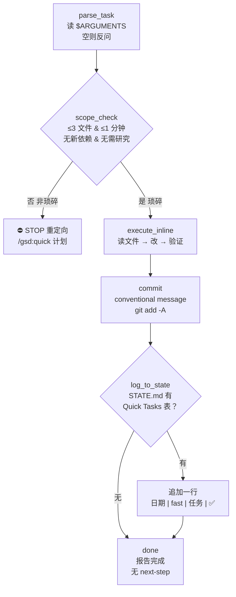

# fast

> 琐碎任务内联执行，不派 subagent、不建 PLAN.md、不做研究与计划检查——understand → do → commit → log，为"1 分钟修补"提供绕过完整执行链的旁路。

<!-- more -->

## 5W1H

| 项 | 内容 |
|---|---|
| **Who（谁用）** | GSD 项目里被零碎请求打断的作者本人——改错别字、更新配置值、补缺失 import、重命名变量、提交未提交的工作、加 `.gitignore` 条目、bump 版本号。这些事不值得付完整执行链（discuss → plan → execute → verify）的上下文成本。 |
| **What（做什么）** | `parse_task` 从 `$ARGUMENTS` 取任务描述 → `scope_check` 用四条硬判据验证"这真的是琐碎" → `execute_inline` 直接读文件、改、验证 → `commit` 原子提交（conventional commit）→ `log_to_state` 有表则追加 STATE.md → `done` 报告。产物：1 个原子 commit + 可选 STATE.md 一行。 |
| **When（何时用）** | 任务满足四条判据（≤3 文件编辑、≤1 分钟、无新依赖/架构变化、无需研究）时；任一不满足就停止并 redirect 到 `/gsd:quick`。`$TASK` 为空时反问 "What's the quick fix? (one sentence)"。 |
| **Where（在哪里）** | 工作流实现 `~/.claude/get-shit-done/workflows/fast.md`（105 行）。**零 agent 派发**——`guardrails` 明文 "NEVER spawn a Task/subagent — this runs inline"，是 88 个工作流里最"裸"的一个。 |
| **Why（为什么存在）** | 消除"1 分钟修补却付 14K token subagent 开销"这个特例。完整链路对琐碎任务是过重的：不需要 PLAN.md 的规划结构，不需要 SUMMARY.md 的总结结构，只需要原子提交纪律。它同时保留 GSD 的提交规范（conventional commit）与可选的 STATE 跟踪，让琐碎工作不脱离项目记录。 |
| **How（怎么做）** | 六个步骤串行：`parse_task` → `scope_check`（四条判据 and 关系判定，非琐碎即 STOP）→ `execute_inline`（无 PLAN.md，直接做）→ `commit`（`git add -A` + conventional message）→ `log_to_state`（`grep -q "Quick Tasks Completed"` 命中才追加，否则静默跳过）→ `done`（报告 ✅ Done，无下一步建议）。 |

## 工作原理

关键设计：`scope_check` 是唯一的质量闸，且闸门是**全有或全无**——四条判据是 and 关系，不满足就走 redirect 而不是降级执行，把"该不该走完整链路"的判定前置到动手之前。`log_to_state` 则是刻意的"尽力而为"：表不存在就静默跳过，绝不越界建表——建表是 `quick` 的职责（quick 的 Step 7 才创建该表），fast 只追加不创建。

## 产出与影响

| 项 | 内容 |
|---|---|
| **读取** | `$ARGUMENTS`、相关源文件、`STATE.md`（仅 grep 表头） |
| **写入** | 最多 3 个文件的修改、1 个原子 git commit、可选 STATE.md 追加一行 |
| **派发 agent** | 无。`guardrails` 明文禁止 spawn，`subagent_type` 出现次数为 0 |
| **成功标准** | 任务在当前上下文完成（无 subagent）；conventional message 原子提交；STATE.md 存在则更新；总操作 < 2 分钟墙钟时间 |

## 适用场景

- 修一个错别字 / 更新一个配置值 / 补一个缺失 import / 重命名一个变量
- 把未提交的工作收进一个原子 commit
- 加一条 `.gitignore` 条目 / bump 一个版本号

## 反模式与陷阱

- **四条判据是"全满足"而非"满足其一"**：`scope_check` 的 ≤3 文件编辑、≤1 分钟、无新依赖/架构变化、无需研究是 and 关系，任何一条不满足都算非琐碎。
- **超范围不是继续做而是 STOP**：guardrails 明文规定超过 3 个文件编辑就停止并 redirect，没有"再多做两个文件"的余地。
- **不确定就 redirect**：guardrails 第二条 "If you're unsure how to implement it, STOP and redirect"——判据是"我知不知道怎么做"，不是"做没做完"。
- **`log_to_state` 静默跳过**：STATE.md 没有 "Quick Tasks Completed" 表时直接跳过，不报错不建表。表的存在性是 `quick` 的职责，fast 只追加。
- **无 next-step 建议是特性**：`done` 步骤明确 "No next-step suggestions. No workflow routing."，别指望它接着给你路由。

## 参见

- [index.md](./index.md) — 专栏总纲：三层架构、Gate 四分类、主链状态机、依赖关系
- [quick](./quick.md) — fast 超范围时的 redirect 目标：小任务走完整 GSD 保障
- [do](./do.md) — 自由文本路由到最合适的 GSD 命令
- GitHub: [get-shit-done](https://github.com/gsd-build/get-shit-done)
- 源码：`~/.claude/get-shit-done/workflows/fast.md`（GSD 1.42.3）