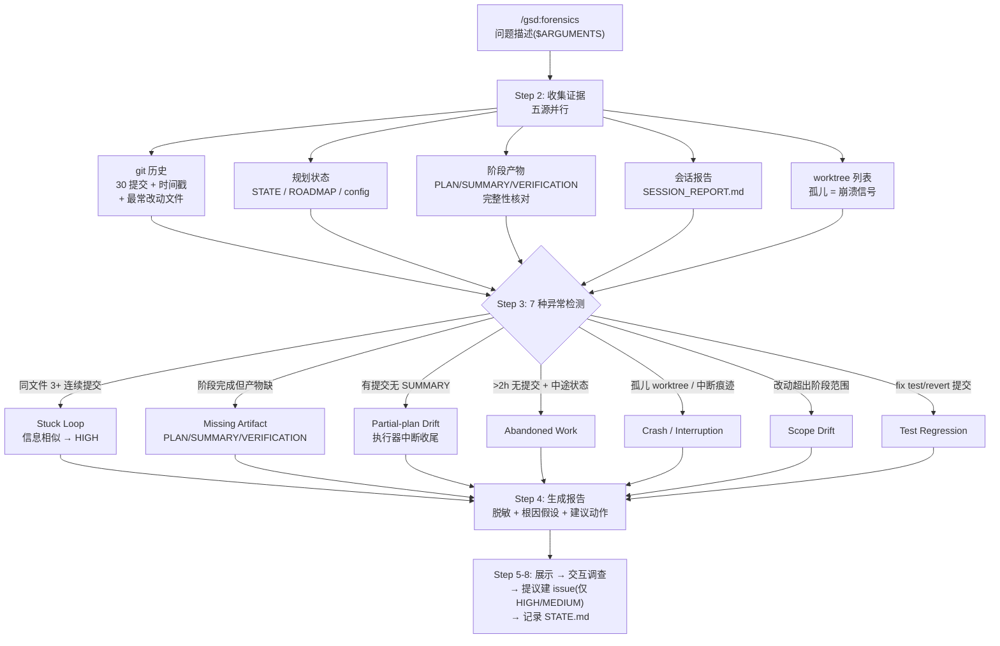

# forensics

> GSD 事故现场勘察：工作流失败/卡住后，只读地分析 git 历史、`.planning/` 产物与文件系统状态，按 7 种异常模式检测并产出结构化取证报告——不修任何东西，只回答"发生了什么、为什么"。

<!-- more -->

## 5W1H

| 项 | 内容 |
|---|---|
| **Who（谁用）** | 项目作者在 autonomous 模式卡在阶段 3、execute-phase 静默失败、或成本异常偏高时的人。面对"它坏了但没人知道为什么"的局面，需要证据而非猜测。 |
| **What（做什么）** | 拿问题描述（`$ARGUMENTS`，空则反问用户）→ 从五个来源收集证据（git 历史 / 规划状态 / 阶段产物 / 会话报告 / worktree 列表）→ 按 7 种异常模式检测（stuck loop、缺失产物、partial-plan 漂移、弃置工作、崩溃中断、范围漂移、测试回归）→ 生成脱敏报告到 `.planning/forensics/report-{timestamp}.md` → 内联展示 → 提供交互调查 → 提议建 GitHub issue → 记录 STATE.md。 |
| **When（何时用）** | 工作流失败、卡住或行为异常时。`$ARGUMENTS` 携带问题描述（如 "autonomous mode got stuck on phase 3"）；缺失则询问。报告生成后可用 `/gsd:resume-work`、`/gsd:execute-phase N` 等恢复命令（报告 Recommended Actions 里给出）。 |
| **Where（在哪里）** | 工作流实现 `~/.claude/get-shit-done/workflows/forensics.md`（278 行）。**零 agent 派发**——纯只读调查 + 单文件报告写入，没有任何 `Agent()` 调用。步骤用 `## Step 1–8` 编号组织（无 `<step name>` 标签）。报告路径：`.planning/forensics/report-$(date +%Y%m%d-%H%M%S).md`。 |
| **Why（为什么存在）** | 消除"失败后靠人肉翻 git log 猜原因"的成本。7 种异常模式把常见事故（agent 卡在循环里反复提交同一文件、执行器实现完代码却没收尾 SUMMARY、崩溃留下孤儿 worktree）变成可判定的信号，且只读原则保证勘察本身不会污染现场。 |
| **How（怎么做）** | 八步串行。Step 2 分五源收集：2a git（最近 30 提交 + 时间戳 + 最常改动文件 + 未提交变更）、2b 规划状态（STATE.md / ROADMAP.md / config.json）、2c 阶段产物（PLAN/SUMMARY/VERIFICATION/CONTEXT/RESEARCH 完整性）、2d 会话报告（SESSION_REPORT.md）、2e worktree 列表（孤儿 worktree = 崩溃 agent 信号）。Step 3 异常判定：同文件 3+ 连续提交且提交信息相似 → Stuck Loop HIGH；提交存在但 SUMMARY 缺失 → Partial-plan Drift；STATE 显示执行中但最后提交 >2 小时前且有未提交变更 → 弃置/崩溃。Step 4 报告含 Evidence Summary / Anomalies Detected / Root Cause Hypothesis / Recommended Actions，并按规则脱敏（绝对路径改相对、去 API key/token、diff 截 50 行）。Step 7 仅在 HIGH/MEDIUM 置信度异常时提议建 issue（`gh issue create --repo gsd-build/get-shit-done`，先探测 `bug` label 是否存在）。Step 8 用 `state.record-session` 记录调查完成。 |

## 工作原理

关键设计取舍：**只读原则是硬约束**——源码明写 "Do not modify project files. Only write the forensic report"，勘察与修复彻底分离：取证报告给证据与建议动作（如 `/gsd:resume-work`），但绝不自己执行恢复。异常检测刻意用低成本信号（提交频率、文件缺失、时间差）而非深度语义分析，因为目标是快速给出置信度分级（HIGH/MEDIUM）并让人决定要不要深挖；对应的，issue 创建被限制在 HIGH/MEDIUM 置信度，避免把噪音变成工单。

## 产出与影响

| 项 | 内容 |
|---|---|
| **读取** | `git log -30`（含时间戳/文件列表）、`git status --short`、`git diff --stat`、`git worktree list`、`.planning/STATE.md`、`.planning/ROADMAP.md`、`.planning/config.json`、`.planning/reports/SESSION_REPORT.md`、各阶段 PLAN/SUMMARY/VERIFICATION/CONTEXT/RESEARCH |
| **写入** | `.planning/forensics/report-{YYYYMMDD-HHMMSS}.md`（唯一写入产物）、经确认后 `gh issue create`（gsd-build/get-shit-done 仓库）、`state.record-session` 会话记录 |
| **派发 agent** | 无。`Agent()` 出现次数为 0——纯 orchestrator 内联调查 |
| **成功标准** | 问题描述获取（参数或反问）；五源证据收集（缺源自适应）；异常按模式检测并分级；报告含证据摘要/异常表/根因假设/建议动作；脱敏规则执行；报告内联展示；可选 issue 创建（HIGH/MEDIUM 且用户确认）；STATE.md 会话记录 |

## 适用场景

- autonomous 模式卡在某个阶段反复重试（Stuck Loop 检测：同文件 3+ 连续提交）
- execute-phase 静默失败——提交有、SUMMARY 没写（Partial-plan Drift，执行器在实现与收尾之间被中断）
- 崩溃/中断怀疑：未提交变更 + STATE 显示执行中 + 多个 worktree 并存
- 成本异常偏高，怀疑 agent 在循环里反复提交
- 想给事故留档，把 HIGH/MEDIUM 置信度发现直接变成 GitHub issue

## 反模式与陷阱

- **它不修东西，只写报告**：只读原则是硬约束。指望 forensics 顺手恢复现场、清 worktree、补 SUMMARY，全都不在它的合同内——恢复靠报告里建议的 `/gsd:resume-work`、`/gsd:execute-phase N`。
- **报告路径是 `.planning/forensics/` 不是别处**：固定写到 `report-$(date +%Y%m%d-%H%M%S).md`，且会污染 git 状态（未提交的新文件）——勘察结束后记得决定它的去留，别让它变成下一个"未提交变更"异常。
- **异常信号是启发式不是证据**：Stuck Loop 的 HIGH 置信度只要求"提交信息相似"；Abandoned 的 2 小时阈值是固定常量。它给的是**怀疑方向**，报告里的 Root Cause Hypothesis 明说"1-3 句基于异常的假设"——要实锤还得 Step 6 的交互深挖。
- **issue 创建有前置探测**：`gh label list --search "bug"` 找到才加 `--label bug` 标签，且只在 HIGH/MEDIUM 置信度且用户确认时提议——不会自动建 issue。
- **脱敏是手工规则不是自动管道**：绝对路径改相对、去 API key/token、diff 截 50 行，三条规则靠人执行——把报告贴出去之前自查一遍，特别是 git diff 输出里可能埋着密钥。

## 参见

- [index.md](./index.md) — 专栏总纲：三层架构、Gate 四分类、主链状态机、依赖关系
- [undo](./undo.md) — 取证后要回滚阶段/计划时使用（安全 git revert）
- [verify-phase](./verify-phase.md) — 取证发现的产物缺失（缺 VERIFICATION.md）正是它的产出
- GitHub: [get-shit-done](https://github.com/gsd-build/get-shit-done)
- 源码：`~/.claude/get-shit-done/workflows/forensics.md`（GSD 1.42.3）