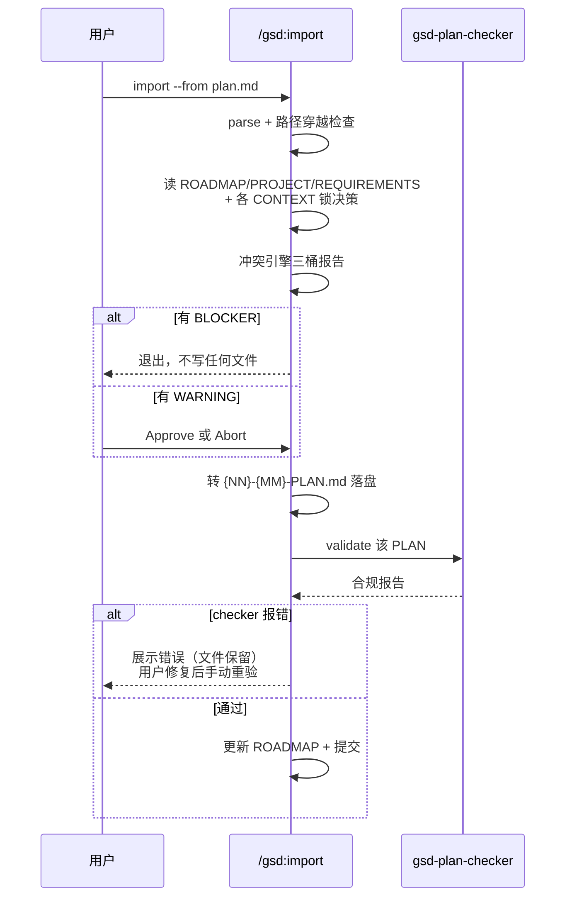

# import

> 把外部写好的计划文件收编进 GSD 体系，但先过一道冲突引擎——BLOCKER 存在时一个文件都不写，入库的永远是先被审计过的。

<!-- more -->

## 5W1H

| 项 | 内容 |
|---|---|
| **Who（谁用）** | 在别的工具（或人手）里已经写好了一份执行计划、现在想把它纳管进 GSD phase 体系的人。典型：从旧工作流迁移，或收到一份 markdown 形式的任务清单/设计文档要变成 `{NN}-{MM}-PLAN.md`。 |
| **What（做什么）** | 解析 `--from <path>`（--prd 未实现直接拒）→ 路径穿越校验 → 载入 ROADMAP/PROJECT/REQUIREMENTS/各 phase CONTEXT 的锁决策 → 读入外部文件并判定格式（GSD PLAN 或自由文档）→ 跑三级冲突检查（BLOCKER/WARNING/INFO）→ 无 BLOCKER 转 GSD 格式落盘 → 派 gsd-plan-checker 验证 → 更新 ROADMAP 计划清单并提交。 |
| **When（何时用）** | `/gsd:import --from <path>`，路径必须真实存在且不含 `..`。`--prd` 提示"planned for a future release"。无 flag 只显示 usage。 |
| **Where（在哪里）** | 工作流实现 `~/.claude/get-shit-done/workflows/import.md`（253 行）。冲突报告格式与闸语义定义在 `references/doc-conflict-engine.md`；gate 交互模式定义在 `references/gate-prompts.md`。派发方式：**仅 1× `gsd-plan-checker`**（plan_validate 步骤）。 |
| **Why（为什么存在）** | 消除"外部计划与既有规划静默打架"的特例：四类 BLOCKER——目标 phase 不存在于 ROADMAP、技术栈违背 PROJECT.md 约束、违背任一 CONTEXT.md `<decisions>` 锁决策、与既有 REQUIREMENTS 矛盾——任何命中都**不写 PLAN.md 就退出**。外部来料在门外被审计，而不是混进来之后再让人工排查。 |
| **How（怎么做）** | `<step>` 串联：`parse_arguments` 校验路径（`..` 检测 + `test -f`）；`plan_load_context` 缺 PROJECT.md/REQUIREMENTS.md 时显示提示并跳过相应检查而非硬失败；`plan_conflict_detection` 三桶报告（BLOCKER 全挡、WARNING 走 approve-revise-abort 确认闸、INFO 仅告知）；`plan_convert` 补全 frontmatter（phase/plan/type/wave/depends_on/autonomous/must_haves）、用 `init.phase-op` 查目标阶段目录；`plan_validate` 派 checker，bad 则展示错误**但不删已写文件**；`plan_finalize` 更新 ROADMAP 计划清单并 `gsd-sdk query commit`。 |

## 工作原理

图里两个停顿点都是闸不是异常。冲突闸的取舍最激进：BLOCKER 场景连已解析的内容都不落盘，因为任何 PLAN.md 若是对锁决策的违背，它存在的那一秒就是错文件。另一处是 checker 失败的**不删除**策略——文件留在原处让用户能就地修复再手动重验，而不是让一条导入流把半成品吞掉。命名规则也是硬契约：源文件里的 PBR 式 `PLAN-01.md`/`plan-01.md` 一律在转换时改名成 `{NN}-{MM}-PLAN.md`，同名冲突在源头就被清掉。

## 产出与影响

| 项 | 内容 |
|---|---|
| **读取** | `.planning/ROADMAP.md`（phase 结构/编号/依赖）、`.planning/PROJECT.md`（约束/技术栈/边界）、`.planning/REQUIREMENTS.md`、各 phase `CONTEXT.md` `<decisions>` 块、外部计划文件本体 |
| **写入** | `.planning/phases/{NN}-{slug}/{NN}-{MM}-PLAN.md`（标准 frontmatter）、`.planning/ROADMAP.md`（计划清单 + 描述）、`.planning/STATE.md`（适用时更新计划计数） |
| **派发 agent** | 1× `gsd-plan-checker`（验证前置完整性与 GSD 规范） |
| **成功标准** | 源码**未提供** `<success_criteria>` 标签；硬约束以末尾 Anti-Patterns 表：不违反 doc-conflict-engine 契约、BLOCKER 存在时不写 PLAN.md、跳过路径校验不允许、命名必须是 `{NN}-{MM}-PLAN.md` |

## 适用场景

- 把另一个工具/库的 plan 文件迁移到 GSD 掌控，要求写出来就能被 plan-phase 消费
- 人工写的任务清单或设计文档想要 GSD 格式化投入执行
- BYO 计划但要先审计它没违背项目的锁决策、约束与需求
- 顺脚改名：源文件用了 PBR 命名时，转换后统一为 `{NN}-{MM}-PLAN.md`

## 反模式与陷阱

- **冲突引擎不许本地改**：Anti-Patterns 第一条——不写 markdown 表、不加新 severity 标签、不绕 BLOCKER 闸，一切以 `references/doc-conflict-engine.md` 为准，导入这件小事不许分裂出第二套语义。
- **BLOCKER 时一个字节都不写**：这不是可选优化而是安全闸——不存在"先写进 PLAN.md、事后修订"的中间态。
- **checker 出错文件不消失**：验证失败时文件保留，需要人手动修或另跑验证——把"导入失败"和"文件丢损"区分开是刻意的。
- **PBR 痕迹零容忍**：`pbr:plan-checker`、`pbr:planner`、`.planning/.active-skill`、`pbr-tools` 全在禁用清单里——这套命名是 GSD 从前身项目里刻意切出来的边界，输出里不得再引用。
- **路径校验不能跳**：路径含 `..` 直接被 `SECURITY_ERROR` 拦下退出，`test -f` 找不到文件则是 FILE_NOT_FOUND 硬错。

## 参见

- [index.md](./index.md) — 专栏总纲：三层架构、Gate 四分类、主链状态机、依赖关系
- [ingest-docs](./ingest-docs.md) — 面向文档集（ADR/PRD/SPEC 全家桶）的批量版，同一冲突引擎
- GitHub: [get-shit-done](https://github.com/gsd-build/get-shit-done)
- 源码：`~/.claude/get-shit-done/workflows/import.md`（GSD 1.42.3）
