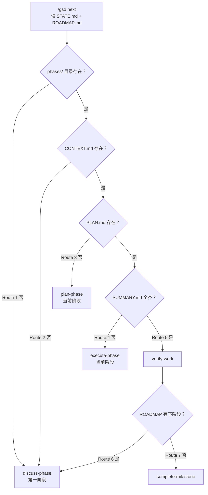

# Get Shit Done (GSD) 技能专栏

> GSD 是 Claude Code 的 **spec-driven 开发框架**：用 `.planning/` 目录当数据库，靠"磁盘上已经有哪些产物"推导下一步该做什么——人不需要记进度，文件系统就是状态机。5 步循环（Discuss → Plan → Execute → Verify → Ship）配 6 命名空间路由，把 67 个命令压成一次可学的骨架。

<!-- more -->

::: tip 版本说明
GSD 已从 `gsd-build/get-shit-done` 迁移到 **`open-gsd/gsd-core`**（老仓库归档，仅重定向）。本专栏对应 GSD Core 1.7.x（框架版本号仍报 1.42.x），5 步循环是官方推荐主链。原 67 命令 / 88 workflow / 33 agent 数字是旧版事实。
:::

::: tip 教学演示文稿
本专栏配套 **13 页瑞士国际主义风格教学 PPT**：涵盖系统规模、三层架构、`.planning/` 状态机、Gate 四分类与预算系统。
👉 [打开 GSD 教学演示文稿（网页 PPT）](../../slides/ppt-gsd-skills/index.md)
:::

本页是专栏总纲，回答三个问题：**它是怎么运转的**、**哪些规则不能违反**、**哪些命令必须会**。详细命令说明请点下方的独立文件——每一页都是一份可执行工作流的 5W1H 说明。

---

## 一、五步循环：主链路

对应命令：`/gsd-discuss-phase` → `/gsd-plan-phase` → `/gsd-execute-phase` → `/gsd-verify-work` → `/gsd-ship`。每个里程碑循环一次，每次只推进一个 phase。

---

## 二、`.planning/` 就是数据库

GSD 没有数据库，全部状态是 `.planning/` 下的 Markdown。路径由 `planningDir()` 计算（`bin/lib/planning-workspace.cjs:46`）：`<cwd>/.planning[/<GSD_PROJECT>][/workstreams/<GSD_WORKSTREAM>]`。

| 文件 | 角色 |
|---|---|
| `config.json` | 唯一配置源 |
| `PROJECT.md` | 长期记忆 |
| `ROADMAP.md` | 阶段总表 |
| `STATE.md` | 短期活记忆，模板强制 **<100 行**，是 digest 不是 archive |
| `REQUIREMENTS.md` | 需求追踪 |

阶段产物在 `.planning/phases/XX-name/` 下按执行顺序产生：`{NN}-CONTEXT.md` → `{phase}-{plan}-PLAN.md` → `{NN}-SUMMARY.md` → `{NN}-VERIFICATION.md`。

**硬约束**：源码注释里写死 **"workflows cannot regress the project state"**——状态只许前进，不许回退。

---

## 三、主链状态机：`next` 读磁盘推导下一步

`workflows/next.md` 的八条路由状态机（读磁盘而非问人）：

**八条路由判定条件**：无阶段目录 → 讨论；有目录无 CONTEXT → 讨论；有 CONTEXT 无 PLAN → 规划；有 PLAN 但 SUMMARY 不全 → 执行；SUMMARY 齐 → 验收；阶段完成且有下阶段 → 推进；全部完成 → 结里程碑；STATE 显示 paused_at → 恢复。

这就是"好品味"的活样板：**把"下一步该干嘛"这个需要人维护的特例消除掉了**。文件在不在就是全部状态。

---

## 四、三层架构：编排者不动手

| 层 | 位置 | 数量 |
|---|---|---|
| 命令外壳 | `~/.claude/skills/gsd-*/SKILL.md` | 67 |
| 工作流实现 | `~/.claude/get-shit-done/workflows/*.md` | 88 |
| 执行者 | `~/.claude/agents/gsd-*.md` | 33 |

`execute-phase.md` 开篇把原则写死在 `<core_principle>` 里：

> **Orchestrator coordinates, not executes.** Each subagent loads the full execute-plan context. Orchestrator: discover plans → analyze deps → group waves → spawn agents → handle checkpoints → collect results.

翻译：编排器只做发现计划、分析依赖、分组 wave、派发 agent、处理检查点、收集结果这六件事，**一行实现代码都不写**。执行按 wave 分批：同一 wave 内并行、跨 wave 串行。

---

## 五、Gate 四分类

`references/gates.md` 规定每个校验点必须映射到四种类型之一（不许自创）：

| 类型 | 目的 | 恢复方式 |
|---|---|---|
| **Pre-flight** | 开工前验前置条件 | 不满足挡住，补上前置再重试 |
| **Revision** | 产出后评质量，带反馈回环（**必有迭代上限**） | 生产者改，checker 重评 |
| **Escalation** | 自动解决不了就上交 | 摆出选项等人决定 |
| **Abort** | 继续有害立即停 | **保留状态**，查根因修好从 checkpoint 重启 |

**检查点三类比例**：**human-verify 90% / decision 9% / human-action 1%**（判据："Claude 能跑的绝不问用户"）。自 #3309 起默认 end-of-phase，不在中途 halt 用户。

---

## 六、不可违反的硬规则

| 规则 | 内容 |
|---|---|
| 强制初始读 | `<required_reading>` 块必须先 Read 完才能做任何动作 |
| 禁直写状态文件 | 不得用 Write/Edit 直接改 `STATE.md` / `ROADMAP.md`，必须走 `gsd-sdk query` |
| 禁 `git add .` / `-A` | 只 stage 指定文件 |
| 禁非 GSD agent | 一律 `subagent_type: "gsd-{agent}"` |
| 尊重已锁决策 | CONTEXT.md / PROJECT.md 已锁定的不重新争论 |
| Gate 四分类 | 不许自创校验类型 |
| Revision 必有上限 | 且要能 stall detection 提前升级 |
| Marker 完成标记 | 必须是 H2 标题 + ALL-CAPS + 输出行首 |
| Abort 保留状态 | 修完根因从 checkpoint 重启 |

---

## 七、Planner 反模式（几条精髓）

`references/planner-antipatterns.md` 里值得记住的：

- **让人类做 Claude 能自动化的事**——"Vercel 有 CLI，Claude 应该跑 `vercel --yes`"。
- **具体性测试**只有一句：*"另一个 Claude 实例能不提问就执行吗？"* 答不上来就是没写清楚。
- **禁用缩范围语言**：`v1`、`simplified version`、`static for now`、`placeholder`、`will be wired later`。阶段太复杂应该建议拆 phase，而不是静默缩减范围。
- **Reflexive SUMMARY chaining**——02 引 01、03 引 02 式链式引用，纯浪费上下文。只在真正用到前序计划的类型/导出/决策时才引用。

---

## 八、上下文预算

`references/context-budget.md` 的四级降级：

| 区间 | 策略 |
|---|---|
| PEAK 0-30% | 全量操作 |
| GOOD 30-50% | 优先读 frontmatter/summary |
| DEGRADING 50-70% | 极度节约并警告用户 |
| POOR 70%+ | 立即 checkpoint |

配套规矩：不读 agent 定义文件（`subagent_type` 自动注入）、不把大文件 inline 进 subagent prompt、重活一律委托。**MCP schema 是最大的每轮固定税**——每启用一个 MCP 每轮都注入 schema，重的可到 20k+ tokens/轮。长 phase 前必须做 MCP 审计。

---

## 九、提交策略

**"Commit outcomes, not process"**——git log 该读起来像 changelog，不是规划日记。

- task 完成 = 提交（每任务一 commit）
- PLAN.md / RESEARCH.md / DISCOVERY.md 创建 = **不**提交
- 格式 `{type}({phase}-{plan}): {task-name}`，类型限 `feat/fix/test/refactor/perf/chore`
- 不得默认传 `--no-verify`

为什么值得这么严：git 历史是未来 Claude 会话的主要上下文源、可以 reset 到上一个成功任务、bisect 能定位到任务级。

---

## 十、必用命令（13 个）

跑 GSD 项目的**全部核心工作流**——覆盖官方 Quickstart 教程的每一步，也是 Reddit 用户实测最常敲的命令。

| 命令 | 说明 |
|---|---|
| [new-project](./new-project) | 统一初始化：提问 → 研究(可选) → 需求 → 路线图 |
| [discuss-phase](./discuss-phase) | 五步循环第一步：榨出实现决策，先识别灰区再追问 |
| [plan-phase](./plan-phase) | 五步循环第二步：研究 → 计划 → 校验 |
| [execute-phase](./execute-phase) | 五步循环第三步：wave 并行执行，编排器精简、实现派给 subagent |
| [verify-work](./verify-work) | 五步循环第四步：对话式 UAT，状态持久化，产出 UAT.md |
| [ship](./ship) | 五步循环第五步：从产物生成 PR，可选代码审查 |
| [next](./next) | 主链路由器：读磁盘推导下一步 |
| [progress](./progress) | 查看进度、总结近期工作与后续 |
| [resume-project](./resume-project) | 立刻恢复完整项目上下文 |
| [pause-work](./pause-work) | 生成 `HANDOFF.json` 与 `.continue-here.md` 交接文件 |
| [complete-milestone](./complete-milestone) | 标记版本完成，MILESTONES 留历史记录 |
| [code-review](./code-review) | 审查阶段内改动的源文件，产出 REVIEW.md |
| [debug](./debug) | 系统化调试，派 `gsd-debug-session-manager` 管检查点循环 |

---

## 十一、可选命令（7 个）

用得少但有存在理由：

| 命令 | 说明 |
|---|---|
| [map-codebase](./map-codebase) | brownfield 项目的代码库映射，配合 `/gsd-onboard` 用 |
| [quick](./quick) | 轻量任务通道，压缩 GSD 全链为单命令 |
| [undo](./undo) | 安全 git 回滚，按阶段清单撤销提交 |
| [settings](./settings) | 交互式配置 agent 与模型档位 |
| [spec-phase](./spec-phase) | 苏格拉底式访谈澄清交付物，带量化歧义评分 |
| [ui-phase](./ui-phase) | 前端阶段 UI 契约 UI-SPEC.md |
| [pr-branch](./pr-branch) | 过滤掉临时 `.planning/` 提交，创建干净 PR 分支 |

---

## 关联专栏

- [agentic-engineer](../agentic-engineer/) — Agent 工程架构
- [harness-engineering](../harness-engineering/) — Harness 工程
- [superpowers-skills](../superpowers-skills/) — obra/superpowers，工程纪律硬规则
- [mattpocock-skills](../mattpocock-skills/) — Matt Pocock skills
- [gstack-skills](../gstack-skills/) — Garry Tan gstack

> 版本对应：本页基于 GSD Core **1.7.x**（本地 `~/.claude/get-shit-done/VERSION` 仍报 1.42.x）。旧仓库 `gsd-build/get-shit-done` 已归档，5 步循环与 6 命名空间路由是新版官方推荐用法。workflow 与 agent 数量随版本变动，引用前建议先跑 `/gsd:update` 核对。
