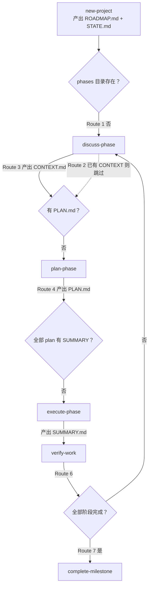

# Get Shit Done (GSD) 技能专栏

> GSD 是 Claude Code 的 spec-driven 开发框架：**67 个命令外壳 + 88 个工作流实现 + 33 个 agent**，用 `.planning/` 目录当数据库，靠"磁盘上已经有哪些产物"推导下一步该做什么——人不需要记进度，文件系统就是状态机。

::: tip 教学演示文稿
本专栏配套 **13 页瑞士国际主义风格教学 PPT**：涵盖系统规模、三层架构、`.planning/` 状态机、Gate 四分类与预算系统，可在线横向翻页浏览。
👉 [打开 GSD 教学演示文稿（网页 PPT）](../../slides/ppt-gsd-skills/index.md)
:::

<!-- more -->

本页是专栏总纲，回答三个问题：**它是怎么运转的**、**技能之间怎么互相依赖**、**哪些规则不能违反**。文末是 88 个 workflow 与 33 个 agent 的完整目录。

---

## 一、它是如何工作的

### 1.1 三层架构：外壳 → 实现 → 执行者

| 层 | 位置 | 数量 | 职责 |
|---|---|---|---|
| 命令外壳 | `~/.claude/skills/gsd-*/SKILL.md` | 67 | 用户唯一入口。薄壳：frontmatter 声明 `name`/`argument-hint`/`allowed-tools`，正文用 `<execution_context>` 里的 `@` 把实现文件拉进来 |
| 工作流实现 | `~/.claude/get-shit-done/workflows/*.md` | 88 | 逻辑本体，编排步骤与 gate |
| 执行者 | `~/.claude/agents/gsd-*.md` | 33 | 真正干活的人，被 workflow 用 `Agent(subagent_type="gsd-xxx")` 派发 |

一个外壳可以收编多个工作流，用第一个参数再分流。本机实测有 11 个这样的伞形外壳：

| 外壳 | 收编的工作流 |
|---|---|
| `gsd-phase` | `add-phase` + `insert-phase` + `remove-phase` + `edit-phase` |
| `gsd-capture` | `add-todo` + `note` + `add-backlog` + `plant-seed` + `check-todos` |
| `gsd-config` | `settings` + `settings-advanced` + `settings-integrations` |
| `gsd-discuss-phase` | `discuss-phase` + `list-phase-assumptions` + `discuss-phase-assumptions` |
| `gsd-progress` | `progress` + `next` + `do` |
| `gsd-update` | `update` + `sync-skills` + `reapply-patches` |
| `gsd-workspace` | `new-workspace` + `list-workspaces` + `remove-workspace` |
| `gsd-manager` | `manager` + `analyze-dependencies` |
| `gsd-sketch` | `sketch` + `sketch-wrap-up` |
| `gsd-spike` | `spike` + `spike-wrap-up` |
| `gsd-pause-work` | `pause-work` + `session-report` |

88 个工作流对 67 个外壳，差额的去向是可枚举的：**46 个**外壳一对一收编单个工作流（其中 45 个同名，唯一例外是 `gsd-resume-work` 收编 `resume-project`）；**11 个**伞形外壳额外覆盖 32 个工作流；两者去重后 **77 个工作流有外壳入口**。剩下两头的零头分别是——**10 个外壳**不引用任何工作流（6 个 `ns-*` 是只读的命名空间索引，`graphify`/`surface`/`workstreams`/`review-backlog` 四个把逻辑直接写在 `SKILL.md` 里，各有 63–199 行），以及 **11 个工作流没有任何入口**（见 [2.5](#_2-5-子工作流-用户不直接调)）。

`.claude/commands/gsd` 已被安装器标记为 `deprecated: true`（`get-shit-done/bin/lib/init.cjs:1872`），本机该目录下 gsd 命令数为 0——旧文档里的 `/gsd:xxx` 写法现在都走 skill。

**88 这个数只数顶层 `.md`。** `workflows/` 下还有两个子目录共 14 个文件，它们不是命令，是被父工作流在指定位置 `Read and execute` 的懒加载片段：`discuss-phase/modes/` 9 个（按 `--power`/`--all`/`--auto` 等 flag 分派，见 `workflows/discuss-phase.md:20-28`）、`discuss-phase/templates/` 2 个、`execute-phase/steps/` 3 个（三个 gate 的完整实现，在 `execute-phase.md:500`、`:914` 以 `Read and execute` 拉入，`:1443` 那处以 `Load and follow the full step spec` 拉入）。所以"GSD 有 88 个工作流"和"有 102 个 workflow 文件"都不算错，但只有前者对应用户可调用的面。

### 1.2 状态文件：`.planning/` 就是数据库

GSD 没有数据库，全部状态是 `.planning/` 下的 Markdown。路径由 `planningDir()` 计算（`bin/lib/planning-workspace.cjs:46`）：`<cwd>/.planning[/<GSD_PROJECT>][/workstreams/<GSD_WORKSTREAM>]`，project 和 workstream 名里带 `/`、`\`、`..` 直接抛错。

| 文件 | 角色 | 谁写 | 谁读 |
|---|---|---|---|
| `config.json` | 唯一配置源 | `config-set` / `config-new-project` | 每个工作流的 Initialize 步 |
| `PROJECT.md` | 长期记忆 | `new-project` Step 4 | STATE.md 引用、`gsd-planner` |
| `ROADMAP.md` | 阶段总表 | `new-project` Step 8 | `roadmap.get-phase`、`gsd-roadmapper` |
| `STATE.md` | 短期活记忆，模板强制 **<100 行**，是 digest 不是 archive | `state update/patch/begin-phase` | **每个工作流的第一步** |
| `REQUIREMENTS.md` | 需求追踪 | `requirements mark-complete` | planner / verifier 做追溯 |

阶段产物在 `.planning/phases/XX-name/` 下，按执行顺序产生：

```
{NN}-CONTEXT.md      discuss-phase 写   → 告诉下游"哪些选择已锁定"
{NN}-SPEC.md         spec-phase 写      → 锁需求，verifier 当 pass/fail 用
{phase}-{plan}-PLAN.md   gsd-planner 写 → 可执行计划，frontmatter 是数据契约
{NN}-SUMMARY.md      gsd-executor 写    → 做完了什么、偏差、自检
{NN}-VERIFICATION.md gsd-verifier 写    → 目标回溯验证结论
{NN}-REVIEW.md       gsd-code-reviewer 写
{NN}-HUMAN-UAT.md    verify-work 写     → 阶段末汇总人工验收项
RESEARCH.md / PATTERNS.md / .continue-here.md
```

`STATE.md` 有一条硬约束写在源码注释里：**"workflows cannot regress the project state"**——状态只许前进，不许回退。

`ROADMAP.md` 的阶段编号规则：整数是计划内阶段，小数是中期紧急插入的——`gsd-sdk query phase.next-decimal 6` 会返回 `06.1`，若已有 `06.1`/`06.2` 则返回 `06.3`，按数值序插在整数之间（`references/decimal-phase-calculation.md`）。

### 1.3 核心编排原则：编排者不动手

`workflows/execute-phase.md` 开篇把原则写死在 `<core_principle>` 里：

> **Orchestrator coordinates, not executes.** Each subagent loads the full execute-plan context. Orchestrator: discover plans → analyze deps → group waves → spawn agents → handle checkpoints → collect results.

翻译：编排器只做发现计划、分析依赖、分组 wave、派发 agent、处理检查点、收集结果这六件事，一行实现代码都不写。`execute-phase` 全文 25 个步骤，名字就能看出分工：

```
parse_args → initialize → safe_resume_gate → check_blocking_antipatterns
→ validate_phase → discover_and_group_plans → execute_waves
→ checkpoint_handling → aggregate_results → ... → verify_phase_goal
→ update_roadmap → offer_next
```

执行按 **wave 分批**：`wave` 字段在计划期就算好，执行期同一 wave 内的计划并行、跨 wave 串行。`execute-phase/steps/` 下三个 gate 守在不同位置：

| Gate | 位置 | 卡什么 |
|---|---|---|
| `per-plan-worktree-gate` | 每个计划派发前 | 该计划要不要开 git worktree 隔离，按计划声明的 `files_modified` 决定 |
| `post-merge-gate` | 一个 wave 全部合并后 | 构建 + 测试，抓单个 worktree 自检查不出来的跨计划集成失败 |
| `codebase-drift-gate` | 最后一次 wave 提交后、验证前 | 结构性漂移检测。**契约规定非阻塞**：内部出错必须放行继续，绝不让这个 gate 判失败 |

### 1.4 Gate：四类校验点

`references/gates.md` 规定每个校验点必须映射到四种类型之一，不许自创：

| 类型 | 目的 | 行为 | 恢复方式 |
|---|---|---|---|
| **Pre-flight** | 开工前验前置条件 | 不满足就挡住，不产生半成品 | 补上前置再重试 |
| **Revision** | 产出后评质量 | 带具体反馈回环给生产者，**必有迭代上限** | 生产者改，checker 重评 |
| **Escalation** | 自动解决不了就上交 | 暂停工作流，摆出选项等人决定 | 人选定路径后继续 |
| **Abort** | 继续下去有害 | 立即停，**保留状态**，报告原因 | 查根因修好，从 checkpoint 重启 |

`gates.md:70` 给了选择启发式，四句话就是决策树：先 pre-flight；产出之后的检查是 revision；回环解决不了就 escalate；继续有危险就 abort。

Revision gate 的迭代上限不是拍脑袋定的——文档明确说"上限应反映单次迭代成本，贵的操作少给重试"，并且要带 **stall detection**：连续两轮问题数不下降就提前升级，不等耗尽次数。

官方 Gate Matrix（`gates.md`）列了几个关键挂点：

| 工作流 | 位置 | 类型 | 查什么 | 失败行为 |
|---|---|---|---|---|
| `plan-phase` | 入口 | Pre-flight | REQUIREMENTS.md、ROADMAP.md | 挡住并提示缺哪个文件 |
| `plan-phase` | Step 12 | Revision | PLAN.md 质量 | 回环给 planner（最多 3 次） |
| `plan-phase` | 回环后 | Escalation | 未解决问题 | 上交开发者 |
| `execute-phase` | 入口 | Pre-flight | PLAN.md | 挡住并提示缺计划 |
| `execute-phase` | 完成 | Revision | SUMMARY.md 完整性 | 重跑未完成任务 |
| `verify-work` | 入口 | Pre-flight | SUMMARY.md | 挡住并提示缺总结 |
| `verify-work` | 评估 | Escalation | 未通过的验收标准 | 把缺口上交开发者 |
| `next` | 入口 | Abort | 错误状态、检查点 | 带诊断信息停止 |

### 1.5 跨会话续接

续接靠两样东西：`STATE.md` 当活记忆（每个工作流第一步必读），`.continue-here.md` / `HANDOFF.json` 当交接单（`pause-work` 生成）。

`references/checkpoints.md` 定了几条规矩，其中一条值得单独说：**自 #3309 起默认 end-of-phase**——不在中途 halt 用户，验证细节嵌进自动任务的 `<verify><human-check>`，等 verifier 在阶段末汇总成 `HUMAN-UAT.md` 一次看完。理由很实在：每次中途 halt 都要付一次 executor 冷启动成本，实测每轮数万 tokens。

检查点分三类，占比是设计过的：**human-verify 90% / decision 9% / human-action 1%**。判据是"Claude 能跑的绝不问用户"——只有认证门和确实没有 CLI/API 的动作才配占用那 1%。

---

## 二、技能之间的依赖关系

### 2.1 主链路：产物驱动的状态机

GSD 最漂亮的设计在这：**下一步做什么不是人记的，是 `next` 读磁盘推导的**。`workflows/next.md` 的 Route 1-8 状态机：



八条路由的判定条件与去向：

| 路由 | 判定条件 | 下一步 |
|---|---|---|
| 1 | ROADMAP 有阶段，但磁盘上无阶段目录 | `/gsd:discuss-phase <第一阶段>` |
| 2 | 阶段目录存在，但无 CONTEXT.md 也无 RESEARCH.md | `/gsd:discuss-phase <当前阶段>` |
| 3 | 有 CONTEXT.md（或 RESEARCH.md），但无 PLAN.md | `/gsd:plan-phase <当前阶段>` |
| 4 | 有 PLAN.md，但非全部有对应 SUMMARY | `/gsd:execute-phase <当前阶段>` |
| 5 | 当前阶段全部 plan 都有 SUMMARY | `/gsd:verify-work` |
| 6 | 当前阶段完成，且 ROADMAP 有下一阶段 | `/gsd:discuss-phase <下一阶段>` |
| 7 | 全部阶段完成 | `/gsd:complete-milestone` |
| 8 | STATE.md 显示 `paused_at` | `/gsd:resume-work` |

这就是"好品味"的活样板：**把"下一步该干嘛"这个需要人维护的特例消除掉了**。不需要进度跟踪器，不需要条件判断分支，文件在不在就是全部状态。

### 2.2 产物依赖：谁生产、谁消费

顺序不是规定出来的，是产物依赖自然形成的：

| 产物 | 生产者 | 消费者 |
|---|---|---|
| `ROADMAP.md` + `STATE.md` | `new-project` / `new-milestone` | 几乎所有工作流 |
| `.planning/codebase/*` | `map-codebase` | `plan-phase`、`ingest-docs` |
| `{NN}-CONTEXT.md` / `RESEARCH.md` | `discuss-phase` | `plan-phase`（有它才规划） |
| `{NN}-SPEC.md` | `spec-phase` | `discuss-phase`、`gsd-planner`、`gsd-verifier` |
| `PATTERNS.md` | `gsd-pattern-mapper` | `gsd-planner` |
| `{phase}-{plan}-PLAN.md` | `gsd-planner` | `execute-phase`、`secure-phase` |
| `{NN}-SUMMARY.md` | `gsd-executor` | `code-review`、`secure-phase`、`eval-review` |
| `{NN}-VERIFICATION.md` | `gsd-verifier` | `audit-milestone` |
| `UI-SPEC.md` / `AI-SPEC.md` | `ui-phase` / `ai-integration-phase` | `ui-review` / `eval-review` |
| `.planning/intel/*` | `ingest-docs` | `new-project` 的 roadmapper |

### 2.3 workflow → agent 分发表

| 工作流 | 派发的 agent（按序） | 分工 |
|---|---|---|
| `new-project` | `gsd-project-researcher` ×4 并行 → `gsd-research-synthesizer` → `gsd-roadmapper` ×2 | 生态研究 → 综合 → 建路线图 |
| `new-milestone` | 同 `new-project` | 里程碑版研究 + 路线图 |
| `map-codebase` / `scan` | `gsd-codebase-mapper` ×4–7 并行 | 扫描代码库写多份文档 |
| `discuss-phase` | advisor 模式下派 `gsd-advisor-researcher`；主流程不派发 | 灰区决策研究 |
| `plan-phase` | `gsd-pattern-mapper` → `gsd-phase-researcher` → `gsd-planner` → `gsd-plan-checker`（可回环） | 模式匹配 → 技术研究 → 写计划 → 审计划 |
| `execute-phase` | `gsd-executor`（多 wave 并行）→ `gsd-verifier` | 执行并原子提交 → 目标验证 |
| `verify-phase` | **零 agent**，全部内联 | 人工/行为验收 |
| `code-review` | `gsd-code-reviewer` | 产出 REVIEW.md |
| `code-review-fix` | `gsd-code-reviewer` → `gsd-code-fixer` | 复审 → 按 REVIEW.md 修 |
| `debug` | `gsd-debug-session-manager` →（内部再派）`gsd-debugger` | 两级委派：会话管理器管检查点循环 |
| `audit-fix` | `gsd-executor` | 按审计结论直接修 |
| `secure-phase` | `gsd-security-auditor` | 验证威胁缓解是否落地 |
| `ui-phase` | `gsd-ui-researcher` → `gsd-ui-checker`（修订循环） | 生成 UI-SPEC → 验设计契约 |
| `ai-integration-phase` | `gsd-framework-selector` → `gsd-ai-researcher` → `gsd-domain-researcher` → `gsd-eval-planner` | 选框架 → 查文档 → 领域研究 → 评估策略 |
| `eval-review` | `gsd-eval-auditor` | 回顾审计评估覆盖 |
| `ingest-docs` | `gsd-doc-classifier` ×N 并行 → `gsd-doc-synthesizer` → `gsd-roadmapper` | 分类 → 综合 → 补路线图 |
| `profile-user` | `gsd-user-profiler` | 从会话记录生成 USER-PROFILE.md |
| `quick` | `phase-researcher` → `planner` → `plan-checker` → `executor` → `code-reviewer` → `verifier` | 单命令跑完小任务 |

几个例外值得记住：

- `gsd-verifier` **不归** `verify-phase` 管——它由 `execute-phase` 在任务完成后立即派发做目标验证；`verify-phase` 只负责人工验收环节。名字有误导性。
- `gsd-intel-updater` 不被任何工作流派发，只由 `get-shit-done/bin/lib/intel.cjs:320` 输出提示消息触发（"spawn gsd-intel-updater agent for full refresh"）。
- `gsd-nyquist-auditor` 归 `validate-phase`，`gsd-integration-checker` 归 `audit-milestone`，`gsd-assumptions-analyzer` 归 `discuss-phase-assumptions`。
- `code-review-fix` 一行的派发逻辑写得齐全（`Agent(subagent_type="gsd-code-fixer")` 在第 192 行），但整个工作流已无外壳入口——它是被 #2790 合并后遗留的完整文件，不是空壳（见 [2.5](#_2-5-子工作流-用户不直接调)）。

### 2.4 硬前置：缺文件就报错

多个工作流在入口处硬性要求前置产物，缺了直接退出并提示该跑哪条命令：

| 工作流 | 前置要求 | 缺失时提示 |
|---|---|---|
| `ai-integration-phase` / `ui-phase` | 存在 `.planning/` | 先跑 `/gsd:new-project` |
| `secure-phase` | 存在 SUMMARY.md | 先跑 `/gsd:execute-phase {N}` |
| `code-review-fix` | 存在 REVIEW.md | 先跑 `/gsd:code-review` |
| `analyze-dependencies` | 存在 ROADMAP.md | 先跑 `/gsd:new-project` |
| `add-tests` | 阶段已完成 | 只作用于已完成阶段 |

### 2.5 子工作流：用户不直接调

88 个工作流里有 11 个没有任何外壳入口，它们的命运分三类。

**第一类：被其他工作流在内部调用（8 个）**

| 工作流 | 调用方（实测引用文件） |
|---|---|
| `execute-plan` | `execute-phase.md`、`node-repair.md` |
| `node-repair` | `execute-plan.md`、`settings-advanced.md` |
| `transition` | `next.md`、`execute-phase.md`、`verify-work.md` 等 17 个 |
| `scan` | `next.md`、`plan-phase.md`、`verify-work.md` 等 25 个 |
| `graduation` | `transition.md`、`extract-learnings.md` |
| `verify-phase` | `plan-phase.md` |
| `diagnose-issues` | `verify-work.md` |
| `discuss-phase-power` | `discuss-phase/modes/power.md` |

其中只有 `graduation.md:3` 在源码里明确写了"Never invoked directly by users"。另外 4 个文件（`add-backlog`、`reapply-patches`、`thread`、`debug`）的头部也标了 `Invoked by`，但指向的是 `commands/gsd/*.md`——那个目录已被安装器废弃，标记本身是过期的。

**第二类：纯本地状态工具（8 个）**

`stats`、`help`、`next`、`progress`、`health`、`cleanup`、`undo`、`settings` 实测几乎不派 agent（只有 `settings` 有 1 处），但被其他工作流大量引用为内部步骤——`next` 被 67 个工作流引用、`progress` 38 个、`settings` 17 个。注意 `next` 虽在主链上起导航作用，本身却只读状态、不派 agent。

**第三类：残留死文件（3 个）**

`code-review-fix`、`plan-milestone-gaps`、`discovery-phase` 在整个 `get-shit-done/` 和 `skills/` 里零引用。前两个在 `skills/gsd-ns-review/SKILL.md:11` 和 `skills/gsd-ns-project/SKILL.md:11` 有明确记载：#2790 把 `gsd-code-review-fix` 合并进了 `gsd-code-review --fix`、删掉了 `gsd-plan-milestone-gaps`，但工作流文件没跟着清掉。`discovery-phase` 连迁移说明都没有，是彻底的孤儿。

这三类不是同一个维度：第一类和第三类加起来正好是 [1.1](#_1-1-三层架构-外壳-→-实现-→-执行者) 里那 11 个无入口工作流（8 个内部调用 + 3 个死文件），第二类那 8 个本地工具全都有外壳入口，不在无入口名单里。所以"用户不直接调"其实有两种成因——没有外壳可调，和有外壳但外壳只是薄封装、真正干活的是别人的内部步骤。

---

## 三、最佳实践与反模式

### 3.1 不可违反的硬规则

`references/universal-anti-patterns.md` 和 `mandatory-initial-read.md` 定了一批红线：

| 规则 | 内容 |
|---|---|
| 强制初始读 | prompt 里有 `<required_reading>` 块，必须先 Read 全部列出文件才能做任何其他动作 |
| 禁直写状态文件 | 不得用 Write/Edit 直接改 `STATE.md` / `ROADMAP.md`，必须走 `gsd-sdk query`（仅首次从模板创建例外） |
| 禁 `git add .` / `-A` | 只 stage 指定文件 |
| 禁非 GSD agent | 一律 `subagent_type: "gsd-{agent}"`，不得退化成 general-purpose/Explore/Plan |
| 尊重已锁决策 | CONTEXT.md / PROJECT.md 里已锁定的决策不得重新争论，无条件尊重 |
| Gate 四分类 | 每个校验点必须映射 Pre-flight / Revision / Escalation / Abort 之一 |
| Revision 必有上限 | 回环必须带迭代上限，且要能提前升级 |
| Marker 格式 | 完成标记必须是 H2 标题、位于最终输出行首，ALL-CAPS 是标准约定 |
| Abort 保留状态 | 危险时立即停但保留状态，修完根因从 checkpoint 重启 |

### 3.2 Planner 反模式

`references/planner-antipatterns.md` 逐条列了"别这么规划"：

- **让人类做 Claude 能自动化的事**——"Vercel 有 CLI，Claude 应该跑 `vercel --yes`"。
- **checkpoint 过多**导致 verification fatigue，应合并到有意义的工作之后只放一个。
- **checkpoint 与实现任务交错散布**，把执行流切碎。
- **任务描述模糊**。具体性测试只有一句：*"另一个 Claude 实例能不提问就执行吗？"* 答不上来就是没写清楚。
- **Reflexive SUMMARY chaining**——02 引 01、03 引 02 式链式引用，纯浪费上下文。只在真正用到前序计划的类型/导出/决策时才引用。
- **禁用缩范围语言**：`v1`、`simplified version`、`static for now`、`placeholder`、`will be wired later`。阶段太复杂应该建议拆 phase，而不是静默缩减范围。

### 3.3 调试哲学

`references/debugger-philosophy.md` 的几条值得背下来：

- **用户是 reporter 不是 diagnostician**。只问预期/实际/报错/何时开始；原因、哪个文件、怎么修——自己查。
- **Meta-debugging**：自己写的代码要当外人的代码读，自己的实现决策是假设不是事实。
- **四类认知偏差及解药**：confirmation（主动找反证）、anchoring（先独立生成 3+ 假设再查）、availability、sunk cost（每 30 分钟自问一次）。
- **一次只改一个变量**；完整读整个函数，而不是只读"相关"行。
- **该重启的五个信号**：2+ 小时无进展 / 3+ 次无效修复 / 无法解释当前行为 / 在 debug debugger / 修好了但不知道为什么。最后一条原文说得狠：**"这不是修好了，这是运气。"**

配套的 `references/common-bug-patterns.md` 按频率排了 11 类 bug，声称覆盖约 80% 的问题，并给了 symptom → 类别映射表。规矩是：形成任何假设前，先扫对应类别。

### 3.4 上下文预算

`references/context-budget.md` 定了一条四级降级：

| 区间 | 策略 |
|---|---|
| PEAK 0-30% | 全量操作 |
| GOOD 30-50% | 优先读 frontmatter/summary |
| DEGRADING 50-70% | 极度节约并警告用户 |
| POOR 70%+ | 立即 checkpoint |

配套规矩：不读 agent 定义文件（`subagent_type` 会自动注入）、不把大文件 inline 进 subagent prompt、读深度随 `context_window` 缩放、重活一律委托。

文档给了两个关键论据，都值得记住：

1. **上下文退化有早期信号，早于阈值告警**：silent partial completion（自检只查文件存在性，查不出语义不完整）、表述变模糊、跳过协议步骤。而且 orchestrator 无法验证 subagent 输出的语义正确性，只能用 `must_haves.truths` 缓解。
2. **MCP schema 是最大的每轮固定税**：每个启用的 MCP 不管用不用，每轮都注入 schema，重的可到 20k+ tokens/轮，往往超过模型调优能省的量。长 phase 前必须做 MCP 审计。

### 3.5 模型分层

`references/model-profiles.md` 的优先级链：`model_overrides[agent]` > `dynamic_routing` > `models[phase_type]` > profile 表 > runtime default。

三条设计理由值得单独看：planner 用 opus，因为架构决策质量影响最大；executor 用 sonnet，因为执行"跟随明确指令"（原文 `follows explicit instructions`，推理已经在计划里做完了）；verifier 用 sonnet 而非 haiku，因为需要推理而不是模式匹配。

一个工程细节：表里有一列 `inherit`，整列都返回 `inherit` 而不是具体模型。它的用途在第 119 行说得很明确——用 OpenRouter 或本地模型时设成 `inherit` profile，否则默认的 `balanced` 会给每个 agent 指定 `opus`/`sonnet`/`haiku`，让非 Anthropic 供应商白付一笔 Anthropic API 费用。

### 3.6 提交策略

`references/git-integration.md` 的原则一句话：**"Commit outcomes, not process"**——git log 该读起来像 changelog，而不是规划日记。

由此推出几条：task 完成 = 提交（每任务一 commit）；PLAN.md / RESEARCH.md / DISCOVERY.md 创建 = **不**提交。格式 `{type}({phase}-{plan}): {task-name}`，类型限 `feat/fix/test/refactor/perf/chore`。不得默认传 `--no-verify`。

为什么值得这么严：git 历史是未来 Claude 会话的主要上下文源、可以 reset 到上一个成功任务、bisect 能定位到任务级。

`.planning/` 的提交统一走 `gsd-sdk query commit "..." --files ...`，由 CLI 处理 `commit_docs` 与 gitignore 检查。

### 3.7 Agent 契约与完成标记

agent 的职责边界由**完成标记 + 产物文件**双重定义，orchestrator 靠 marker 正则路由（`references/agent-contracts.md`）。

两个关键交接，字段全部必填：

**Planner → Executor，经 PLAN.md**：frontmatter（`phase/plan/type/wave/depends_on/files_modified/autonomous/requirements`）+ `<objective>` + `<tasks>`（每个任务含 type/files/action/verify/acceptance_criteria）+ `<verification>` + `<success_criteria>`。

**Executor → Verifier，经 SUMMARY.md**：frontmatter + Commits 表（每任务的 commit hash 与描述）+ Deviations 段（自动修的问题或写 "None"）+ Self-Check（PASSED/FAILED 带细节）。

标记规则：ALL-CAPS 是标准约定，必须是 H2 且位于最终输出行首。几类典型：

| agent | 完成标记 |
|---|---|
| `gsd-planner` | `## PLANNING COMPLETE` |
| `gsd-executor` | `## PLAN COMPLETE`、`## CHECKPOINT REACHED` |
| `gsd-plan-checker` | `## VERIFICATION PASSED`、`## ISSUES FOUND` |
| `gsd-ui-checker` | 只 `## ISSUES FOUND`（没有对称的 PASSED 标记） |
| `gsd-debugger` | `## DEBUG COMPLETE`、`## ROOT CAUSE FOUND`、`## CHECKPOINT REACHED` |
| `gsd-roadmapper` | `## ROADMAP CREATED`、`## ROADMAP REVISED`、`## ROADMAP BLOCKED` |
| `gsd-verifier` / `gsd-integration-checker` | title-case（有意为之，不是 bug） |
| `gsd-nyquist-auditor` / `gsd-security-auditor` | 非标准 `## PARTIAL`/`## ESCALATE`、`## OPEN_THREATS`/`## ESCALATE`，表示部分结果需 orchestrator 判断 |
| `gsd-codebase-mapper` / `gsd-doc-writer` 等 | 无 marker，直接写产物 |

一处有意的例外：`agent-contracts.md:79` 明确 `## PLAN COMPLETE` **不**被 execute-phase 的正则匹配，完成检测靠 spot-check（SUMMARY.md 存在性 + git 状态）——因为 subagent 的完成信号在部分运行时不可靠，宁可查文件系统。

> **计数说明**：`~/.claude/agents/` 下有 33 个 agent 定义文件，但 `agent-contracts.md` 的 Agent Registry 只登记了其中 22 个（即定义了完成标记契约的那些）。未登记的 11 个是 `gsd-ai-researcher`、`gsd-code-fixer`、`gsd-code-reviewer`、`gsd-debug-session-manager`、`gsd-doc-classifier`、`gsd-doc-synthesizer`、`gsd-domain-researcher`、`gsd-eval-auditor`、`gsd-eval-planner`、`gsd-framework-selector`、`gsd-pattern-mapper`。

---

## 四、Workflow 目录（88 个）

### 启动（8）

| 命令 | 说明 |
|---|---|
| [new-project](./new-project) | 统一初始化流程：提问 → 研究(可选) → 需求 → 路线图 |
| [new-milestone](./new-milestone) | 为已有项目启动新里程碑周期，加载上下文并收集目标 |
| [map-codebase](./map-codebase) | 并行调度多个 codebase-mapper，产出结构化代码库文档 |
| [scan](./scan) | 轻量代码库评估，只派一个 mapper 聚焦单一方面 |
| [import](./import) | 摄入外部计划：冲突检测 → 写 PLAN.md → 交 gsd-plan-checker 校验 |
| [ingest-docs](./ingest-docs) | 扫描仓库里的 ADR/PRD/SPEC/DOC，综合后引导或合并进 `.planning/` |
| [resume-project](./resume-project) | 立刻恢复完整项目上下文，让"我们做到哪了"有立即答案 |
| [pause-work](./pause-work) | 生成 `HANDOFF.json` 与 `.continue-here.md` 交接文件 |

### 规划（12）

| 命令 | 说明 |
|---|---|
| [plan-phase](./plan-phase) | 为路线图某阶段生成可执行 PLAN.md，默认 研究→计划→校验→完成 |
| [discuss-phase](./discuss-phase) | 榨出下游 agent 需要的实现决策，先识别灰区再追问 |
| [discuss-phase-power](./discuss-phase-power) | 强模式：一次性生成全部问题成 JSON 状态文件 |
| [discuss-phase-assumptions](./discuss-phase-assumptions) | 同上但走代码库优先分析 |
| [list-phase-assumptions](./list-phase-assumptions) | 规划前先摊出 Claude 的假设，让用户纠正误解 |
| [discovery-phase](./discovery-phase) | 按合适深度执行发现（**无外壳入口**，见 [2.5](#_2-5-子工作流-用户不直接调)） |
| [spec-phase](./spec-phase) | 苏格拉底式访谈澄清某阶段交付什么，带量化歧义评分 |
| [ultraplan-phase](./ultraplan-phase) | [BETA] 把规划卸载到 Claude Code 云端 ultraplan |
| [plan-review-convergence](./plan-review-convergence) | 跨 AI 计划收敛：让外部 AI CLI 独立评审阶段计划 |
| [plan-milestone-gaps](./plan-milestone-gaps) | 读 MILESTONE 缺口，创建补齐所需的全部阶段（**#2790 已删除，残留文件**） |
| [milestone-summary](./milestone-summary) | 从已完成里程碑产物生成人类可读的项目总结，用于团队 onboarding |
| [analyze-dependencies](./analyze-dependencies) | 执行前分析 ROADMAP 各阶段依赖，检测文件重叠 |

### 阶段 CRUD（4）

| 命令 | 说明 |
|---|---|
| [add-phase](./add-phase) | 在里程碑末尾追加整数阶段，自动计算编号 |
| [insert-phase](./insert-phase) | 里程碑中期发现紧急工作，插入小数阶段 |
| [remove-phase](./remove-phase) | 删除未开始的未来阶段，删目录并重编号后续阶段 |
| [edit-phase](./edit-phase) | 就地修改 ROADMAP.md 中某阶段任意字段，编号与位置不变 |

### 执行（9）

| 命令 | 说明 |
|---|---|
| [execute-phase](./execute-phase) | 以 wave 并行执行某阶段全部计划，编排器精简，实现派给 subagent |
| [execute-plan](./execute-plan) | 执行单个 PLAN.md 并产出 SUMMARY.md |
| [do](./do) | 解析自由文本，路由到最合适的 GSD 命令（分发器） |
| [quick](./quick) | 小任务走完整 GSD 保障（原子提交、STATE 跟踪），单命令压缩全链 |
| [fast](./fast) | 极简任务内联执行，无 PLAN.md、不派 subagent |
| [autonomous](./autonomous) | 自主驱动里程碑阶段，可全部或按 `--from N`/`--to N` 范围 |
| [spike](./spike) | 通过体验式探索验证想法，做聚焦实验感受各部件 |
| [spike-wrap-up](./spike-wrap-up) | 把 spike 实验发现打包成持久项目 skill（实现蓝图） |
| [mvp-phase](./mvp-phase) | 引导 MVP 模式规划，提示"As a / I want to / So that" |

### 验证与审计（9）

| 命令 | 说明 |
|---|---|
| [verify-work](./verify-work) | 对话式测试验证已建功能，状态持久化，产出 UAT.md |
| [verify-phase](./verify-phase) | 目标回溯分析，确认代码库真的交付了阶段承诺 |
| [validate-phase](./validate-phase) | 审计已完成阶段的 Nyquist 验证缺口，补测试 |
| [add-tests](./add-tests) | 基于 SUMMARY/CONTEXT/实现为已完成阶段生成单测与 E2E |
| [audit-fix](./audit-fix) | 自主审计-修复流水线：跑审计、解析、分类、修 |
| [audit-uat](./audit-uat) | 跨阶段审计所有 UAT 与验证文件，找出每个未决项 |
| [audit-milestone](./audit-milestone) | 汇总各阶段验证，核对里程碑是否达成 definition of done |
| [secure-phase](./secure-phase) | 确认 PLAN.md 威胁登记表的缓解措施已落地 |
| [eval-review](./eval-review) | 回顾审计已实现 AI 阶段的评估覆盖度 |

### 代码审查与调试（6）

| 命令 | 说明 |
|---|---|
| [code-review](./code-review) | 审查阶段内改动的源文件，产出 REVIEW.md |
| [code-review-fix](./code-review-fix) | 按 REVIEW.md 自动修问题（**#2790 已并入 `gsd-code-review --fix`，残留文件**） |
| [review](./review) | 跨 AI 同行评审：调外部 AI CLI 独立评审阶段计划 |
| [diagnose-issues](./diagnose-issues) | 并行调度多个 debug agent 调查 UAT 缺口找根因 |
| [debug](./debug) | 系统化调试，派 gsd-debug-session-manager 管检查点循环 |
| [explore](./explore) | 苏格拉底式构思工作流，用探询问题引导探索想法 |

### UI 与 AI 专项（5）

| 命令 | 说明 |
|---|---|
| [ui-phase](./ui-phase) | 为前端阶段生成 UI 设计契约 UI-SPEC.md |
| [ui-review](./ui-review) | 对已实现前端做六维度回顾性视觉审计 |
| [sketch](./sketch) | 用一次性 HTML mock 探索设计方向，再定实现 |
| [sketch-wrap-up](./sketch-wrap-up) | 把草图设计发现策展打包成持久项目 skill |
| [ai-integration-phase](./ai-integration-phase) | 为涉及 AI 系统的阶段生成 AI 设计契约 AI-SPEC.md |

### 发布（4）

| 命令 | 说明 |
|---|---|
| [ship](./ship) | 从已完成阶段/里程碑工作创建 PR，用计划产物生成丰富 PR 描述 |
| [pr-branch](./pr-branch) | 过滤掉临时 `.planning/` 提交，创建干净 PR 分支 |
| [graduation](./graduation) | LEARNINGS.md 跨阶段毕业助手，聚类复现项并提名晋升候选（由 transition 调用） |
| [complete-milestone](./complete-milestone) | 标记某版本完成，在 MILESTONES 留历史记录 |

### 维护（12）

| 命令 | 说明 |
|---|---|
| [update](./update) | 经 npm 检查 GSD 更新，显示变更日志，获取用户确认 |
| [sync-skills](./sync-skills) | 跨运行时同步 GSD skill |
| [cleanup](./cleanup) | 把已完成里程碑累积的阶段目录归档到 `.planning/milestones/v{X}` |
| [undo](./undo) | 安全 git 回滚，按阶段清单撤销 GSD 阶段/计划提交 |
| [node-repair](./node-repair) | 失败任务验证的自主修复算子，由 execute-plan 在任务失败时调用 |
| [reapply-patches](./reapply-patches) | 更新重装后把用户本地修改合并回新版本（由 `update --reapply` 调用） |
| [transition](./transition) | 标记当前阶段完成并前进到下一阶段 |
| [session-report](./session-report) | 生成本会话总结文档，记录所做工作与成果 |
| [extract-learnings](./extract-learnings) | 从已完成阶段提取决策、教训、模式与意外 |
| [forensics](./forensics) | 失败或卡住的工作流的事后调查，只读分析 git 历史与 `.planning/` |
| [docs-update](./docs-update) | 生成、更新并验证全部项目文档 |
| [health](./health) | 校验 `.planning/` 目录完整性并报告可操作问题 |

### 捕获（8）

| 命令 | 说明 |
|---|---|
| [add-todo](./add-todo) | 把会话中冒出的想法/任务/问题捕获为结构化 todo |
| [add-backlog](./add-backlog) | 用 999.x 编号把想法停进 ROADMAP backlog 停车场（由 `capture --backlog` 调用） |
| [note](./note) | 零摩擦捕获想法：一次 Write、一行确认 |
| [plant-seed](./plant-seed) | 把前瞻想法捕获为带触发条件的结构化种子文件 |
| [check-todos](./check-todos) | 列出全部待办，选中后加载完整上下文并路由 |
| [inbox](./inbox) | 按贡献模板分拣评审所有未决 GitHub issue 与 PR |
| [thread](./thread) | 创建/列出/关闭/恢复跨会话持久上下文线程 |
| [profile-user](./profile-user) | 完整开发者画像流程：同意 → 会话分析(或问卷兜底) |

### 工作区（3）

| 命令 | 说明 |
|---|---|
| [new-workspace](./new-workspace) | 创建隔离工作区目录，内含 git 仓库副本与独立 `.planning/` |
| [list-workspaces](./list-workspaces) | 列出 `~/gsd-workspaces/` 下所有工作区及状态 |
| [remove-workspace](./remove-workspace) | 移除工作区，清理 git worktree 并删除目录 |

### 配置与导航（8）

| 命令 | 说明 |
|---|---|
| [settings](./settings) | 交互式配置工作流 agent 与模型档位 |
| [settings-advanced](./settings-advanced) | 交互式配置 power-user 开关：plan bounce、node repair、subagent 超时 |
| [settings-integrations](./settings-integrations) | 交互式配置第三方集成（搜索 API key 等） |
| [help](./help) | 按用户所问层级显示 GSD 命令帮助 |
| [next](./next) | 探测当前项目状态，自动推进到下一个逻辑步骤（主链路由器） |
| [progress](./progress) | 查看进度、总结近期工作与后续，再智能路由 |
| [stats](./stats) | 显示项目全景统计：阶段、计划、需求、git 指标 |
| [manager](./manager) | 单终端交互式指挥中心，仪表盘管理整个里程碑 |

---

## 五、Agent 目录（33 个）

### 研究员（7）

| Agent | 说明 |
|---|---|
| [gsd-advisor-researcher](./gsd-advisor-researcher) | 研究单个灰区决策，返回带理由的结构化对比表 |
| [gsd-ai-researcher](./gsd-ai-researcher) | 研究选定 AI 框架官方文档，产出可实施指引 |
| [gsd-domain-researcher](./gsd-domain-researcher) | 研究 AI 系统的业务领域与现实场景，先于评估标准摸清"什么算好" |
| [gsd-phase-researcher](./gsd-phase-researcher) | 规划前研究某阶段如何实现，产出 RESEARCH.md 供 planner 消费 |
| [gsd-project-researcher](./gsd-project-researcher) | 建路线图前研究领域生态，产物进 `.planning/research/` |
| [gsd-research-synthesizer](./gsd-research-synthesizer) | 把多个并行研究员的产出综合成 SUMMARY.md |
| [gsd-ui-researcher](./gsd-ui-researcher) | 产出 UI-SPEC.md 设计契约，读上游产物并探测设计系统现状 |

### 规划师（5）

| Agent | 说明 |
|---|---|
| [gsd-planner](./gsd-planner) | 创建可执行阶段计划：任务拆解、依赖分析、目标回溯验证 |
| [gsd-roadmapper](./gsd-roadmapper) | 创建项目路线图：阶段拆分、需求映射、成功标准推导 |
| [gsd-framework-selector](./gsd-framework-selector) | 交互式决策矩阵，帮用户选定合适的 AI/LLM 框架 |
| [gsd-pattern-mapper](./gsd-pattern-mapper) | 分析代码库既有模式，产出 PATTERNS.md 把新文件映射到最接近的范本 |
| [gsd-plan-checker](./gsd-plan-checker) | 执行前验证计划能否达成阶段目标，做目标回溯质量分析 |

### 执行员（6）

| Agent | 说明 |
|---|---|
| [gsd-executor](./gsd-executor) | 执行 GSD 计划：原子提交、偏差处理、检查点协议、状态管理 |
| [gsd-codebase-mapper](./gsd-codebase-mapper) | 探索代码库并写结构化分析文档 |
| [gsd-code-fixer](./gsd-code-fixer) | 读 REVIEW.md 应用智能修复并提交 |
| [gsd-doc-writer](./gsd-doc-writer) | 按 doc_assignment 块写/更新项目文档 |
| [gsd-doc-synthesizer](./gsd-doc-synthesizer) | 把分类后的规划文档综合成单一上下文，处理优先级与交叉引用环 |
| [gsd-doc-classifier](./gsd-doc-classifier) | 把单个规划文档分类为 ADR/PRD/SPEC/DOC/UNKNOWN |

### 调试与诊断（6）

| Agent | 说明 |
|---|---|
| [gsd-debugger](./gsd-debugger) | 用科学方法调查 bug，管理调试会话与检查点 |
| [gsd-debug-session-manager](./gsd-debug-session-manager) | 在隔离上下文中管理多周期调试检查点与续接循环，内部再派 gsd-debugger |
| [gsd-eval-auditor](./gsd-eval-auditor) | 回顾审计已实现 AI 阶段的评估覆盖度 |
| [gsd-eval-planner](./gsd-eval-planner) | 设计 AI 阶段评估策略：挑关键失败模式、定评估维度 |
| [gsd-nyquist-auditor](./gsd-nyquist-auditor) | 填补 Nyquist 验证缺口，生成测试并核对覆盖 |
| [gsd-integration-checker](./gsd-integration-checker) | 验证跨阶段集成与端到端流程是否真的连通 |

### 审查（7）

| Agent | 说明 |
|---|---|
| [gsd-assumptions-analyzer](./gsd-assumptions-analyzer) | 深度分析某阶段代码库，返回带证据的结构化假设 |
| [gsd-doc-verifier](./gsd-doc-verifier) | 把生成文档里的 factual claims 对活代码库逐条核验，返回 JSON |
| [gsd-code-reviewer](./gsd-code-reviewer) | 审查源文件的 bug、安全问题与代码质量，产出分级 REVIEW.md |
| [gsd-security-auditor](./gsd-security-auditor) | 核验 PLAN.md 威胁模型的缓解措施已在代码中实现，产出 SECURITY.md |
| [gsd-ui-auditor](./gsd-ui-auditor) | 对已实现前端做六维度回顾性视觉审计，产出评分 UI-REVIEW.md |
| [gsd-ui-checker](./gsd-ui-checker) | 按六质量维度校验 UI-SPEC.md 设计契约，产出 BLOCK/FLAG/PASS 结论 |
| [gsd-verifier](./gsd-verifier) | 目标回溯分析验证阶段目标达成，核对代码库是否真交付了承诺 |

### 用户与情报（2）

| Agent | 说明 |
|---|---|
| [gsd-user-profiler](./gsd-user-profiler) | 分析会话记录八个行为维度，产出评分的开发者画像 |
| [gsd-intel-updater](./gsd-intel-updater) | 分析代码库并写结构化 intel 文件到 `.planning/intel/`（只由 `get-shit-done/bin/lib/intel.cjs` 触发，不被工作流派发） |

---

## 适用场景

- 多阶段长周期项目，需要严格的阶段边界与 spec-first
- 想让 AI 自主推进、人类只在关卡做判断的团队
- 上下文吃紧的长会话——checkpoint 与 STATE.md 就是为这个设计的
- 需要跨会话续接、可回溯到任务级的工程（git 历史即上下文）

## 关联专栏

- [agentic-engineer](../agentic-engineer/) — Agent 工程架构
- [harness-engineering](../harness-engineering/) — Harness 工程
- [superpowers-skills](../superpowers-skills/) — obra/superpowers，工程纪律硬规则
- [mattpocock-skills](../mattpocock-skills/) — Matt Pocock skills
- [gstack-skills](../gstack-skills/) — Garry Tan gstack

> 版本对应：本页基于 GSD **1.42.3**（本地 `~/.claude/get-shit-done/VERSION`）与 33 个本地 agent 定义写成。workflow 与 agent 数量随版本变动，引用前建议先跑 `/gsd:update` 核对。
