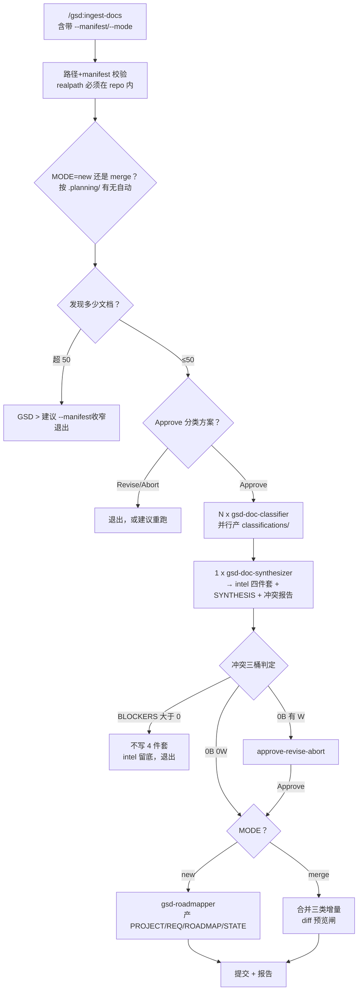

# ingest-docs

> 扫仓库里散落的 ADR/PRD/SPEC/DOC，批量分类后合成一份统一情报，再选"建新 .planning/ 还是并入既有规划"——把历史决策文档变成规划基础设施而不是僵尸 README 目录。

<!-- more -->

## 5W1H

| 项 | 内容 |
|---|---|
| **Who（谁用）** | 两种处境的迁移者：① 一个古老仓库里散着 `docs/adr/`、`docs/prd/`、`docs/specs/` 但从未用过 GSD，想一步把决策/需求/约束拉进 `.planning/`（MODE=new）；② 已有 `.planning/`、拿到了一批新文档想并进去不推翻现状（MODE=merge）。 |
| **What（做什么）** | 解析参数（SCAN_PATH/--mode/--manifest/--resolve）→ realpath 包含性校验 → init + 模式自动判定 + git 初始化 → 三路发现（manifest 优先，否则目录约定，最后内容启发式）→ 50 文档硬帽 → 展示分类结果走 approve 闸 → 并行派 N 个 gsd-doc-classifier → 派 1 个 gsd-doc-synthesizer 产 intel 与冲突报告 → conflict_gate 按 BLOCKER/WARNING 分档决定是否继续 → new 模式派 gsd-roadmapper 建 4 件套 / merge 模式规划增量合并 → 提交。 |
| **When（何时用）** | `/gsd:ingest-docs [path]`。flag：`--mode new|merge`（缺省按 `.planning/` 是否存在自动判定）、`--manifest <file>`（YAML，body 列 path/type/precedence）、`--resolve auto`（v1 只支持 auto，interactive 保留）。 |
| **Where（在哪里）** | 工作流实现 `~/.claude/get-shit-done/workflows/ingest-docs.md`（339 行），init/commit 走 `bin/gsd-tools.cjs`。派发顺序：N× `gsd-doc-classifier`（单消息并发、上限 50）→ 1× `gsd-doc-synthesizer` →（仅 new 模式）1× `gsd-roadmapper`。 |
| **Why（为什么存在）** | 消除"历史文档一大堆、规划却零起点"的特例：把 ADR 决策手抄进项目上下文容易失真，该流把分类做成**按文档并发**的 agent 群体、人工零拾取；并把 `LOCKED-vs-LOCKED ADR 矛盾` 明文定为 BLOCKER、把 PRD 的多个 acceptance variant **原样保留给人裁决**——它只搬档案不替你拍板。 |
| **How（怎么做）** | `<step>` 分行：`discover_docs` 三路归一去重、上限 50 份（超出即退出并建议 `--manifest` 收窄）；`classify_parallel` 建 staging `.planning/intel/classifications/`、任一 classifier 报错则中止且不碰 `.planning/`；`synthesize` 产 `intel/{decisions,requirements,constraints,context}.md`、`SYNTHESIS.md`、`INGEST-CONFLICTS.md`；`conflict_gate` 解析 `### BLOCKERS ({N})` 等三桶标题行、BLOCKERS>0 时**不写 PROJECT/REQUIREMENTS/ROADMAP/STATE**、staged intel 留底；`route_new_mode` 只问规划器无法从 intel 推出的最小问题集（项目名、目标运行时等）再派 roadmapper；`route_merge_mode` 以"新需求/新决策/新范围"三类增量为准并入而非覆写。 |

## 工作原理

关键设计是**staging 永不成为生产**：分类结果放在 `.planning/intel/` 暂存区，除非冲突闸放行，任何时刻都不写 PROJECT/REQUIREMENTS/ROADMAP/STATE 这四件真正的目的地——BLOCKER 时 intel 留底供人工巡查，而不是连有助于裁决的中间产物也一起销毁。第二个取舍在分类失败：任一 classifier 出错就中止**不碰 .planning/**，宁可没有输出，也不要一半分类另一半乱猜的混合库。

## 产出与影响

| 项 | 内容 |
|---|---|
| **读取** | 扫描目录内 `.md` 文档（ADR/PRD/SPEC/RFC/DOC 约定目录）、`--manifest` YAML（path/type/precedence）、merge 模式的既有 `ROADMAP.md`/`PROJECT.md`/`REQUIREMENTS.md`/各 phase `CONTEXT.md` |
| **写入** | staging `.planning/intel/classifications/` ；synthesizer 产 `.planning/intel/{decisions,requirements,constraints,context}.md`、`SYNTHESIS.md`、`.planning/INGEST-CONFLICTS.md`；闸放行后 new 模式建 `PROJECT/REQUIREMENTS/ROADMAP/STATE` 四件套，merge 模式增量追加 |
| **派发 agent** | N× `gsd-doc-classifier`（≤50 并发）→ 1× `gsd-doc-synthesizer` →（MODE=new 时）1× `gsd-roadmapper` |
| **成功标准** | 源码**未提供** `<success_criteria>` 标签；硬约束来自末尾 Anti-Patterns：不违反 doc-conflict-engine 契约、BLOCKER 存在不写 4 件套、不自动裁决 LOCKED-vs-LOCKED、不合成 PRD 变体、50 上限不可绕过 |

## 适用场景

- 接手一个老仓库、想直接靠历史决策文档而不是重新提问来 bootstrap `.planning/`
- 仓库散落 `repo root` 到 `docs/` 各处的规划类文档、需要规范化档案而不是人工分类
- 已经在用 GSD，不时会收到一批新的 ADR/PRD，想增量并进现有 `.planning/`（merge）
- 想用 `--manifest` 精准指定哪几份、什么类型、谁优先级更高——绕开试探性扫描

## 反模式与陷阱

- **BLOCKER 大于零就不写 4 件套**：`conflict_gate` 这道是硬闸，与 import 的 PLAN 不写同源——想先写后改的路子在这里直接封死。
- **50 文档上限不可 argue**：超上限被退回并点名重新 `--manifest` 收窄——大库别指望单跑一遍就抓完所有文档。
- **PRD 竞争变体不合成**："Merge competing PRD acceptance variants into a combined criterion" 罚则明确，所有 variants 全留给用户人手选——AI 不能有默认合并意见。
- **`--resolve interactive` 明确拒绝**：v1 原样拒绝并返回 future release 消息——没有人机分步的"逐步裁决"模式可打。
- **三桶标题是解析契约**：冲突报告的 `### BLOCKERS ({N})` / `### WARNINGS ({N})` / `### INFO ({N})` 标题行为闸硬依赖——synthesizer 或人工若改格式，闸直接失效。

## 参见

- [index.md](./index.md) — 专栏总纲：三层架构、Gate 四分类、主链状态机、依赖关系
- [import](./import.md) — 单文件计划导入（同一冲突引擎的 --from 版本）
- [new-project](./new-project.md) — 无历史文档时的替代路径（靠提问立项目）
- GitHub: [get-shit-done](https://github.com/gsd-build/get-shit-done)
- 源码：`~/.claude/get-shit-done/workflows/ingest-docs.md`（GSD 1.42.3）
