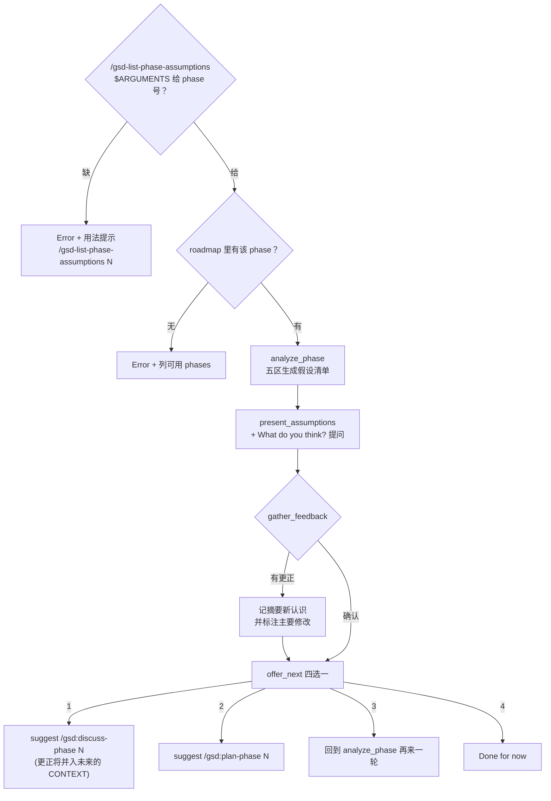

# list-phase-assumptions

> 在动工前把 AI 的理解一条条公开展示给你看——技术路线、实现顺序、边界解读、风险预判、依赖假设五类，附置信等级；是"分析它怎么想"而不是"收集你知道什么"，纯对话没有文件产物。

<!-- more -->

## 5W1H

| 项 | 内容 |
|---|---|
| **Who（谁用）** | 对 phase 目标只有一个 roadmap 短句、想知道"AI 自己对这句话会解读成什么"的发起人；另外在 discuss-phase 之前想先听到 AI 的立场，避免顺着访谈框架被动回答的人。 |
| **What（做什么）** | `validate_phase`（读 `$ARGUMENTS` 校验 phase 存在）→ `analyze_phase`（按五个预设领域生成假设清单：Technical Approach / Implementation Order / Scope Boundaries / Risk Areas / Dependencies，带 Confidence 分级）→ `present_assumptions`（结构公开，问"这些假设准确吗"）→ `gather_feedback`（确认或修正，摘要级更正明说"这显著改变了我的理解"）→ `offer_next`（转 discuss / 转 plan / 重审 / 到此为止）。 |
| **When（何时用）** | discuss 开始之前的轻量校准阶段，任何时候都能单独跑一次的临时动作——产物就是屏幕上这段对话，跑完即散。 |
| **Where（在哪里）** | `~/.claude/get-shit-done/workflows/list-phase-assumptions.md`（178 行）。**零 agent 派发**——无任何 subagent_type，是这 7 个工作流里最轻的一个；全部上下文就是 ROADMAP.md 一个文件 + 主会话记忆。 |
| **Why（为什么存在）** | 消除"双方都以为自己理解对了、没人说破"这个便宜的失败点。 vs discuss-phase 的边界：discuss 是**录入用户知识**，本工作流是**展示 Claude 的理解**——把隐含的推定摆上台面变成可反驳的清单，把误解成本压到动工前而不是 execute-phase 的 VERIFICATION 失败里。 |
| **How（怎么做）** | 五类假设每类都有固定口吻：Technical Approach（"我会用 X 因为…"）、Implementation Order（"先做哪三步"）、Scope Boundaries（明分 In / Out / Ambiguous——含"可以两头走的边界"）、Risk Areas（"棘手的是 X"）、Dependencies（依赖前面阶段的东西、外部依赖、反哺未来阶段的产物）。置信三档：`Fairly confident`（roadmap 里明写）/ `Assuming`（合理推理）/ `Unclear`（可以走向多个答案）；诚实声明不确定性是收尾条件。 |

## 工作原理

关键设计：转一轮不更换产物——gather_feedback 接受 corrections 后不落盘，直接"摘要新理解"开对话继续；offer_next 里选 "Re-examine" 是**唯一能带修正回到生成侧的路径**，其他三选只是路由提示。选择 discuss 是把后续更大的、更多人的决策（CONTEXT.md 生成）通过一个非阻塞会话预热好——真正"我要写文档"的操作在另一条线路上发生，本工作流不写任何文件，避免让一段对话冒充真源。代价是修正不会持久化——负责任的用法是把这里的更正带进 discuss-phase 落成 CONTEXT.md。

## 产出与影响

| 项 | 内容 |
|---|---|
| **读取** | `.planning/ROADMAP.md`（只从中 grep 该 phase 和其他编号），以及主对话内的项目状态；**不读** `state.md` 或 REQUIREMENTS.md（源码仅 cat `ROADMAP.md`） |
| **写入** | 无——纯对话产物，不落盘任何文件，不调用 gsd-sdk，不 git commit |
| **派发 agent** | 零 agent——无任何 `subagent_type` 出现，是最轻的一个工作流 |
| **成功标准** | phase 校验通过、五区（technical/order/scope/risk/dependencies）假设完整呈现、置信标落到恰当档位、给用户的"What do you think?"反馈问题正确送往 offer_next、下一步选项清晰呈现 |

## 适用场景

- 给只拆到一句话的 phase，在写 ROADMAP 前先听 AI 是否已把措辞读偏
- discuss-phase 暂不想开始，但想先拿到一个提前版的沟通草案
- 在 1v1 会话里快速校准"我认为该做什么 vs roadmap 里写的什么"
- roadmap 措辞精简到"每位读者各自脑补一处"时，强制暴露推理假设

## 反模式与陷阱

- **本工作流不落盘**：源码 success_criteria 和 offer_next 均没提到生成任何文件；gather_feedback 承认 corrections，但只体现在对话中——不落盘，所以它**不是 CONTEXT.md 替身**，更正必须通过后续 discuss 才能固化进产物。
- **只读 ROADMAP 一个文件**：不做代码预研、不读 REQUIREMENTS、不查 STATE，所以"Fairly confident"意思是"roadmap 里明写了"而不是"证据充分"；识别能力弱于 discuss-phase-assumptions 的 gsd-assumptions-analyzer（本工作流没有 agent 调用）。
- **"Re-examine" 就是重新跑 analyze**：它不是把修正存下来增量 append 的机制——回到生成侧只会基于已重置的理解重新生成一版五区清单。
- **phase 号必须先存在于 roadmap**：validate_phase 用 `grep -i "Phase N"` 校验，没立项的 phase 直接 Error + 可用阶段列表；它没有"帮你看个尚未立项的想法"的入口。

## 参见

- [index.md](./index.md) — 专栏总纲：三层架构、Gate 四分类、主链状态机
- [discuss-phase](./discuss-phase.md) — 想要把更正固化进 CONTEXT 时该跑的下游
- [discuss-phase-assumptions](./discuss-phase-assumptions.md) — 有 agent 的重假设版，产物真的落盘
- [spec-phase](./spec-phase.md) — 上游：想给出量化的需求清晰度评分时用这个
- GitHub: [get-shit-done](https://github.com/gsd-build/get-shit-done)
- 源码：`~/.claude/get-shit-done/workflows/list-phase-assumptions.md`（GSD 1.42.3）
