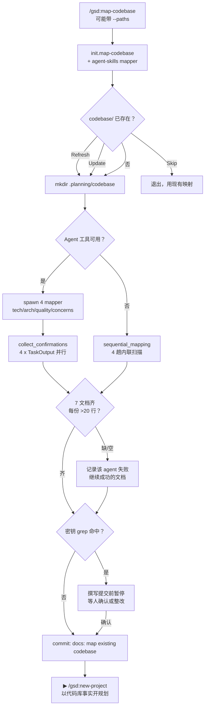

# map-codebase

> 用 4 个并行 mapper agent 把整个代码库扫描成 `.planning/codebase/` 下的 7 份结构化文档——让"AI 不懂这个仓库"从借口变成一分钟前的历史。

<!-- more -->

## 5W1H

| 项 | 内容 |
|---|---|
| **Who（谁用）** | 两种处境：① 拉了个存量的陌生仓库、想跑 `/gsd:new-project` 但没有任何规划基础的人；② 被 `/gsd:execute-phase` 的 codebase-drift gate 打回来、需要增量重扫被改过的目录的人（`--paths apps/accounting,packages/ui`）。 |
| **What（做什么）** | 解析 `--paths`（进入增量-重扫描模式）→ init 查询 → check_existing 三选一（Refresh/Update/Skip）→ 建目录 → 探测 Agent 工具可用性 → 并行派 4 个 gsd-codebase-mapper → TaskOutput 收"确认+行数" → 校验 7 文档齐全且 >20 行 → secrets 扫描 → 提交 → 报告下一步。 |
| **When（何时用）** | `new-project`、`new-milestone` 前的存量仓库预备；写代码造成规划漂移之后被上游 gate 指名叫重扫。可选 flag `--paths <p1,p2>`，用于限定子前缀扫描。 |
| **Where（在哪里）** | 工作流实现 `~/.claude/get-shit-done/workflows/map-codebase.md`（443 行）。派发方式：4× `gsd-codebase-mapper` 并行 `run_in_background`（tech / arch / quality / concerns）；Agent 工具不可用（.codex/.gemini 运行时等）则走 `sequential_mapping` 内联四趟扫描、**零 agent**、明令禁用 `browser_subagent` 顶替。 |
| **Why（为什么存在）** | 消除"上下文污染"这类真实成本：每个 mapper 都拿全新上下文，只研究自己的领域，**直接把文档写进盘**，编排者只收"文件路径+行数"，不回收任何正文。工作多领域同时推进也加速——快不是靠省事，是靠 4 份独立上下文互不传染。 |
| **How（怎么做）** | `<step>` 串联并带条件：`parse_paths_flag` 负责 `PATH_SCOPE_HINT` 归一化——含 `..`、以 `/` 开头、或含 shell 元字符的全拒绝，全非法则回退全库扫描；`detect_runtime_capabilities` 决定走并行还是 sequential；`collect_confirmations` 用 TaskOutput（超时默认 300000ms，可由 `workflow.subagent_timeout` 配置）并行收确认；`verify_output` 检查 7 文档、非空；`scan_for_secrets` 在提交前 grep sk-/ghp_/AKIA/xox/私钥等模式，命中即暂停提交、等待人工确认。 |

## 工作原理

关键设计有两个。第一，**--paths 是显式契约而不是共享变量**：源码用整段说明强制所有下游 prompt 用同一 `${PATH_SCOPE_HINT}` 变量——否则"增量重扫"会静默劣化为全库扫描，drift gate 的增量模式就白做了。第二，**mapper 是写工不是报告工**：agents 直接以模板写文档，编排者只收确认与行数——正因此在 sequential 降级时仍是同一套模板内联落盘，而非偷懒换出一份摘要。

## 产出与影响

| 项 | 内容 |
|---|---|
| **读取** | 全库或 `--paths` 限定前缀内的源码/配置/测试；`init.map-codebase` JSON（mapper_model、subagent_timeout、date 等） |
| **写入** | `.planning/codebase/` 共 7 份：`STACK.md`、`INTEGRATIONS.md`、`ARCHITECTURE.md`、`STRUCTURE.md`、`CONVENTIONS.md`、`TESTING.md`、`CONCERNS.md`；增量模式额外在 frontmatter 盖 `last_mapped_commit: <HEAD sha>` |
| **派发 agent** | 4× `gsd-codebase-mapper` 并行 `run_in_background`；Agent 工具不可用时 0 派发（内联 sequential_mapping） |
| **成功标准** | 源码 `<success_criteria>` 共 7 条：`.planning/codebase/` 建立、含 Agent 派发和 0 派发两条分支、7 文档齐全、无空文档（>20 行）、带行数的完成摘要、下一步 GSD 风格 |

## 适用场景

- 刚克隆一个陌生仓库，想先有真实档案再跑 `/gsd:new-project` 或 `/gsd:new-milestone`
- 一轮 execute-phase 后 drift gate 发现"计划之外的文件被改动"，需要范围重扫
- 只想更新其中两三份文档（Update 模式，挑文档刷新）
- 无 Agent 工具的运行时（Codex、Gemini CLI 等），内联顺序跑完也算一次完整映射

## 反模式与陷阱

- **禁用冒牌 mapper**：源码 CRITICAL 两条——不许用 `Explore` 或 `browser_subagent` 顶着干，browser_subagent 只是网页工具，对代码分析必然失败。
- **编排者巴不得闲着**：4 mapper 期间 ORCHESTRATOR RULE 明令不许自己读源码或写映射文档——这是在防重复劳动和版本冲突。
- **编排者只收路径+行数**：确认格式固定是 Mapping Complete+文档列表，你不会拿到任何文档内容，别指望它顺带念给你听。
- **secrets 会拦你一手**：提交前有 `scan_for_secrets` 拦截（sk-、ghp、AKIA、`-----BEGIN.*PRIVATE KEY` 等模式），命中即等待人工确认——被拦不是 bug，是审计路径。
- **`--paths` 校验不是装饰**：路径含 `..`、`/` 前缀或 shell 元字符会拒绝；全部非法时安静回退成全库扫描——想确实只扫一半就要自己确认给的前缀合法。

## 参见

- [index.md](./index.md) — 专栏总纲：三层架构、Gate 四分类、主链状态机、依赖关系
- [scan](./scan.md) — 单焦点的轻量扫描（一个 mapper，一次只出一两份文档）
- [new-project](./new-project.md) — 消费本文档成果做 brownfield 立项
- GitHub: [get-shit-done](https://github.com/gsd-build/get-shit-done)
- 源码：`~/.claude/get-shit-done/workflows/map-codebase.md`（GSD 1.42.3）
