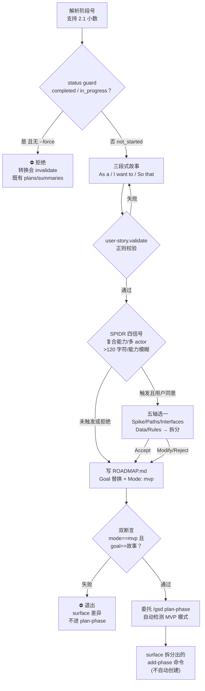

# mvp-phase

> 把一个阶段转入 MVP 模式：用 "As a / I want to / So that" 用户故事重写 Goal、按 SPIDR 判断是否拆分，再委托 plan-phase 走垂直切片规划。

<!-- more -->

## 5W1H

| 项 | 内容 |
|---|---|
| **Who（谁用）** | 想用垂直切片（vertical slice）而不是水平分层规划一个阶段的项目作者——要的是最小可走路骨架（walking skeleton），故事过大时愿意拆成多个阶段。 |
| **What（做什么）** | 解析阶段号（支持小数如 `2.1`，`--force` 允许改进行中/已完成阶段）→ 查 ROADMAP 状态（completed / in_progress / not_started 三态）→ 三次 AskUserQuestion 依次问 As a / I want to / So that → 组装故事并用 `user-story.validate` 正则校验（失败逐字段重问）→ SPIDR 四信号检查，触发则按五轴问一个定向问题并 Accept/Modify/Reject → 写 ROADMAP.md（Goal 行替换为故事 + 插入 `**Mode:** mvp`）→ `roadmap.get-phase --pick` 双断言验证 → 委托 `/gsd plan-phase` → 若有拆分则列出 deferred 的 add-phase 命令。产物：ROADMAP.md 的 Mode 行 + 故事化 Goal + 后续 PLAN.md。 |
| **When（何时用）** | 阶段处于 `not_started` 时；`in_progress`（有 plans 未完成）或 `completed` 时**拒绝转换**，除非带 `--force`（转换会 invalidate 既有 plans/summaries）。前置：阶段必须存在于 ROADMAP（不存在 → 建议 `add-phase`/`insert-phase`）。常见 flag：`--force`、`--text`。 |
| **Where（在哪里）** | 工作流实现 `~/.claude/get-shit-done/workflows/mvp-phase.md`（221 行）。**零 agent 派发**——第 7 步委托 `/gsd plan-phase` 是命令调用，不是 subagent 派发；plan-phase 通过 MVP_MODE 解析链（CLI flag → ROADMAP `**Mode:** mvp` → config → false）自动检测新模式。 |
| **Why（为什么存在）** | 消除"MVP 模式没有标准入口"这个特例。plan-phase 的垂直切片模式依赖 ROADMAP 里一行 `**Mode:** mvp`，但手工编辑 ROADMAP 容易写出不合 verifier 正则的故事（同一个 `user-story.validate` 守卫后面验证阶段还会用）。它把"故事收集 + SPIDR 拆分 + 模式标记"收成一个带硬校验的命令，杜绝半成品故事落盘。 |
| **How（怎么做）** | 九个编号步骤（源码用 `## 1.`~`## 9.` 组织，非 `<step>` 标签）：解析阶段号 → 校验存在与状态（status guard + Already-MVP guard）→ 三段式用户故事（空字段重问该字段，正则不过重跑）→ SPIDR 检查（四信号任一触发才走，用户可拒绝）→ 写 ROADMAP.md（先展示 diff 问 Apply/Cancel）→ 双断言验证（`NEW_MODE==mvp` 且 `NEW_GOAL==story`，失败即退出）→ 委托 plan-phase → surface 拆分出的新阶段命令 → 退出。 |

## 工作原理

关键设计：两个硬闸决定成败——status guard 把 `in_progress`/`completed` 的转换直接拒绝（转换会 invalidate 既有计划），而双断言确保 ROADMAP 写入是"全有或全无"：任一断言失败就退出，绝不带着半应用的写入去委托 plan-phase。SPIDR 拆分则是刻意的**不自动建阶段**——Accept 后只把剩余切片 surface 成 add-phase 命令列表，编号控制权留给用户。

## 产出与影响

| 项 | 内容 |
|---|---|
| **读取** | `$ARGUMENTS`、`gsd-sdk query roadmap.get-phase`、`roadmap.analyze`、ROADMAP.md |
| **写入** | ROADMAP.md 两处编辑（Goal 行 + `**Mode:** mvp` 行），原子写（read-edit-write） |
| **派发 agent** | 无。委托 `/gsd plan-phase` 是命令调用；用户后续可自行对拆分阶段跑 `mvp-phase` |
| **成功标准** | 源码无 `<success_criteria>` 块；工作流自身的完成判据是第 6 步双断言——`NEW_MODE` 等于 `mvp` 且 `NEW_GOAL` 等于组装的故事，任一不符 surface 差异并退出 |

## 适用场景

- 把一个明确功能意图的阶段切成垂直切片（Walking Skeleton 起步）
- 阶段故事过大：复合能力（and 连接）、多 actor、超过 120 字符、能力描述模糊——任一信号触发 SPIDR 检查
- 想让 plan-phase 自动进入 vertical-slice 模式，而不想每次手动传 CLI flag（靠 roadmap mode 字段）
- 首个阶段（Phase 01）且里程碑零前序摘要时，期望 Walking Skeleton gate 自动触发

## 反模式与陷阱

- **`in_progress`/`completed` 拒绝转换**：没有 `--force` 直接报错——"Converting an active or completed phase to MVP mode mid-flight will invalidate any existing plans and summaries"。这不是软警告。
- **故事正则硬校验**：`user-story.validate` 用正则 `/^As a .+, I want to .+, so that .+\.$/` 校验，失败会逐字段重问、重建、再验证，绝不带半成品故事进 ROADMAP。
- **SPIDR 拆分不自动建阶段**：Accept 拆分后，剩余切片只是 surface 成 `add-phase` 命令给你，不自动创建——保持编号控制权，拆出来的阶段需要你事后手动跑 `mvp-phase`。
- **双断言失败即退出**：`NEW_MODE`/`NEW_GOAL` 任一不符就 surface 并退出，不会带着半应用的写入去委托 plan-phase（"Do not proceed to plan-phase delegation with a half-applied write"）。
- **"No" 就跳过 SPIDR**：用户明确拒绝拆分时直接 proceed——SPIDR 是引导不是强制。

## 参见

- [index.md](./index.md) — 专栏总纲：三层架构、Gate 四分类、主链状态机、依赖关系
- [plan-phase](./plan-phase.md) — 被委托的目标：自动检测 MVP 模式并生成 PLAN.md
- [next](./next.md) — 主链路由入口：探测项目状态推进到下一逻辑步骤
- GitHub: [get-shit-done](https://github.com/gsd-build/get-shit-done)
- 源码：`~/.claude/get-shit-done/workflows/mvp-phase.md`（GSD 1.42.3）