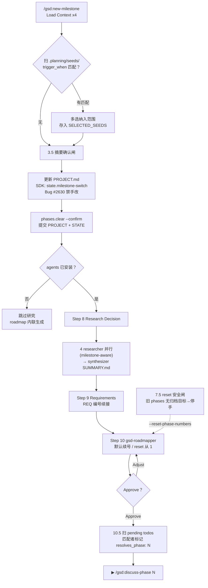

# new-milestone

> 给已完成过一轮里程碑的存量项目开启下一轮（v1.0 → v1.1），带 phase 编号续接、SEED 唤醒、`resolves_phase` 待办回填——它是 new-project 的 brownfield 等价物。

<!-- more -->

## 5W1H

| 项 | 内容 |
|---|---|
| **Who（谁用）** | 上一轮里程碑已交付（MILESTONES.md 里有记录、`.planning/` 已存在）后想开下一轮的人。区别于 new-project 的关键处境：需求基线和工程决策已经沉淀，不该重问"想建什么"。 |
| **What（做什么）** | 载入四份上下文 → 收集里程碑目标 → 扫描 planted seeds → 定版本号 → 确认摘要 → 更新 PROJECT.md → 经 SDK 原子切换 STATE.md → 清理旧阶段目录并提交 → 可选 4 路研究 → 定义里程碑需求（编号续接）→ 派 roadmapper → 把匹配的 pending todo 标上 `resolves_phase: N`。 |
| **When（何时用）** | `/gsd:complete-milestone` 归档完上一轮之后。可选 flag：`--reset-phase-numbers`（阶段编号从 1 重排，而非从上一里程碑末号续接）；里程碑名字可直接写在参数里。 |
| **Where（在哪里）** | 工作流实现 `~/.claude/get-shit-done/workflows/new-milestone.md`（634 行）。派发顺序：4× `gsd-project-researcher`（milestone-aware 提示词，聚焦新特性）→ `gsd-research-synthesizer` → `gsd-roadmapper`（含 revise 循环）。 |
| **Why（为什么存在）** | 消除三类偷懒特例：① 手改 STATE.md 只改 body 不改 frontmatter（Bug #2630——下游 state.json、进度条全部报旧里程碑，直到第一次 phase advance 才被迫 resync），所以强制走 `state.milestone-switch` SDK 原子处理器；② 上一轮攒下的 planted seeds 和 pending todo 被遗忘——本流主动扫描 `.planning/seeds/SEED-*.md` 的 `trigger_when` 与里程碑目标的匹配、扫描 pending todos 并打上 `resolves_phase`，召回不依赖人翻笔记。 |
| **How（怎么做）** | 编号步骤串联：`1. Load Context` 解析 `--reset-phase-numbers` 并 Read PROJECT/MILESTONES/STATE/MILESTONE-CONTEXT；`2.5. Scan Planted Seeds` 匹配即弹多选，未选中种子**原样留存**（绝不删改 seed 文件）；`3.5. Verify Milestone Understanding` 写盘前先 confirm；`7.5 Reset-phase safety` 若 `phase_dir_count > 0` 先归档旧 phases 目录，归档目标缺失则直接停手要求先跑里程碑归档；`8. Research Decision` 明示不要把选择写入 config.json（防止暗改后续 `plan-phase` 行为）；`10.5. Link Pending Todos` 只在"清晰、有把握"匹配时打标，模糊待办保持未链接。 |

## 工作原理

关键设计：研究提示词里每个 researcher 的 `EXISTING_CONTEXT` 字段显式声明"已建成的特性不要重研究"——4 路研究只针对**新增**能力，避免重复调研整个存量系统。另一处是 `resolves_phase` 的保守策略：匹配准则是 best-effort 且明令"do not over-match"，模糊或横切的 todo 保持未链接——宁可漏标，不可错标。

## 产出与影响

| 项 | 内容 |
|---|---|
| **读取** | `.planning/PROJECT.md`、`MILESTONES.md`、`STATE.md`、`MILESTONE-CONTEXT.md`（讨论产物）、`.planning/seeds/SEED-*.md`、`.planning/todos/pending/*.md` |
| **写入** | `.planning/PROJECT.md`（Current Milestone 段）、`STATE.md`（经 SDK 原子切换）、`.planning/research/*.md`、`REQUIREMENTS.md`、`ROADMAP.md`、todos frontmatter `resolves_phase: N`；删除已消费的 `MILESTONE-CONTEXT.md` |
| **派发 agent** | 4× `gsd-project-researcher` → 1× `gsd-research-synthesizer` → 1× `gsd-roadmapper`（± revise）；agent 未装时研究跳过、roadmap 内联生成 |
| **成功标准** | 源码 `<success_criteria>` 共 13 条 checkbox：STATE.md 重置、MILESTONE-CONTEXT.md 消费并删除、"Phase numbering mode respected"、"matched todos tagged with `resolves_phase: N`" |

## 适用场景

- v1.0 验收完成之后，想给 v1.1 / v2.0 立项并把范围讲清楚
- 上一轮讨论时种了 `.planning/seeds/` 的 SEED 文件，想让触发条件命中的自动浮出
- 前一轮留下一堆 pending todos，想知道哪些会被新里程碑的某个阶段顺手解决
- `--reset-phase-numbers` 重启编号时，希望旧阶段目录先被归档而不是留下脏目录

## 反模式与陷阱

- **STATE.md 禁止手改**：源码以 Bug #2630 为证——上一版手动重写 Current Position 但 frontmatter 还指着旧里程碑，所有下游读者都读到旧数据。必须走 `gsd-sdk query state.milestone-switch`。
- **reset 编号有前置闸**：`--reset-phase-numbers` 且 `phase_dir_count > 0` 但归档目标缺失时**直接停**，要求先把上一个里程碑完成归档——不希望新 `01-*` 目录与旧目录静默冲突。
- **研究选择显式不落盘**：选了"本次跳过研究"不写入 config.json，`workflow.research` 是持久偏好，管的是后续每次 `plan-phase` 的默认行为；要改默认请 `/gsd:settings`。
- **SEED 的静默规则**：无 seed 或无匹配时整个 2.5 步**不打印任何消息**——没看到提示不代表没有机制。
- **未选中的种子永不删除**："Unselected seeds remain untouched in `.planning/seeds/`"，唤醒失败不是销毁理由。

## 参见

- [index.md](./index.md) — 专栏总纲：三层架构、Gate 四分类、主链状态机、依赖关系
- [new-project](./new-project.md) — 白板的第一次立项（greenfield 对应流程）
- [complete-milestone](./complete-milestone.md) — 归档上一轮、给出本文档入口的兄弟命令
- GitHub: [get-shit-done](https://github.com/gsd-build/get-shit-done)
- 源码：`~/.claude/get-shit-done/workflows/new-milestone.md`（GSD 1.42.3）
