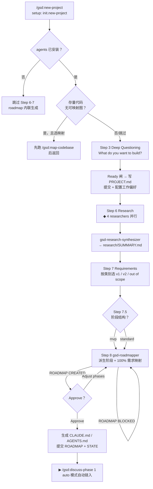

# new-project

> 从一句话想法到可执行的 ROADMAP，一次工作流走完提问、调研、需求、路线图全程——项目只有一次立项，这里的提问深度直接决定后面所有阶段的计划质量。

<!-- more -->

## 5W1H

| 项 | 内容 |
|---|---|
| **Who（谁用）** | 不确定要建什么的 greenfield（绿地）或存量仓库负责人。也服务拿着现成 PRD 的人：`--auto` 跳过深读对话，直接从文档合成 PROJECT.md 并自动审批推进。 |
| **What（做什么）** | Setup 检查 → 检测存量代码并可选先跑 map-codebase → 深读提问 → 写 PROJECT.md → 问工作偏好 → 4 路并行调研 → 分类定义需求（REQ-ID）→ 选阶段结构（MVP/分层）→ 派 roadmapper 生成 ROADMAP → 提交全部产物。 |
| **When（何时用）** | `.planning/` 还不存在、`project_exists` 为 false 的空项目起点。自动模式需 `--auto` 且必须提供 idea 文档（`@prd.md` 或贴文），否则报错退出。 |
| **Where（在哪里）** | 工作流实现 `~/.claude/get-shit-done/workflows/new-project.md`（1476 行）。派发顺序：4× `gsd-project-researcher`（Stack / Features / Architecture / Pitfalls）→ `gsd-research-synthesizer` → `gsd-roadmapper`（Approve 失败时再派 revise 轮）。 |
| **Why（为什么存在）** | 把"立项"从拍脑袋变成流水线：调研产物分四个维度落盘（表铁律 vs 差异化 vs 反特性的 feature 分类），需求被压成可测的用户句式并授予 REQ-ID，roadmapper 强制 100% 需求到阶段的映射校验——消除了"规划凭空想"和"路线图漏掉某条需求"这两类返工特例。 |
| **How（怎么做）** | 编号步骤串行：`1. Setup` 有 agent 未装就降级为内联生成路线图，运行时探测决定生成 `AGENTS.md`（Codex）还是 `CLAUDE.md`；`2. Brownfield Offer` 检测到存量代码先问是否跑 `/gsd:map-codebase`；`3. Deep Questioning` 沿话题线索追问题直到 Ready 闸；`6. Research Decision` 4 researcher 并行后禁止编排者自行读文件；`7. Define Requirements` 按类别选出 v1，剩 table stakes 落 v2、差异化落 out of scope；`8. Create Roadmap` 处理 `ROADMAP BLOCKED`/`ROADMAP CREATED` 两种返回并循环审批。 |

## 工作原理

关键设计：编排者有明确的 ORCHESTRATOR RULE——4 个 researcher 活着时自己**禁止**读调研文件，先等 4 路全部返回再派 synthesizer。这不是装饰性纪律，而是防止主上下文在子代理没完成时重复做同样的合成工作、然后两个版本互相冲突。另一个取舍是 Brownfield：PROJECT.md 的 Validated 区直接从 `.planning/codebase/ARCHITECTURE.md` 和 `STACK.md` 推导——已有的能力不再是待办。

## 产出与影响

| 项 | 内容 |
|---|---|
| **读取** | `.planning/codebase/ARCHITECTURE.md`、`STACK.md`（brownfield）、idea 文档、`.planning/spikes/MANIFEST.md` 与 `.planning/sketches/MANIFEST.md`（prior exploration 检测） |
| **写入** | `.planning/PROJECT.md`、`.planning/config.json`、`.planning/research/{STACK,FEATURES,ARCHITECTURE,PITFALLS,SUMMARY}.md`、`.planning/REQUIREMENTS.md`、`.planning/ROADMAP.md`、`.planning/STATE.md`、`$INSTRUCTION_FILE` |
| **派发 agent** | 4× `gsd-project-researcher` → 1× `gsd-research-synthesizer` → 1× `gsd-roadmapper`（± revise）；agent 未装时全降级为内联生成 |
| **成功标准** | 源码 `<success_criteria>` 共 18 条 checkbox：PROJECT/config/REQUIREMENTS/ROADMAP 全提交、roadmapper 派发带上下文、"Roadmap files written immediately (not draft)"、"User knows next step is `/gsd:discuss-phase 1`" |

## 适用场景

- 白板起家，想先问清"到底想建什么"再让 AI 排计划
- 已有存量仓库，想带上真实架构事实立项（先开 map-codebase 的 brownfield 路径）
- 已有 PRD/design doc，想 `--auto` 一键跑完全程并自动进入 discuss-phase 1
- 项目初始化时就锁定工作流偏好：研究/计划检查/验证器/模型档位

## 反模式与陷阱

- **`project_exists` true 直接报错**：唯一解药是 `/gsd:progress`。没有新项目覆盖流程——`.planning/` 一旦存在这个命令就再也不适用。
- **`--auto` 没文档就是死路**：源码明确 `--auto requires an idea document`，没有自动兜底。
- **agent 未装是静默降级**：Setup 警告后会跳过 research 直接内联建路线图，产物质量下降但你若不看警告，回来发现没有 SUMMARY 也会莫名其妙。
- **不是计划工具**：这里产出的是"为什么要建这个 + 分几段做"，具体的 PLAN 粒度归 `/gsd:plan-phase`。

## 参见

- [index.md](./index.md) — 专栏总纲：三层架构、Gate 四分类、主链状态机、依赖关系
- [new-milestone](./new-milestone.md) — 跑完 v1 后给存量项目开新里程碑（本文档的 brownfield 等价物）
- [map-codebase](./map-codebase.md) — 立项前给存量代码建档的 7 文档映射
- GitHub: [get-shit-done](https://github.com/gsd-build/get-shit-done)
- 源码：`~/.claude/get-shit-done/workflows/new-project.md`（GSD 1.42.3）
