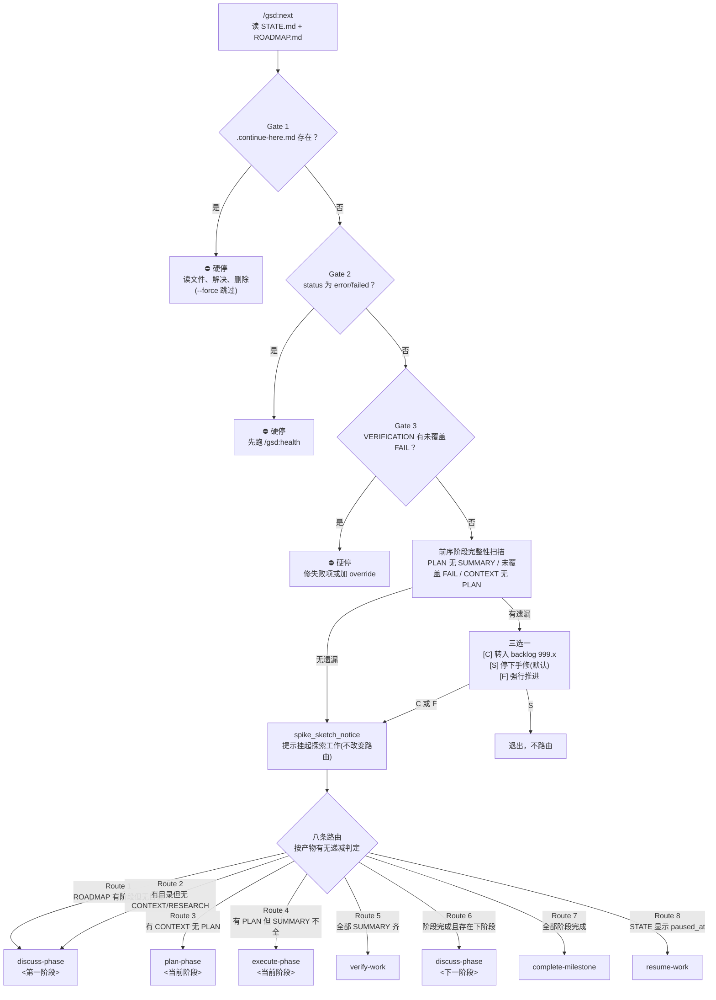

# next

> 探测当前项目状态，自动推进到下一个逻辑步骤——读磁盘而非问人，判断该讨论、规划、执行还是验收。

<!-- more -->

## 5W1H

| 项 | 内容 |
|---|---|
| **Who（谁用）** | 项目作者本人。长周期 GSD 项目里每天开工的人，不想回想"昨天做到哪了、下一步跑什么"。 |
| **What（做什么）** | 读 `.planning/STATE.md` 与 `.planning/ROADMAP.md`，跑三道硬闸检查，再按八条路由规则判定当前所处阶段产物，最后**不经确认**直接调用对应命令。 |
| **When（何时用）** | 每次新会话开工、上下文窗口耗尽被 checkpoint 后恢复、或忘了上一步跑完该干什么的时候。是主链路的路由入口，`--force` 可跳过所有安全闸强行推进。 |
| **Where（在哪里）** | 工作流实现 `~/.claude/get-shit-done/workflows/next.md`（220 行），用户经外壳 `/gsd:next` 或 `/gsd:progress --next` 进入。**零 agent 派发**——只读状态、不派 subagent，是 88 个工作流里最轻的一个，同时被其他 67 个工作流引用为内部步骤。 |
| **Why（为什么存在）** | 消除"人脑记进度"这个特例。没有它，多阶段项目每次跨会话都要人肉回忆"讨论过了吗、计划生成了吗、总结写了吗"，且回忆不可靠。有了它，"下一步"变成纯函数：`f(磁盘上的产物)` → 命令。文件在不在就是全部状态，不需要进度跟踪器，也不需要条件分支记忆。 |
| **How（怎么做）** | 五个步骤串行：`detect_state` 读快照 → `safety_gates` 三道硬闸（未解 checkpoint / 错误状态 / 未检验证失败）+ 前序阶段完整性扫描 → `spike_sketch_notice` 提示挂起的探索工作（不改变路由）→ `determine_next_action` 按产物有无匹配 Route 1–8 → `show_and_execute` 打印判定并立即执行命令。路由判据严格按"产物出现顺序"递减判断：无阶段目录 → 讨论；有目录无 CONTEXT → 讨论；有 CONTEXT 无 PLAN → 规划；有 PLAN 但 SUMMARY 不全 → 执行；SUMMARY 齐 → 验收；阶段完成且有下阶段 → 推进；全部完成 → 结里程碑；STATE 显示暂停 → 恢复。 |

## 工作原理

关键设计：三道硬闸**先于**路由判断执行，且首个命中即退出——顺序很重要，因为对一个处于错误状态的项目做路由只是把错误往后推。前序阶段完整性扫描则相反，它不硬停，而是给人三个选项并支持把遗漏项自动登记成 `ROADMAP.md` 的 `999.x` backlog 条目——设计取舍是"不让卫生问题挡住推进，但也不允许静默丢失记录"。

## 产出与影响

| 项 | 内容 |
|---|---|
| **读取** | `.planning/STATE.md`、`.planning/ROADMAP.md`、`gsd-sdk query state.json`、`gsd-sdk query find-phase <N>` |
| **写入** | 仅在用户选 `[C] 转入 backlog` 时写 `ROADMAP.md` 并 `gsd-sdk query commit`；其余路径只读 |
| **派发 agent** | 无。`subagent_type` 出现次数为 0，是工作流里最轻的一个 |
| **成功标准** | 状态正确探测、下一步按路由规则正确判定、命令无需确认立即调用、调用前状态清晰可见 |

## 适用场景

- 长周期多阶段项目，跨会话续接不想靠人肉回忆进度
- 被 checkpoint 打断后恢复，需要立刻知道"我们做到哪了"
- 想自动串起 discuss → plan → execute → verify 主链、零摩擦推进
- 配合 `--force` 做批量推进时的安全闸旁路

## 反模式与陷阱

- **误以为它会修问题**：三道硬闸只停不修。它报告 `.continue-here.md` 存在、状态为 error、验证失败，然后退出——修的动作全在别的工作流。
- **`[C]` 选项是登记不是解决**：选 Continue 只是把遗漏项写进 `ROADMAP.md` 的 backlog，并立即继续路由，不会再确认一次。登记不等于处理，backlog 需要你自己回头看。
- **Route 2 的语义容易被忽略**：阶段目录存在但既无 `CONTEXT.md` 也无 `RESEARCH.md` 时，判定为"该讨论"而不是"该规划"——目录存在不等于工作做过。
- **它不产生计划，也不产生执行**：`next` 本身只读，真正的活由它调用的命令完成。把它当执行器用只会看到一条"下一步是 xxx"的输出。

## 参见

- [index.md](./index.md) — 专栏总纲：三层架构、Gate 四分类、主链状态机、依赖关系
- [progress](./progress.md) — 查看进度后再智能路由（`next` 的父外壳之一）
- [do](./do.md) — 解析自由文本路由到最合适的 GSD 命令
- GitHub: [get-shit-done](https://github.com/gsd-build/get-shit-done)
- 源码：`~/.claude/get-shit-done/workflows/next.md`（GSD 1.42.3）
