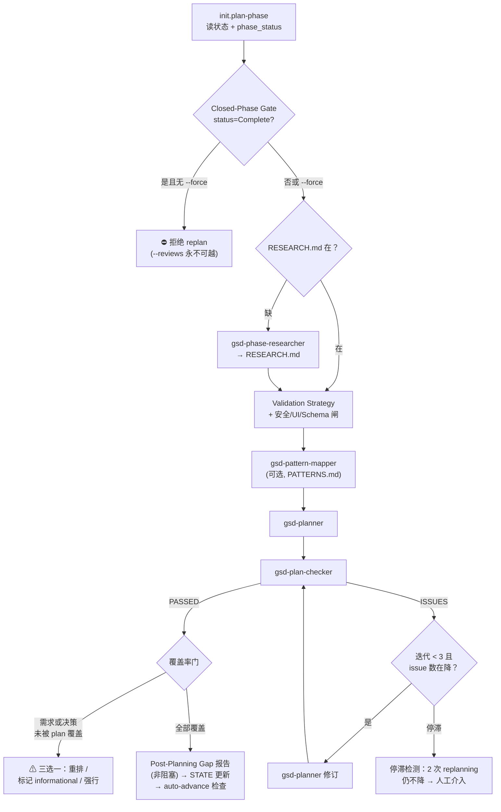

# plan-phase

> 把一个 phase 变成可执行的 PLAN.md 文件——research（可选）→ 规划 → 校验三段一气呵成，修订循环最多 3 轮，确保执行器拿到的任务带的都是可验证断言而不是"保持一致"这种空话。

<!-- more -->

## 5W1H

| 项 | 内容 |
|---|---|
| **Who（谁用）** | 已完成 discuss-phase（手里有 CONTEXT.md）但还没进 execute-phase 的人；以及拿到 review 反馈想重排计划、跑过 spec-phase 想直接用 PRD 跳过讨论的人。 |
| **What（做什么）** | 初始化读取阶段状态 → 关闭阶段硬闸 → 解析 flag → 若缺研究则派研究员 → 建验证策略 → 过安全/UI/Schema 三道软件闸 → 派规划师写 `*-PLAN.md` → 派检查员验计划 → 修订循环 → 覆盖率门 → 记 STATE/ROADMAP → 可选自动推进。产物：`{padded_phase}-PLAN.md` 系列（含 frontmatter wave/depends_on/files_modified）。 |
| **When（何时用）** | 每个 phase 进执行前必经。flag 极多：`--research`/`--skip-research`、`--gaps`（补计划）、`--reviews`（重排）、`--prd <file>`（PRD 快车道）、`--research-phase <N>`（只做研究）、`--chunked`（分片规划）、`--auto`/`--chain`、`--force`。 |
| **Where（在哪里）** | `~/.claude/get-shit-done/workflows/plan-phase.md`（1784 行）。派发 agent 共四类，按顺序：`gsd-phase-researcher`（step 5）→ `gsd-pattern-mapper`（step 7.8，可选）→ `gsd-planner`（step 8；chunked 模式在 8.5 多次短跑）→ `gsd-plan-checker`（step 10）→ 检查不过时回到 `gsd-planner`（step 12 修订）。 |
| **Why（为什么存在）** | 消除"计划写得漂亮但执行不动"这个最贵的失败。每个任务强制带 `<read_first>`、`<acceptance_criteria>`、具体值 `<action>`，执行器不需要猜"对齐 X 与 Y"到底是什么意思；Requirements Coverage Gate 和 Decision Coverage Gate 把 discuss 决策到 plan 的翻译断层在纸面上暴露，而不是花几千刀执行完才发现漏了。 |
| **How（怎么做）** | 关键 step 与判定：`Closed-Phase Gate`（phase_status=Complete 时拒绝 replan，`--force` 可越，但 `--reviews` 对关闭阶段永不可越）；`Handle Research`（has_research 则跳过，否则问用户 research/skip）；`Anti-Shallow Execution Rules` 编入 planner prompt；`Revision Loop`（max 3 轮，issue 数不降即停滞检测，两次 replanning 无果要求人工或 `/gsd:debug`）；`Requirements Coverage Gate` + `Decision Coverage Gate`（TRACKABLE 决策没被任何 plan 引用则 exit 1）；`Post-Planning Gap Analysis`（非阻塞兜底报告）。 |

## 工作原理

关键设计：三道内容闸（安全威胁模型、UI-SPEC 缺失即退出、Schema push 强制 `[BLOCKING]` 任务注入）都发生在 planner spawn 之前——问题是立即发现的，而不是执行完再回趟。修订循环与覆盖率门是两套不同的保险：前者管"计划内部质量"，后者管"discuss 的决策没丢在翻译路上"（`gsd-sdk query check.decision-coverage-plan` 失败即 exit 1，verify-phase 对应门是非阻塞的——这个不对称是 reviewer finding F15 里刻意的取舍）。

## 产出与影响

| 项 | 内容 |
|---|---|
| **读取** | CONTEXT.md、REQUIREMENTS.md、STATE.md、ROADMAP.md、RESEARCH.md（可生成）、UI-SPEC.md、PATTERNS.md、既有 PLAN.md、SPIKE/SKETCH FINDINGS |
| **写入** | `{phase_dir}/*-PLAN.md` 系列、`*-RESEARCH.md`、`*-VALIDATION.md`、`*{PATTERNS}.md`、STATE.md（`state.planned-phase`）、ROADMAP.md（wave 依赖注记，幂等）、git commit（commit_docs=true 时） |
| **派发 agent** | `gsd-phase-researcher` → `gsd-pattern-mapper`（可选）→ `gsd-planner`（含 chunked outline/per-plan、revision 多次）→ `gsd-plan-checker` |
| **成功标准** | CONTEXT.md 早期加载并传给所有 agent、计划创建且 checker 通过或用户覆盖或 3 轮后人工决策、用户每次 spawn 之间看到状态、用户知道下一步 |

## 适用场景

- 已有 CONTEXT.md，要为 phase 生成可直接喂给 execute-phase 的计划文件
- 用 `--prd` 跳过讨论环节，从 PRD 直达计划
- 用 `--research-phase N` 做跨阶段研究，不触发规划，`--view` 最便宜地看现有研究
- 用 `--chunked` 在长项目上做分片规划，每个 plan 单独提交抗崩溃、可断点续跑
- 用 `--reviews` 把跨 AI 评审反馈折算成新的 PLAN

## 反模式与陷阱

- **已关闭阶段不能 replan**：`phase_status=Complete`（summaries 齐 + VERIFICATION passed）时入口全拦——`--force` 能绕普通 gate，但对 `--reviews + Complete` 没有任何覆盖；评审发现的真问题应该开新阶段或提 issue，不是改已完成工作。
- **`--research-phase` 的行为跟名字直觉相反**：加了它就不只是"research 优先"而是"只做 research 后退出"（RESEARCH_ONLY=true），plan-checker/verification/gaps/bounce 全部跳过；`--view` 只打印已有 RESEARCH.md，文件不存在直接报错。
- **修订循环有停滞保险不是无限修**：issue 数 >= 上一轮时进入停滞检测，"Adjust approach" 重回完整 replanning 最多 2 次；重置的是 iteration_count，不清的是 stall_reentry_count。
- **Chunked 模式不回收非 chunked 的存量计划**：源码明说恢复旧计划的正确动作是 step 6 的"Add more plans"或直接开 execute-phase，不要对已有 PLAN 的阶段重新起一个 chunked run。
- **决策覆盖门可通过"标注"而非"重排"过关**：uncovered decision 的合法出路之一是把它标 `[informational]` 或挪进 `Claude's Discretion`——等价于承认"这不该被追踪"，不是放弃，但别拿它当万能解锁键（override 会记进 STATE.md，verify-phase 会再提一次）。

## 参见

- [index.md](./index.md) — 专栏总纲：三层架构、Gate 四分类、主链状态机
- [discuss-phase](./discuss-phase.md) — 上游：产出被本工作流当锁定输入的 CONTEXT.md
- [spec-phase](./spec-phase.md) — 可选上游：PRD 快车道（`--prd`）的输入来源
- [execute-phase](./execute-phase.md) — 下游：消费 PLAN.md 的执行器
- GitHub: [get-shit-done](https://github.com/gsd-build/get-shit-done)
- 源码：`~/.claude/get-shit-done/workflows/plan-phase.md`（GSD 1.42.3）
