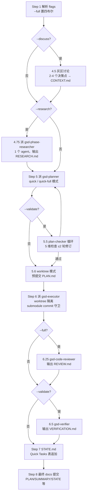

# quick

> 小任务走完整 GSD 保障的单命令管线——planner（quick 模式）→ executor 全自动串起，原子提交 + STATE 跟踪，质量档位可组合（`--discuss --research --validate` 等价 `--full`）。

<!-- more -->

## 5W1H

| 项 | 内容 |
|---|---|
| **Who（谁用）** | 要做"小而明确"任务（加个小功能、修 bug、改配置）但想要 GSD 保障（原子提交、STATE 跟踪）而不是裸手改的人；任务比 `fast` 的"琐碎"大一点、需要规划或研究，但又不值得开完整阶段。 |
| **What（做什么）** | 8 个编号步骤：Step 1 解析 flags（`--full` 置四个布尔；`--discuss --research --validate` 三合一归一化为 `--full`）→ Step 2 `init.quick` + 子模块路径解析 + ROADMAP 存在性校验 → 2.5 分支处理（fork 自 origin/HEAD，#2916）→ 3-4 建目录 `.planning/quick/{quick_id}-{slug}/` → 4.5（可选）灰区讨论写 CONTEXT.md → 4.75（可选）派 1 个 researcher → Step 5 派 planner（quick / quick-full 模式）→ 5.5（可选）plan-checker 循环（封顶 2 轮）→ 5.6（worktree 模式）预提交 PLAN.md → Step 6 派 executor（worktree 隔离 + submodule commit 守卫）→ 6.25（仅 `--full`）code-review → 6.5（仅 `--validate`）verifier → Step 7 STATE.md "Quick Tasks Completed" 表追加 → Step 8 最终 docs 提交。产物：PLAN/SUMMARY 及可选 CONTEXT/RESEARCH/VERIFICATION/REVIEW + 原子 commits + STATE 行。 |
| **When（何时用）** | 任务明确、自包含、单个 executor 能完成；比 `fast` 大（需要规划或研究）时。前置：`roadmap_exists` 必须为 true（缺失 → 报错建议 `new-project`）。**可在阶段中途运行**——只校验 ROADMAP 存在，不看阶段状态。flag：`--full` / `--validate` / `--discuss` / `--research`（可组合）、`--text`。 |
| **Where（在哪里）** | 工作流实现 `~/.claude/get-shit-done/workflows/quick.md`（1169 行）。**按 flag 顺序派发**：`gsd-phase-researcher`（仅 `--research`，单 agent 不是 4 并行）→ `gsd-planner`（1）→ `gsd-plan-checker`（仅 `--validate`）→ `gsd-planner`（修订）→ `gsd-executor`（1）→ `gsd-code-reviewer`（仅 `--full`）→ `gsd-verifier`（仅 `--validate`）。 |
| **Why（为什么存在）** | 消除"小任务没有 GSD 保障"的缺口——裸手改丢了原子提交和 STATE 跟踪，完整阶段流程又过重。它把全链压进一条命令，且质量档位可组合：默认最轻（只 planner + executor），`--discuss` 补灰区决策锁定，`--research` 补实现方向调研，`--validate` 补计划检查 + 验证，`--full` 全开。 |
| **How（怎么做）** | 判定逻辑：planner 约束是"单一计划 1-3 个聚焦任务、原子自包含、~30% 上下文（validate 模式 ~40% + `must_haves`）"；plan-checker 检查 5 维（requirement coverage / task completeness / key links / scope sanity / must_haves derivation），`## VERIFICATION PASSED` 或 `## ISSUES FOUND` 进修订循环，`iteration_count >= 2` 给 Force proceed / Abort；executor 的 submodule 守卫是 **commit 时 fail-loud**（staged 路径落入 SUBMODULE_PATHS → abort 并提示重跑 `use_worktrees=false`）；verification 按状态表路由（`passed` / `human_needed` / `gaps_found`）。 |

## 工作原理

关键设计：管道是**条件串行**的——每个质量档位都只在其 flag 下插入环节，默认路径只有 planner → executor 两跳；`--discuss --research --validate` 被归一化为 `--full`，保证组合与一键等价而不是叠加出怪异行为。executor 的 submodule 守卫是 commit 时 fail-loud 而非预声明（quick 无 `files_modified` 列表），且明确不碰 ROADMAP——quick 任务独立于计划阶段，不污染阶段进度。

## 产出与影响

| 项 | 内容 |
|---|---|
| **读取** | `$ARGUMENTS`、`init.quick`、STATE.md、PROJECT.md、CLAUDE.md、`.gitmodules` |
| **写入** | `.planning/quick/{quick_id}-{slug}/` 下 PLAN/SUMMARY（及按 flag 的 CONTEXT/RESEARCH/VERIFICATION/REVIEW）、STATE.md "Quick Tasks Completed" 行、原子 commits |
| **派发 agent** | 按 flags：`gsd-phase-researcher`（`--research`）→ `gsd-planner`（1）→ `gsd-plan-checker` + planner 修订（`--validate`，≤2 轮）→ `gsd-executor`（1）→ `gsd-code-reviewer`（`--full`）→ `gsd-verifier`（`--validate`） |
| **成功标准** | ROADMAP 校验通过；任务描述由用户提供；四 flag 正确解析且 `--full` 置全部布尔；slug（小写连字符 ≤40 字符）与 quick_id（YYMMDD-xxx）生成；目录创建于 `.planning/quick/`；按 flag 产出 CONTEXT/RESEARCH/PLAN/SUMMARY/VERIFICATION；plan-checker 修订封顶 2；STATE 表追加（`--validate` 带 Status 列）；产物提交 |

## 适用场景

- 加个小功能 / 修 bug / 改配置，想要原子提交和 STATE 跟踪而不开完整阶段
- 不确定实现方向 → `--research`：派一个聚焦 researcher 调研库选型与坑
- 有灰区决策 → `--discuss`：规划前锁定决策，planner 视 CONTEXT.md 为已锁定
- 要质量保障 → `--validate`：计划检查（≤2 轮）+ 执行后验证
- 全都要 → `--full`：discussion + research + plan-checking + verification 一键全开

## 反模式与陷阱

- **组合等价是归一化不是叠加**：`--discuss --research --validate` 被显式归一化为 `--full`（"ensures --discuss --research --validate is treated identically to --full"），不是三个独立阶段累加。
- **修订循环封顶 2 轮**：`iteration_count >= 2` 后只给 "Force proceed / Abort"，不无限循环。
- **submodule 守卫在 commit 时 fail-loud**：quick 无预声明 `files_modified`，守卫只能在 staged 时检查；abort 后必须重跑 `workflow.use_worktrees=false` 才能继续，不要手动绕过提交。
- **ROADMAP 是硬前置**：`roadmap_exists` false 直接报错——quick 不能用于新项目，先 `/gsd:new-project`。
- **executor 不写 docs 也不碰 ROADMAP**：SUMMARY/STATE/PLAN 由编排器 Step 8 统一提交；ROADMAP 明确 "Do NOT update"——quick 独立于计划阶段。
- **pre-dispatch PLAN.md 提交是 worktree 模式的硬要求**：先提交 PLAN.md 再派 executor，否则 worktree 从 branch HEAD 读不到计划（CC #36182 路径漂移）。
- **`classifyHandoffIfNeeded` 报错是运行时 bug 不是失败**：executor 报 failed 但 SUMMARY 存在且 git log 有提交 → 按成功处理。

## 参见

- [index.md](./index.md) — 专栏总纲：三层架构、Gate 四分类、主链状态机、依赖关系
- [fast](./fast.md) — 更轻的旁路：琐碎任务内联执行；`quick` 是 fast 超范围时的 redirect 目标
- [do](./do.md) — 自由文本路由，"a specific, actionable, small task" 路由到 `/gsd:quick`
- [execute-phase](./execute-phase.md) — 多计划并行执行的完整阶段版
- GitHub: [get-shit-done](https://github.com/gsd-build/get-shit-done)
- 源码：`~/.claude/get-shit-done/workflows/quick.md`（GSD 1.42.3）