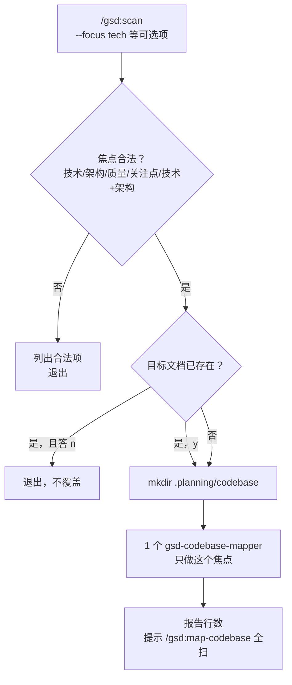

# scan

> 指名道姓只扫一个焦点的轻量体检：派 1 个 mapper、出 1–2 份文档——当 map-codebase 的 4 路全扫为回答你那一个问题时纯属浪费。

<!-- more -->

## 5W1H

| 项 | 内容 |
|---|---|
| **Who（谁用）** | 只关心一个维度的疑问式用户："这个仓库技术栈到底用了什么"（`--focus tech`）、"测试怎么组织的"（`--focus quality`）。以及快速补齐单份档案的人：init 检出目标文档已存在并出示修改日期后，用户才决定是否覆盖。 |
| **What（做什么）** | 解析 `--focus <area>`（默认 `tech+arch`，非法值直接列出合法项退出）→ 用 init 检出目标文档是否已存在、存在则展示修改日期并问"用最新扫描覆盖? [y/N]" → `mkdir -p .planning/codebase` → 派 1 个 gsd-codebase-mapper → 报告产出文档与行数并提示更全的 4 路方案。 |
| **When（何时用）** | 点状补档/覆盖查验，且能耐受它建议你退到 `/gsd:map-codebase`。可选 flag `--focus tech|arch|quality|concerns|tech+arch`。 |
| **Where（在哪里）** | 工作流实现 `~/.claude/get-shit-done/workflows/scan.md`（104 行）。派发方式：1× `gsd-codebase-mapper`（同步、无 `run_in_background`）。 |
| **Why（为什么存在）** | 消除"4 路全扫才为答一个问题"的开销浪费：map-codebase 一次 4 agent 起跑、产出 7 份文档、随后的收确认/验证/密钥扫描一整条链都要走；这里把维度文档映射表做成路由事实——`tech` 精准产出 `STACK.md`+`INTEGRATIONS.md`，`concerns` 单交 `CONCERNS.md`——一次 Agent 调用拿到同样的事实拷贝，只是范围缩到最小。 |
| **How（怎么做）** | 5 个编号 Step 直排：`Step 1: Parse arguments and resolve focus` 非法 focus 立即列合法值退出；`Step 2: Check for existing documents` 用 `gsd-sdk query init.map-codebase` 查目标文档、存在则出示修改日期并 `[y/N]`，说 n 即退出；`Step 3: Create output directory`；`Step 4: Spawn mapper agent`（prompt 明确领域与仅产列表，附 ORCHESTRATOR RULE：Agent 活着时不许自己另读文件）；`Step 5: Report` 报告焦点与产出行数。 |

## 工作原理

图里的关键取舍在 Step 2：scan 不像 map-codebase 那样有 Refresh/Update/Skip 三态，只有一条「盖/不盖」闸——理由是它本来就知道自己只出哪几份文档，覆盖或是退出之外没有第三种合理结局。同时它不做 Agent 工具探测也不做 secrets 扫描：这两道闸属于全量映射工作流的默认防护，单焦点写入量小所以砍掉以保轻量。mapper prompt 也保留了 ORCHESTRATOR 规则（子代理活着时不许自己另读文件），与 map-codebase 同源但只护这 1 个 agent。

另一个事实细节：默认焦点是 `tech+arch`——一次最简扫描也至少拿到骨架事实（栈 + 架构）两类，单一维度扫描反而是要显式指定的例外。

## 产出与影响

| 项 | 内容 |
|---|---|
| **读取** | `gsd-sdk query init.map-codebase` JSON（判定目标文档是否已存在）、焦点映射表（`tech`→STACK/INTEGRATIONS, `arch`→ARCHITECTURE/STRUCTURE, `quality`→CONVENTIONS/TESTING, `concerns`→CONCERNS, `tech+arch`→前四个） |
| **写入** | `.planning/codebase/` 内的焦点对应文档 1–4 份（视 `--focus`） |
| **派发 agent** | 1× `gsd-codebase-mapper`（非后台运行） |
| **成功标准** | 源码 `<success_criteria>` 共 5 条：焦点解析（默认 tech+arch）、旧文档出示修改日期、覆盖前先问用户、单 mapper 带对焦点、文档写入 `.planning/codebase/` |

## 适用场景

- 只想快速回答一个问题：栈用的是什么、集成点在哪、测试怎么排的
- map-codebase 之后某一两份文档明显过时，需要定向重刷
- 赶进度的会话里不想起 4 个 agent、也不想等全量扫描跑完
- 一次 AI 会话收尾前，把某份缺失的档案补齐

## 反模式与陷阱

- **它只是单点修复不是全景扫描**：报告阶段主动提示「Use `/gsd:map-codebase` for a comprehensive 4-area parallel scan」——当你需要第一份完整代码库档案时不要拿它顶。
- **覆盖是 y/N 不是 AskUserQuestion**：默认 N，不显式确认就不动已有文档——它走标准 y/N 而非选项面板，与多数 GSD 闸的交互形态不同。
- **没有 runtime 降级和密钥扫描**：那两道闸是 map-codebase 专属——若你的运行时连 Agent 工具都没有，scan 的 Step 4 无备选方案，源码里没有 sequential fallback。

## 参见

- [index.md](./index.md) — 专栏总纲：三层架构、Gate 四分类、主链状态机、依赖关系
- [map-codebase](./map-codebase.md) — 4 路并行全扫 Plus 版（本文档的加量兄弟）
- GitHub: [get-shit-done](https://github.com/gsd-build/get-shit-done)
- 源码：`~/.claude/get-shit-done/workflows/scan.md`（GSD 1.42.3）
