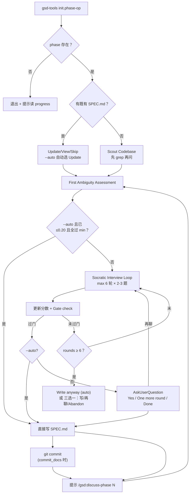

# spec-phase

> 用定量歧义评分驱动的苏格拉底面谈把"这个 phase 到底交付什么"问到可写 SPEC.md 的精度——成功标准：歧义分数 ≤ 0.20 且四个维度过底线，产出的是可证伪的需求清单而不是"用户体验要好"这种话。

<!-- more -->

## 5W1H

| 项 | 内容 |
|---|---|
| **Who（谁用）** | 拿着一句"加个批量导出"这种表述就进 GSD 的人、或替别人把模糊想法写成可评审需求的人——都处于"WHAT 还没定"的早期阶段，区别于 discuss-phase 处理的"实现怎么做"环节。 |
| **What（做什么）** | `Initialize`（用 `gsd-tools.cjs init phase-op` 校验）→ 既有 SPEC.md 检查（Update / View / Skip 分选）→ `Scout Codebase`（先看代码再提问）→ `First Ambiguity Assessment`（预先打 4 维歧义分）→ `Socratic Interview Loop`（最多 6 轮 × 每轮 2–3 题，五个访谈视角按轮次轮换）→ `Generate SPEC.md`（每条需求必须带 current state/target state/pass-fail 验收项）→ `Commit`（commit_docs 开启时原子提交）。产物：`{phase_dir}/{padded_phase}-SPEC.md`。 |
| **When（何时用）** | phase 刚立项、需求还很模糊、要在规划前把 WHAT 定下来的阶段。flag：`--auto`（算到过门槛即跳过访谈）与 `--text`（无 UI 式菜单，纯文本向）。顺序上通常在 discuss-phase 之前，直接消费 spec 的是 plan-phase 的 `--prd` 通道。 |
| **Where（在哪里）** | `~/.claude/get-shit-done/workflows/spec-phase.md`（262 行）。**零 agent 派发**——4 个访谈角色是同一参与者轮换，不是 spawn 出来解决的；所有评分、门判都是内联算术 + 用户反馈。 |
| **Why（为什么存在）** | 消除"需求清不清晰全凭文采和感觉"这个特例。给歧义定标尺（0.0 完全模糊 → 1.0 完全清晰）意味着"清楚了吗"从主观判断变成可计算的加权分——不达标就继续追问，直到 4 个维度都过最小门。 |
| **How（怎么做）** | 步骤与判定逻辑：歧义分 = `1.0 − (0.35×goal + 0.25×boundary + 0.20×constraint + 0.20×acceptance)`；维度最小门分别为 goal 0.75 / boundary 0.70 / constraint 0.65 / acceptance 0.70；`max 6 rounds`（researcher 1–2、simplifier 2、boundary-keeper 3、failure-analyst 4、seed closer 5–6 各换一个视角）；每轮末尾重打 4 个维度分并做门检查；6 轮不达标三选一："带差距标注写 SPEC.md" / "继续说" / "Abandon"（Abandon 会真的不写 SPEC）。 |

## 工作原理

关键设计：四维模型不是人设口号而是可计算的门——分数不是装饰，边界要求是 pass/fail 式而不是话术式，"The system should be fast" 这种需求明确标 ✗、可接受的是"API 在 p95 下 &lt;200ms"等有数字的表述；"Boundaries must be explicit lists" 是明确写死的强制性约束而非 advisory。访谈视角按轮次轮换（Researcher→Simplifier→Boundary Keeper→Failure Analyst→Seed Closer），前两轮锚定现状、第 4 轮专问"需求写错会出什么坏事"——提问本身是有方法论的，不是随机追问。多个维度不达标时 Ambiguity Report 里会打上⚠ "planner must treat below-minimum as assumption"——功能层面的降级路径，不是报错株连到出口。

## 产出与影响

| 项 | 内容 |
|---|---|
| **读取** | ROADMAP.md（phase 描述 + canonical refs）、REQUIREMENTS.md、STATE.md、既有 SPEC.md（Update 路径）、代码库本身（Scout Codebase） |
| **写入** | `{phase_dir}/{padded_phase}-SPEC.md`、git commit（`spec(phase-N): add SPEC.md ... (#2213)`，commit_docs=false 时只写不提交） |
| **派发 agent** | 零。五个访谈视角（Researcher/Simplifier/Boundary Keeper/Failure Analyst/Seed Closer）是同一会话换帽，不 spawn subagent |
| **成功标准** | Scouted codebase 后才问问题；每次轮四个维度都返回分数；过门或用户明选"带差距标注写"；SPEC.md 只含 falsifiable 要求；boundaries 是显式列表；acceptance criteria 是 pass/fail 打钩；commit_docs=true 时原子提交；最后引导跑 `/gsd:discuss-phase` |

## 适用场景

- phase 目标只有一句话但影响面大，需要在正事动手前把需求定死不能 sprint 滑掉
- 团队里"有人觉得含糊"、"有人觉得何必这么细"，用评分数字拉到同一张判断台上
- `--auto` 模式：歧义分数已经过门，不需要访谈直接拿 roadmap 生成 SPEC
- 从模糊 idea → SPEC.md → plan-phase `--prd` 这条绕过 discuss 的快车道入口

## 反模式与陷阱

- **Abandon 选项是真的不写**：critical_rules 明写 "SPEC.md is NEVER written if the user selects 'Abandon'"——不是提示梗，中途放弃谈崩不会留"半成品草稿"。把访谈做到能落一组需求还嫌不满再选放弃，就是成本自担。
- **过门是必要件不是质量证书**：0.20 只是"够规划师下手"的门槛，不是"需求足够好"的同义词；低于门时的出路是 Ambiguity Report 里标 "⚠ Below minimum — planner must treat as assumption" 的降级路径，不是静默放行。
- **AI-SPEC.md 被显式排除**：源码用 `ls *-SPEC.md | grep -v AI-SPEC` 探测既有文件——同目录的 `AI-SPEC.md`（来自 `/gsd:ai-integration-phase`）是另一种用途的文件，不会被本工作流当作既有 SPEC 读。
- **访谈节奏有硬栅栏**：max 6 轮、每轮 2–3 题——约束防的是"Socratic 上头把所有问题一次灌满"；6 轮后选 "Keep talking" 才不限轮数，那是明示的例外路径不是默认。

## 参见

- [index.md](./index.md) — 专栏总纲：三层架构、Gate 四分类、主链状态机
- [discuss-phase](./discuss-phase.md) — 下游：拿到 SPEC.md 后固需求为锁、专问 HOW
- [plan-phase](./plan-phase.md) — `--prd` 通道：spec-phase 跳过 discuss 的快捷产物消费方
- [analyze-dependencies](./analyze-dependencies.md) — 另一种"规划前补清单"的工具
- GitHub: [get-shit-done](https://github.com/gsd-build/get-shit-done)
- 源码：`~/.claude/get-shit-done/workflows/spec-phase.md`（GSD 1.42.3）
