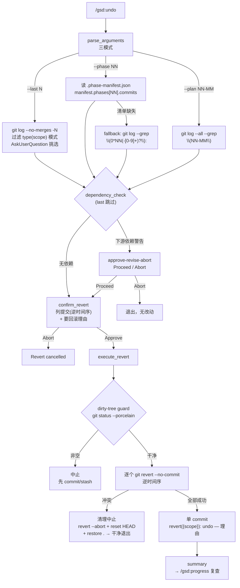

# undo

> 安全 git 回滚：按阶段清单或计划 ID 撤销 GSD 提交，带依赖检查与确认门，全程用 `git revert --no-commit` 保留历史——绝不 `git reset --hard` 抹掉过去。

<!-- more -->

## 5W1H

| 项 | 内容 |
|---|---|
| **Who（谁用）** | 阶段或计划提交错了、想撤销的项目作者。操作对象是**已提交**的 GSD conventional commits（`feat(04-01):` 这种格式），不是未提交的改动。 |
| **What（做什么）** | 展示 banner → 解析模式（`--last N` / `--phase NN` / `--plan NN-MM`）→ 收集候选提交（phase 模式优先读 `.planning/.phase-manifest.json` 清单，缺失才 fallback git log）→ 依赖检查（仅 phase/plan 模式，找出下游依赖方并警告）→ 确认门（approve-revise-abort + 要求回滚理由）→ 执行（dirty-tree guard 先行 → `git revert --no-commit` 逆时间序逐个 → 冲突则清理中止）→ 展示摘要。 |
| **When（何时用）** | `/gsd:undo --last 5` 交互挑选最近 N 个 GSD 提交；`/gsd:undo --phase 03` 撤销整个阶段；`/gsd:undo --plan 03-02` 撤销单个计划。前置条件：工作树干净（有未提交改动直接中止）。回滚完成后可用 `/gsd:undo --last 1` 撤销回滚本身。 |
| **Where（在哪里）** | 工作流实现 `~/.claude/get-shit-done/workflows/undo.md`（314 行）。**零 agent 派发**——纯 git 操作链。步骤：`banner` → `parse_arguments` → `gather_commits` → `dependency_check` → `confirm_revert` → `execute_revert` → `summary`。必读参考：`references/ui-brand.md`、`references/gate-prompts.md`。清单文件：`.planning/.phase-manifest.json`（`manifest.phases[N].commits` 数组）。 |
| **Why（为什么存在）** | 消除"用 reset 回滚"的破坏性特例：`git reset --hard` 抹掉提交历史，跨会话协作时等于删掉别人依赖的记录。undo 用 `revert --no-commit` 生成反向提交，历史保留、可再撤销；依赖检查挡住"撤销阶段但下游已经开工"的连锁破坏；确认门要求写理由并进 commit message，回滚可追溯。 |
| **How（怎么做）** | 七步串行。`parse_arguments`：`--last N`（COUNT 默认 10）、`--phase NN`、`--plan NN-MM`，无参数打印 usage 退出。`gather_commits`：last 模式过滤 `type(scope):` 模式后 AskUserQuestion 挑选；phase 模式读 manifest 的 `manifest.phases[TARGET_PHASE].commits`，清单缺失则 fallback `git log --grep "\(0*NN(-[0-9]+)?\):"`；plan 模式 `git log --all --grep "\(NN-MM\)"`；空结果干净退出。`dependency_check`（last 模式跳过）：phase 模式搜 ROADMAP.md 的 "Depends on: Phase N"/`depends_on: [N]`，下游目录有 PLAN/SUMMARY 即警告；plan 模式查同阶段编号 > MM 的 PLAN.md 的 `<files>`/`consumes` 是否引用目标输出；有警告走 approve-revise-abort。`execute_revert`：先 `git status --porcelain` 非空即中止；按逆时间序逐个 `git revert --no-commit`，失败时先 `git revert --abort`（首次失败）再 `git reset HEAD` + `git restore .`（中途失败清 staged），全部中止后退出；成功后单 commit `revert({scope}): undo ... — {REASON}`。 |

## 工作原理

关键设计取舍：**HARD CONSTRAINT 是最高优先级**——`git revert --no-commit`，源码在 success_criteria 里特意写了一条"`git reset --hard` is NEVER used anywhere in this workflow"，唯一的 reset 例外是冲突清理时的 `git reset HEAD`（取消暂存，非硬重置）。dirty-tree guard 先于一切 revert 执行，因为对未提交的工作做回滚会把别人的半成品卷进来。依赖检查**只警告不阻断**——警告后仍走确认门，由人决定 Proceed 还是 Abort，符合 gate-prompts 的 approve-revise-abort 模式。

## 产出与影响

| 项 | 内容 |
|---|---|
| **读取** | `git log --oneline --no-merges -N`、`.planning/.phase-manifest.json`、`.planning/ROADMAP.md`（依赖搜索）、下游阶段目录的 `*-PLAN.md`/`*-SUMMARY.md`、`git status --porcelain` |
| **写入** | 单个 `revert({scope}): undo ...` 提交（`git revert --no-commit` 暂存后 commit） |
| **派发 agent** | 无。`Agent()` 出现次数为 0——纯 git 操作链 |
| **成功标准** | 三模式参数解析正确；phase 模式读 manifest 的 `manifest.phases[TARGET_PHASE].commits`；清单缺失时 fallback git log；phase 模式对已开工下游发依赖警告；plan 模式对引用目标输出的后续计划发警告；dirty-tree guard 中止未提交改动；执行前展示确认门；逆时间序 `git revert --no-commit`；全部暂存后单提交；首失败与中途失败两种冲突清理路径都处理；全程永不使用 `git reset --hard` |

## 适用场景

- 阶段整体跑偏，撤销该阶段全部提交（`--phase 03`），但先被依赖检查拦一下"Phase 4 已经开工了"
- 单个计划（如 03-02）做坏了，只想撤它不动同阶段其他计划
- 想从最近 N 个 GSD 提交里挑几个撤（`--last 10` 交互选择）
- 回滚后发现还是不对——`/gsd:undo --last 1` 把回滚本身也撤销（revert 可逆性的直接应用）
- 需要保留历史审计痕迹的回滚场景（每个反向提交带理由）

## 反模式与陷阱

- **`--last` 模式没有依赖检查**：`dependency_check` 明确 "Skip this step entirely for MODE=last"——交互挑选的提交可能互相依赖，撤了 A 留下依赖 A 的 B，全靠你自己判断。
- **有未提交改动直接拒绝**：dirty-tree guard 在**任何** revert 之前跑，非空即中止并提示 "Commit or stash them before running /gsd:undo"——这不是 bug，是防止把工作区半成品卷进回滚。
- **依赖检查只读 ROADMAP 与后续计划文本**：phase 模式靠搜索 "Depends on:" / `depends_on:` 字符串，plan 模式靠 `<files>`/`consumes` 引用——依赖声明写得含糊就查不出来，警告缺失不等于没有依赖。
- **冲突清理是双路径的**：首次失败用 `git revert --abort`；但此前已暂存的干净 revert 会让 abort 变 no-op，此时靠 `git reset HEAD` + `git restore .` 清场——源码专门处理了这种 mid-sequence 情形，报错信息里写 "All pending reverts have been aborted — working tree is clean"，若清理后树不干净说明遇到了它没覆盖的边界。
- **确认门要求理由**：`confirm_revert` 在 Approve 之后还要一次 AskUserQuestion 要理由，理由是空选项列表的自由文本，进 commit message——不耐烦跳过理由，commit 里就会留下一个空泛的 `undo ... —`。

## 参见

- [index.md](./index.md) — 专栏总纲：三层架构、Gate 四分类、主链状态机、依赖关系
- [forensics](./forensics.md) — 回滚前先勘察"到底哪里坏了"
- [audit-milestone](./audit-milestone.md) — 里程碑验收失败后，回滚到未达标阶段的入口
- [progress](./progress.md) — 回滚后复查项目状态（undo 的 summary 推荐命令）
- GitHub: [get-shit-done](https://github.com/gsd-build/get-shit-done)
- 源码：`~/.claude/get-shit-done/workflows/undo.md`（GSD 1.42.3）