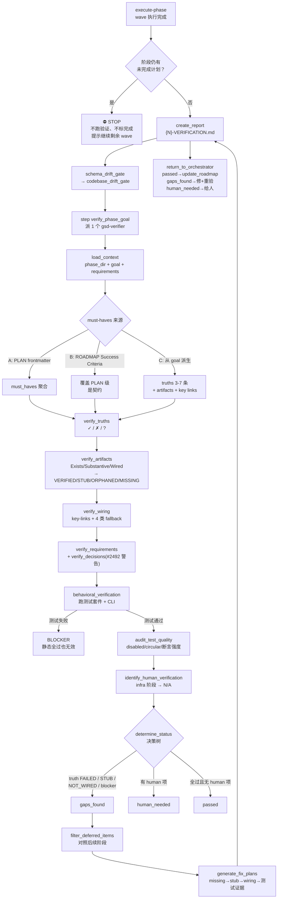

# verify-phase

> 阶段级目标回溯验证：不是查"任务做完了吗"，而是查"代码库真的交付了阶段承诺的目标吗"——由 execute-phase 在**全部计划与 wave 完成后**派出的验证 subagent 执行。

<!-- more -->

## 5W1H

| 项 | 内容 |
|---|---|
| **Who（谁用）** | 不是交互式用户工作流——它的执行者是 **gsd-verifier 验证 subagent**，由 execute-phase 在阶段末尾派生。人只在 `human_needed` 状态（需人工验证项）出现时才介入。 |
| **What（做什么）** | 加载阶段上下文 → 建立 must-haves（PLAN frontmatter → ROADMAP Success Criteria → 从 goal 派生的三级降级）→ 逐 truth 验证 → 三层 artifact 检查（存在/实质/接线）→ key-link 接线验证 → 需求覆盖 → 决策覆盖（#2492，非阻塞）→ 跑测试套件与 CLI → 反模式扫描 → 测试质量审计 → 识别人工验证项 → 判定状态 → 延期项过滤 → 生成修复计划 → 写 VERIFICATION.md → 返回 orchestrator。 |
| **When（何时用）** | execute-phase 的 **step `verify_phase_goal`（源码第 1448 行）**——排在 code review、regression gate、schema drift gate、codebase drift gate **全部之后**，是阶段收尾而非逐任务触发。**若阶段仍有未完成计划则整段跳过**，直接停住并提示继续跑剩余 wave。由 execute-phase 派发，不是独立命令。前置条件：阶段有 PLAN.md（must-haves 来源）或 ROADMAP.md（Success Criteria / goal）。 |
| **Where（在哪里）** | 工作流实现 `~/.claude/get-shit-done/workflows/verify-phase.md`（543 行）。**零 agent 派发**——它自己是 subagent，`subagent_type` 出现次数为 0，全部逻辑内联（与其他 verify 工作流不同）。必读参考：`references/verification-patterns.md`、`templates/verification-report.md`。 |
| **Why（为什么存在）** | 消除"任务完成 ≠ 目标达成"的假阳性：占位符组件也能被标 complete。goal-backward 四问（TRUE / EXIST / WIRED / TESTS PROVE）逐层下钻，把"验证"从文件存在性检查升级为行为验证——静态 grep 抓不到运行期失败，所以它真的跑测试套件。 |
| **How（怎么做）** | 十六个 step：`load_context` → `establish_must_haves`（A/B/C 三级）→ `verify_truths` → `verify_artifacts`（`verify.artifacts` + export 级 spot check）→ `verify_wiring`（`verify.key-links` + 四类 fallback 模式）→ `verify_requirements` → `verify_decisions`（#2492 警告门）→ `behavioral_verification`（测试命令解析：config > Makefile > 语言嗅探；**有 runner 且执行失败** = BLOCKER，无 runner 时只警告跳过；CLI 缺 fixture 转 `? NEEDS HUMAN`）→ `scan_antipatterns`（TBD/FIXME/placeholder 无引用 = blocker）→ `audit_test_quality`（disabled/circular/provenance/断言强度）→ `identify_human_verification` → `determine_status`（决策树：gaps_found > human_needed > passed）→ `filter_deferred_items` → `generate_fix_plans` → `create_report` → `return_to_orchestrator`。 |

## 工作原理

关键设计取舍：`determine_status` 的决策树**按最严优先**——任何 truth FAILED、artifact STUB/MISSING、key link NOT_WIRED、测试质量审计 blocker，直接 gaps_found，哪怕其余全绿。`passed` 是唯一要求"无 human 验证项"的状态。对称地，决策覆盖门（#2492）刻意做成**非阻塞警告**：plan-phase 翻译时已挡过一轮，验证时只查"翻译了但执行中消失"的决策，且"honor a decision"是模糊子串启发式，误报不值得毁掉一个好阶段。

## 产出与影响

| 项 | 内容 |
|---|---|
| **读取** | `init.phase-op`、`roadmap.get-phase`、`roadmap.analyze`、`REQUIREMENTS.md`、各 `*-PLAN.md`（must_haves）、`verify.artifacts` / `verify.key-links` / `check.decision-coverage-verify` 查询、`workflow.test_command` / `workflow.context_coverage_gate` 配置 |
| **写入** | `{PHASE_DIR}/{PHASE_NUM}-VERIFICATION.md`（artifact 表、wiring 表、需求覆盖、反模式、human 验证、gaps、fix plans） |
| **派发 agent** | 无。`subagent_type` 出现次数为 0——它是被派发者，不是派发者 |
| **成功标准** | must-haves 建立（frontmatter 或派生）；truths 全部带状态与证据；artifacts 三层全查；key links 全验；需求覆盖评估；#2492 决策检查（非阻塞）；反模式扫描分类；测试质量审计（disabled/circular/provenance/断言强度）；human 验证项识别；状态判定；延期项过滤；修复计划生成（如 gaps_found）；VERIFICATION.md 完整报告；结果返回 orchestrator |

## 适用场景

- execute-phase 收尾时需要一个阶段级裁决，确认"这一阶段整体是否真交付了承诺"
- 怀疑有 STUB（`setPlan()` 之类死代码）、ORPHANED（存在但无人 import/use）的接线缺口
- 需求要求值级/行为级证明，但测试只有存在性断言——`audit_test_quality` 的断言强度分级会标 INSUFFICIENT
- 测试把期望值"从被测系统自身捕获"——circular test 检测专门抓这种自证循环
- infrastructure/foundation 阶段（无用户可见面）——自动 N/A，不发明人工验证步骤

## 反模式与陷阱

- **gsd-verifier 不归 verify-phase 管**：命名极具误导性——verify-phase.md 是验证 subagent 的执行说明，**派发权在 execute-phase** 的 `verify_phase_goal` 步（阶段全部计划完成后）。你无法 `/gsd:verify-phase` 直接调用它。
- **未完成计划会跳过整段验证**：阶段还有剩余计划时，execute-phase 在 **wave 完成后、进入 code review 与三个漂移门之前**就停住——不跑验证、不在 ROADMAP/STATE 标完成，只提示继续跑剩余 wave。分批跑 wave 时别误以为每跑完一批就有验证结论。
- **决策覆盖门是警告不是门**：`verify_decisions` 返回 `{blocking: false}`，**不参与** `determine_status` 的 gaps_found/human_needed/passed 判定——看到"not_honored"别以为会卡住阶段，它只是留痕供人审阅。
- **测试失败是最硬的 blocker**：`behavioral_verification` 里测试套件失败 = BLOCKER，**无论静态检查多漂亮**；但注意测试命令解析有降级链（config > Makefile > 语言嗅探），没有 test runner 时只打"⚠ No test runner detected"然后跳过——这是源码承认的空洞，别当成测试真跑了。
- **CLI 验证无 fixture 就不跑**：成功标准里描述的 CLI 命令，若项目里没有 `templates/`/`fixtures/`/`testdata/` 等示例输入，标记 `? NEEDS HUMAN` 并跳过——**绝不发明示例输入**，这是源码的显式禁令。
- **delay 语义：延期项不影响状态**：`filter_deferred_items` 把 gap 移到 `deferred` 列表后，`passed` 可以据此恢复——但它要求保守匹配（后续阶段的 goal/success criteria 文本里必须有明确证据），模糊匹配不得延期。

## 参见

- [index.md](./index.md) — 专栏总纲：三层架构、Gate 四分类、主链状态机、依赖关系
- [verify-work](./verify-work.md) — 用户侧会话式 UAT（本页是 agent 侧，两者互补）
- [audit-milestone](./audit-milestone.md) — 聚合本页的 VERIFICATION.md 做里程碑级验收
- [code-review](./code-review.md) — 阶段源码质量审查（与目标验证并行不悖）
- GitHub: [get-shit-done](https://github.com/gsd-build/get-shit-done)
- 源码：`~/.claude/get-shit-done/workflows/verify-phase.md`（GSD 1.42.3）