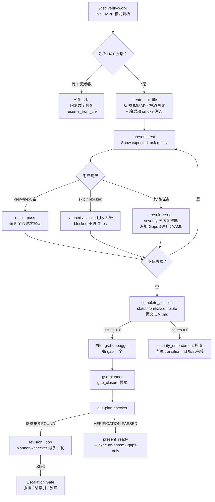

# verify-work

> 会话式 UAT 验收：用户亲手测试、Claude 只做记录，把"功能真的符合预期吗"变成可追踪的 UAT.md，并把失败项喂给 plan-phase --gaps 自动规划修复。

<!-- more -->

## 5W1H

| 项 | 内容 |
|---|---|
| **Who（谁用）** | 刚跑完 execute-phase 的项目作者。不想看代码、只想亲手点一遍功能确认"真能用"的人——用户测试，Claude 记录（`User tests, Claude records`）。 |
| **What（做什么）** | 加载阶段上下文 → 检查活跃 UAT 会话（可恢复）→ 从 SUMMARY.md 提取可测试交付物 → 创建 `{phase_num}-UAT.md` → 逐个展示 checkpoint 等用户回答 → 处理响应（pass/skip/blocked/issue，severity 自动推断）→ 会话完成提交 → 有 issue 则并行诊断 + planner 自动规划修复。 |
| **When（何时用）** | execute-phase 跑完后、规划下一阶段前。`/gsd:verify-work {phase}` 带阶段号开新会话，不带参数则列出活跃会话供恢复。MVP 模式阶段、`--text` 模式（非 Claude 运行时）有专门分支。前置条件：阶段有 SUMMARY.md 可提取测试。 |
| **Where（在哪里）** | 工作流实现 `~/.claude/get-shit-done/workflows/verify-work.md`（780 行）。派发链：`diagnose_issues` 经 diagnose-issues 工作流**每 gap 并行派一个 gsd-debugger** → `plan_gap_closure` 派 **gsd-planner**（gap_closure 模式）→ `verify_gap_plans` 派 **gsd-plan-checker** → `revision_loop` 最多 3 轮 planner↔checker。 |
| **Why（为什么存在）** | 消除"任务完成标记了但功能是坏的"这个特例——占位符组件也能被标成 complete。UAT.md 是持久化产物，`/clear` 后靠文件恢复，不靠人脑记测试进度。blocked（前置条件缺）与 issue（代码缺陷）被刻意分开：blocked 不是代码问题，绝不混进 Gaps。 |
| **How（怎么做）** | 十六个 step 串行：`initialize`（init.verify-work + MVP 模式解析）→ `check_active_session` → `automated_ui_verification`（有 Playwright-MCP 时自动核 UI checkpoint）→ `find_summaries` / `extract_tests`（含冷启动 smoke test 注入）→ `create_uat_file` → `present_test`（渲染 checkpoint 必须 byte-for-byte 输出）→ `process_response`（"yes"/"y"/"next"/空 = pass，其余 = issue + 关键词 severity 推断）→ `complete_session`（pending/blocked/无理由 skipped 任一 >0 则 status=partial）→ `scan_phase_artifacts` → `diagnose_issues` / `plan_gap_closure` / `verify_gap_plans` / `revision_loop` / `present_ready`。零 issue 时按 security 检查后**内联**执行 transition.md（不派 Task）。 |

## 工作原理

关键设计取舍：`present_test` 要求整个响应**逐字节等于**渲染出的 checkpoint——把"展示测试"和"补充说明"彻底隔离，防止 orchestrator 的杂音污染测试协议。写入是批量的（issue 时、每 5 个通过、完成时三个时机），刻意不在每次交互都落盘，换取 token 效率，代价是中途 `/clear` 最多丢 5 个测试的进度——这是有意的取舍。

## 产出与影响

| 项 | 内容 |
|---|---|
| **读取** | `gsd-sdk query init.verify-work`、`phase.mvp-mode`、各 `*-SUMMARY.md`、活跃 `*-UAT.md` 文件、`workflow.ui_phase` / `workflow.security_enforcement` 配置 |
| **写入** | `.planning/phases/{phase}/` 下 `{phase_num}-UAT.md`（frontmatter status/updated、Tests、Summary、Gaps 追加）、完成时 `gsd-sdk query commit`、零 issue 时改 ROADMAP.md/STATE.md（经 transition.md） |
| **派发 agent** | gsd-debugger（每 gap 一个，并行）→ gsd-planner（gap_closure）→ gsd-plan-checker → gsd-planner（revision）+ gsd-plan-checker（最多 3 轮） |
| **成功标准** | UAT 文件含 SUMMARY 全部测试；测试逐个展示；响应按 pass/issue/skip 处理；severity 从不提问；issue/每 5 通过/完成时批量写入；完成即提交；有 issue 时并行诊断 + 修复计划经 checker 验证；就绪后走 `/gsd:execute-phase --gaps-only` |

## 适用场景

- execute-phase 刚跑完，需要人肉确认功能真实可用（不只"任务标记完成"）
- 阶段 SUMMARY.md 里提到 `server.ts`、`database/*`、`migrations/*` 等路径——冷启动 smoke test 会自动注入，抓只在干净启动时暴露的 bug
- 有 Playwright-MCP 且阶段有 UI-SPEC.md——UI checkpoint 自动核验，只剩主观项问人
- MVP 模式阶段：user-flow 步骤先行，技术检查延迟到流程跑通之后
- 中途 `/clear` 后凭 UAT.md 恢复会话，不重测已通过的项

## 反模式与陷阱

- **blocked 不等于 issue**：响应含 "server"/"physical device"/"release build" 等关键词会被标 `blocked` 并推断 `blocked_by` 标签，但**不写入 Gaps**——它们是前置条件不是代码缺陷，混进去会让 plan-phase 给不存在的 bug 排修复计划。
- **MVP 模式 user-flow 失败即停**：`extract_tests` 规定 user-flow 第 N 步失败就判定 FAIL，技术检查根本不跑——别在流程没通时去补端点测试，那是浪费。
- **零 issue 时并不直接结束**：`complete_session` 会查 `workflow.security_enforcement`，没跑过 secure-phase 就警告，然后**内联**执行 transition.md 标记阶段完成——它特意不用 Task 派发，因为 orchestrator 上下文里已有 UAT 结果。
- **severity 是猜的**：`process_response` 用关键词表推断（crash/error→blocker，color/spacing→cosmetic），默认 major。源码明确"Never ask how severe is this?"——用户可在后续纠正，但流程不会主动问。
- **diagnose 是自动的、无确认的**：`diagnose_issues` 步骤直接并行派 debug agent，不弹确认框。想在诊断前介入，得在 verify-work 跑起来之前就盯住。

## 参见

- [index.md](./index.md) — 专栏总纲：三层架构、Gate 四分类、主链状态机、依赖关系
- [diagnose-issues](./diagnose-issues.md) — 被 verify-work 调用的并行根因诊断
- [verify-phase](./verify-phase.md) — 目标导向验证（由 execute-phase 派发，与本页互补）
- [audit-milestone](./audit-milestone.md) — 里程碑级验收（聚合本页的 phase 验证结果）
- GitHub: [get-shit-done](https://github.com/gsd-build/get-shit-done)
- 源码：`~/.claude/get-shit-done/workflows/verify-work.md`（GSD 1.42.3）