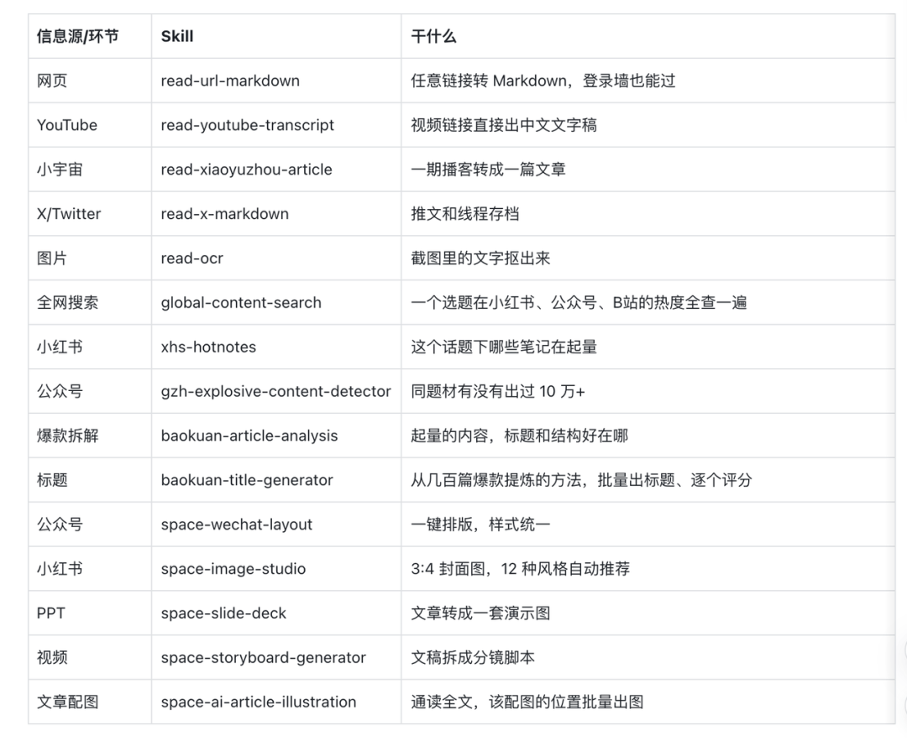
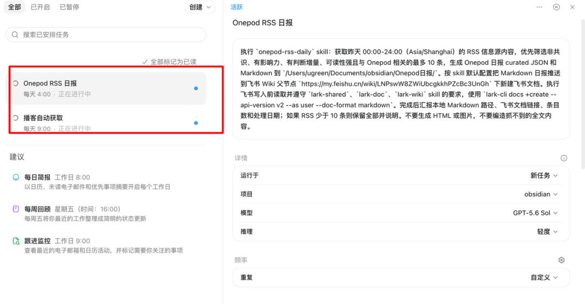
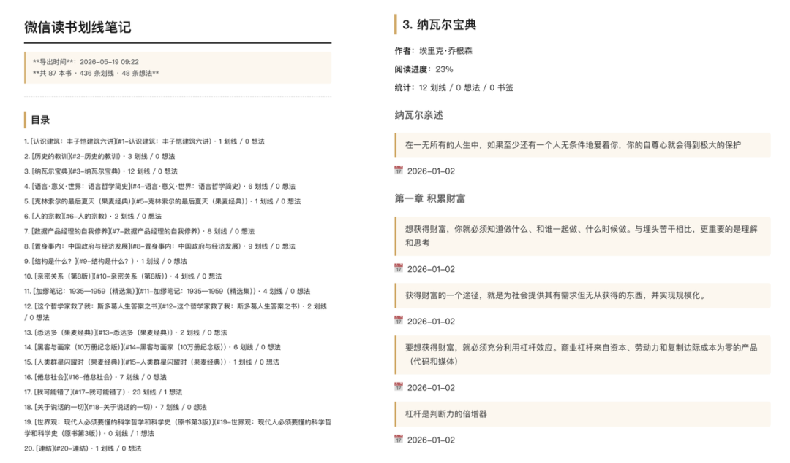
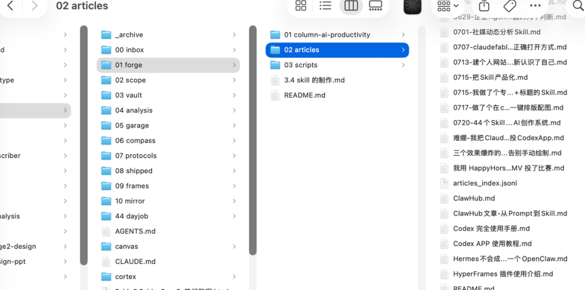
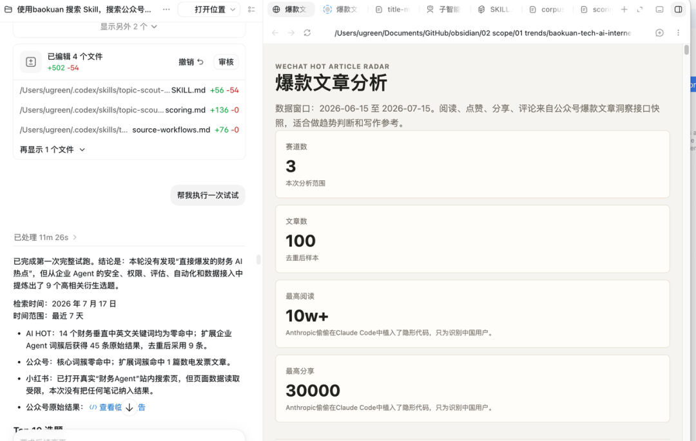
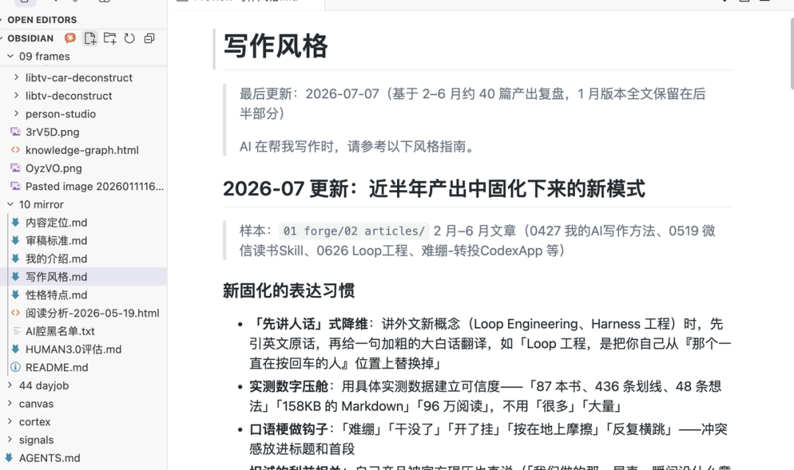
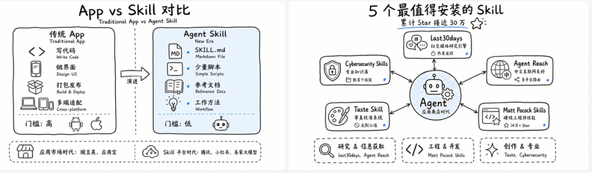

# 50 个 Skills 打造 AI 创作系统：四层架构全解析

## 核心洞察

大多数人的 Skill 是「收藏夹式」——看到一个存一个，用一次就再也没用过。空格丶把50个 Skill 串成了一个**系统**：数据→创作→排版→分发，四层流水线。

**关键区别**：不是收集 Skill，而是让 Skill 之间有上下游关系，数据流出到下一层自动衔接。

## 四层架构

### 第一层：数据层——搭建 Agent 的上下文

负责「信息进来」。网页、YouTube、小宇宙播客、推文、截图 OCR，什么格式进来都统一变成文稿。

- **RSS 自动获取**：关注的博主更新自动抓取，不用每天到处刷
- **Codex 定时任务**：每天定时抓取，输出各信源日报
- **微信读书导出**：用 Skill 导出87本书、436条划线
- **小红书收藏导出**：Skill 直接提取收藏内容

全部保存到创作内容库，变成 AI 能调用的上下文。写文章时 AI 带着你全部的阅读积累上场。

### 第二层：创作层——选题和编写

负责选题验证和标题生成。

- **热点检测**：结合小红书、公众号、B站、抖音几个平台的热度
- **爆款拆解**：拆爆款的标题和结构
- **标题生成**：用「专写10万+标题 Skill」生成一组标题挑选
- **全文编写**：Agent 参考整个内容库的风格自动更新规则来输出文章

写作风格文档、历史文章索引、审稿标准都在内容库里，根据写的文章实时更新。AI 读完这些再动笔，比任何写作神器都好使。

### 第三层：排版层——文字转多模态

负责一份文字内容变成图片、视频多种模态。

- **公众号排版**
- **小红书封面**
- **PPT 制作**
- **视频分镜**
- **批量配图**
- **逻辑图生成**

可用 NotebookLM、Lovart、GPT-image2 批量出图。

**核心原则**：内容只写一次，形态交给工具。

视频制作方面，现阶段可以稳定把文字转 B-roll：
- 任意内容转成创意视频
- 任何文章变成视频版 PPT

### 第四层：分发（进行中）

坦白讲，这套系统还缺最后一环。发公众号、发小红书、发B站，目前还是手动的。排版层出了成品，最后一步还是自己复制粘贴。分发层的 Skill 在路上了。

## 实际流程演示

一条小宇宙链接丢进去 → 读成文稿存进素材库 → 查阅获取关键词或洞察 → 调用热点 Skill 查三个平台热度确认值得写 → 写大纲 → 生成一组标题挑一个 → 批量配图 → 排版发公众号 → 出封面改小红书图文

**从一条链接到两个平台的成品，人做的事情只剩三样：做判断、写正文、挑结果。**

## 三个开源仓库

| 仓库 | 用途 |
|------|------|
| [SpaceZephyr/read-buddy](https://github.com/SpaceZephyr/read-buddy) | 数据层：阅读/采集 |
| [SpaceZephyr/creator-buddy](https://github.com/SpaceZephyr/creator-buddy) | 创作层：选题/编写 |
| [SpaceZephyr/design-buddy](https://github.com/SpaceZephyr/design-buddy) | 排版层：设计/出图 |

## 总结

**收藏别人的100个 Skill，不如把自己的10个串成系统。**

关键不是 Skill 的数量，而是它们之间是否有上下游关系。数据层产出的内容能自动流入创作层，创作层的成品能自动流入排版层——这才是系统化的本质。

空格丶正在把这套系统打造成产品 [Cowrite](https://github.com/SpaceZephyr/cowrite)，给 Codex 装上可视化创作工作台。
