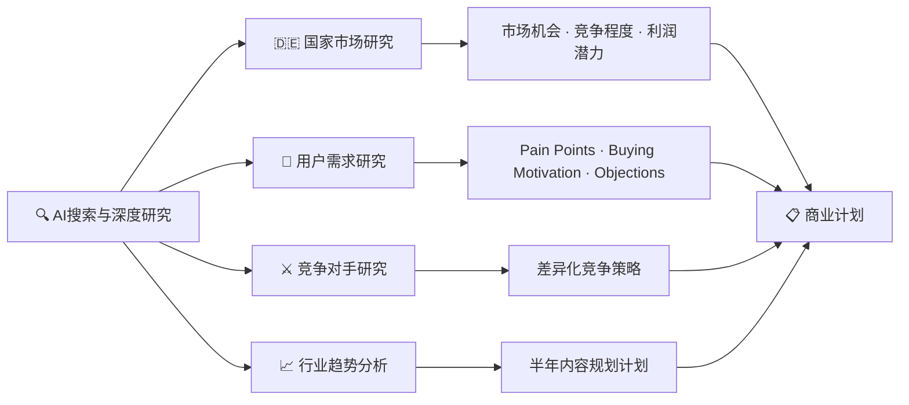
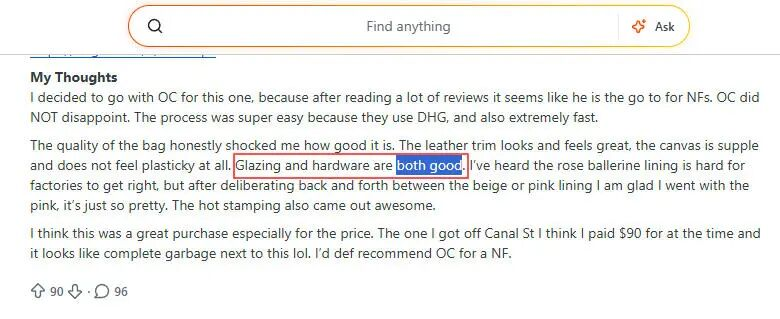

# 莆、广系跨境电商独立站卖家AI细学手册：搜索与深度研究

> **摘要**：莆、广系跨境电商卖家借助 AI 实现华丽蜕变，从每天百来个网页的有限效率，翻天到深度搜索+整理+归纳+分析的全新工作流。核心玩法：AI = 市场研究员 + 用户分析师 + SEO分析师 + 广告优化师 + 竞争对手研究员，四大研究方向：**国家市场研究**（蓝海市场挖掘）→ **用户需求研究**（Reddit/Trustpilot/社媒评论）→ **竞争对手研究**（扒光对手底裤）→ **行业趋势分析**（提前半年布局）。最终把 Google、Reddit、TikTok、Pinterest、YouTube、Facebook、Trustpilot 等平台整合成完整的商业情报系统，转化为选品策略、SEO规划、广告创意、内容营销和运营决策。

<!-- more -->

## 核心框架



## Markmap 思维导图

```markmap
# 莆、广系跨境电商 AI 搜索与深度研究

## 核心定位
- AI = 市场研究员 + 用户分析师 + SEO分析师 + 广告优化师 + 竞争对手研究员

## 一、国家市场研究
### 蓝海市场挖掘
- 传统方法：死盯美国 → 卖家扎堆、内卷严重
- 新思路：借助 AI 挖掘新兴蓝海市场
### 实战案例：LV 大麻花包进德国
- 步骤①：假设市场 → 请分析德国市场
  - 市场规模 / 消费能力 / 消费者画像
  - 线上购物习惯 / 热门品牌
  - Google 搜索趋势 / Pinterest 趋势 / TikTok 热度
  - Reddit 讨论热点 / 竞争难度 / 利润空间
  - 三维评分：市场机会 · 竞争程度 · 利润潜力
- 步骤②：制定 90 天市场进入计划
  - SEO · Google Ads · Facebook Ads
  - 内容营销 · 预算建议 · 风险提示

## 二、用户需求研究
### 数据来源
- Reddit · Trustpilot · YouTube 评论
- Facebook 评论 · TikTok 评论
### 实战流程
- 步骤①：分析评论
  - 统计：用户抱怨最多的问题 / 购买原因 / 退款原因 / 满意原因 / 最希望改进的地方
  - 输出：Pain Points · Buying Motivation · Objections · Marketing Angles（按频率排序）
- 步骤②：二次分析
  - 20 个广告卖点
  - 20 个 SEO 文章主题
  - 20 个 FAQ 问题
  - 20 条 Facebook 广告文案方向

## 三、竞争对手研究
### 深度拆解维度
- 品牌定位 / 目标用户 / 价格区间 / SKU 数量
- 产品分类 / 爆款产品 / 新品更新规律
- 博客更新规律 / SEO 策略 / Google 关键词布局
- 站内结构 / 物流政策 / 支付方式 / 售后政策
- 邮件营销策略 / 社交媒体运营情况
### 输出
- 竞争对手最大优势 / 最大弱点
- 后来者突破机会
- 差异化策略：首页布局 · SEO · 广告打法 · 内容营销 · 价格策略 · 会员体系

## 四、行业趋势分析
### 时间节点
- 不要等产品卖不动才开始分析
- 始于销量陆续上升之后，卖不动前半年
### 数据来源
- Google Trends · TikTok · YouTube · Instagram · Reddit
### 实战流程
- 步骤①：趋势分析
  - Google Trends / Pinterest 趋势
  - TikTok 热门内容
  - Instagram 热门内容
  - YouTube 测评
  - Reddit 讨论
  - 输出：增长最快颜色 / 款式 / 关键词 / 国家
  - 未来半年热门产品预测
  - 哪些趋势值得布局 · 哪些已开始衰退
- 步骤②：制定 6 个月内容营销计划
  - SEO 文章 · TikTok 选题 · Facebook 广告 · Blog 更新计划

## 最终价值
- 把 Google / Reddit / TikTok / Pinterest / YouTube / Facebook / Trustpilot
- 整合成完整的商业情报系统
- 转化为：选品策略 · SEO 规划 · 广告创意 · 内容营销 · 运营决策
```

## 正文

AI的搜索与深度研究依然是莆、广系跨境电商独立站卖家必修课之一，今天，GOD哥就沿用概念、分类、案例的格式，深入浅出，根据自己一年多以来的研究成果，给大家分享一些心得体会。

对于莆、广系跨境电商卖家而言，AI的深度研究与搜索，并非只是单纯地借助AI搜索资料，更重要的是能够借助AI快速收集、分析与整理行业资源，最终形成能够指导选品、SEO、广告投放与运营决策的研究成果。这绝对是一个高效的SOP流程，借助一个高效的工作流即可实现。


从某种意义上讲，其实，卖家朋友们可以把AI工具看成一个具备市场研究员、用户分析师、SEO分析师、广告优化师与竞争对手研究员的综合能力助手。

这两年，在厦门和福州公司，我经常与一些优秀的客户朋友沟通，发现他们已经从传统的莆、广系跨境电商从业者，华丽蜕变成人工智能时代的AI驾驭者。前几年，AI还没有面世的时候，他们的运营，每天的工作往往是流连在Google搜索、Reddit找帖子、油管找KOL、Facebook广告中心盯广告、Trustpilot看评论等，一天也就百来个网页的工作量，效率是有限的。AI出现之后，现在他们的工作流程变成了深度搜索、整理、归纳与分析，最后形成工作流，效率翻天了。

结合莆、广系跨境电商独立站行业的特点，我认为AI搜索与深度研究可以从如下几个方向切入。

### 1、国家市场研究

一说到做莆、广系跨境电商的市场研究，我在以前的精品孵化计划下也有讲述了几种传统的方法。很多人研究了半天，最终往往容易集中在一个方向，那就是：我就死盯着美国这个国家的市场。倒也没错，美国的订单体量确实全球第一，可是，你慢慢地就会发现这些国家市场上卖家扎堆，人满为患，竞争剧烈，于是，新兴的蓝海市场挖掘，成为了诸多后进者的机会所在。


我们以LV大麻花包为例，这个产品在美国那边都卖烂了，内卷严重，但不可否认，这个产品妥妥是莆、广系市场上的爆品无疑，经典不过时，那么，我们是否可以借助AI为这个品挖掘出一些潜在的蓝海市场呢？

投喂AI开始，挖掘一下市场趋势，分析一下LVMM Monogram在德国的市场趋势：

**①、假设市场**

```
请分析德国市场。
产品：LVMM Monogram Handbags
输出：市场规模/消费能力/消费者画像/线上购物习惯/热门品牌/Google搜索趋势/Pinterest趋势/TikTok热度/Reddit讨论热点/竞争难度/利润空间
最后请按照：市场机会、竞争程度、利润潜力三个维度进行评分，并给出进入建议。
```

**②、制定计划**

```
如果我要进入德国市场。
请制定：未来90天市场进入计划。
包括：SEO、Google Ads、Facebook Ads、内容营销、预算建议与风险提示。
```

如上两步，就是一个完整的市场研究初级流水线，然后，运营者结合这个报告，再深度人工调整与实施。

### 2、用户需求研究

在初步确定了市场国家后，我们需要对这个国家的用户进行需求分析，比如说，德国女性喜欢不喜欢LV麻花这个包，如果她们的审美观都不在此，那推广再多，都没有意义。

用户需求分析可以从Reddit、Trustpilot、Youtube评论、Facebook评论、Tik Tok评论等地方抓爬数据，这些地方有大量真实用户内容，在很大的程度上可以说明这个国家用户的需求意向。



选定相关的社区，开始投喂：

**①、分析评论**

```
请分析以下Reddit帖子：（帖子列表）
任务：
统计：用户抱怨最多的问题/购买原因/退款原因/满意原因/最希望改进的地方
最后输出：Pain Points/Buying Motivation/Objections/Marketing Angles，并按照出现频率排序。
```

**②、二次分析**

```
根据以上分析，请输出：
20个广告卖点/20个SEO文章主题/20个FAQ问题/20条Facebook广告文案方向
```

这样，借助AI，我们可以完成一轮用户需求分析，还可以输出分析的方向文案。

### 3、竞争对手研究

这个工作，实际上绝大多数的莆、广系跨境电商从业者都没有去做，但其实这是一项非常重要的工作。

有些从业者也只是初级研究自己的竞争对手，停留在"盯一盯"的层面上，从来没有进行过系统性拆解。为什么人家可以卖得这么好？为什么人家价格可以做得这么低还有利润？

这一切，可以借助AI进行深度研究。


**①、分析**

```
分析以下竞争对手网站：（网址）
输出：复刻的品牌定位/目标用户/价格区间/SKU数量/产品分类/爆款产品/新品更新规律/博客更新规律/SEO策略/Google关键词布局/站内结构/物流政策/支付方式/售后政策/邮件营销策略/社交媒体运营情况
最后总结：竞争对手最大的优势/最大的弱点。
如果我是后来者，有哪些突破机会？
```

**②、差异化策略**

```
请根据以上分析，制定一套差异化竞争策略。
包括：首页布局/SEO策略/广告打法/内容营销/价格策略/会员体系
```

### 4、行业趋势分析

行业趋势分析主要体现在莆、广系的一些系列品上，比如，劳力士潜航者家族、LV Nerverful家族等。

很多莆、广系独立站的卖家发现产品卖不动了才开始分析，实际上，太迟了，当你某一款品的销量陆续上升之后，就可以开始分析了，这个时间经常始于产品"卖不动"的半年之前。


借助AI，完全可以在Google Trends、Tik Tok、YouTube、Instagram，甚至是红迪上，进行趋势分析。

**①、趋势分析**

```
假如你要扮演一名跨境电商分析师角色
产品：Brand Rolex SubmarinerWatch for Men
请分析：
- Google Trends / Pinterest 趋势
- TikTok 热门内容
- Instagram 热门内容
- YouTube 测评
- Reddit 讨论
输出：增长最快颜色/增长最快款式/增长最快关键词/增长最快国家/未来半年热门产品预测
最后请给出：哪些趋势值得布局，哪些趋势已经开始衰退。
```

**②、制定计划**

```
根据以上趋势，请制定未来6个月内容营销计划
包括：SEO文章/TikTok选题/Facebook广告/莆、广系跨境Blog更新计划
```

### 结论

上述讲解的是几种常见的AI搜索与深度研究案例，实际上，AI在莆、广系跨境电商领域的运营要比这些广泛很多，它的价值绝对不仅仅是搜索答案，更重要的是形成你自己特有的商业计划。

商业计划？听起来很高、大、上，实际上，你拆分之后，也就是所谓的市场研究（决定进入哪个国家）、用户需求研究（直接决定转化率）、竞争对手研究（定差异化竞争能力）与行业趋势研究（决定未来半年甚至一年的产品和内容布局）这些细致的步骤，可以真正落地实施的计划部分。

利用AI，莆、广系跨境电商独立站的卖家可以把Google、Reddit、TikTok、Pinterest、YouTube、Facebook、Trustpilot等多个平台的信息整合成一套完整的商业情报系统，再把这些研究成果转化为选品策略、SEO规划、广告创意、内容营销和运营决策。这才是AI搜索与深度研究真正的价值所在。
