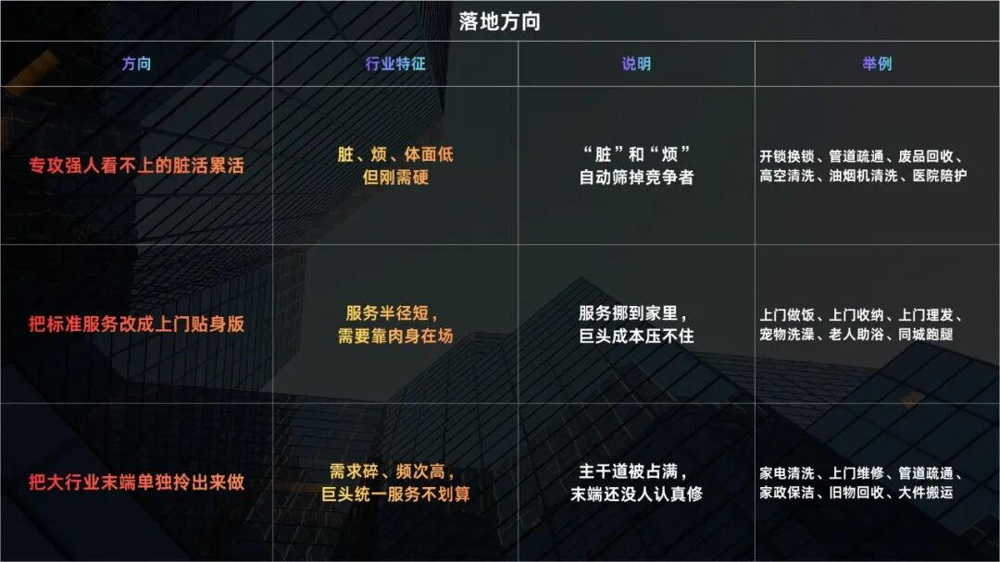
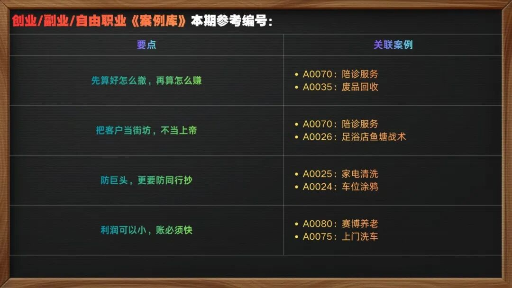
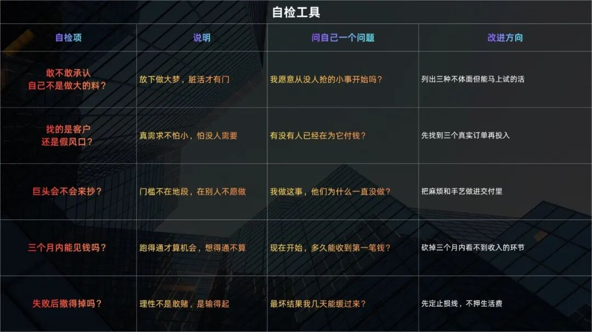

# 反规模化生存：蓝海藏在红海里

### 薛定谔的“蓝海”

所有人都说，要去找蓝海。你也开始找，研究风口趋势赛道，听各种宏大叙事，越找越慌，越觉得自己的渺小和落后，你发现在各种领域里，自己永远是NPC，永远在陪跑。因为大家拿的是同一幅地图，凭什么轮到你呢？或者说，哪有那么多蓝海？

终于，你承认了一个事实：

蓝海不是路牌，它不会写着名字等你，你需要另一条路。

### 新海、旧海

那既然蓝海那么少，普通人是不是只能认命？

你慢慢的开始注意到，你站在强者那张地图上看世界，他们拿着放大镜到处找没人去过的海域，你跟着在他们屁股后头，能看到的当然只能是一片拥挤。

相反的，如果把镜头拉回来再看身边的红海，答案就变了：

或许，普通人的蓝海不是一片海，是红海裂开的一条缝，因为有些领域在宏观上是红海，在微观上是蓝海。

### 去它的“做大做强”

现在，你已经看见机会的缝隙了，但心里总有个声音在说：

做就做大的，要么就别干。

这个声音不是你一个人的判断，是所有人共用的一套创业幻想。

随着时间的推移，你兜兜转转历尽千帆，才终于意识到，我得先想想这个月饭钱从哪来啊，我特么不是没能力，而恰恰是被这种大梦给耽误了，它让我看不上小机会，又够不着大机会，最后卡在中间，越来越焦虑...去它的做大做强，这太不实际了，还不如放下执念，踏踏实实的赚点小钱。这种方式虽然天花板低，很难赚到什么大钱，但启动快、能迅速跑通，是一种非常理性的选择，大梦人人会做，小钱不是人人会赚。

到这一步，你已经把最大的包袱扔了，你的对手不再是那些强者，而是你随时能下场的小事。

### 城市巷战

所以，你想，如果我主动选择“反规模化、反标准化”的非标业务，专门做那些资本巨头、专家大V们看不上、懒得做的脏活累活，和强者形成错位竞争，在夹缝中生存，或许是一条行的通的路。正所谓：

你打你的，我打我的。

就像在城市里打巷战一样，航母再强也开不进胡同，不是它清高，是它进来不划算，一旦进来，整套成本就把自己压垮了。放弃正面战场，让强者没机会摆开阵势跟你决战，你就可以安心的做那种胡同里天天有人进出的生意了。

所以，那些繁华商圈里的各种店铺像走马灯一样换了一茬又一茬，而角落里那些修鞋的、配钥匙的、改衣服的小铺子，却像钉子户一样存在了很多年。

所以，“一人公司”、“灵活就业”、“超级个体”这些概念才会在当下越来越有热度，“小而美”这个词慢慢变成一种对终身事业的向往，而不再是什么“做大做强，再创辉煌”。大家不是不爱钱了，而是早已厌倦了宏大叙事，不再把创业理解为租办公室、招团队、拿融资，大家更愿意去研究一个普通人怎么用技能接单，再用工具处理流程，靠小生意活下来。

所以，医院周边开始出现很多陪诊、代买药、术后上门护理这类服务，做的人都是普通人。大机构治病，小生意治手忙脚乱。不只是有人生病的情况，现在老龄化、双职工、独居和小家庭越来越多，很多过去由家人完成的事，现在需要付费请人做，比如上门做饭、照顾宠物、接送孩子等等。这些需求很个性化，没法像奶茶店一样复制一千家，但只要做得认真，老客户会长期回头。

比如很多小餐馆靠近写字楼，中午忙的冒烟，晚上闲得蛋疼。线上平台抽成又高、还天天搞各种活动压榨你，后来有些老板开始只做周边公司的团餐，放弃全网流量，只做熟客预约，每天固定几家公司订午餐和加班餐，菜单按甲方预算设计，准时送到前台。慢慢的订单稳定了，也不用再跟着平台卷来卷去，不累了。

再比如家装行业，大公司拼命打广告抢新楼盘，而那些大量住了十几年的老房子，墙面开裂、水电老化，很少有人用心做。后来一些包工头和设计师开始只接老房改造，主打“不动结构、不改燃气、不用搬家”，不需要跟整装公司比豪华，只求改的方便，住得舒服，不但有钱赚，转介绍率也特别高。还有一种更垂直细分的项目，那就是之前我们讲过的“房屋适老化改造”，这个也算是个小风口，也是这种逻辑。

再比如自媒体，教人做账号的专家大V到处都是，真正赚到钱的却很少，因为大家都在抢同一批想当博主的人。有人反着来，专门给本地小店拍一些短平快的小视频，把小吃店、修脚店、花店拍得接地气，一条收几百块，他们要的不是粉丝，是附近几条街的人看到视频后进店。这种生意不用什么高深的知识、高端的技法，主打一个接地气，你不用做成大号，你也不用帮别人做成大号，只要在本地有一些稳定客户就忙不过来。

以上这些需求，不性感、没有造富故事，但高频、真实、能收钱。

所以，你作为创业新人，

### “反规模化生存”

最终，你想明白了，这就叫“反规模化生存”：

别人在赌一个十年后的大结局，你在赚一个很快就能验证的小结果。

你终于选对了战场。

理论说完，我们说实操。

这种“反规模化生存”的策略，具体有哪些方向，我们看这张表，行业名称只是举例子，只要满足特征，没提到的行业也可以运用：

还有一份执行要点，可以结合咱们的图文版《案例库》中提到过的一些创业/副业/自由职业的项目攻略来实操，注意以大写A字打头的案例编号：

接下来是一份自检清单，方便对照自身：

### 结语

做强不如做久，

做大不如做巧。

赢的标准

不是谁更大，

而是谁先活下来、

谁更不容易被抢走。

你打你的，我打我的，

小，也是一种赢法。

以上，供参考。

如果恰好，你也坚信：

脑子轻松了，身体就要受累。

欢迎关注我们，每期有惊喜。

【其它硬核内容】：

低成本创业/副业/自由职业《索引手册3.0》

祝暴富。
