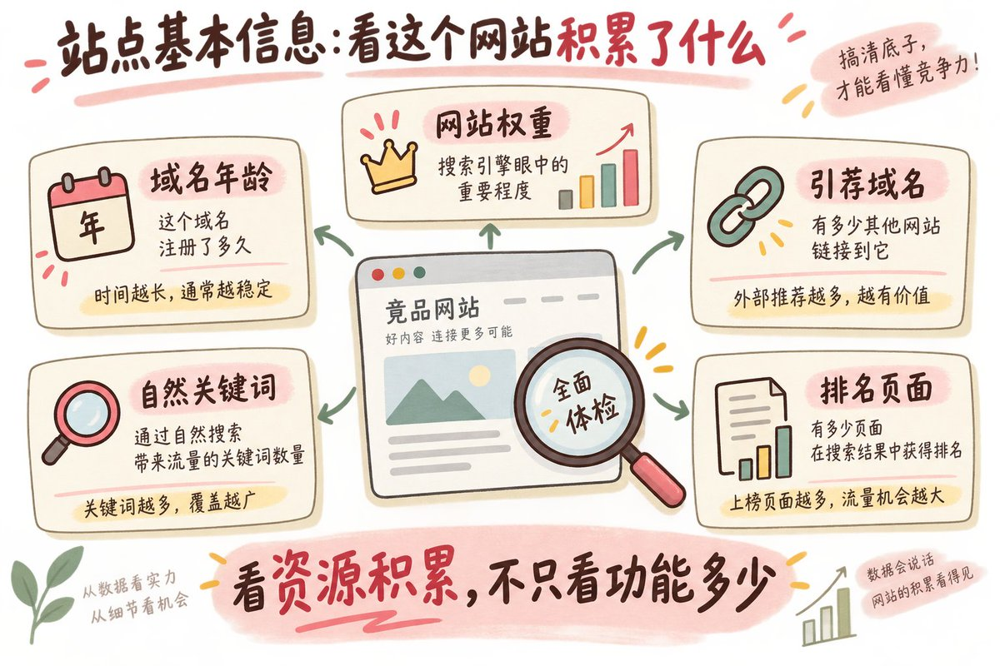
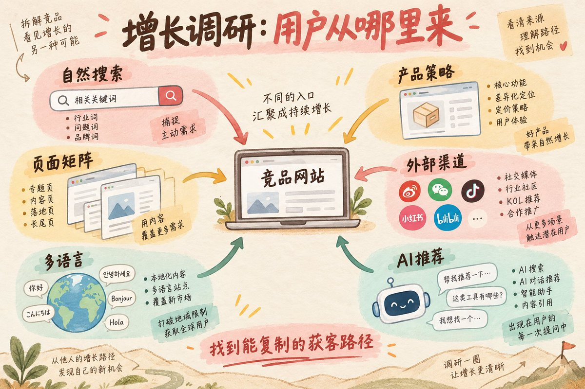
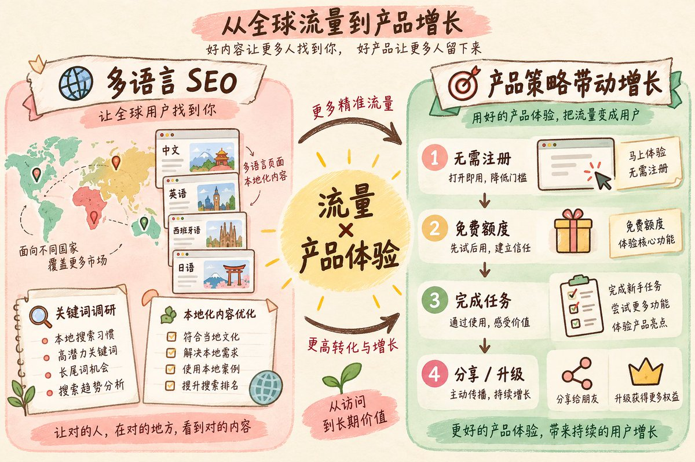
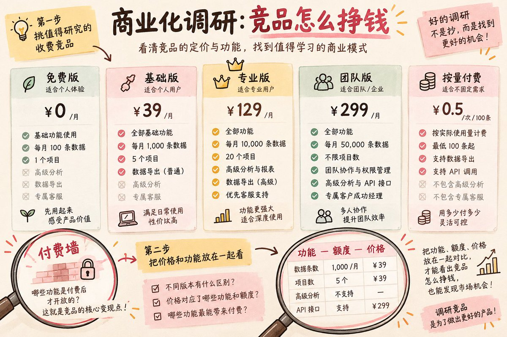
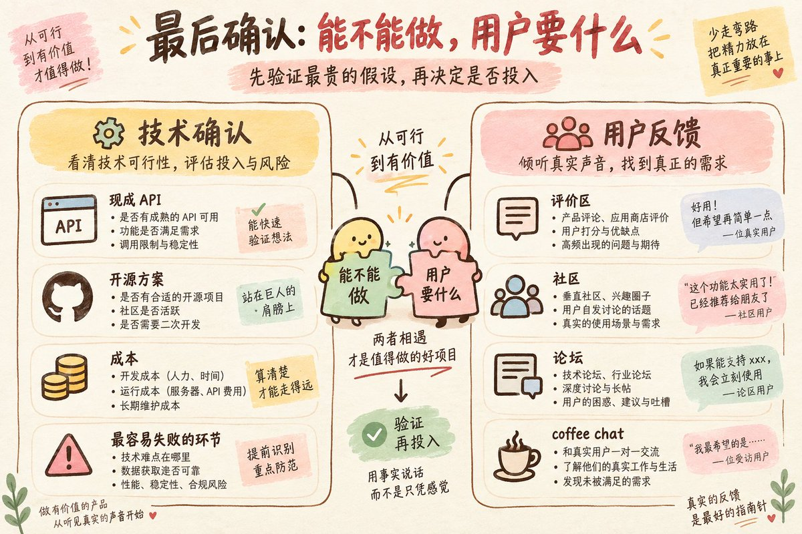
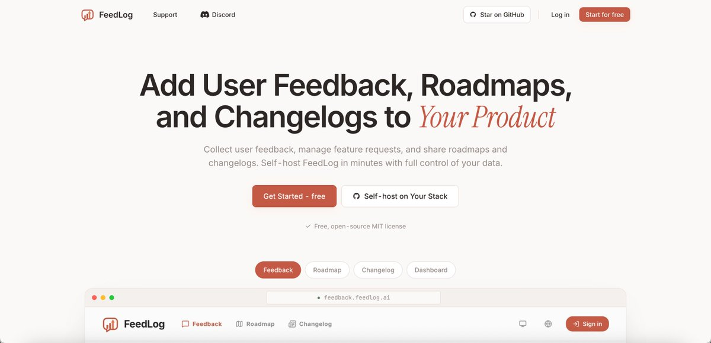
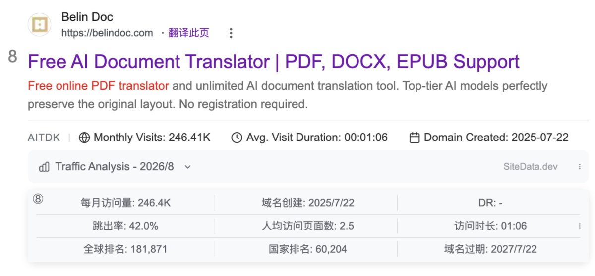
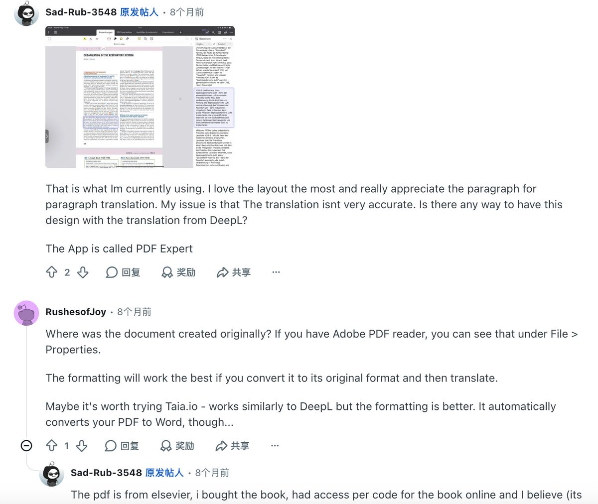
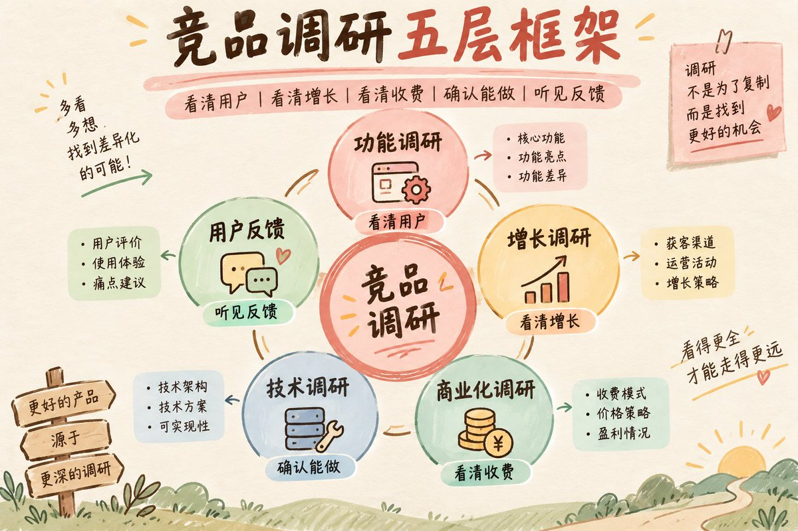

大家好，我是夏林果～

上一篇爆了，被很多人看到！在这里肥肠感谢大家的支持，上一篇主要给大家讲了从一个真实问题出发，如何做需求方向验证，又把需求翻译成了用户会搜索的关键词。

但需求方向刚确定，还不能马上就开干啊，你还得知道市场上已经有什么产品，用户现在怎么解决，竞品从哪里获得用户，又靠什么收费，知己知彼。

这一篇我就把竞品调研的方法讲清楚，帮你判断这个赛道你值不值得进，怎么从竞品中杀出重围，先带你看文章架构：

- 为什么要做竞品调研
- 做竞品调研前，认识这些概念和工具（新手往这儿看）
- 竞品调研全流程分享
- 小白跟练：用 PDF Translator 分析一次
- 复盘：竞品调研到底要得到什么

**这篇如果是想做AI出海产品经理的小白同学！一定也要看起来！我把我毕生所学都写进来了hhh**

## 一、为什么要做竞品调研

## **竞品调研可不是为了抄功能**

很多人说到竞品调研，第一反应不就是抄吗？你小子还挺精！那我还写这篇干啥了hhhh

哎！你想想，人家竞品已经上辣么久了，你花几周把同样的功能做出来，用户为什么非要来你这儿呢？

哎呀，我也不是给你泼冷水，既然竞品已经存在，不一定是坏事呀。有人在做、有人在用、有人愿意付费，至少说明这个需求已经被市场验证了，不代表你就不能做了。

所以你要研究的是：用户为什么用它，用户从哪里进入，从哪出，经过几步才能拿到结果，哪一步让他愿意掏钱，哪些服务流程或者功能环节还没有被打磨好。

所以，竞品调研不是证明别人做过，所以我也能做，而是把别人的服务流程、获客方式和收费逻辑拆出来，再结合自己的能力和资源判断：**这件事换我能不能干？我应该从哪儿开始？**


## 竞品调研的目标和作用

这篇调研结束时，至少要回答四个问题：

- 这个赛道有没有真实产品和真实用户？
- 竞品的基础服务闭环是什么？
- 竞品从哪里获得用户，又怎么把用户变成付费用户？
- 我能不能做出一个基础版本，并且找到一条自己走得通的获客路径？

比如，想做一个 pdf to word 工具，搜这个词时，常见的竞品可能会包括 Smallpdf、iLovePDF、PDF2Go，以及 Adobe Acrobat 的在线工具。

我说实话了，这些产品经营时间长、功能成熟、品牌也已经被用户熟识，而且它们的核心流程都很完整，价格和功能也没有明显空档，用户反馈里也没有反复出现的关键抱怨，那这个方向就不太适合新手作为第一个产品，因为你干不过他们hhh

这不是说它绝对不能做，而是你要知道：**你面对的不是一个简单的功能，而是一批已经积累了品牌、SEO 和产品资源的成熟对手。** 如果你没有非常明确的用户群、场景或服务切入口，单纯做一个“我也能把 PDF 转成 Word”的产品，进入成本会比较高，除非你能做出过人之处了

反过来，如果你发现搜索结果里有不少小站，或者用户反复抱怨格式错乱、文件隐私、批量处理和某个具体场景，而现有竞品没有接住，才值得继续往下研究。

## 二、做竞品调研前，认识这些概念和工具（新手往这儿看）

如果你本身在做出海了，往下滑，这部分你不用看，新手这部分一定要看，纯扫盲来的


## 站点基本信息：看这个网站积累了什么

这些词主要在增长调研和 SEO 判断里出现，用来判断一个网站大概经营了多久、积累了多少资源：

- **域名年龄：** 这个域名从注册到现在大概多久了。时间越长，通常意味着积累时间越长，但不等于排名一定好。
- **DA（Domain Authority）：** Moz 的权重指标，用来预测一个域名在搜索结果里获得排名的能力，通常是 1 到 100 分；
- **DR（Domain Rating）：** Ahrefs 的权重指标，主要看一个网站反向链接配置的强弱，也是 0 到 100 分；你提到的“D2”，如果指的是 Ahrefs 的指标，通常写作 DR；
- **AS（Authority Score）：** Semrush 的权重指标，会综合看反向链接质量、估算自然流量和疑似垃圾链接等信号。
- **引荐域名：** 有多少个不同的网站链接到它，可以粗看外部链接的积累。一个网站上有 100 个链接，不一定等于 100 个引荐域名。
- **自然关键词：** 网站没有直接购买广告，而是通过页面内容在 Google 上获得排名的词。
- **自然流量：** 用户通过搜索结果进入网站的流量。
- **Organic Keywords：** 一个网站在 Google 前 100 名里出现过的关键词数量，但数量多不等于质量高，还要继续看它有多少词进入前十。
- **排名页面：** 哪些具体页面带来了搜索流量，而不只是看它的首页。
- **Keyword Ranking：** 某个页面在某个关键词上的排名。看竞品时，不要只看“有多少关键词”，还要看它真正排在前几名的是什么词。
- **Backlink：** 反向链接，其他网站指向这个网站的一条链接。一个网站可以拥有很多 Backlink，但它们可能都来自同一个站。


## 功能调研：看用户怎么完成任务

这些词主要在你实际体验竞品时出现：

- **服务闭环：** 用户从进入产品，到完成任务、拿到结果的完整过程。比如 PDF 翻译就是上传、处理、预览、下载。
- **Aha Moment：** 用户第一次真正感受到产品价值的那个瞬间。比如上传 PDF 后，几秒钟就看到排版基本不变的翻译结果，这一刻可能就是 PDF Translator 的 Aha Moment。
- **免费额度：** 免费用户可以使用多少次、多少页或多少容量。
- **MVP：** 最小可用版本。不是把产品做得很粗糙，而是先保留完成核心任务所必须的功能。

## 增长和SEO调研：用户从哪里来

- **流量来源：** 用户从搜索、直接访问、社媒、推荐还是广告来到网站。
- **自然搜索：** 不直接购买广告，而是依靠搜索排名获得访问。
- **SERP：** Search Engine Results Page，也就是你在 Google 里搜索一个词后看到的结果页。工具给出的 KD 只是参考，真正要看的还是 SERP 前十是谁。
- **Search Intent：** 用户搜索一个词时真正想做什么。是了解问题、比较产品，还是马上使用工具，决定了你应该做什么页面。
- **内容入口：** 博客、教程、模板页、免费工具页等吸引用户进入网站的页面。
- **外链：** 其他网站指向你的网站的链接。
- **长尾词：** 更具体、更接近某个场景的搜索词。单个词的搜索量可能不大，但用户目的通常更清楚，竞争也可能更小。
- **广告投放：** 通过 Google、Meta 等平台直接购买流量。

## 商业化调研：用户在哪一步付钱

- **付费墙：** 用户在哪一步开始必须升级或付费，才能继续使用某个功能或额度。
- **Freemium：** 基础功能免费，高级功能或更高额度收费。
- **订阅制：** 按月或按年持续收费。
- **按量付费：** 按处理次数、文件页数、使用额度等收费。
- **一次性买断：** 用户付一次钱，获得某个版本或某段时间的使用权。
- **Trial：** 试用期或试用额度，用来让用户在付款前体验产品。
- **CTA：** Call To Action，页面上推动用户完成下一步的按钮或文案，比如 Upload、Try Free、Start Now。
- **Conversion：** 用户完成了你希望他完成的动作，比如上传文件、注册、订阅或付款。
- **Conversion Rate：** 转化率。比如 100 个访问者里有 5 个人注册，注册转化率就是 5%。

## 工具先列入门款，这里不展开

工具不用一开始全部购买，也不用现在就学会。早期先知道这些工具大概用来做什么，真正调研时再查：

- **Google Trends：** 看一个词的长期趋势、季节性和不同国家的热度；
- **Similarweb：** 粗看流量来源、国家和渠道构成；
- **AITDK：** 快速查看域名年龄、估算流量、自然关键词、引荐域名和基础 SEO 信息；
- **[SiteData.dev](https://x.com/momo_peggy/status/SiteData.dev)：** 查看流量来源、搜索与社媒占比、引荐域名、域名注册时间和一些 SEO 数据；
- **Ahrefs 或 Semrush：** 看自然关键词、排名页面和引荐域名；
- **Wayback Machine：** 看产品过去的首页、定价页和定位变化；
- **Google Ads Transparency Center、Meta Ad Library：** 看竞品是否长期投广告；
- **Reddit、导航站和评价站：** 看用户讨论、产品评价和真实原话。

预算有限的话，先会用 Google Trends、Similarweb、Wayback Machine 和 Reddit 就够了；Ahrefs、Semrush 这类工具，等你真的需要查关键词和外链时再上手。这一篇只介绍小白早期比较容易上手的工具，不在这里展开具体操作。大家如果有更好用、更适合新手的工具，也可以放到评论区补充。

**这个工具系列，下一篇我会展开写写怎么去用！！**

## 三、竞品调研全流程分享

咳咳，从这里开始，就是本文章含金量最高的部分了！


## 第一部分：功能调研，看竞品如何服务用户

**第一步：先筛出目标竞品**

拿上一篇你确认好的核心关键词，直接放进谷歌里搜，快速看前三页的产品。

把和需求无关和长期不更新的结果删掉，把前三页产品都尽量体验一次，留下约5个真正解决问题的产品。不要只看站点的名字，要点进网站真实体验：它是不是在服务同一类用户，用户能不能在里面完成同一个核心任务。

这5个产品就是功能调研的目标竞品。后面所有功能体验，都以这批产品为主就行了

**第二步：作为用户体验产品**

别只看竞品首页上写了多少功能，要像一个第一次来的普通用户一样去体验。就以你作为正常人的体感，看下面五维度：

- **页面结构和上手难度：** UI是否设计合理，是否简洁好看，核心按钮是否容易找到，第一次来的用户能不能马上明白这是做什么的，以及下一步该做什么
- **功能体验和质量：** 上传、输入、处理、预览、下载是否顺畅，等待时有没有提示，失败时有没有解决办法，最后的速度、准确度、格式保留和稳定性怎么样
- **流程效率和闭环：** 不同竞品完成同一个任务分别要几步，哪个更简便；它是把用户的问题完整解决了，还是只完成一个小环节，后面还得用户自己找别的工具
- **注册和付费节点：** 哪一步要求登录、注册、验证或付费，免费额度和付费墙出现得是否自然，会不会在用户还没感受到价值前就被卡住
- **值得学习和做得不好的地方：** 值得学习的可能是页面清楚、流程短、结果交付明确、错误提示及时；做得不好的可能是等待时间太长、格式混乱、免费额度太紧，或者一个简单动作要来回跳转很多页面

这样对比之后，你看到的就不只是它有什么功能，而是它让用户完成任务的成本有多高。你也会渐渐的明确出来哪些功能是核心，哪些是你的机会点，哪些是可以再观察迭代的。

**第三步：整理功能清单，再判断优先级**

先把这5个竞品的功能 list 整理出来，把它们放在一起对比，再把功能分成四层：

- **MVP版本必须有：** 不做就无法完成核心任务的功能
- **后续再做：** 有价值，但不影响第一版完成主任务
- **差异点：** 你准备重点做得更好的一个或两个环节
- **技术风险：** 成本高、难度高、需要先验证的功能

以我做过的PDF Translator这个词为例吧，第一版先保证上传、选择语言、翻译、预览和下载能跑通；批量处理、术语表、复杂 OCR、文档对话，可以先放到后续或技术风险区。

但不要因为某个竞品少了一个功能，就马上认定这就是你的机会。你要找的机会点应该是用户确实在意，但竞品做得不够好的地方，或者多个产品都没有把某个关键环节接起来。先判断它是不是影响核心结果，再决定要不要把它做成自己的差异点。

**容易犯的错，是把功能数量当成产品能力。** 功能再多，如果用户从上传文件到拿到结果的流程很长，仍然不能算服务做得好。你需要做的是让用户又快又好的拿到大结果（哈哈哈哈哈哈）

## **第二部分：增长调研，竞品的用户到底从哪来的**

增长调研要回答的是：**竞品的用户从哪里来，哪些动作真正带来了增长，这条路径我有没有机会复制。**

上来啊，我建议你先选好调研的样本，这儿为啥我不建议你直接参考刚才功能调研的产品呢？因为很有可能你看的产品基本都是老站点，不是说老站点不能学，是人家的成功太早了，你还真未必能学起来。

夏林果建议啊，横向挑和自己域名年龄、资源积累差不多的新站或小站，重点看近一两年起来的产品，然后纵向再选一两个老站，用 Wayback Machine 看它早期怎么冷启动、最近又在做什么。域名年龄、权重、引荐域名、页面数量和流量，可以先用 AITDK 或 [SiteData.dev](https://x.com/momo_peggy/status/SiteData.dev) 快速看一遍。



**第一步：看 SEO 关键词怎么起量**

用 Ahrefs 或 Semrush 查看自然关键词、排名页面和估算流量，重点回答三个问题：

- 哪些关键词已经带来流量，是核心词、场景词还是长尾词？
- 哪些词进入前十，哪些只是排在前五十甚至前一百？
- 这些词分别对应工具页、产品页、场景页还是博客？

还要打开排名靠前的页面，看它的页面内容 SEO 怎么做：先看 TDK，也就是 Title、Description 和页面关键词；再看 Hero 区怎么用一句话说明产品、功能和价值。继续看有没有 How to use、Features、Benefits、FAQ、案例、使用场景和 CTA，正文是在解决用户问题，还是只是在堆关键词。

页面的展示方式也要看：有没有 FAQ、HowTo、Product 或 Video 等结构化数据；有没有视频演示、截图、交互效果和动效，帮助用户更快理解产品。展示做得好，不只是让页面好看，也能降低理解成本，提高用户继续使用的概率。

不要看它有多少关键词，要找出真正带来访问的词，以及这些词背后的搜索需求。以及这个竞品是靠一个大词起量，还是靠大量具体长尾词慢慢堆起来的。这都代表了不同的打法，知道不！！

**第二步：拆它的页面矩阵**

把竞品所有重要页面按类型列出来：核心工具页、功能页、语言组合页、场景页、模板页、比较页、帮助页和博客。再看每类页面的数量、URL 结构、上线时间、收录情况和各自带来的流量。

竞品的增长可能不是靠首页，而是靠几十个场景页或几百篇长尾文章。你要看清楚它是怎么把不同搜索词分配给不同页面的，哪些页面负责获客，哪些页面负责把用户引回工具。页面上线时间可以通过 Wayback、工具里的首次发现时间和页面历史变化交叉判断，不要把估算日期当成精确事实。

博客和整体页面结构也要单独看，比如博客文章是否在回答长尾问题，是否把用户引回产品页；除了首页和博客，它有没有工具页、模板页、案例页、帮助中心、比较页或免费资源页。页面越多不代表 SEO 越好，但这些页面能让你看出它是怎么把不同搜索需求分配到不同页面上的。

**第三步：看多语言 SEO 怎么做**

看它服务哪些国家和语言，以及这些语言是简单翻译首页，还是有独立的语言页、场景页和内容页。重点看：

- 不同国家的主要关键词是否真的做了本地化，而不是逐字翻译；
- 语言版本是否有独立 URL、TDK、内部链接和内容；
- 哪些语言页面拿到了流量，哪些只是铺出来但没有起量。

多语言不是页面翻译得越多越好。要把语言数量和实际流量、转化、维护成本放在一起看，判断它是在服务真实市场，还是只是在批量铺页。再看哪些国家和语言贡献了主要访问。这个数据不能只停留在国家排名，还要回到前两步：这些国家的用户搜的是什么词，主要进入哪些页面，页面有没有对应的语言版本和内容。最后看最近几个月的流量是在增长、稳定还是下滑，确认这个需求有没有明显的季节性。



**第四步：看产品策略有没有带动增长**

产品本身也是获客渠道。看它是不是无需注册、免费使用、免费额度大、结果可下载，或者提供模板、批量处理和分享功能。

要进一步判断：用户是不是因为“马上能用、不要钱、没有注册门槛”才进入；免费功能是否足够让用户感受到价值；产品有没有用文件大小、次数、页数、速度或高级功能来控制成本；完成任务后有没有自然地引导注册、分享或升级。

这里的重点不是判断“免费好不好”，而是看**免费策略有没有真正带来流量和转化**。如果竞品的主要卖点就是免费，那你不能只复制免费，还要算清楚自己的成本和后续收费入口。

**第五步：拆外部渠道和持续导流来源**

把外部流量拆成几类看：外链、推荐、社媒、导航站、榜单、媒体、合作伙伴和广告。用 Ahrefs、Semrush、[SiteData.dev](https://x.com/momo_peggy/status/SiteData.dev) 或 AITDK 看引荐域名、推荐来源、链接增长频率和流量占比，再点进去确认它是怎么被提到的。

如果**社媒流量**比较高，就分别去看它在哪些平台经营：YouTube 是做教程、测评还是产品演示；Reddit 是参与讨论、回答问题还是发布产品；X 和 LinkedIn 是个人账号在更新，还是产品官方账号在运营。把它发过的内容、更新频率、互动情况和用户最常问的问题记下来。

如果**推荐流量**比较高，就点开主要来源的网站，看它是怎么被提到的：是被导航站收录、被博客评测、被媒体报道，还是和其他产品做了合作。这里可以和外链分析结合起来，因为推荐链接很多时候也是外链的一部分。广告流量则要看广告文案、投放关键词和落地页，搞清楚它花钱买的是什么用户。

**第六步：看GEO，AI 会不会提到它**

GEO 可以理解成面向 AI 搜索和回答的品牌曝光。你要实际问 ChatGPT、Perplexity、Gemini 等工具几类问题：直接搜品牌词、搜核心功能词、搜“推荐一个工具”、搜具体场景。

记录 AI 推荐的是品牌名、工具页、内容页、场景页还是博客；它引用的是官网、第三方评测、媒体还是社区讨论。还要看竞品是否有清晰的产品定位、FAQ、使用说明、结构化内容和大量可被引用的场景页。

这一项不要把一次回答当成排名结论。它更像一个持续观察：**用户问相关问题时，AI 有没有机会认识你、理解你、提到你。** 如果完全没有提及，先检查品牌实体、核心页面和外部提及是否足够清楚。

**最后：判断哪些增长动作能复制**

六个维度看完，必须落到自己的判断：这条流量来源，你做不做得了？需要什么成本？多久可能见效？你能不能连续做三个月？

这里有些增长动作，我直接给你了，是新手可以直接做的：

- **SEO 基本可以做：** 核心关键词可以向竞品靠拢，页面标题、内容结构、场景页、长尾文章和内部链接，都可以按用户需求重新做一套；
- **多语言要挑市场做：** 不要一开始翻译几十种语言，先选已经有搜索和访问信号的国家，做好一两个语言版本；
- **产品策略可以借鉴：** 可以先做无需注册、有限额度的免费体验，但上线前先把单次成本和付费入口算清楚；
- **免费外链可以先做：** 导航站、产品目录、个人博客、社区资料页和社媒主页，先把能提交的免费渠道提交起来；
- **有预算再做付费外链：** 可以考虑基础导航站、客座博客或相关媒体合作，但不要一上来大量采购；
- **官方社媒主页应该建立：** YouTube、Reddit、X、LinkedIn 等平台，能建产品主页就先建起来。它们既是运营阵地，也能作为品牌入口和外链来源；
- **投放要看资源：** 竞品靠广告起量，但你烧不起钱，就不要把投放当作第一获客路径。

## 第三部分：商业化调研，它到底怎么挣钱

商业化调研要回答的是：**竞品把什么东西卖给什么用户，又在哪一个节点让用户付钱。** 这一部分不必把所有竞品都研究一遍，优先挑 3 到 5 个已经明确收费、价格体系比较完整、和你目标用户相近的产品。当然了，你也可以等有用户之后再考虑商业化，这个部分不急的。

但是你调研的结果不能只是竞品 A 收 9.9 美刀，竞品 B 收 19 美刀。你最后要根据这些信息，写出自己的第一版定价，例如收什么模式、免费给多少、第一档卖什么、为什么这样定。


**第一步：先挑值得研究的收费竞品**

优先选择已经有免费版、订阅、按量付费或完整价格页的产品。它们不一定是功能最强的，但要能让你看清楚“功能—额度—价格”的关系。

**第二步：把价格和功能放在一起看**

先记录免费版、基础版、专业版、团队版或按量付费的价格，再把每一档开放的功能和额度记下来。重点找付费墙：用户在哪一步开始被要求升级？是文件大小限制、处理次数限制、导出限制、速度限制，还是某个高级功能限制？

注意奥，最好把每个竞品的价格统一成同一个单位来比较：比如每月多少钱、每处理 100 页多少钱、每个文件多少钱。否则一个按月收费，一个按页收费，要不直接比较价格也没啥意义。

这里提醒你注意几个问题：

- **它按什么收费：** 功能、额度、页数、文件大小、速度、质量，还是团队协作？
- **它向谁收费：** 偶尔使用的普通用户、高频使用的专业用户，还是团队和 API 用户？
- **它什么时候收费：** 用户刚进来就收费，还是先让用户完成一次任务，看到结果后再收费？
- **免费版和付费版差在哪里：** 免费版是让用户体验价值，还是已经能满足大多数需求？付费版有没有一个足够明确的升级理由？

**第三步：亲自体验到付费墙**

不要只截图价格页，最好亲自走一遍升级路径：注册、上传文件、完成一次任务，看到结果，再继续操作，直到系统要求你升级。记录付费墙出现在哪一步，以及它限制的到底是什么。价格页写的内容，和真实付款流程不一定完全一样。有些产品会按地区、活动或用户类型显示不同价格，也有些产品把真正的限制藏在使用过程中。

这一轮体验完，你应该能得到一个结论：用户是因为用不够了才付费，还是因为需要更好的结果才付费。前者适合按额度、次数或页数收费，后者适合把更高质量、更快速度、更完整功能放进付费版。

**第四步：用三个标准定出自己的第一版价格**

**第一，看成本。** 先估算一个付费用户每月会产生多少 API、存储、支付手续费和其他服务成本。价格不能长期低于单个用户带来的实际成本，不然用户越多，亏得越快。如果成本还算不清楚，先不要承诺无限使用，优先采用按量收费或设置明确额度。

**第二，看价值。** 用户付费买的不是“几个按钮”，而是节省时间、得到更好的结果，或者完成原本自己很难完成的任务。你的定价要围绕用户真正想要的结果，而不是围绕你写了多少功能。

**第三，看市场。** 把 3 到 5 个竞品统一单位后的价格放在一起，看大概的低位、中位和高位。新产品第一版没有品牌和信任积累，通常先从竞品中低位切入更容易获得第一次付费；如果你的成本更高，就不能盲目跟着低价，而要减少额度、改成按量收费，或者把更高价值的结果做成高价档。

实际落地时，小白可以先用一个简单版本：**一个有限额的免费版，加一个足够完成核心任务的付费版。** 免费版让用户先感受到价值，但不要无限免费；付费版只放一个清晰的升级理由，不要一开始设计五六档复杂套餐。

像是PDF Translator这个需求的话，如果成本主要随着页数增加，就可以先按页数或额度收费；如果用户是经常翻译论文、合同或资料，再考虑月度订阅。先选一个最符合使用频率和成本结构的方式，不要强行做订阅奥。



**第五步：上线后用真实行为调整价格**

这次定价只是第一版假设，还要迭代的。上线后重点看三个数据：有多少用户完成第一次核心任务，有多少用户碰到付费墙，有多少用户最终付款。

举个例子，如果很多人完成任务，却没人愿意点付费，可能是付费价值不够清楚、价格太高，或者付费墙出现得太早；如果很多人碰到付费墙但没有付款，要继续看他们是嫌贵、额度不够，还是结果质量没有达到预期；如果用户很快用完额度，说明额度可能太小，也可能说明按量收费更适合。

话又说回来了，不要因为一个人说太贵就立马降价，也不要因为一个人付费就认为价格正确。至少积累一批真实用户的使用和付款行为，再调整价格、额度和付费节点。



## 第四部分：技术调研，只确认产品能不能落地

这一部分我不想展开成开发教程。因为我自己更偏产品、运营和增长，不是靠写代码吃饭，所以技术调研对我来说只服务一个目的：**确认这个产品不是停留在想法里，而是能用现成技术和合适的人做出来。**

**第一步：确认核心功能有没有现成方案**

小白先确认三件事：核心功能有没有现成 API、开源项目、无代码工具或 AI 辅助方案；每完成一次核心任务，大概会产生多少接口、存储和第三方服务成本；哪个功能最容易卡住，是否值得先做一个小实验，或者找开发者单独确认。

比如 PDF Translator，不需要一开始研究竞品用了什么具体框架。你只需要先确认：文字型 PDF 能不能稳定提取和翻译，复杂排版会不会严重变形，文件处理成本能不能接受，用户上传的文件如何保存和删除。

**第二步：把最容易失败的地方单独验证**

如果核心功能涉及复杂 OCR、大文件处理、实时协作或高额接口成本，就不要只靠搜索资料判断。直接找一个懂这块的人做一次短咨询，或者先做一个最小技术实验。

能把这些问题回答到“可以继续验证”的程度，就够进入下一步了。

**第三步：用工具补足自己的技术理解**

不做开发的人，可以先看竞品的帮助文档、API 文档、开发者博客、开源项目和社区讨论。看不懂的地方，让 AI 把技术方案翻译成产品语言。但 AI 只能帮你理解选项，不能替你决定产品方向，也不能把它的猜测当成竞品事实。

如果想继续补这方面的认知，不建议一上来去看纯代码教程。可以看一些独立产品、SaaS 和产品验证的内容，重点学习别人怎么做判断：

- Pieter Levels：看他如何用简单技术快速做出产品、上线并验证市场，可以从 [Bootstrapped Startup 方法总结](https://levels.io/how-to-build-bootstrapped-startup-without-funding) 开始；
- Indie Hackers：看独立开发者如何在写代码前验证需求，可以参考 [不写代码验证 Micro-SaaS 想法的案例](https://www.indiehackers.com/post/how-i-validated-a-micro-saas-idea-in-48-hours-without-writing-a-single-line-of-code-2dce1c062b)；
- MicroConf：看 SaaS 产品验证、定价和早期经营，可以参考 [Validate Your SaaS Idea FAST](https://microconf.com/on-air-episodes/validate-your-saas-idea-fast)；
- Arvid Kahl：重点看他如何描述用户问题、验证假设和安排产品优先级，不要只看收入故事。

这些内容不是为了教你写代码，而是让你知道：在技术投入之前，先把最贵、最容易失败的假设验证掉。

## 第五部分：用户反馈调研，用户真正关心什么

用户反馈调研不用一开始展开成复杂的访谈项目，先去用户真实出现的地方找原话。

去哪些渠道找

- **评价和产品社区：** Product Hunt 评论区、G2、Capterra、Chrome Web Store、App Store 等，看用户夸什么、骂什么、为什么给低分；
- **社媒和论坛：** Reddit、X、LinkedIn、YouTube 评论区，以及目标用户所在的专业论坛和社群；
- **搜索替代方案：** 搜竞品名加 review、alternative、problem、vs，也可以在 Reddit 里直接搜产品名和核心问题；
- **竞品自己的反馈入口：** 帮助中心、Feature Request、Changelog、评论区和公开 Roadmap，看看用户提交过什么需求。

如果能通过 X、LinkedIn、Reddit 等社媒找到真实用户，尽量约一次 coffee chat。不要问“如果我做一个这样的工具，你会不会用”，而是问他上一次什么时候遇到这个问题、当时怎么解决、花了多少时间和钱、为什么没有继续用原来的办法。

反馈当然可以用 Feedlog 这类工具集中收集，现在有widget智能客服的能力了，可以承接用户的疑问和需求，后续把需求、Roadmap 和 Changelog 管起来，让用户知道哪些反馈已经被处理。



feedlog.ai

## 四、小白跟练：用 PDF Translator 分析一次

上一篇我们已经用 PDF Translator 这个方向走过了需求和关键词研究。现在按照上面的流程，我带你看看竞品调研咋做吧。（我不会拆的特别精细，要不这文章实在写不完了）

## **第一部分：功能调研**

**第一步：先锁定 5 个竞品**

先用 pdf translator 或 translate pdf 搜索 Google 前两三页。这里有一个小细节：热门词的首页往往会混进很多 Sponsored 或“广告”结果，尤其是大词，赞助商结果可能占掉很大一块位置。

这些结果是花钱买来的广告位，不能直接当成自然排名。先把赞助商结果隐藏或排除，再看自然搜索结果里的产品：哪些排名靠前，哪些产品重复出现，哪些是真的在解决 PDF 翻译这个问题。

这一轮先锁定 5 个功能竞品：**iLovePDF、[PDFTranslator.org](https://x.com/momo_peggy/status/PDFTranslator.org)、Online Doc Translator、Smallpdf、DeepL**。后面如果你实际搜索后发现某个产品并不相关，再替换成 PDF Simply、Soda PDF 等更匹配的结果。

**第二步：把 5 个产品的核心体验一遍**

每个竞品都至少实际走一遍上传、选择语言、翻译、预览和下载，不要只看首页的功能宣传。重点记录：

- 页面结构和上手难度：第一次来的用户能不能马上明白怎么开始；
- 功能和结果质量：翻译速度、准确度、排版保留、预览效果和下载结果怎么样；
- 流程效率：从上传到拿到结果需要几步，哪个产品更简单，哪里需要反复跳转；
- 服务是否闭环：它能不能把用户从上传文件一直服务到拿到可用结果，还是只解决了其中一小步；
- 注册和付费节点：什么时候要求登录、注册或付款，免费额度和付费墙卡在哪里。

把明显做得好的地方和明显不好的地方一起记下来。比如流程短、提示清楚、结果交付顺畅，是值得学习的地方；等待时间长、格式错乱、限制不透明，则可能是体验问题。

**第三步：把功能 list 梳理出来，再判断优先级**

体验完 5 个竞品后，不要只写“这个好、那个不好”，而是把它们出现过的功能全部列出来，再判断哪些功能是第一版必须做的，哪些可以晚点做，哪些可能成为自己的机会点，哪些需要先验证技术。

下面这张表就是 PDF Translator 第一轮应该整理出的功能清单。实际调研时，把你看到的产品、截图和问题记在自己的调研笔记里：

```
| 功能项              | 优先级     | 判断标准                 |
| ---------------- | ------- | -------------------- |
| 上传 PDF、识别文件格式和大小 | MVP 必须有 | 用户无法上传，就无法开始核心任务     |
| 选择原文和目标语言        | MVP 必须有 | 翻译前必须让用户明确处理方向       |
| 提取 PDF 文字并完成翻译   | MVP 必须有 | 这是产品最核心的结果           |
| 基本排版保留和结果预览      | MVP 必须有 | 用户需要先确认结果是否可用        |
| 下载翻译后的文件         | MVP 必须有 | 没有可交付文件，服务就没有闭环      |
| 注册、免费额度和付费限制     | MVP 必须有 | 关系到产品能不能实际运营和收费      |
| 扫描件 OCR          | 后续再做    | 技术复杂度和处理成本更高，先确认需求比例 |
| 批量翻译、大文件处理       | 后续再做    | 高频用户可能需要，但不一定是第一版必需  |
| 术语表、翻译记忆和自定义规则   | 差异点候选   | 如果目标用户是专业用户，可能成为付费理由 |
| 双栏对比、人工修改或二次编辑   | 差异点候选   | 看竞品是否普遍做得不好，用户是否真的在意 |
| 复杂表格、双栏论文和特殊排版还原 | 技术风险    | 先做小实验，不要一开始就承诺全部支持   |
| 文档对话、总结和问答       | 后续再做    | 属于扩展能力，先保证翻译结果可用     |
```

以 PDF Translator 为例，第一版先保证上传、选择语言、翻译、预览和下载能跑通。扫描件 OCR、复杂表格、术语表、文档对话和批量处理，不要一开始全部塞进去。

“差异点”也不能简单理解为竞品没有的功能。先确认这个缺口是否影响用户拿到结果，是否在多个竞品和用户讨论里反复出现，再决定它是不是值得做成自己的机会点。

## **第二部分：增长调研**

这一次我们换一个产品来看：**BelinDoc**



BelinDoc 是一个 AI 文档翻译工具，除了 PDF、Word、PPT、Excel，也已经扩展到漫画、视频、CAD 等翻译场景。

目前月访问量约 **24.6 万**。2026 年 3 月前后，它的月访问量还只有约 9 万，之后最高接近 29 万，半年左右出现了一轮很明显的增长。流量里 **51.1% 来自自然搜索，37.4% 来自 Direct**，几乎没有付费投放；中国是第一大市场，占 20.6%，其次是印度、美国、巴西和俄罗斯。

这个案例很适合拿来研究 SEO 增长哎，因为它不是靠某一次广告投放突然冲起来的，而是持续寻找新的翻译需求，再给每个需求做对应的页面和产品入口。

**第一步：SEO 关键词怎么起量**

BelinDoc 目前超过一半的流量来自自然搜索，Search Paid 为 0，基本可以判断它主要是在靠自然排名拿搜索用户。这里的关键词研究，看的不是某一个页面的文案，而是**整个站有哪些自然关键词、哪些页面在拿排名、哪些页面正在贡献流量**。

它没有只做 Document Translator 这种大词，而是把“文档翻译”拆成了大量更具体的语言组合页面，例如 English to Japanese、Japanese to English、Korean to English、Chinese to English 等。这类词单独看，可能没有大词的搜索量，但搜索意图更明确、页面也更容易精准承接。大量语言组合叠加起来，就形成了一批稳定的搜索入口。结合它 51.1% 的自然搜索流量来看，**SEO 是 BelinDoc 目前最核心的增长渠道。**

**第二步：页面矩阵怎么铺**

BelinDoc 的页面扩展，不只是把同一个产品翻译成不同语言，而是在不断寻找新的翻译需求。

除了文档翻译，它已经做出了漫画翻译、Webtoon 翻译、视频翻译、EPUB 翻译、CAD 工程图翻译等独立产品页。这个动作的增长价值很直接：做一个 CAD Translator，就多了一批搜索 DWG 翻译、DXF 翻译 的用户；做一个 Webtoon Translator，就能承接漫画和网漫相关的翻译需求。真的方向做得很妙～！

所以它扩展产品的意义，不只是功能变多，而是**每新增一个明确的翻译场景，就新增了一组可以被搜索到的产品入口**。这一步要用页面级数据继续确认：哪些新页面已经开始拿到排名，哪些只是刚上线还没有流量。

**第三步：多语言 SEO 怎么做**

BelinDoc 的多语言增长，不只是把首页翻译成不同语言，而是直接做不同语言组合的独立入口。它的第一大市场是中国，占 20.6%；印度、美国、巴西和俄罗斯也有比较明显的流量。

翻译工具本身就是全球需求，所以它没有把增长押在单一英语市场上，而是让同一个产品去覆盖不同国家、不同语言组合的搜索需求。这里要继续看每个语言页面有没有独立 URL、TDK、正文、内部链接和真实流量，不能只看它支持多少语言。

它给我们的启发是：多语言 SEO 不一定要先做一个很大的本地化网站，也可以先从有明确搜索需求的语言组合开始，逐个做成可以直接使用的产品入口。

**第四步：产品策略有没有带动增长**

BelinDoc 首页直接强调 **免费、不用登录、可以直接翻译**，用户从搜索结果进入后，就能上传文件开始处理。

这和它 51.1% 的搜索流量是匹配的。很多人搜索“PDF 怎么翻译”“文档怎么翻译”，只是临时有一个文件要处理。如果进站之后还要注册、验证邮箱、绑卡，很容易直接离开。BelinDoc 的做法是：**先让搜索进来的用户把事情做完，再考虑后面的付费和留存。**

对小白来说，这里要看的是产品策略有没有帮助它承接搜索流量，而不是简单得出“免费一定好”。免费策略必须和成本、额度、后续付费入口放在一起判断。同时还要看流量趋势：它从 2026 年 3 月前后的约 9 万，半年左右增长到最高接近 29 万，说明这套“搜索入口 + 免费体验”的路径确实有增长信号。

**第五步：外部渠道和持续导流**

BelinDoc 的流量里，37.4% 来自 Direct，几乎没有付费投放，Search Paid 为 0。这里的 Direct 不等于社媒，也不等于推荐流量，它通常包括用户直接输入网址、收藏夹、已经熟悉品牌后再次访问等情况。所以这个案例不能简单总结成“它靠外部渠道增长”。目前更明确的判断是：**它主要依靠自然搜索获取新用户，Direct 则说明有一部分用户已经记住了品牌，或者会重复访问。**

如果继续往下查，就要用 AITDK、[SiteData.dev](https://x.com/momo_peggy/status/SiteData.dev) 或 Ahrefs 看引荐域名和外链增长，再确认 Direct 背后有没有品牌传播、社媒分享或推荐访问。不能因为 Direct 占比高，就直接说它做了某种社媒打法。

**第六步：GEO：AI 会不会提到它**

这一轮提供的分析数据里，暂时没有 GEO 的验证结果，所以这里不强行给 BelinDoc 添加一个没有证据的结论。后续可以实际问 ChatGPT、Perplexity 或 Gemini：best document translator、AI tool for translating CAD drawings、how to translate a Korean webtoon 等问题，记录 AI 推荐的是 BelinDoc 的品牌、某个产品页，还是第三方内容。

综合这六个维度，BelinDoc 最值得研究的不是某个具体关键词，而是**不断拆分新的翻译需求，然后给每个需求做一个能被搜到、进来就能直接使用的产品入口**。

文档翻译太大，就拆成不同语言；PDF 翻译还不够，就继续拆漫画、Webtoon、CAD、EPUB、视频；产品页覆盖不完，再用 Blog 去接更细的问题。数据也在支持这条路线：**51.1% 的流量来自自然搜索、几乎没有付费投放，同时月访问量从 2026 年 3 月前后的约 9 万，一度增长到接近 29 万。**

## **第三部分：商业化调研**

这一轮直接把 5 个产品的公开方案拆开看。这里先不替 PDF Translator 定价，只看它们怎样把“免费体验”切成“付费额度”。

```
| 产品                                                            | 免费版                                                   | 付费版/价格                                                                                                                   | 功能与额度                                                              | 付费触发点                                             |
| ------------------------------------------------------------- | ----------------------------------------------------- | ------------------------------------------------------------------------------------------------------------------------ | ------------------------------------------------------------------ | ------------------------------------------------- |
| [PDFTranslator.org](https://pdftranslator.org/)               | 无需注册；每月免费 600 页；单文件最大 20MB；最多 3 个并行任务                 | 公开页面目前没有展示付费套餐                                                                                                           | PDF 翻译、100+ 语言、OCR、长 PDF、格式保留；另有 PDF 拆分、合并、压缩等工具                   | 目前不是用公开付费墙转化，而是先用免费额度获客；后续最自然的付费点是页数、文件大小、并发和 OCR |
| [iLovePDF](https://www.ilovepdf.com/pricing)                  | 可使用核心工具，但文件处理次数和部分工具有限；AI 工具受限                        | Premium：$5/月，按年计费 $60；包含无限文档处理、Web/移动端/桌面端、去广告、优先支持和 2,000 AI Credits                                                    | PDF 翻译、压缩、转换、合并、编辑、签名、工作流；Premium 解除处理次数和批量限制                      | 用户频繁处理文件、需要 AI 翻译/总结、批量处理，或不想看广告时升级               |
| [Smallpdf](https://smallpdf.com/pricing)                      | 30+ 工具，但下载次数、移动端和 AI 工具受限；AI 工具文件上限 50MB，文档字数约 25–35K | Pro：官方价格页按月/年切换；提供 7 天试用；解锁无限工具、下载、OCR、AI 和移动端                                                                           | Translate PDF、Chat with PDF、OCR、压缩、转换、编辑、签名等；Pro 的 AI 文档字数上限为 100K | 免费下载次数用完、需要 OCR/AI/批量处理，或需要解除每日任务限制时升级            |
| [Online Doc Translator](https://www.onlinedoctranslator.com/) | 免费、无需注册；支持 109 种语言；上传文件后直接翻译并尽量保留原排版                  | 官网没有公开订阅或套餐价格                                                                                                            | 支持 PDF、Word、Excel、PPT 等文档，底层使用 Google Translate；公开页面没有展示明确页数/额度套餐  | 它更像免费流量入口，公开页面没有明显付费墙；商业化价值需要从广告、合作或其他产品入口继续研究    |
| [DeepL](https://www.deepl.com/en/pro?cta=character-limit)     | 每月 1 个文件；单文件最大 5MB；每月 50,000 字符；1 个术语表、最多 5 个术语条目     | Individual：$8.74/月，按年计费；每月 3 个文件、300,000 字符、30MB；Team：$28.74/用户/月，每月 20 个文件、1,000,000 字符；Business：$57.49/用户/月，每月 100 个文件 | 高质量文本和文档翻译、术语表、批量翻译、团队管理；付费版支持更大的 PDF 和更多文件                        | 用户需要翻译第 2 个以上文件、超过免费字符数/文件大小，或需要批量、术语表和团队功能时升级    |
```

这张表里最值得注意的不是价格高低，而是三种完全不同的收费思路：[PDFTranslator.org](https://x.com/momo_peggy/status/PDFTranslator.org) 和 Online Doc Translator 先用免费体验抢用户；iLovePDF 和 Smallpdf 把大量 PDF 工具打包成订阅；DeepL 则直接围绕翻译质量、文件次数、字符数和团队能力收费。

如果未来商业化，最容易接上的不是一上来做复杂订阅，而是先给 600 页免费额度，再卖一次性页数包，或者把 OCR、大文件、批量任务和更高并发放进付费版。这个结论来自它现在已经展示出来的额度结构，不是凭空设计一套价格。

## **第四部分：技术调研**

这一部分至少按三个层次确认：

- **先拆核心链路：** 文件上传、文字提取或 OCR、翻译、排版重建、预览和下载，每一环分别有没有现成 API、开源项目或成熟服务可接；
- **再找最容易失败的地方：** 文字型 PDF、扫描件、双栏论文、表格和大文件分别测试一次，记录准确度、排版、速度、失败率和单次成本；
- **最后确认运营风险：** 文件保存多久、什么时候删除，第三方接口是否会留存内容，成本是否会随着页数快速上升，用户失败后有没有重试或人工兜底方案。

看不懂的地方先问 AI、查 API 文档和开发者文章。AI 可以帮你把技术方案翻译成产品语言，但不能替你决定产品方向。遇到 OCR、大文件、高成本等风险，就做一个最小技术实验，或找开发者做一次针对性确认，不需要一开始研究完整技术栈。

## **第五部分：用户反馈调研**

这次找到的竞品的真实反馈，基本都指向同一个问题：**翻译质量和版式保留很难同时做好。**

在 Reddit 的一条讨论 里，用户说 DeepL 的翻译很准确，但整份 PDF 翻译后排版变乱，所以不愿意购买；在 另一条讨论 里，用户提到表格错位、项目符号间距变化、图片漂移、部分内容没有被翻译，而且最终仍然需要人工清理。



这说明用户真正愿意付费解决的，不是“再多支持几种语言”，而是**拿到一个不用重新排版、可以直接交付的文件**。对文档翻译这类需求来说，复杂表格、扫描件和多栏 PDF 的质量，才是最值得继续验证的机会点。

## **第六部分：如果现在就做，怎么落地**

如果是我现在做 PDF Translator，不会一开始和 iLovePDF、Smallpdf 拼功能数量，而是先围绕“把 PDF 翻译好，并尽量保留原排版”做一个能跑通的版本。

- **功能：** 先做上传、语言选择、文字型 PDF 翻译、基本排版保留、预览和下载；OCR、批量处理、术语表和复杂文档对话放到后面。
- **MVP：** 先支持最常见的文字型 PDF，限制文件大小和页数，把速度、准确度和排版效果测清楚，再决定要不要扩展扫描件和复杂表格。
- **增长：** 上线后先做三件事：提交核心工具页和场景页收录；围绕 pdf translator 及论文、手册、教材等场景做内容；同步提交免费导航站，建立 X、Reddit、YouTube 等产品主页。
- **商业化：** 先保留有限免费额度，再按页数或额度收费；等真实用户出现后，再根据 API 成本和使用频率决定做月订阅，还是继续卖一次性额度包。

这就是调研后的第一版结论：**先把核心结果做稳，再用 SEO 获取搜索用户，最后根据真实使用量设计收费。**

## 五、复盘：竞品调研到底要得到什么

我总结下，先看竞品怎么把用户的问题解决掉，再看它怎么获得用户、怎么收费；然后确认这个产品能不能用现成技术做出来，最后回到真实用户那里，看看哪些地方还没有被接住。

我们复盘下这五个部分吧：

- 功能调研：用户怎样拿到结果，哪些功能不能砍；
- 增长调研：竞品从哪里获得用户，哪些渠道自己能做；
- 商业化调研：用户为什么付费，第一版应该怎么收费；
- 技术调研：这个想法能不能先做出来，哪里最容易卡住；
- 用户反馈：用户真正抱怨什么，哪些问题值得继续做。


最后，你应该能把结论压缩成一句话：**我准备给谁做什么，先做哪些功能，不做哪些功能，准备从哪里获客，先靠什么方式收费。** 如果这句话还说不清楚，就说明竞品调研还没有完成；如果已经说得清楚，就不要再无限调研，进入下一步验证。

下一篇其实本来应该写怎么根据这些调研结果，做出一个最小可用的 MVP 版本，并找到第一批真实用户。

但我觉得稳扎稳打一些，下一篇会出一个**出海小白必备的出海工具包和使用方法**，先教大家使用工具，然后再继续这个系列哈～！