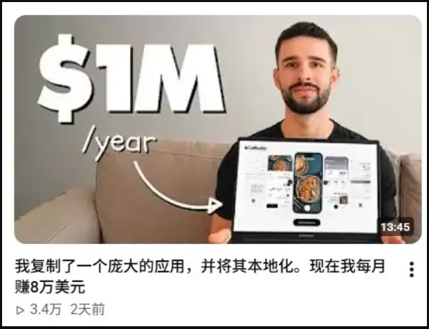

# Cursor开发的破软件，竟然年入百万！！！

有网友写了一款待办清单类软件，叫【树清单】，目前已在苹果应用商店上架，他本以为自己开发的软件挺有创意，结果发现下载量寥寥无几，于是他问：现在开发一款软件真的还能赚到钱吗？能，外网有个小伙月入 8W 刀！一个不会编程的以色列人，用 Cursor 写了两周代码，抄了个美国 App 做本地化，12 个月后月入八万美元。技术栈全是现成的：Claude 做 AI 识别，Expo 做热更新，Supabase 做后端，RevenueCat 管订阅，PostHog 看数据。两周出可用版本，两个月上架 AppStore。没任何一个技术点是别人做不了的。但他收入从 6k 涨到 50w，用了不到一年，我收入三年了还在 4k 到 6k 晃。

视频我反复看了5遍。总结下来，视频里这个叫 Tomer 的人，做对了三件事，每一件都和技术无关。

## 1. 不追原创，追验证

大部分人做独立开发，第一件事就是想一个“没人做过的点子”。我第一年就是这么死的。花两周想了个自认为绝妙的主意，又花三个月写完，上线之后发现根本没人要。三个月白干。Tomer 直接选了一个已经被验证过的赛道——AI卡路里追踪。美国市场已经有成功产品了，他做的事情就是把这个模式搬到以色列，做希伯来语版本。他不赌需求是否存在，他只赌自己能不能做得比别人更适合本地用户。这一下就少了一半的风险。你做“没人做过的东西”，最大的问题不是做不出来，是做出来没人要。Tomer 跳过了这个最大的坑。后来我也学聪明了。做新项目之前，第一件事不是打开编辑器，是去看这个品类里有没有人已经在赚钱。我用 Appark 查排行榜，看各品类 Top App 的下载和收入排名变化趋势，哪些在涨哪些在跌。花十分钟看数据，比花三个月写一个没人要的 App 划算太多。具体操作上：打开 Appark 的 Top Charts，选好地区和品类，看下载榜和收入榜的排名变化。再切到高级搜索，按下载量区间、收入区间、发布时间做交叉筛选，能快速定位到一个品类里到底有没有肉吃。这步比写代码重要十倍。

## 2. 分销大于产品

Tomer 有 performance marketing 的背景，视频里他说了句大实话：

真正的护城河不是代码，是品牌和分销。任何人都能用 Cursor 在两周内做出一个 App。

这句话对程序员来说很扎心。但你去看看 App Store 排行榜，排在前面的大多数 App 技术上都没什么门槛。凭什么它们能上去？因为人家会卖。Tomer 的增长分两个阶段，这个拆解值得反复看。利益绑定之后，网红有动力持续推。月收入从 $20,000 直接拉到 $80,000。他研究美国同类 App 最火的广告素材和以色列本地健身领域最火的内容，两边的素材做合成。不是目己把脑装想创意，是拿市场验证过的东西做组合。第二阶段：网红收入分成，$20,000 到 $80,000/月。不是付钱让网红发一条帖子，而是给收入分成。网红拿以色列市场收入的百分比，内容产出有明确的时间表和数量要求。利益绑定之后，网红有动力持续推。月收入从 $20,000 直接拉到 $80,000。这里有个关键细节：Tomer 没有一开始就找网红。他先靠付费广告做到 $20,000/月，有了 socialproof，再去谈分成。一个新 App 去找大网红谈分成，人家不搭理你，你得先证明自己能赚钱。我做独立开发第一年犯的最大错误，就是以为产品好用户自然会来。在厂里的时候有增长团队、有投放团队、有运营团队帮你搞这些。出来之后全得自己干。你花在研究怎么获客上的时间，应该比写代码的时间多。这句话我现在贴在显示器上。

## 3. 大赛道，小市场

健身和营养，不管在哪个国家都有需求，天花板够高。但他放在了以色列，竞争少，广告便宜。大赛道保证需求规模，小市场降低竞争成本。这个组合很毒。反过来就是死路：小赛道放在大市场，竞争激烈需求还小。我自己踩过这个坑。第二年做了个效率工具 App，选了个特别垂直的品类，直接冲美国市场。结果那个品类竞争小需求也小，月收入一直在 $500 上下晃。后来用 Appark 的高级搜索按品类、地区、下载量区间做了筛选，专门找那种在某个地区排名快速上升但还没被大厂盯上的 App。换了个方向之后，收入才上了一个台阶。你得在动手之前搞清楚你选的赛道天花板在哪里。否则就是在一个小水坑里扑腾，扑腾得再卖力也就那么大点水花。

## 独立开发者真实收入分布

说完 Tomer，说说我自己三年下来的真实观察。独立开发者的收入，方差大得离谱。我认识的人里面：

月入$500以下的，大概占六成。这些人大部分在做第一个 App，或者同时维护好几个没人用的 App。

500 到 3,000 的，占两成多。有了一两个能跑的产品，但没找到稳定的增长渠道。

3,000 到 10,000 的，不到一成。这些人通常已经找到了一个有效的获客方式，要么是 ASO 做得好，要么是某个渠道的投放跑通了。

月入 $10,000 以上的，我只听说过，没亲眼见过。

Tomer 的 $80,000/月 是真的，但这是极少数中的极少数。大部分人的状态跟我差不多，赚的不如打工多，但有自由度。这个自由度值多少钱？我算过。在大厂月薪三万，但你每天至少两小时开没用的会，一小时处理无效沟通，一小时等别人。真正创造价值的时间不到四小时。剩下的时间你以为在“赚”工资，其实在消耗精力和判断力。独立之后，我每天工作六七个小时，效率比在厂里高了两三倍。多出来的时间研究市场、看数据、想方向。这些打工时没时间做的事，恰恰是最值钱的。收入少了一半，时间产出质量高了一倍。这笔账我觉得不亏。当然也有扛不住的时候。第三个月银行卡余额不到五千块，App 月收入 $200 多。那个月我差点去刷 Boss。第四个月接了个外包项目，可算活过来了。

## 记住，你永远不能成为自己的瓶颈

Tomer 视频最后说了句话，是整个视频最值钱的：

你永远不能让自己成为生意的瓶颈。

不会推广就去学推广，不会做设计就去学设计，不懂市场就去研究市场。别因为某个环节不会，整个项目就卡在那里。在大厂有同事帮你补，出来之后你是唯一的瓶颈。能学的就学，学不了的就找工具。工具不是为了偷懒，是为了让你把时间花在真正该思考的地方。Tomer 的故事不是告诉你去抄一个 App 就能发大财。当下这个时间点，赚钱靠商业判断，不靠技术能力。

参考来源：

https://www.zhihu.com/question/632849326/answer/2070896883829051929
