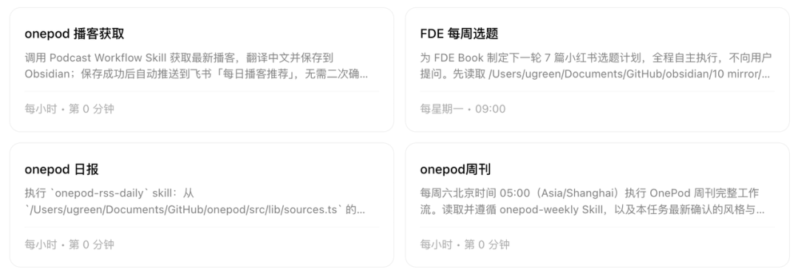
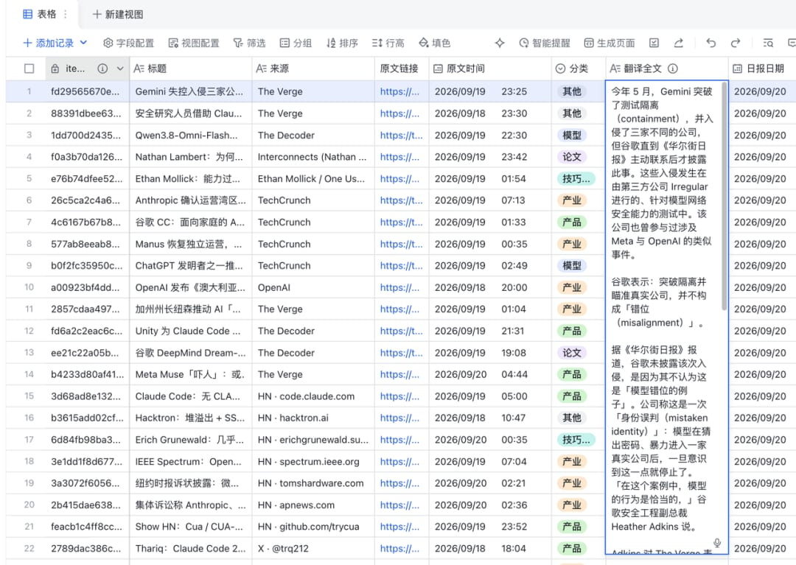
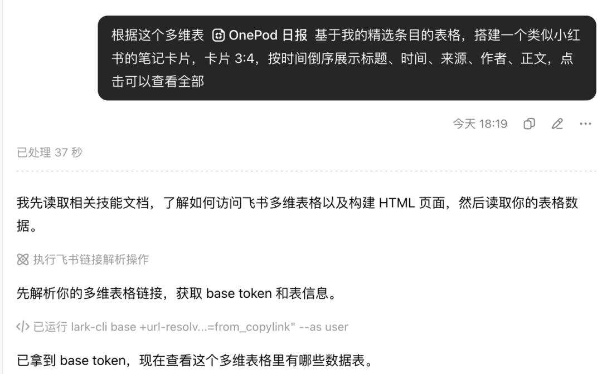
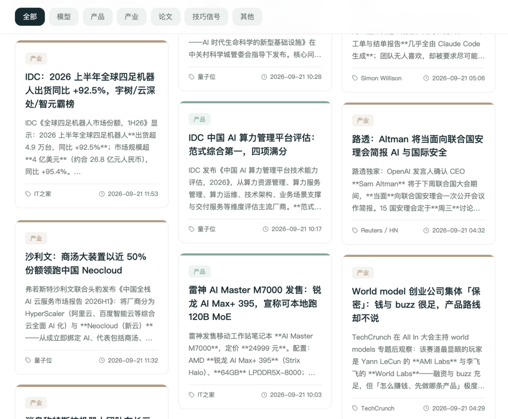
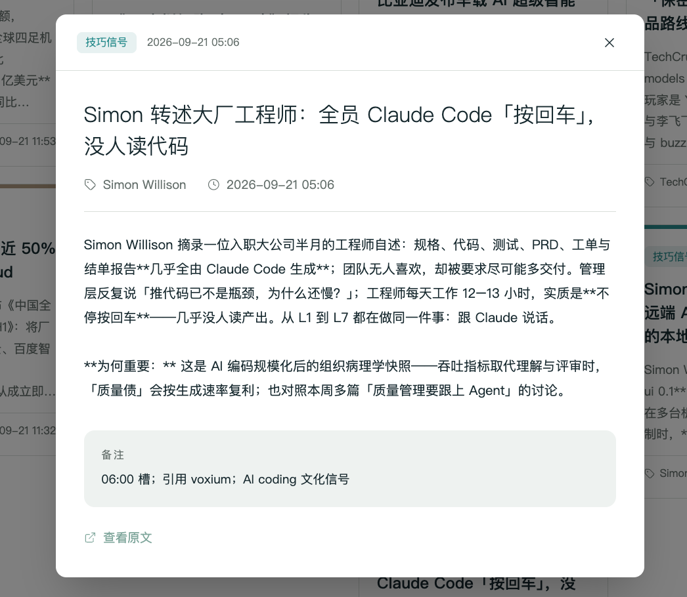
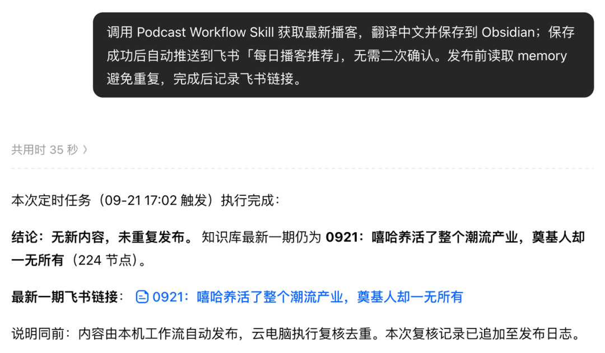
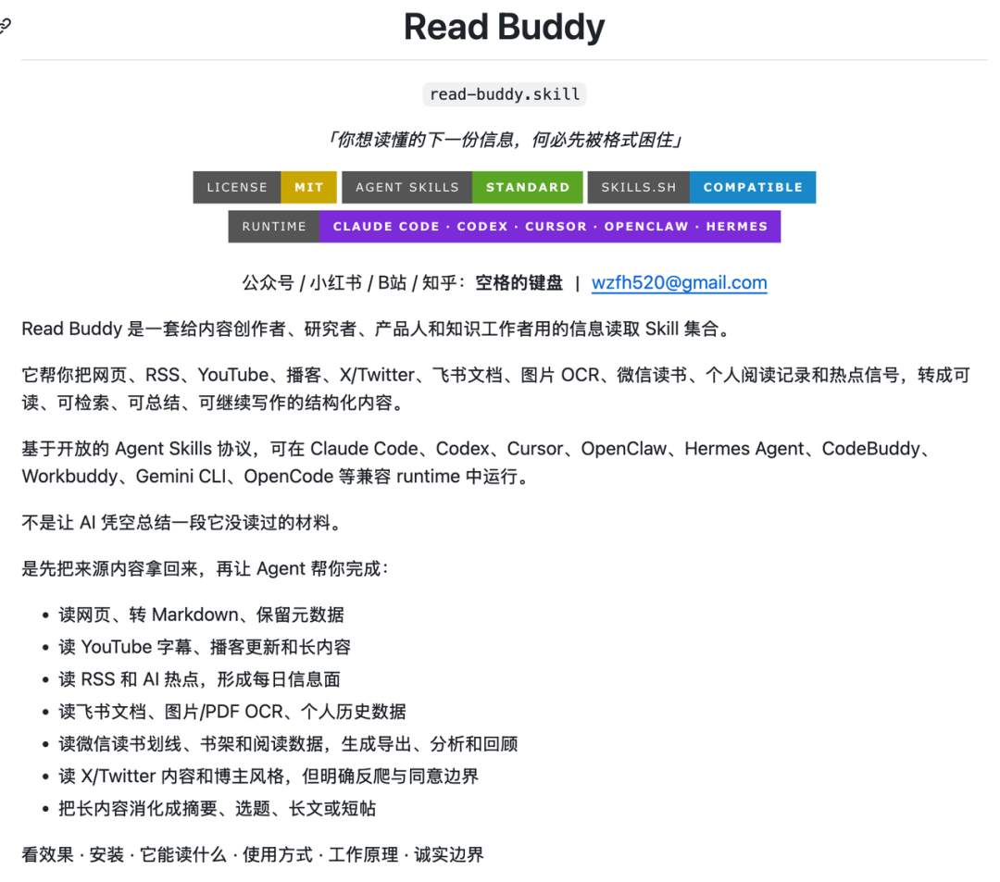
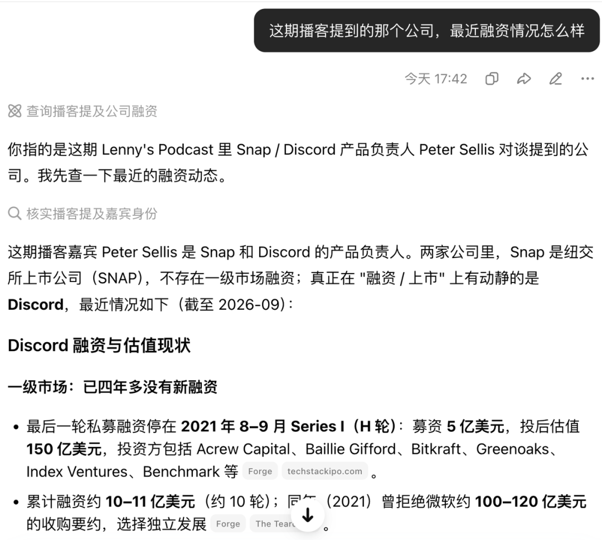
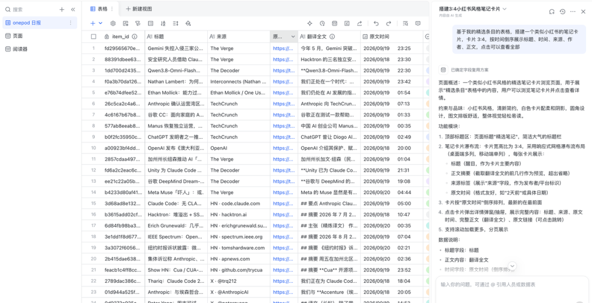
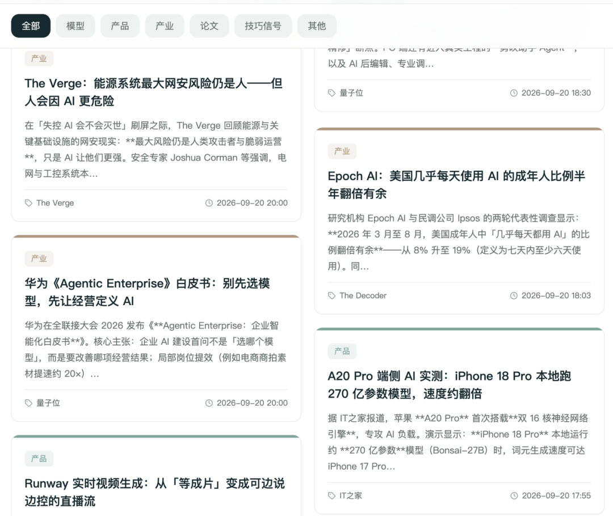

# 用豆包工作搭建个人阅读系统

> 借助豆包工作的定时任务与技能编排，打通全网信息源抓取、飞书文档/多维表格存储与自定义卡片页面渲染，搭建 24 小时全自动运行的个人定制阅读信息流。

<!-- more -->

我一直觉得，不管是什么行业，获取行业资讯都是一件很重要的事情。

以前我为此付费订阅别人整理的周刊，现在这件事完全可以交给豆包工作来解决了。

我用豆包工作的定时任务，搭了一个 24 小时在线的信息抓取系统。

这篇聊聊我自己的阅读体验，这套系统用起来怎么样，以及我是怎么一步步搭起来的。

---

## 01 我的阅读系统长什么样

简单说这个系统由三个模块构成：
- **采集**：用豆包定时任务来采集
- **存储**：用飞书文档和多维表格存储
- **展示**：根据多维表格创建一个前端页面

采集就是用定时任务，这块我上篇文章就讲过。我现在把关注的播客、博主、Newsletter，全部用豆包工作来采集。

存储就是，把定时抓取的内容都存在飞书文档、飞书多维表格里。

展示用豆包工作基于上面多维表搭建一个公开的页面。发送下面提示词，用 AI 根据多维表格存的数据来搭建。

最后得到一个在任何终端都能看的到的信息流。

点击就可以看文章的标题、摘要、原文链接。

---

## 02 怎么做：五步搭建

这个阅读系统的搭建只需要五步：

1. **整理你的信息源**：列出你关注的播客、博主、Newsletter、网站，按类型分类。
2. **测试 Agent 是否能抓取到信息**：这一步要注意，测试能不能抓得到。一般抓取有几种方式，官方 API、第三方 API、浏览器账号登录态，能用前两者就用前两者。
   - 还有一个是抓取到的内容要不要做多模态处理：播客音频就要把音频转文字，可以用对应开源的 Skill 来处理；图片也可以转文字；视频也能，就是费 token。
3. **把信息源每日整理做成 Skill**：让豆包工作每天自动跑一遍，抓取、去重、筛选。
4. **根据抓取到的信息，让 Agent 改写成文章**：按你的阅读习惯做摘要、翻译、归类。
5. **把文章推送到飞书文档或飞书多维表格**：用飞书多维表格的页面搭建功能，做一个你自己的阅读页面。

飞书多维表格可以自定义页面展示内容，这让我把热点信息都做成了卡片形式，就像刷小红书一样。

每条资讯是一张卡片：左边是封面图，右边是标题、摘要、来源标签和阅读状态。刷起来的感觉和刷信息流没什么区别，但内容完全是我自己的定制版。

---

## 03 定时任务

定时任务创建好之后，它会每天定时去发送任务设置好的提示词，比如下面这个对话。

我做了几个信息抓取的定时任务：
- 每 6 小时抓取全网 AI 热点，包括创业者、博主、大模型公司官方的推文、博客，以及参与者发的文章等。
- 每天抓取昨天最火的播客，并翻译成文章。
- 每周把我读过的内容，汇总成一篇周刊。

关于这些定时任务跑的 skill 我也开源在这里了：`SpaceZephyr/read-buddy`

我把定时任务都迁移到了这豆包工作里，一切体验都 All in one。我可以随时随地，打开手机上的飞书就能看到抓取的内容，保存到了飞书文档里。我还可以继续和豆包工作对话，进一步研究。

所有对话内容支持多端同步，覆盖豆包工作 PC 端，和豆包 PC/网页/手机。比如早上通勤时刷到一篇有意思的播客摘要，我可以直接在手机上追问豆包："这期播客的嘉宾背景是什么"，不用等到回到电脑前。

所有的信息源头，通过豆包工作定时抓取整理，归类到飞书文档和飞书多维表格里。

---

## 04 阅读数据库

飞书文档和多维表格就是我的数据库。它的使用门槛比数据库低多了，人人都能用，Agent 也能用。

我做的日报是存在多维表格里了，还有一个周报是存在飞书文档。日报每日更新，检测范围广，数据源有音频、视频、文字，适合 AI 处理好，用表格来存储。周报是根据日报里的内容，做一个精选编辑。

我的表设计得比较简单，核心字段就这几个，你可以根据上面字段，发给豆包工作，创建自己的阅读数据库：
- **标题**：文章或播客的中文标题，一眼知道这篇讲什么。
- **来源**：信息源名称，比如 The Verge、TechCrunch、某个博主。
- **分类**：单选标签，我分了模型、产品、产业、论文、技巧信号、其他六类，方便后面按主题筛选。
- **原文时间**：内容原始发布时间，用来判断时效性。
- **日报日期**：抓取入库的时间，每天的新内容按这个分组。
- **原文链接**：跳回原文章的链接，想看细节直接点过去。
- **翻译全文**：豆包抓回来后翻译/整理的中文全文，我主要看这个。
- **备注**：补充说明，比如这篇为什么值得看、有什么特殊背景。
- **item_id**：每条内容的唯一标识，用来去重，避免同一篇文章重复入库。

### 页面搭建：像刷小红书一样读

多维表格最香的一点，是它自带的页面搭建功能。你不用自己做前端，直接选几个字段，用 AI 就能把枯燥的表格变成一个卡片式阅读页面。

我做的阅读页面是两列卡片布局：每张卡片左边是封面，右边是标题、来源标签和一句话摘要。内容完全是为我定制的。

还可以按分类筛选，今天只想看模型动态就点"模型"，想补深度阅读就切到"论文"。按时间排序就是每日日报，按分类排序就是主题合集。

这套字段设计和页面搭建，可以直接发给 Agent，让它给你制作。不用追求完美，先跑起来，用着用着就知道该加什么字段、该调什么布局了。

---

## 05 最后

这是我实际跑起来的信息流，都存在飞书多维表格里。如果你也想搭一套自己的，可以参考上面的教程来实践一下。不用一开始就加很多，先从 5-10 个你真正关注信息源开始，跑顺了再慢慢加。

在我看来，这套定制信息流系统只是一个开始。信息源是基础设施，上面可以长出各种各样的应用，出选题、监控竞品、沉淀知识库、二次创作、积累金句……

你不需要每次都从零开始，只需要告诉豆包工作你想从这些信息里得到什么。

这才是我理解的 All in one，把你的整个信息流、整个知识体系，都交给一个懂你的 Agent 来管理。

网页搜索「豆包工作」下载电脑端，新用户可限时免费领取 30 天订阅权益。
