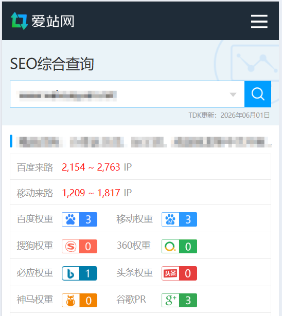

# 10年的网站，被我卖掉了

我有好几个网站，不止C语言中文网；不过它们都没有什么流量，加起来也干不过C语言中文网。前段时间有个买家过来询价，我觉得合适，就卖了一个，4W 块钱，不多，就当赚点零花钱吧。

下面是网站的权重，或者预估流量：

这是第三方网站的统计，不准，只能作为一个参考，实际流量在 500UV 左右。按照第三方网站的统计，卖便宜了，价格应该超过 10W。按照实际流量来算，卖得超级贵，相当于 80 块钱一个 UV；一般的网站，能卖到 20 块钱一个 UV 就非常牛批了。之前也有很多买家报价，一般是 1~2W，现在能卖到 4W，我也挺开心，所以就果断出手了。

高光时刻在 2019 年，大概有 3000UV，市场价格在 7W 左右。

这个域名我已经注册了十多年了，从大学就开始运营了，只是没有拿到什么结果，后来干脆把它当做了一个实验平台。AI + 自媒体的时代早就来了，网站已经没有什么想象空间了，我也不会去运营它了，趁着现在还能变现，赶紧换点口粮吧。当梦想错过了风口，可能永远都是一张大饼。

## 多说几句

卖网站也是一门好生意，很多搞 SEO 的屌丝靠这个逆袭。越是早期，网站流量就越是好做，只要你能解决内容，权重就很容易起来。搬运、采集、伪原创、撕书，各种有底线无底线的骚操作，都被站长们拿来搞米了。一个网站的流量可能不多，但是一百个、一千个呢？积土成山，只要网站数量足够多，整体的流量就非常可观。一个 UV 大概能卖 10~20 块钱，搞定 100W 流量就财务自由了。现在叫矩阵，以前叫站群。不需要人脉，不需要资本，也不需要情商，只要你有点技术，再加上赚米的决心，就一定能拿到结果。互联网特别适合穷人，它能让你和富人站在同一起跑线上；在新的技术和打法面前，财富使不上劲，谁先适应，谁先晋级。有钱不如有技术，是互联网时代的真实写照。我身边运营网站的朋友，基本都是穷人出身，经过 10 年的战斗，他们大部分都跨越了阶级，最起码也算个中产了。我比较执拗，喜欢搞原创，喜欢慢慢来，所以现在混的比较惨，在站长圈里算是垫底的了。当你踩上风口了，一定要赶紧起量，赶紧变现，千万不要犹豫；等风口过了，大部分人都会被筛掉（包括你），只留下几个巨头分享市场蛋糕。
