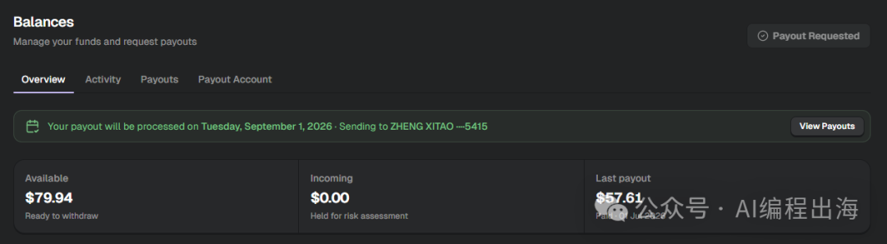
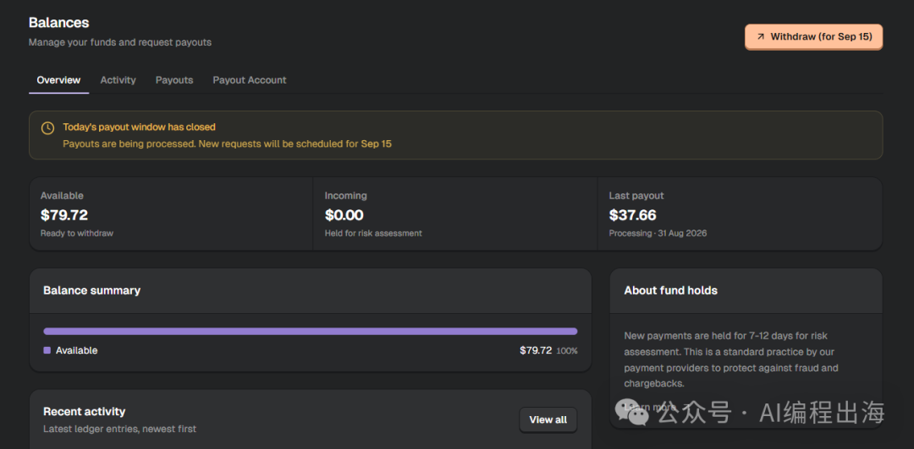
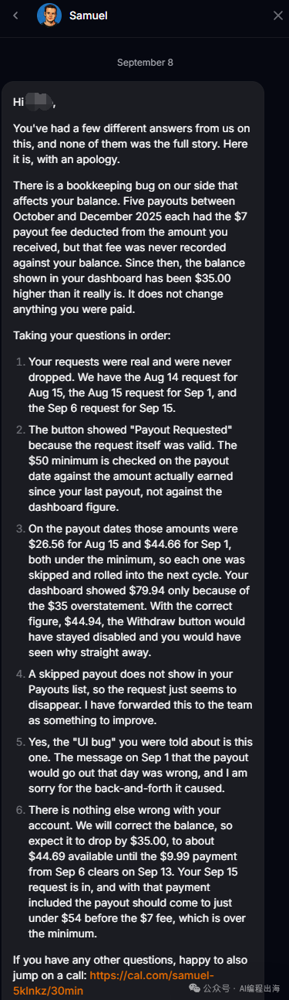
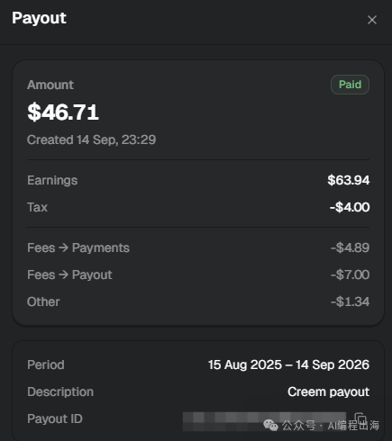
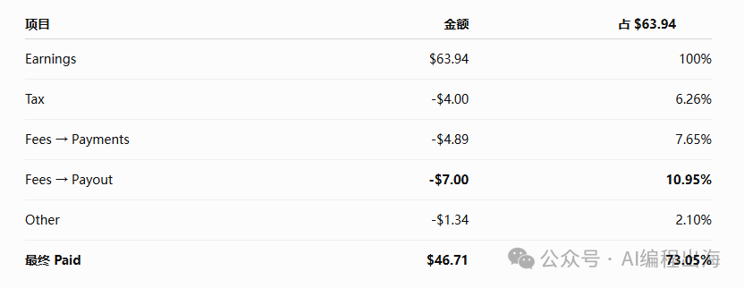

# 出海网站收入63.94美元，Creem提现折腾一个月，到手只剩46.71美元

最近遇到一个让我很恼火的事情，Creem提现连续两次没有给我打款；折腾了一个月，63.94美元最终到账46.71美元。

事情的缘由是这样，我有一个订阅站，还有两个订阅用户，每个月很佛系地给我带来可怜的一点零花钱。

8月15日提现窗口前，我看到Creem后台显示可以提现，于是点击Withdraw按钮提交提现申请，Balances页面也显示：8月15日将会提现。

结果到了8月15日，Payouts中没有任何提现记录，原来等待提现的状态消失，Withdraw按钮再次高亮，提示可以于9月1日提现。

这让我感觉十分莫名其妙！明明前一天还提示等待提现并且显示8月15日打款，结果到了8月15日，就变成让我重新申请、再等半个月？而且没有任何原因说明。

我只好再次点击Withdraw按钮。这次我留了一个心眼，截了个图作为证据，万一再出相同问题，好拿截图找Creem客服。

结果，到了9月1日那天，Creem“故技重演”，等待提现的状态再次消失，Withdraw按钮再次高亮，提示可以于9月15日提现...

这次，我有了截图的证据，于是直接联系Creem客服。结果经过几个来回的沟通，总算弄明白其中原因。

原来，不是我的提现申请失效，而是Creem的账务系统出了一个余额显示Bug。

客服解释，2025年10月到12月，我有5次提现，每次实际到账时都已经扣了7美元手续费，但后台却没有把这笔费用从账户余额里同步扣掉。5次累计下来，导致后台一直多显示了35美元。

所以，当时我看到后台有79.94美元，以为已经超过50美元提现门槛，实际上，真正可提现的只有44.94美元。8月15日和9月1日提现时，真实可提现金额分别只有26.56美元和44.66美元，都没有达到50美元最低提现要求，因此系统自动跳过了提现。

钱没有凭空少35美元，而是后台一直多显示了35美元。

客服还说，他们随后会把余额修正，并表示9月15日这次提现应该可以正常执行。

弄清楚原因后，我于是再次提交提现申请。果然，就在昨天9月15日，我终于收到这笔一波三折的零花钱。

Earnings $63.94，最终到账 $46.71，一共扣了 $17.23，约占这笔收入的 26.95%。

血亏！

这个提现记录中，Tax对应每个订单的税务扣款，Fees → Payments是每个订单的交易手续费，Other对应Moderation API的费用，用于NSFW的检测和过滤。这些费用都无法免除，唯一值得关注的是：

Fees → Payout -$7.00

> Creem目前公开的银行提现规则是：7美元／欧元，或提现金额的1%，取较高者。

Creem目前公开的银行提现规则是：7美元／欧元，或提现金额的1%，取较高者。

我这次提现扣了7美元，折合人民币将近50元，这也意味着小额提现很不划算。

出海赚钱真不容易！

原本以为买个域名，就可以做全世界的生意，但实际情况下，真正运营起来才发现，有许多比域名费用高得多的成本，账没算清楚，有可能一不小心就亏进去了。

你的出海网站也有使用Creem支付吗？是否也遇到我遇到的这些尴尬问题。欢迎交流。
