# 别他妈闭门造车了！产品出海第一步：选择比努力重要 100 倍，快速完成比完美重要 1000 倍

> 14 年 IT 裸辞做产品出海，2 小时用 AI 搓出简陋静态页，24 小时干下 26 万曝光、当月 2200 美金。本文拆解从选词到上线到外链到变现的完整闭环，两条铁律：选择比努力重要 100 倍，快速完成比完美重要 1000 倍。

绝大部分做独立开发和产品出海的人，从第一天起就注定死透了。

为什么？

因为典型的程序员思维在作祟： 闭门造车憋大招，花 3 个月写出架构无比优美、组件封装无比严谨、UI 调得比 Apple 还性感的“完美产品”。

上线发推，祈求全网来围观，结果只有 3 个点击，其中 2 个还是自己刷的。

最后把自己感动得痛哭流涕，长叹一声“出海都是骗局”。

醒醒吧，这就是纯粹的自嗨！

在这个时代，做产品出海必须刻进骨髓的两条铁律：

选择比努力重要 100 倍！

快速完成比完美重要 1000 倍！

公网上的真实用户根本不在乎你的代码写得有多高深，他们只在乎当下正在爆发的需求，有没有一个页面能立刻解决他的痛点。

2026 年 3 月，我加入出海圈子仅两天半，甚至连那个英文词是什么意思都没搞懂，凭着一个 2 小时用 AI 搓出来的简陋静态页，24 小时干下了 26 万曝光、10 万真实海外点击。

单日广告进账 200 美元，当月2200美金。

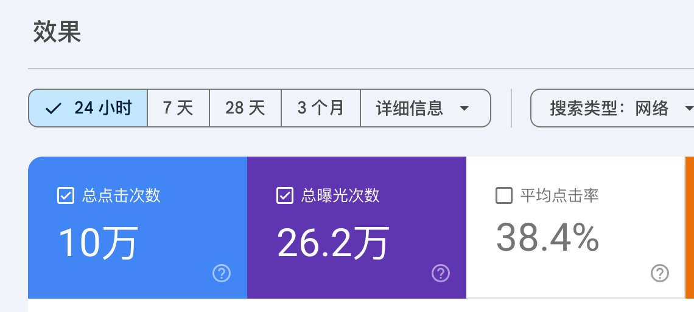

这一篇，不讲虚头巴脑的宏大叙事，全是我自己经历的真实干货。带你手把手走一遍出海全流程：从 Trends 抓风口到二次挖词 -> 搜词知意与扒竞品 -> 域名三大打法与 5 刀低成本基建 -> 外链到底怎么堆 -> 中前期四大赚钱方向与避坑心得。

📑 本文实战导航目录（建议先赞后看，常读常新）

| 核心阶段 | 实操搞法与必备工具（纯大白话） |
| --- | --- |
| 一、选词挖词 | Google Trends 盯飙升词，用 TrendsBar 插件二次挖长尾，Ahrefs/Similarweb 偷看竞品，哥飞“词根法”批量生词 |
| 二、极速上线 | 域名只选好记的，Spaceship 便宜买，Cloudflare 5 刀跑 6 个站，Neon 免费数据库，AI 两分钟搞定监控 |
| 三、狂推外链 | 外链就是公网拉赞同票（就像推特大 V 转发），导航站全网轰炸、死链替换捡漏，哥飞“遗忘法则”熬过沙盒期 |
| 四、四大方向 | 1. 小游戏站（赚广告秒回血） 2. 工具站（收订阅） 3. AI 工具（客单价高赚大钱） 4. 代充站（吃差价流水） |
| 五、新手心法 | 正反馈大于一切！宁做能拿到真实数据的小词，绝不碰耗死人的大词！不迷信付费社群，在实战里干中学。 |

<!-- more -->

## 一、选词：如何在公网挖出能暴击的“黄金词”？

千万不要坐在家里拍脑袋想“我要做一个什么牛逼的产品”。

永远先看市场在搜什么，产品永远排在搜索需求后面！

1. Google Trends 实时抓取潜伏风口

做产品出海，Google就是最大的市场，打开 Google Trends（谷歌趋势），范围选择全球，我当时搜索的关键词是“ai”，它是近几年一直高热度的词。

日期建议选择过去一周，不要只看大盘的热搜新闻，去看热度上升的查询。

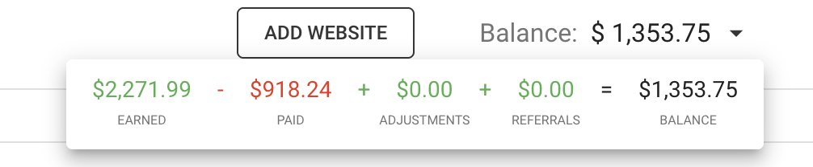

重点盯那些突然从第二页悄悄爬上来的生词。

拿我当时那个词为例：周日上午还在相关搜索第二页，周一上午窜到第 8，中午直接杀进第 4！

这就是肉眼可见、正在呈指数级爆发的真实流量风口。

当然这里有巨大的运气成分，但是更多的坚持去检查。

有的大佬直接做个监控插件，有变化后通知。

💡 实操小细节：TrendsBar 插件与“顺藤摸瓜”

如果你英语没那么好，或者觉得网页一页页看很慢、想批量导出数据，我推荐：

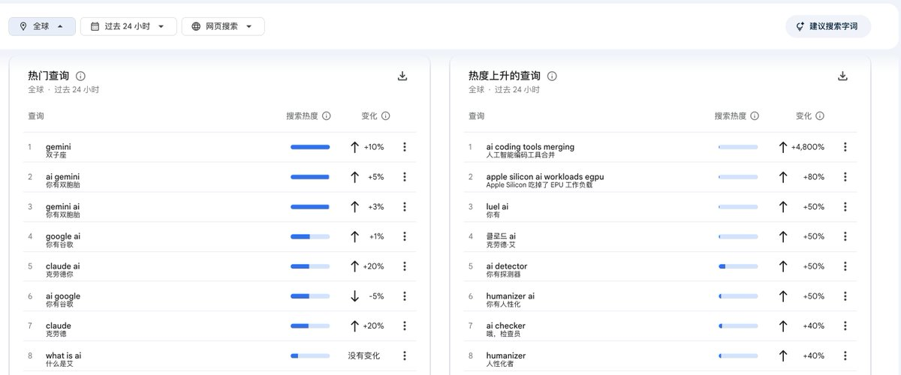

1. Chrome 插件利器：TrendsBar： 装上 TrendsBar 插件，可以直接把 Trends 页面上的飙升词、热度数据一键批量下载到本地 Excel。一目了然，完全不受语言障碍影响。
2. 二次搜索（顺藤摸瓜）： 下载完表格千万别停下！把第一批导出来的热词，当成新的词根，再扔进 Trends 搜一次！ 这样你就能顺藤摸瓜，挖出更深层、更垂直、竞争极小但意图极强的“二级长尾词”。

这招能帮你直接避开正面战场，捡到蓝海词。

2. 搜词知意：查清含义、过滤泛词、判定真空竞争度

从 Trends 抓到上升词之后，千万别无脑闭着眼睛建站，第二步必须是：搜词知意！

① 查清真实含义，不相关的果断枪毙

立刻把这个词扔进 Google 搜索前几页，阅读对应的维基百科、论坛解释或相关新闻，搞清楚它到底代表什么业务、解决什么问题。如果这个业务技术太复杂、甚至涉及法律红线，或者跟你能交付的东西八竿子打不着，果断放弃。

② 警惕巨头盘踞的“大泛词”，死磕垂直与蹭词

像ai tools、crypto这种超大词叫做“泛词”，权重全在巨头老站手里，新手碰一个死一个。优先抓两类高转化意图：小游戏相关、在线实用小工具相关。敏锐蹭词，精准截流：比如前段时间大火的jev或jav衍生词，随手一搜，网上已经有海量站点围绕这些词在疯狂收割海外流量。

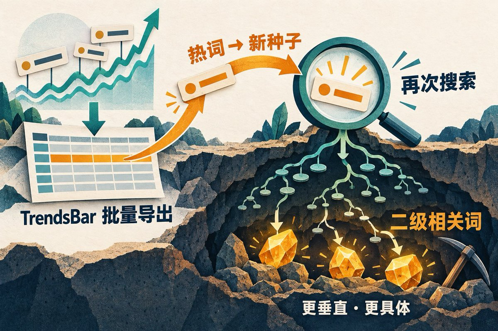

出海初期在没有品牌心智时，不要羞于蹭词，能截到精准流量就是硬道理！

③ 判定结果页真空期（千载难逢的入场信号）

在 Google 搜索结果页，如果能同时满足以下 3 点，立刻买域名动手：

1. 搜索结果全是一堆论坛碎屑；前两页几乎都是 Reddit 讨论帖、X（Twitter）吐槽、Quora 问答；几乎没有一个正经的独立产品站！
2. 官方供给极弱、甚至动作迟钝：我当时发现对应这个词的官方网站才注册不到 7 天，权重极低，甚至连主流域名（.com）都没抢占。
3. 域名主流后缀大量闲置：打开query.domains查一圈，除了官方那个奇怪的小众后缀，主流后缀居然都还空着！

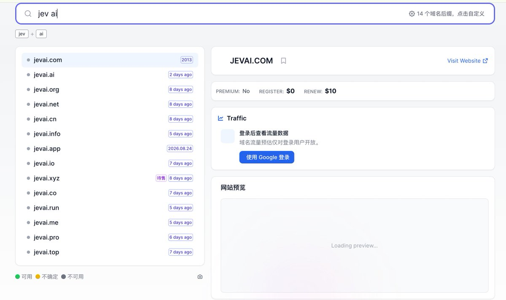

这就是供需严重脱节的真空窗口！海量老外在狂搜，全网却没有一个正经网页给他们交付。这时候必须分秒必争抢下生态位！

3. 选词进阶大杀器：Ahrefs、Semrush 与 Similarweb

如果你想把选词做到更科学、更量化，公网有三大顶尖工具必须了解：Ahrefs (ahrefs.com) 、Semrush (semrush.com)、Similarweb (similarweb.com)：

    1. Ahrefs (ahrefs.com) & Semrush (semrush.com)： 把关键词扔进去，大白话就看 3 个数：

- 月搜索量（Volume）：看每个月到底有多少人在搜；
- 竞争难度（KD）：新手强烈建议找 KD < 10 甚至 KD < 5 的词，这种就是软柿子，上几个基础外链就能轻松杀上首页；
- 每次点击广告值多少钱（CPC）：如果一个词点击一次值好几美金，说明商业价值极大，挂广告都能赚爽。

    2.  Similarweb (similarweb.com)： 竞品偷窥狂神器！看到别人出海赚到钱的网站，直接把网址扔进去，一键看透它的月总访问量、流量主要靠搜索还是社交网络、主要访客来自哪个国家。照着高手的成熟打法抄，是最稳的捷径！

但是注意：对小白用户来说不是必须的，他们的成本也不便宜，一个月闲鱼上也要100多。只是更好的辅助我们，没有也没有关系，Google Trends（https://trends.google.com/） 、google ads keyword planner （https://ads.google.com/aw/keywordplanner/home）。还有 https://ahrefs.com/keyword-difficulty 免费查KD（关键词难度，新手建议30以下） 绝对也是够用的

4. 搜不到突发热词？祭出哥飞“词根法”（Seed Keywords）

如果在 Google Trends 上碰巧遇上公网平淡期，没有突发热词怎么办？ 那就用哥飞方法论中的“词根法”进行穷举联想。

核心逻辑：以极强交易/工具意图的词根（Seed Keywords）为基准，组合垂直行业需求，批量挖掘长尾低 KD 词。

经典工具类词根组合：

- [功能] + generator（生成器：比如 bio generator、prompt generator、palette generator）
- [格式A] to [格式B] + converter（格式转换：比如 webp to png、pdf to docx、pdf 2 img）
- [行业] + calculator（计算器：比如 cagr calculator、macro calculator）
- [大牌工具] + alternative（竞品替代：比如 notion alternative、canva alternative）

小游戏/娱乐类词根组合（可以在 Roblox 上去找灵感）：

- [游戏名] + unblocked / play [游戏名]（免拦截版/在线玩，海外学生搜索量巨大）
- [游戏名] + online
- [游戏名] + tools / wiki
- [主题] + simulator（模拟器类）

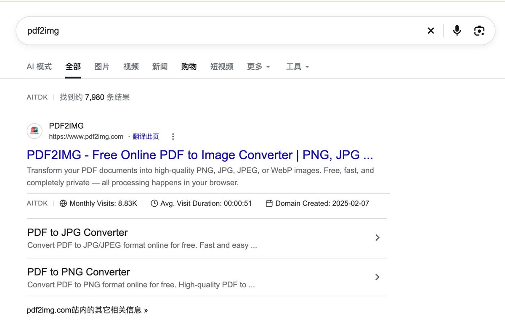

注：小游戏类词往往搜索量极大，通常通过挂广告展示来快速变现。

学会这套词根穷举法，能让你彻底摆脱“看天吃饭”的焦虑，源源不断地挖出几百个蓝海建站机会

## 二、极速上线：域名实战法则、极低成本基础设施与系统复用

很多人出海死在“准备工作”上：选框架、搭脚手架、配数据库、挑设计系统……等你折腾完两个月，风口早他妈凉透了。

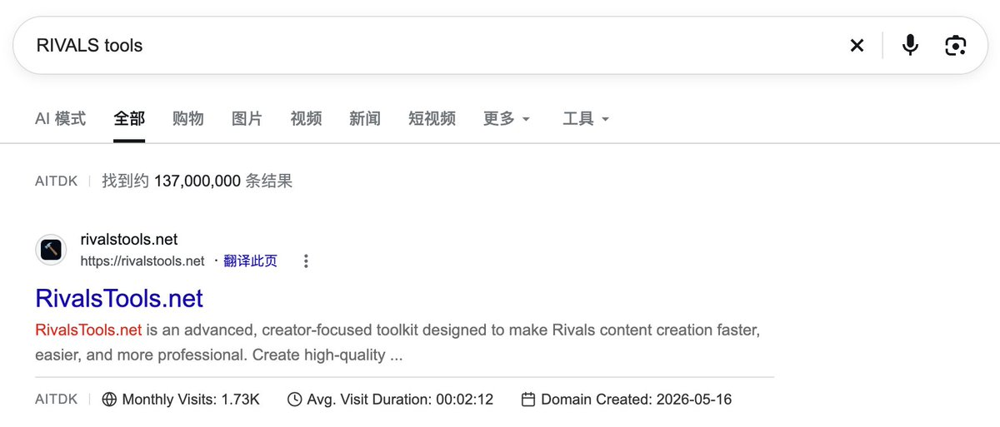

当热度按小时狂飙时，你的窗口只有半天！

1. 域名选择的实战军规与灵活变通

- 军规一：域名与核心关键词保持高度一致（Exact Match Domain, EMD）： 如果关键词是xyz tool，域名最好就直接是xyztool.com，搜索引擎权重倾斜极其明显，海外用户一眼看到也是天然信任。
- 军规二：坚决使用国际通用域名： 我们做的是海外产品出海，赚的是老外的钱！国外普通用户根本不知道比如.cn是什么，点击率直接暴跌。
- 军规三：万事不绝对，多层级替代方案：如果 .com 被占了，去找 .net、.org、.pro、.app，或者加词缀如 xyz-tool.com，核心是方便老外记住。关于大火的 .ai 域名：有预算直接冲没问题，自带科技光环，但门槛高（通常要买 3 年起），基于自己的情况来。

域名购买神器推荐：Spaceship (spaceship.com)： 别再去 GoDaddy 或 Namecheap 忍受复杂的加价套路了。通常最便宜，解析速度快，没有任何乱七八糟的隐形扣费。你有更便宜的选择，优先你的方式。

2. 系统复用与极低成本基建（作者私藏武器库）

很多技术人每次做新站都要从零写一套鉴权、排版、支付，累死累活。真正的出海老鸟，全靠“系统复用”！

① 系统代码库复用（一套模板，极速裂变）

当你完成过第一个合格的站点后，把它的通用骨架（前端响应式布局、多语言 SEO 标签、深色模式、用户鉴权、Stripe 支付组件、API 转发接口）抽象成一套内部脚手架。下一个新词出现时，直接 Clone 现有工程，换上新的关键词、文案和核心功能，1 到 2 个小时直接发布！这种工业化流水线的复用速度，能把竞争对手打得找不着北。

不一定非要框架，买模板，你手搓绝对能搓出来。GitHub上有开源项目，拿来改造完全够用。你想省麻烦，10分钟就上线先登录注册、多语言、api、生图、生视频的能力，又没有复用模板， 我推荐 @idoubicc 的shipany和 @indie_maker_fox 的mksaas。

我自己用的是mksaas，我买的原因是当时赚钱了，买这些没有压力，后面对模板魔改的也很厉害。

② 极低成本部署神器：Cloudflare（强烈推荐！）

部署网站不要傻乎乎去买昂贵配置的独立云服务器。强烈推荐直接用 Cloudflare（Pages / Workers）！它是目前全球 CDN 加速和部署成本最低的方案，抗 DDoS 攻击能力极强。性价比炸裂：作者目前买的是5 美金/月的套餐，一口气跑了6 个出海独立网站，丝滑流畅，全球秒开，几乎零运维成本！

③ 数据库搭配：Neon (Serverless Postgres)

如果网站需要存储数据，直接接入Neon (neon.tech)。 Serverless 架构，根据请求自动伸缩，自带连接池，其免费额度（Free Tier）对于中前期的出海工具站来说完全够用，基本处于零成本运行状态。

④ 数据监控不用学了，直接让 AI 当牛马！

以前很多人卡在 GSC（Google Search Console）和 GA4（Google Analytics 4）埋点上，看几十页文档折腾两三天。现在根本不需要学了！把前端代码扔给 Claude / Cursor：“帮我把 Google Search Console 和 Clarity 验证文件配置好，把 Google Analytics 4 的测量 ID 埋进去”。

同时安装clarity，这样当用户浏览我们的网站的时候，我们可以查看用户使用行为，便于复盘优化网站。

AI 2 分钟写好代码，你直接推到 Cloudflare 部署，秒完成全站流量监控！代码可以糙，数据监控一秒都不能缺！

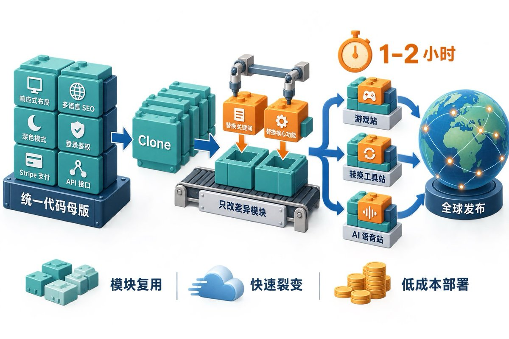

## 三、流量的死穴：外链的本质是“投票”，狂堆外链拉开差距！

你的网站上线了，为什么是个公网孤岛？为什么排名会往下掉？ 很多人以为是在跟 Google 算法斗智斗勇。

大错特错！实际上，添加外链根本不是在跟 Google 竞争，而是在跟你的竞争对手竞争！

外链的底层逻辑：公网的“民主投票”我们可以把 Backlinks（外链）粗暴地理解为公网用户对你投的一张赞同票。

如果你和竞争对手做了同一个词，一个用.com，一个用.net，甚至你们两家的网页代码和内容长得一模一样，Google 凭什么把排名给谁？

Google 只会认谁拿到的投票多！

投票也有“健康票”与“垃圾票”之分：

- 用机器批量刷的垃圾农场站外链，就是作弊票，Google 一旦发现直接惩罚降权；
- 找真正的大牛博客、高权重权威媒体给你的链接，相当于一张顶一万张的超级赞同票。

通俗类比：就像你在 Twitter/X 上发了一条帖子：

- 只有几个机器人水军回复，算法根本不理你；
- 底下有大量真人真实评论，算法开始推流；
- 突然有两个万粉科技大 V 给你转发背书，你的推文直接全网爆火！外链就是公网世界里的大 V 转发背书！

1. 冷启动期：暴力堆外链，快速拉升域名信任度

海外导航站 / Directory 全网轰炸： 批量提交到 Product Hunt、Toolify.ai、There's An AI For That (TAAFT)、Futurepedia 以及各种垂直细分 Directory（搜submit your tool/ai directory list）。这一步能迅速为你沉淀几十到上百个高权重的 DoFollow/NoFollow 投票，让 Google 爬虫几小时内完成全站收录。

【避坑警示】：不要一天就把所有的干完了， 考虑到有些外链需要审核，建议是一周5-15个外链，这个没有标准，反正我是这么干的， 然后坚持，坚持永远是最难的， 我是停更了1个多月，又慢慢的开始。

高权重 Web 2.0 与社媒埋链： 在 Medium、Dev.to、Hashnode 撰写使用指南并自然内嵌链接；去 Reddit 相关的 Subreddit、X 垂直标签分享实用心得。

付费外链加速： 在 Upwork 上挑选高 DR（Domain Rating > 40-50）的海外科技类博客发 2-3 篇相关的 Guest Post。有对应社群，有些大佬也会分享他们自己的渠道，可以学习。

【避坑警示】：千万别买 Fiverr 上“$5 发 5000 条”的垃圾 PBN 外链，那种不健康投票会被 Google 判定作弊，整个域名彻底报废！

2. 中后期：精细化外链的精细活（你的长期护城河）

三大精细化外链搞法：

1. 竞品外链逆向工程：用 Ahrefs 或 Semrush 扒光竞品前 3 名的所有外链，看他们都在哪些博客被推荐，顺藤摸瓜找站长发邮件做内容置换。
2. 死链替换法（捡漏神技）：排查老牌权威博客里失效的 404 工具链接，发邮件提醒博主换成你的新工具，成功率极高。
3. 打造外链磁铁：在网站上免费开源一份独家数据表或好用小插件，海外博主写文章时会为了引用数据主动免费帮你打广告。

坦白讲：我的第一个网站其实还没做到这一步，因为当时运气好赶上了热度爆发。

但我想说明的是，这一步才是真正拉开我们做产品出海距离的胜负手！这一步我也在做，也还在深度学习中。

3. 心态与坚持：哥飞的“网站遗忘法则”

做精细化外链，最难的从来不是技巧，而是心态和坚持。 特别是针对处在初期阶段的朋友，你会陷入这种周期律：不停地兴奋 -> 疯狂坚持 -> 几天看不到效果 -> 失落、怀疑、恐惧 -> 偶尔来点流量再次兴奋……

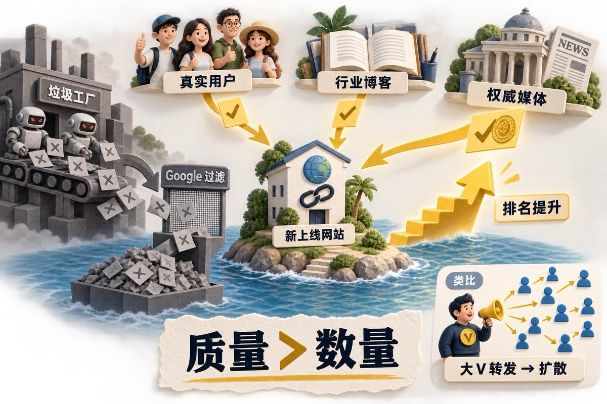

在这个磨人过程中，一定要保持极好的心态。哥飞总说过一句话：当你把这个网站做到你认为合格之后，做好它的外链建设，然后把它忘掉，隔五六个月再去看！

你会惊讶地发现，搜索引擎的沙盒期过后，这个网站自然发展的成果，可能比你想象中要好得多！

## 四、中前期做站的四大黄金方向

做网站出海，对于中前期的小伙伴来说，到底有哪些具体方向能跑通变现？

总结下来主要有四类：

1. 小游戏资讯站 / 游戏工具站（正反馈最快）

特点：极易得到正反馈，非常容易拿到你的第一个订单或第一笔美金（比如 1 美元、2 美元）。

变现：主要通过流量广告接入广告商（如 AdSense、Adsterra 等），这正是我第一个网站跑通盈利的核心模式。

2. 实用工具站（积分与轻量订阅）

特点：像 PDF 转文档、网页转图片、格式转换、计算器等刚需小工具。

变现：用户为了免除限制或高频使用，会购买额度积分，或者成为轻度订阅用户。

3. AI 工具站（客单价高，容易拿到大订单）

特点：这是目前最卷但也最具爆发力的方向。说“容易”，是指相比于几十美分的广告，AI 工具更容易拿到大金额的高客单价订单！

现状与思考：这个方向需要更深度的思考与产品壁垒。我目前也正在全力重构和深耕我的AI 工具站，中间踩了极其多的坑，但这也是真正能赚到持续大钱的资产。

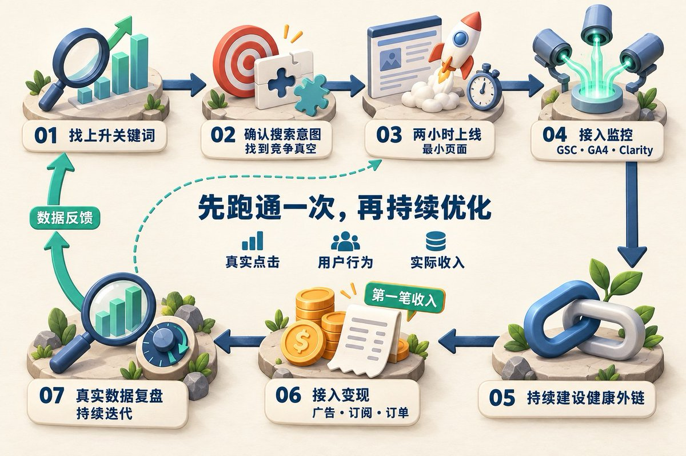

4. 代充站（中间商赚差价，公网高爆方向）

特点：虽然严格来说不属于纯软件出海，但属于当前非常火爆的变现渠道。

模式：现在海外有很多成熟的开源代充网站系统，你只需要找到可靠的上游批发供应商，搭建好网站获取真实用户，帮他们在你的网站下单或代操作，纯赚差价，流水极大。

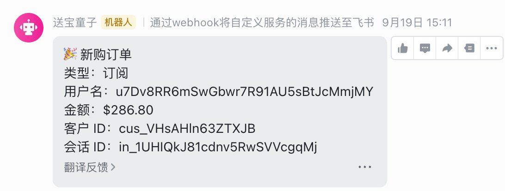

## 五、除了做网站，出海还有哪些坑？写给新手的大实话

产品出海是一门真正的综合商业实践。除了上述的选词和建站，还有很多深水区的实操细节：

- 海外收款与合规结汇：如何低成本注册海外公司与 Stripe 账户，如何通过合规渠道把美金安全换回国内人民币；
- AI 接口防护防白嫖：做 AI 工具站，如何防止前端 API Key 泄露、如何做并发风控和限流，防止被黑客薅秃破产；
- 付费广告投放前沿尝试（正在实测）：除了等自然 SEO，我们最近也正在实测付费广告投放（Google Search Ads、Twitter Ads、Reddit 针对性投流），通过精准测算客单价与获客成本（CAC），测试正向投产比（ROI）；
- 科学定价策略：是定 9.9 美元还是 29.9 美元？如何设置免费试用额度（Freemium）和付费墙（Paywall）才能把转化率拉到极致？

这些更深度的实操细节，以及更多进阶的找词黑科技，我最近都在亲自踩坑、重构和测试，后续也会在我的账号上逐步复盘拆解。

给小白出海者的掏心窝子话：正反馈大于一切！

最后，我想针对很多第一次尝试产品出海的小白朋友，说几句极其掏心窝子的大实话：

1. 第一次做产品出海，其实做什么都不重要，重要的是把流程完整跑通一次！不要在赛道选择上内耗一个月，严格按照这套 SOP：找词 -> 2 小时上线 -> 秒接监控 -> 狂堆外链 -> 接入变现，哪怕是一个极其粗糙的小页面，只要你完整跑通了全流程，你的认知就会发生质的飞跃。
2. 尽可能找圈内前辈请教，确认方向没有大偏移： 出海最忌讳闭门造车在死胡同里撞得头破血流。多去推特、社群向拿到过结果的前辈、老鸟虚心请教，让他们帮忙看一眼你的选词逻辑和网站结构，确认你的打法和方向没有根本性的偏差。
3. 宁愿选一个能快速拿正反馈的“简单小词”，也绝不要碰耗死人的“老词大词”！很多新手心比天高，一上来就想挑战行业大词，结果折腾两三个月，后台点击还是 0。相信我，在长期没有正反馈的漫漫黑夜里，那种失落、怀疑和自我否定是极度痛苦、极度消耗心智的，绝大多数人就是在这个阶段被活活熬死的！宁愿去找一个竞争极小、看似不起眼的简单词、冷门小词！只要能看到真实的海外点击涌入，哪怕第一周只赚到 1 美元、2 美元，这种真真切切的正反馈，给你建立起的第一个信心就是无价之宝！也可以找朋友一起抱团取暖，有了信心，你才能在出海这条路上一直活下去！

在这里，推荐大家去关注 @gefei55 哥飞老师和 @hezhiyan7 赫兹大哥。有兴趣的朋友可以去翻看他们的微信公众号，以及他们在 X 上的干货复盘。按照我的亲身体会，你基本上把哥飞和赫兹公开发布的帖子、文章认真研读一遍，就完全足够你独立搞定一个网站、完成基本的产品出海，这没有任何问题！绝对能让你少走几个月的弯路。

最后，真正拉开人与人差距的，从来不是什么不传之秘。最核心的，永远是去执行、去验证、去复盘、去坚持，在实战的泥潭里干中学！

## 💬 后续分享预告

如果你对产品出海、AI 搞钱、选词实战、以及正在尝试的海外广告投放与定价测算感兴趣，欢迎关注我！ 

我会把我做出海Ai产品 踩过的每一个坑、每一个真实的海外订单数据毫无保留地复盘发出来，一起赚美刀。

文章由Gemini 3.8 进行最后优化，图片由GPT Image 2.5模型生成

- 封面图片使用 @AdrianPunk115 的生图技能
- 文章配图使用 @dotey 的生图技能

出海产品通过Codex、Claude Code 、GLM、DeepSeek 口喷而成。
