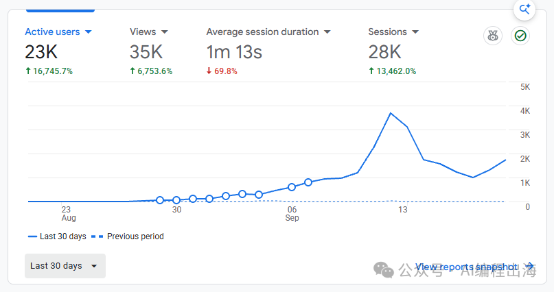
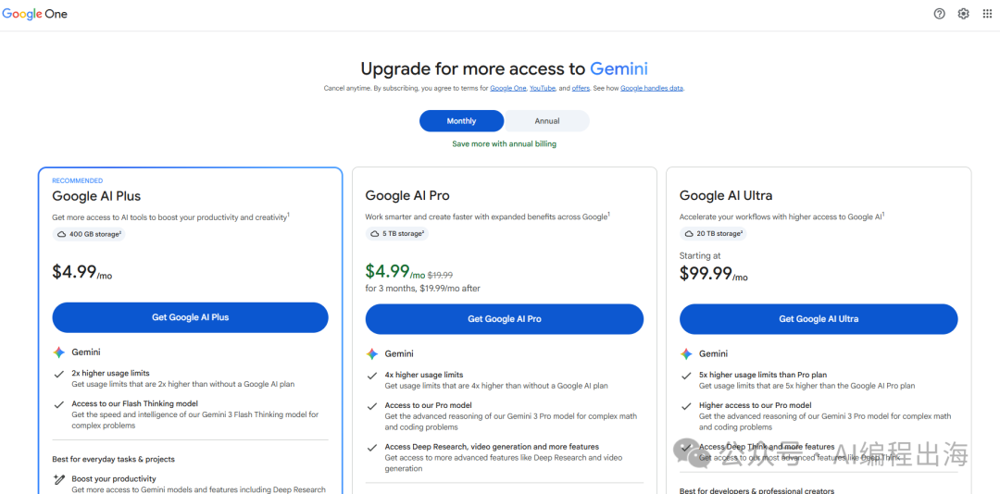
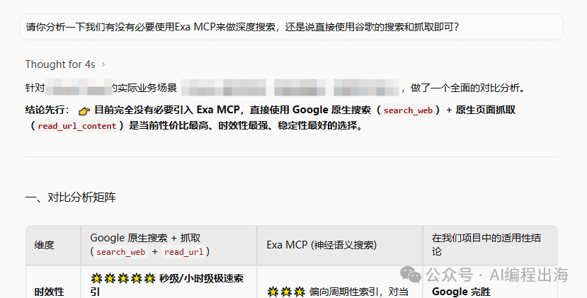
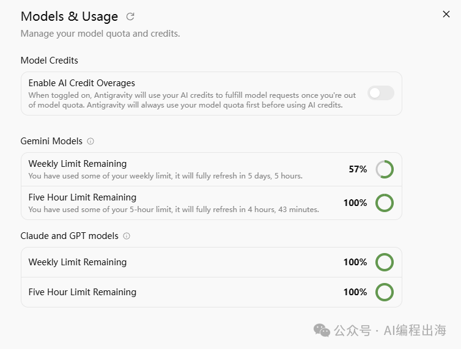

# 不再等Codex重置了，这次Gemini真让我意外

最近，全网都在聊Codex重置，生财亦仁也发了一篇关于AI重置的超级标，可见这件事情对我们的影响之大。然而，上周二大家一致期待的Codex重置并没有如约而至，导致许多人和我一样，Token早早用完，工作陷入停摆。

前面的文章《放弃批量上站后，一个新站半个月来了1.2万访客》提到我搭建了一个新的内容平台，这次不再局限于某个新词，而是通过不断地挖掘关键词和长尾词给网站增加内页。结果网站一点都不爆，而是十分佛系地缓慢上涨，半个月左右涨到1.2万访客。

然而，这个网站后续并没有继续上涨，在Codex Token额度耗光、工作停摆的几天里，每天访客数更是一路向下至1000左右，直到这两天网站恢复更新后，才重新有了上涨的苗头。

我手头只有一个ChatGPT 20x的账号，在Codex Token额度耗光的几天里，我无法继续更新这个网站，也没有另外开发其它项目，但我每天仍然使用ChatGPT Pro帮我做一些方案，以及完善手头一个还没上线的小程序。

直到周五翻看“生财TokenRank排行榜内测群”的聊天记录的时候，看到有不少圈友提及Gemini，我这才想起了几个月前我一直相处的老朋友。

我于是打开Gemini的Upgrade页面，没想到竟然显示前3个月每个月只需4.99美金：

我毫不犹豫点了“Get Google AI Pro”。结果很遗憾，订阅时提示我不符合4.99美金的条件，可能是因为我以前使用过Gemini，不是新用户。我犹豫片刻后，最终还是以20美金订阅了Gemini的Pro。

接下来，我开始在Antigravity里使用Gemini跑我最近这个网站中的Skills和队列任务。结果，几轮测试下来，Gemini的表现让我十分惊喜！

我让它首先执行的是更新网站已有页面的数据和信息，它不仅联网搜索并更新了最新的信息，而且还十分高效，之前我让Codex跑了将近24小时的任务，Gemini竟然只花了不到10分钟。

我不确定这是Gemini真的那么高效，还是它并没有按我的要求串行做更深入的调研，这点后续还需进一步观察。

过程中，我发现Gemini执行任务的时候并没有使用EXA MCP进行深度搜索和调研，和Gemini沟通才发现，原来这是因为我还没有让Gemini配置EXA，所以它直接使用谷歌自带的搜索能力和爬虫能力完成了相关搜索和调研。

Gemini还帮我做了一番对比，并告诉我：“目前完全没有必要引入EXA MCP，直接使用Google原生搜索（search_web）+原生页面抓取（read_url_content）是当前性价比最高、时效性最强、稳定性最好的选择。”

这里不排除Gemini自夸的嫌疑，但是不得不承认，就搜索能力而言，谷歌仍然是当之无愧的老大。我于是听从它的建议，没有进一步配置EXA MCP。

昨天我又尝试让Gemini跑另一个完善网站几百个页面的队列任务，这一次，它并没有10分钟内搞定，足足花了十个多小时，找出了我的网站页面中原来的一些内容错误和多语言翻译错误。如果换成Codex，这一批任务估计得跑三天三夜，更关键的是，Codex很可能跑到第二天晚上的时候就Token耗尽，任务挂在第三天黎明到来的前一个晚上。

这批队列任务执行完后，我特地打开了Gemini的Token使用情况，结果显示花了43%的周额度，这个Token消耗速度比Codex要慢得多。

接下来，我得调整一下AI的工作安排，让Gemini发挥它的搜索能力和爬虫能力，完成一些信息调研和内容更新的工作，而把Codex更强的编程能力和推理能力留在项目开发上。

昨天，我还尝试让Gemini帮我分析和解决另一个出海网站的问题，如果最终奏效，我在另外写文章告诉大家。

这次最让我意外的，不是Gemini完成了哪些任务，而是我原本一直在想，怎样才能拿到更多Codex额度，现在开始想：哪些工作，其实不一定非得交给Codex？

你最近有遇到Codex额度不够、工作停摆的情况吗？最后又是哪个工具，真正接住了原来的任务？反正接下来，我不打算继续盯着Codex的重置时间了。
