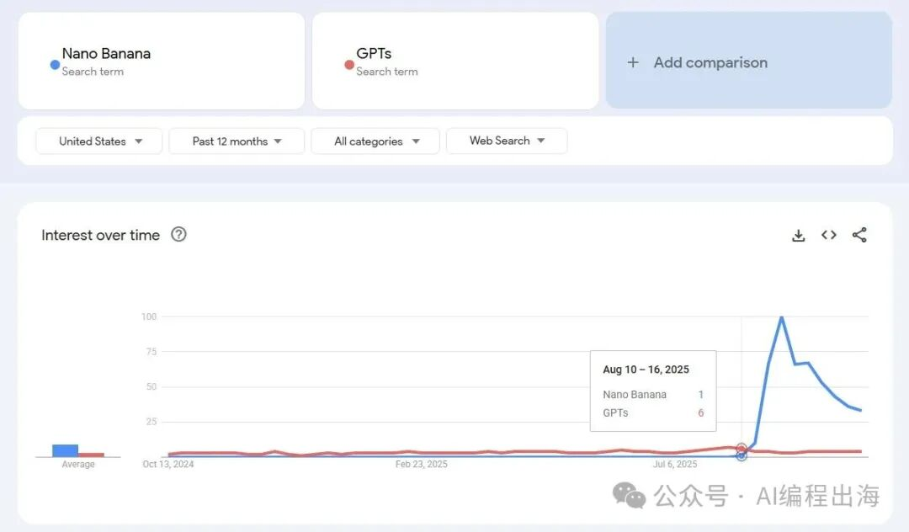
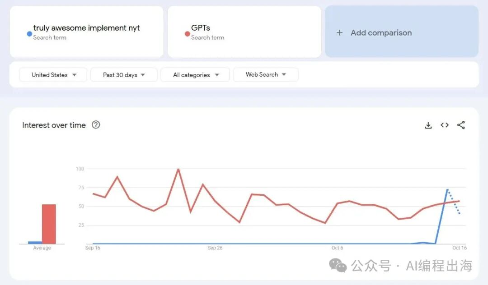
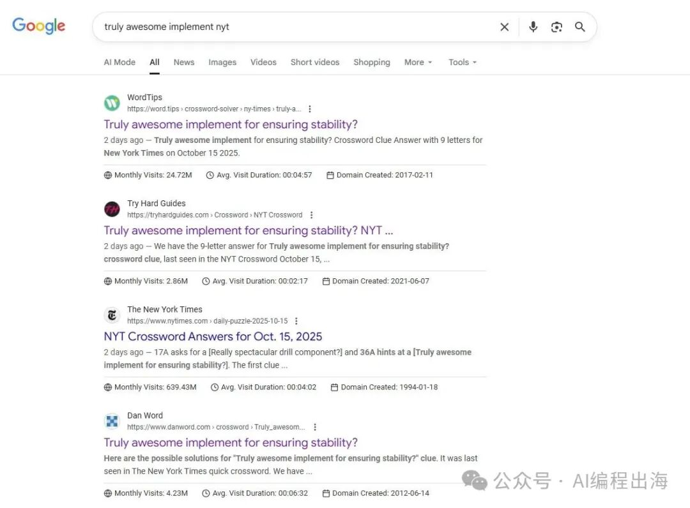
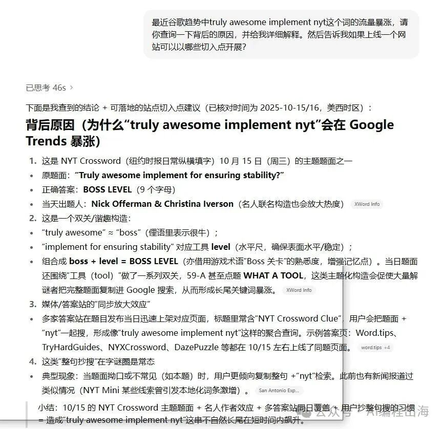
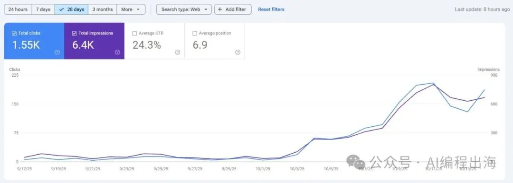
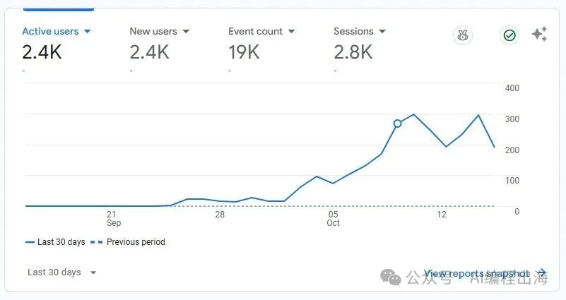

# 找新词：出海网站新手最快找到正反馈的方法

最近有不少朋友问我怎样挖掘新词，我都会建议他们看看哥飞公众号的文章。然而，许多朋友并没有深入挖掘其中的价值，尤其是一些时间较早的文章内容。

于是，我想重新回顾一下哥飞老师公众号的一些文章，试图帮大家挖掘出一些哥飞时不时透露出来的出海赚钱密码。

今天，我们就从哥飞经常提及的“找新词”开始。

大家可以先回顾一下哥飞老师的2023年发布的这2篇文章：

找新词：一个永远有效的建站策略，让你快速拿到搜索引擎流量

哥飞教你一招判断关键词出现时间，找新词不再难

谷歌一年有7500 亿次是全新的搜索查询，平均到每天是20 亿次全新的搜索。这就是全球用户和谷歌给我们出海的机会！

那么，究竟什么才是新词呢？怎样做新词网站呢？按我对哥飞老师文章的理解：

新词是指过去几乎没有搜索量而现在突然出现飙升搜索量的词；

这些词过去没有网站或很少网站专门有页面去承接，因此做相应关键词的页面去承接；

通过注册关键词域名、做关键词内容，举全站之力去做这个关键词。

我们以前段时间爆火的“Nano Banana”为例：

这个词在2025年8月之前，几乎没有搜索量，直到8月10才出现搜索量，而且一周后是飙升的搜索量，这种词就是哥飞老师所说的新词。在这一波流量中，NanoBanana.ai最早注册了相关域名并最早上线了网站，因此拿到了这个新词的流量：

然而，并不是所有的新词都值得去做，比如这两天出现的这个词：

搜索量突然飙升超过GPTs的搜索量。但是，这种词的飙升主要是因为某一个事件触发，事件过后流量可能就会走弱。如果我们不确定一个词是因为什么原因流量飙升，可以通过谷歌搜索一下，也可以试着让AI用联网模式查看分析一下：

通过多方考证新词飙升的原因，再来决定是否把这个词做成网站来承接相应的流量。

如果你认真体会哥飞老师的找新词做网站的思路，你一定会更快找到正反馈，感受到出海的感觉！比如我前不久这篇文章：

新手想快速体会出海的感觉，一定要试试哥飞所说的“找新词”

提到的这个网站：

