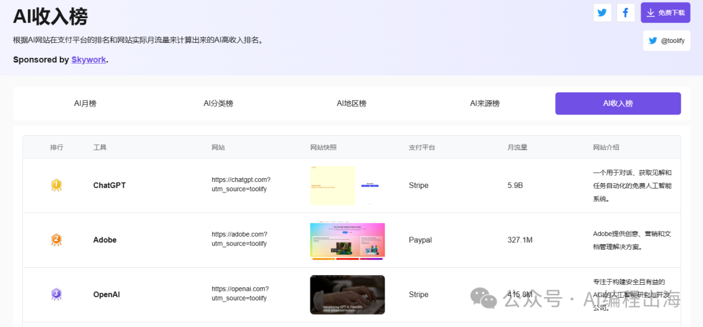

# 出海工具站高手是怎样挖掘产品需求的？

出海工具站高手是怎样挖掘产品需求的？其实我不适合来回答这个问题，因为我也正在向高手们学习之中。

前面的文章：

找新词：出海网站新手最快找到正反馈的方法

出海那么难！网站流量总是躺平！怎么办？

我重新阅读了哥飞公众号的文章，然后整理了哥飞老师提及的通过“找新词”和“分析关键词难度”来挖掘网站新需求。

然而，今天有位朋友微信上问我怎样挖掘需求？还说看了我的文章和哥飞老师的文章后，仍然没有太好的思路去挖掘关键词。所以，我今天回顾了之前在生财有术和哥飞社群中看到的相关内容，给大家整理一篇挖掘出海产品需求的文章。

以下内容部分节选自生财有术的精华文章，部分来源于哥飞社群的所见所闻。大家有兴趣请到生财有术查看下面原文：

> 刘小排：如何获得产品idea链接：https://t.zsxq.com/1yjkT

刘小排：如何获得产品idea

链接：https://t.zsxq.com/1yjkT

> 刘小排：什么产品好做？三个—链接：https://t.zsxq.com/13yN8

刘小排：什么产品好做？三个—

链接：https://t.zsxq.com/13yN8

> 子木：独立开发如何赚得比工资多：从选品到营销，干就完了！链接：https://t.zsxq.com/q6VGt

子木：独立开发如何赚得比工资多：从选品到营销，干就完了！

链接：https://t.zsxq.com/q6VGt

1. 找新词

这是哥飞老师、小排老师和子木老师同时提及的思路，前面我们也有文章提及哥飞老师的具体实践方法。

小排老师文中提到：这个世界上，每天有30亿次搜索，其中，20%的搜索词组，是昨天没有出现过的。那就意味着，每天都有新的机会，就看你能不能发现了。使用这套方法论的成功公司包括Veed.io，他的创始人有一个金句“Make something people search for”。Veed.io的确也是这么实践的，它每月网站流量有2100万，其中63%都是来自于搜索引擎。

子木也在文中提及：谷歌70%的搜索需求还没有好答案！用Google Trends、关键词规划师（Google Ads）、Ahrefs这些工具，找到新趋势，先占坑！看词是不是描述非通用场景需求，看趋势是新需求就重点关注。比如：“AI换脸”火了，马上有人做AI视频换脸工具，“GPT语音克隆”需求大，马上有人做AI语音克隆SaaS。

> 工具集：Google Trends关键词规划师（Google Ads）Ahref的Keyword Difficulty Checker

工具集：

Google Trends

关键词规划师（Google Ads）

Ahref的Keyword Difficulty Checker

2. 看榜单

看榜单，不能只关注排在最前面的大站，而是要关注增长潜力大、竞争较小的排名不在最前面的产品。

子木在文中提到：去App Store、Google Play、Product Hunt、Reddit、Toolify收入榜单这些地方，看别人对竞品的差评，看看他们骂得最多的点，就是你优化的方向。

Hix.ai和Pollo.ai的创始人阿彪在生财有术的一次航海直播分享中也提到看榜单会开阔自己的视野。

> 工具集：https://www.ycombinator.com/companieshttps://www.producthunt.com/https://toolify.ai/https://chrome-stats.com/App StoreGoogle Play

工具集：

https://www.ycombinator.com/companies

https://www.producthunt.com/

https://toolify.ai/

https://chrome-stats.com/

App Store

Google Play

3. 逛论坛

小排老师和子木老师在文章中都没有提及逛论坛，但是生财有术和哥飞社群中时不时都有人提及从Reddit或Twitter上挖掘需求。

哥飞社群今年3月份的新词比赛第一名Lafe在分享中提到：哪些渠道找风口？挖掘渠道最重要的是要到高流量的地方、爆款内容的起点。这些爆款信息，最先在社交媒体平台发酵，比如Twitter、Reddit, 可以关注国内外大v (小互, orange.ai, 歸藏, Dreaming tulpa) 等，但他们发的内容不一定代表已经爆火。这时候就需要验证工具，可以通过Google Trends查看相关关键词在过去 7 天、30 天内的搜索热度变化，来验证它的短期流量趋势。

> 工具集：https://www.reddit.com/https://www.x.com/https://quora.com/

工具集：

https://www.reddit.com/

https://www.x.com/

https://quora.com/

4. 靠平台

围绕大平台的周边挖掘需求。子木在文中提及：只要你找到Top200个大平台x每个平台不会做、但用户很想要的东西，你就赢一半了！那起码有1万个需求！但记住顺着平台做周边，长期主义！比如：微信不做多开？立刻有人做了“多开工具”；Notion功能不够强？各种Notion插件出来了；ChatGPT不能自动整理摘要？立刻就有人做AI摘要工具。

5. 抄竞品

抄成功竞品，然后做出差异化的价值点。小排老师在文中提及：成功的竞品，已经帮你验证过，市场一定存在、这条路一定能走通。生财有术是一个创业案例宝库，其中有大量的实操经验，大家都完全可以从模仿开始，然后不断去优化、去做出差异点。“抄”，听上去好像不怎么高端。不高端又怎么样，实用就行。Google怎么来的？Google是世界上第11个搜索引擎，它先抄了别的搜索引擎，然后引入了PageRank算法，让搜索结果排序更加合理，从而提供了差异化的价值。

6. 产品化

小排老师在文中提及一种模式：有人愿意预付费找你定制某个需求，然后你将它产品化。码叔在生财有术做过分享，这正是他的方法。他从6月自学Google插件开发以来，半年时间已经变现了好几十万，他的方法可以复制。他总是从定制需求开始，从来不自己生造一个idea。某人有个需求，知道码叔会编程，就付费让码叔定制开发。然后，码叔就想办法把它产品化，卖给更多的人。

7. 向内求

这是终极方法，也是小排老师在文中提及的第一个挖掘需求的方法：原生Idea。英文原名“organic idea”，这是硅谷创业界最推崇的方式，被众多科技界创投界大佬认可。“organic idea”的意思是——解决你自己遇到的问题，你自己就是它的用户，你会每天使用自己的产品。

如果你和我一样是出海新手，“找新词”还没学会，“看榜单”又还没有感觉，“逛论坛”又不喜欢，那你就先从自己和身边的需求开始吧。你会从中找到AI编程的乐趣和出海的感觉。

比如我自己的第一个出海产品，一个保存网页内容和汇集管理网页的Chrome插件GPTBLOX（链接：https://gptblox.com/wechat），从GPT3.5开始通过AI编写，一直迭代到现在已有二十多个版本，因为我自己每天都在使用。目前插件已经3200+用户，而最初的开发原因只是那段时间ChatGPT频繁封号，我和身边的许多朋友需要保存ChatGPT的聊天记录。

但是，这个挖掘需求的方法一定要注意小排老师在文中提及的点：构思产品idea的动词，应该是“注意到”，而不是“想到”。“我注意到，有这么一个问题，可以这么来解决”而不是“我想到了一个创业idea”。

以上是我在生财有术和哥飞社群中学到的一些挖掘需求的方法，如果你对生财有术和哥飞社群感兴趣，请阅读我前面的这篇文章：

人，一定要走进能托举和滋养你的圈子

文末，附上刘小排老师做产品的终极秘密：

做一个产品之前，先问清楚自己：什么人？在什么场景下？愿意花多少钱？解决什么问题？
