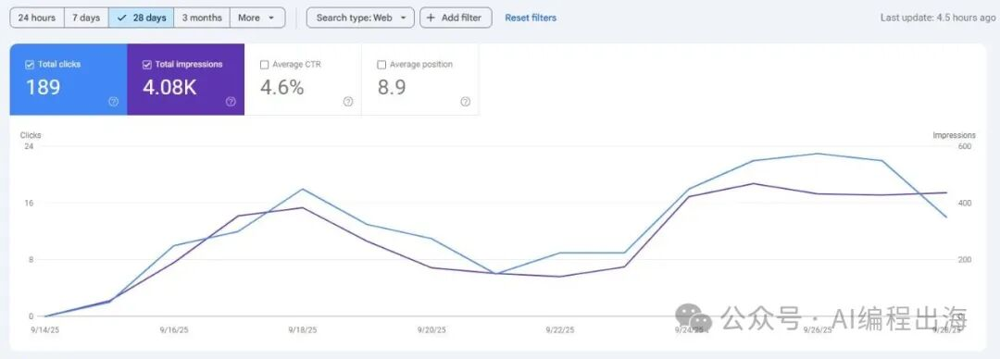
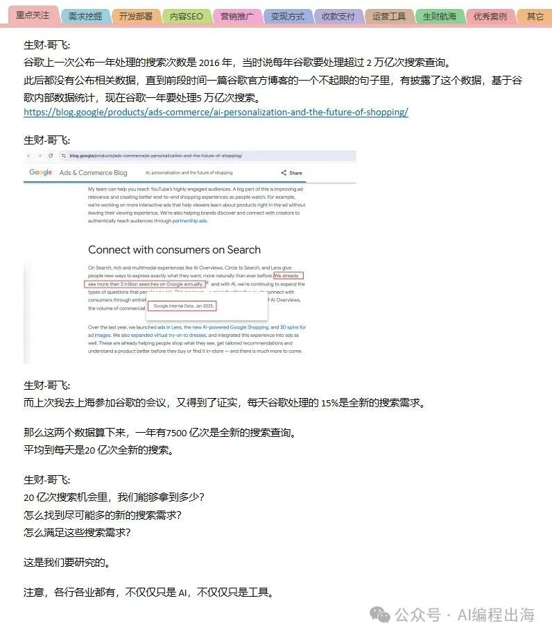

# 新手想快速体会出海的感觉，一定要试试哥飞所说的“找新词”

2周前，我随手上线了一个网站，还没有时间添加外链，但网站却有4000多曝光和189点击。

其实，这就是哥飞常和我们提及的“找新词做网站”。

可以看到这个词半个月前突然飙升，虽然后面有所回落，但仍然远高于GPTs的搜索量。

为什么说哥飞说的“找新词”会更快让我们新手找到出海的感觉呢？我找到了哥飞之前的一段分享记录：

谷歌一年有7500 亿次是全新的搜索查询，平均到每天是20 亿次全新的搜索。这就是全球用户和谷歌给我们出海的机会！
