# 出海那么难！网站流量总是躺平！怎么办？

昨天的文章：

找新词：出海网站新手最快找到正反馈的方法

我和大家一起回顾了哥飞公众号2023年发布的两篇文章，挖掘出哥飞老师给我们透露的第一个出海赚钱密码：找新词。

谷歌趋势中时不时都会爆出天量级流量的新词，比如今年上半年GPT4o生图带火的“Ghibli AI”，再比如前不久火爆的“Nano Banana”，再比如最近飙升的“Sora 2”等等，还有时不时冒出来的小游戏，比如Roblox上火爆起来的“Grow a Garden”。

然而，很多这些新词也是许多出海高手紧盯的“猎物”，如果你和我一样总是比高手们慢半拍慢一拍，那未必能从这些新词中拿到预期的结果。

所幸，我们可以跟进的新词还有很多，哥飞在这篇文章：

【收藏】51个挖掘需求时能用得上的财富密码关键词哥飞免费赠送给大家

给我们赠送了51个用户挖掘新词的词根，妥妥的财富密码，你还可以根据自己的实践总结出更多词根。围绕一些别人比较少关注的词根找到的新词，竞争往往会小很多。

另外，我们还可以通过挖掘已经存在但是竞争度相对较低的词来做网站。这就是今天要给大家分享的哥飞给我们透露的第二个出海赚钱密码：分析关键词难度。

先给大家看两个我去年上线的出海工具站的GSC走势图：

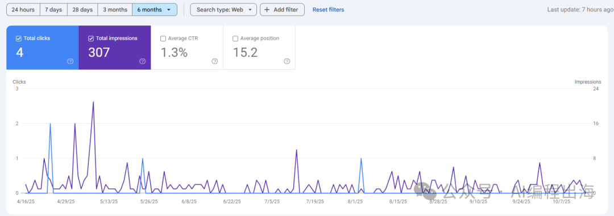

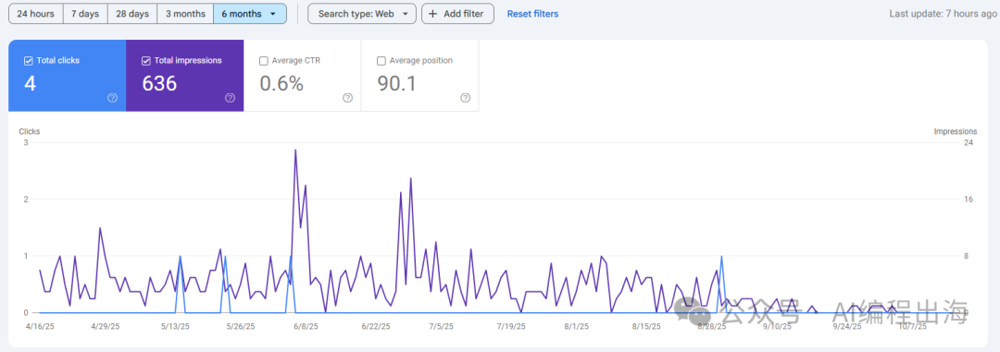

几乎“躺平”了！

再给大家看同一时期上的另外两个出海工具站的GSC走势图：

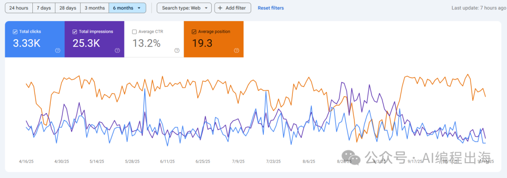

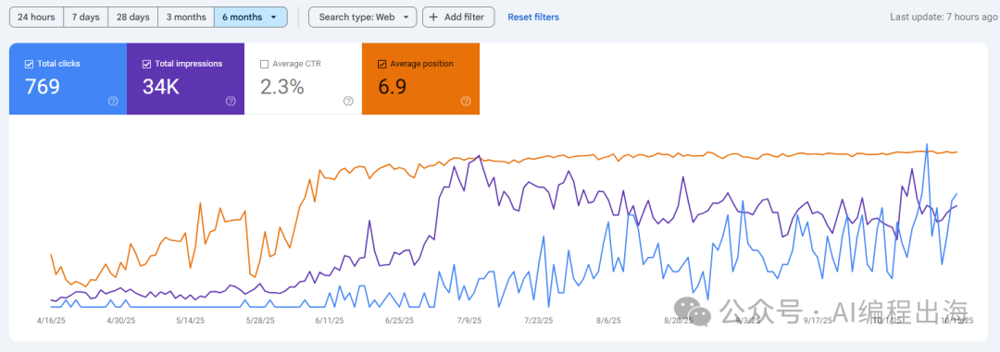

虽然不温不火，但至少没有“躺平”，而且还挺稳定的。

实际上，这4个网站都只有首页1个页面，再加上一个隐私协议页面，都很佛系地上了一些外链，但为什么会有这么大的区别？答案就在“关键词难度”上。

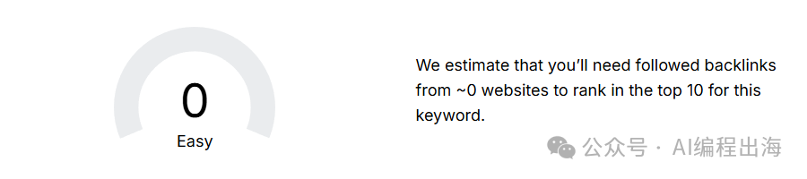

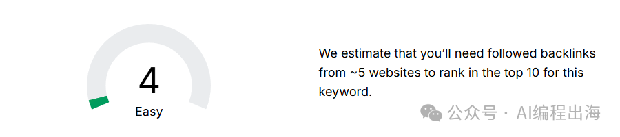

在Ahref的Keyword Difficulty Checker上可以看到这两个关键词的难度都非常低，而实际上这两个词在谷歌趋势的搜索量也不大：

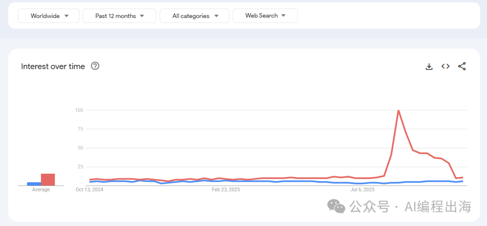

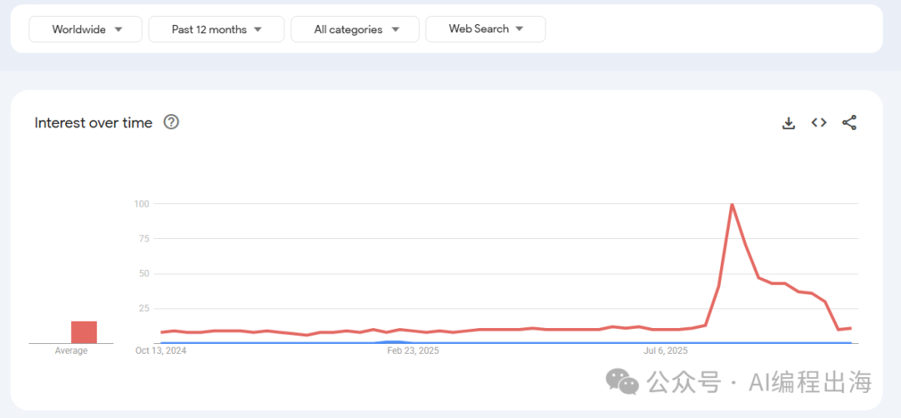

在讲怎样分析关键词难度之前，大家可以先回顾一下哥飞在2023和2024年发布的几篇文章：

有了这几个关键字优化难度分析工具，妈妈再也不怕我不会判断SEO难度了

用一个真实例子教你如何判断一个关键词是否值得做网站

利用Semrush找有一定搜索量且竞争小的关键词时容易遇到的一些陷阱

【哥飞看词】帮社群里朋友看一个关键词是否能做

刚好这两天和朋友聊到Shopify模板，我们就从“Shopify Theme”这个词开始。

先看看关键词的搜索量：

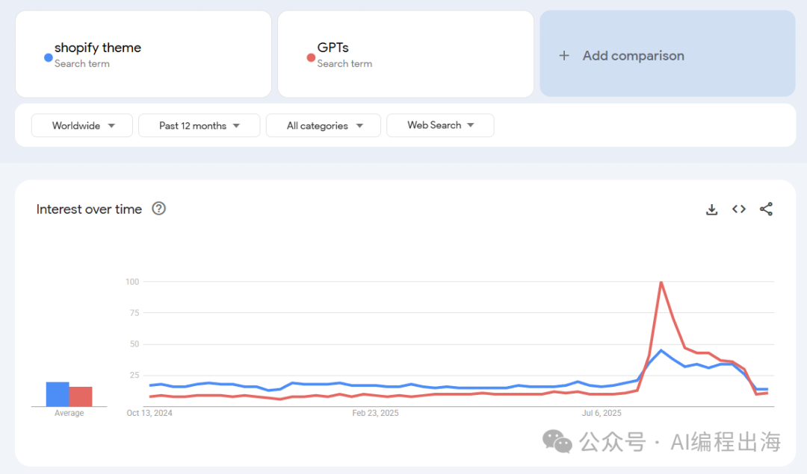

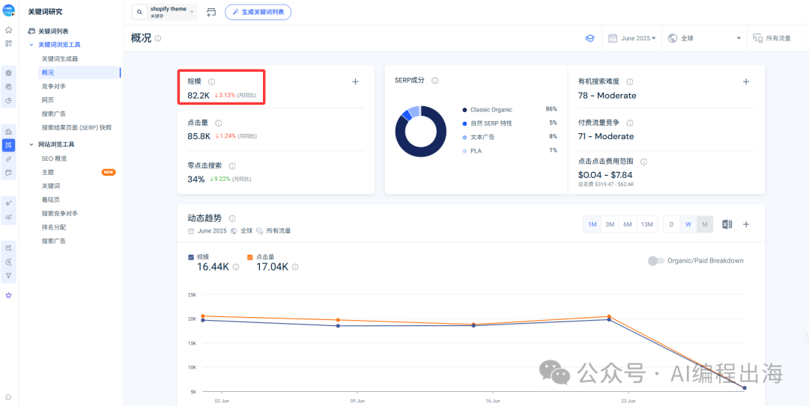

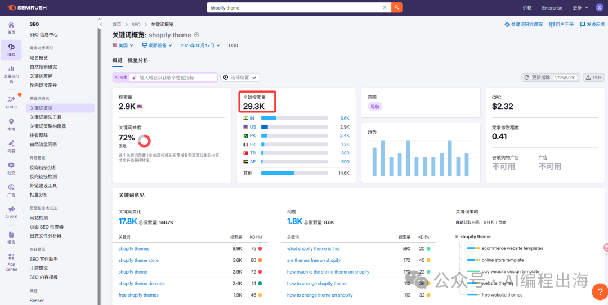

这是谷歌趋势、Semrush和SimilarWeb显示的关键词流量情况。

按哥飞老师的建议：“竞争难度请参考 Ahrefs 家的，搜索量请看谷歌趋势的。”可以看出“Shopify Theme”这个词肯定不是新词，并且一直流量很大，说明需求确确实实存在。

接下来看看关键词的难度：

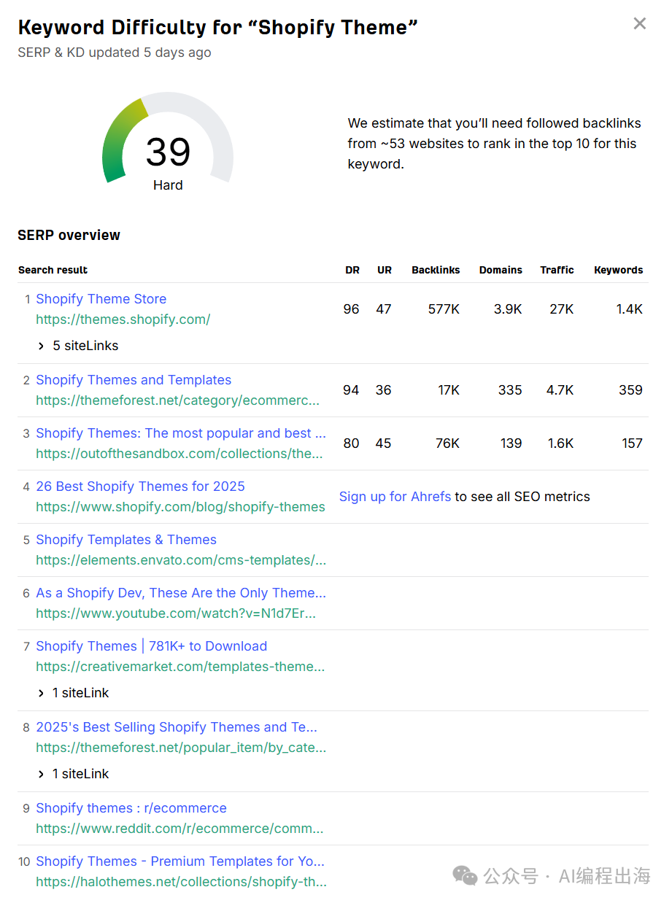

在Ahref的Keyword Difficulty Checker：

> https://ahrefs.com/keyword-difficulty/

https://ahrefs.com/keyword-difficulty/

可以看到这个词的难度是39，预估需要53个外链就能做到谷歌的前十。看起来似乎难度不小，但并非遥不可及。

然而，我们看看前5位的网站，要么是Shopify官方，要么是著名的模版网站，DR非常高，都是几乎无法撼动的大站。如果你的网站没有出彩的体验，没有足够的资源，想要跻身前列的难度非常大。

我们在通过SimilarWeb的“关键词生成器”和Semrush的“关键词魔法工具”查看一下：

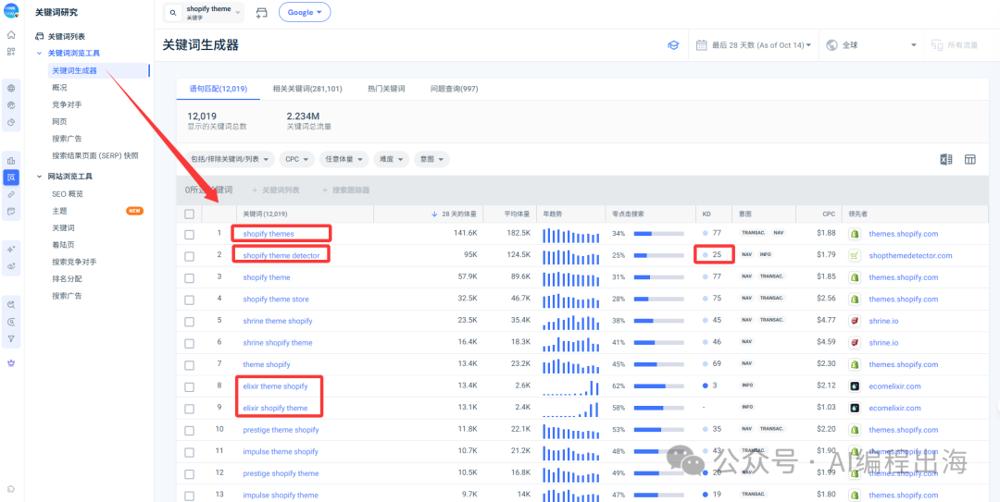

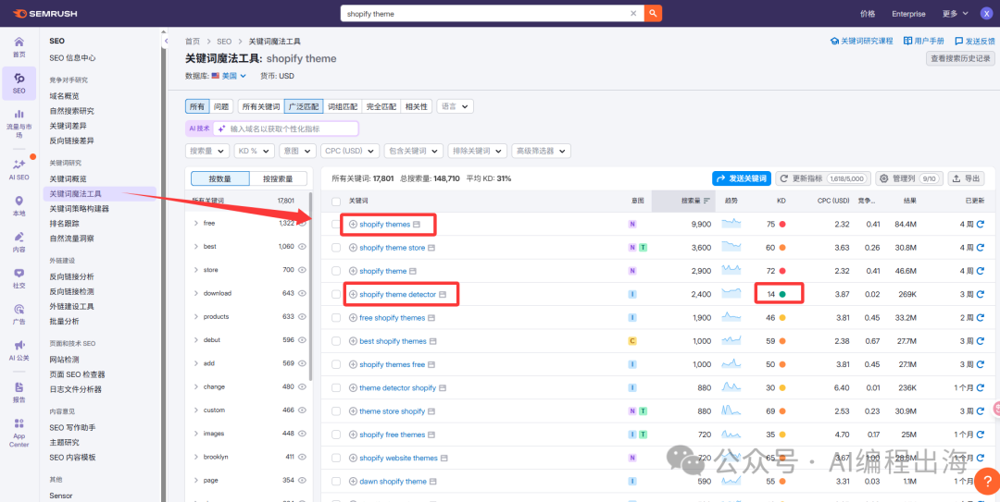

这两个分析工具显示的“Shopify Theme”这个词的难度更大，但是，我们同时发现一个词“shopify theme detector”在SimilarWeb和Semrush中的难度都在30以内，并且也有一定搜索量。

我们查看一下谷歌趋势和Keyword Difficulty Checker

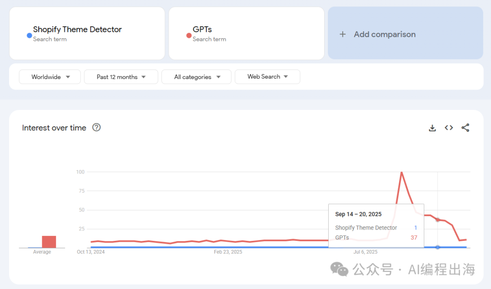

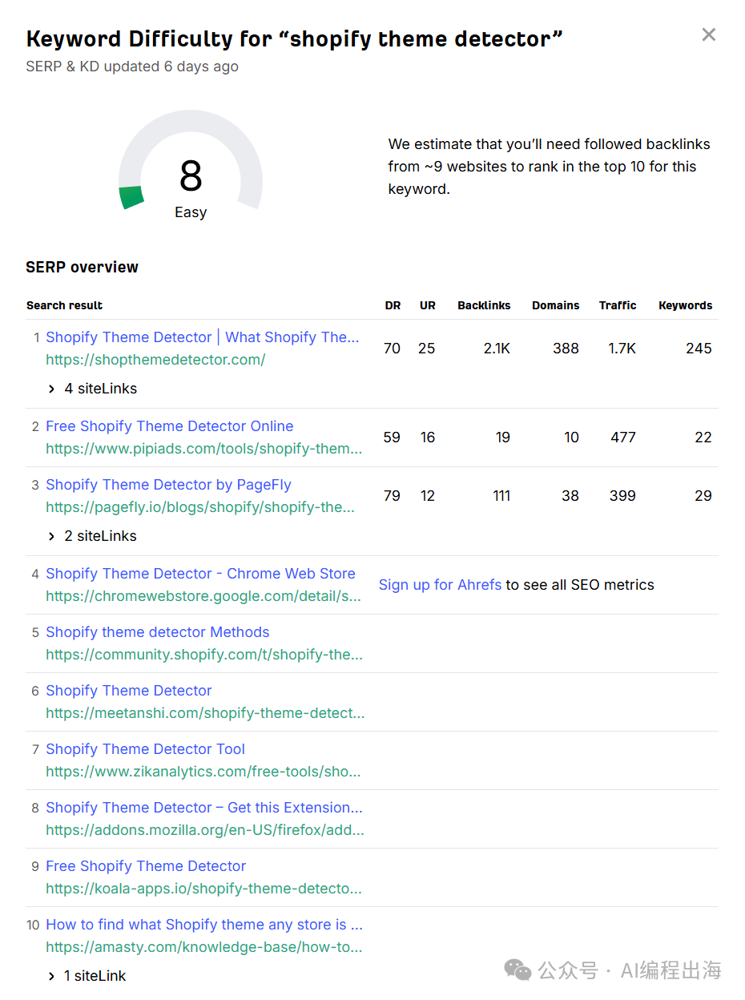

没想到关键词难度只有8，预估只需要9个外链就能做到谷歌的前十。排在第2位和第3位的都是网站内页，排在第4位的是一个谷歌插件，而排在第一位的是一个网站主页：

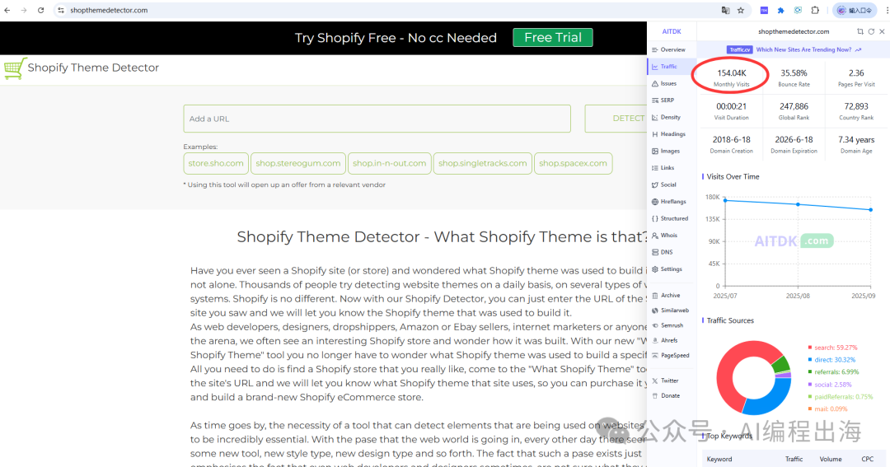

打开可以看到这个网站主要功能就是帮助用户查看Shopify网站使用了什么模板，每个月竟然有15万月访客，令人吃惊！

出海那么难！对于“shopify theme detector”这样的关键词，你觉得值得做一个出海网站吗？
