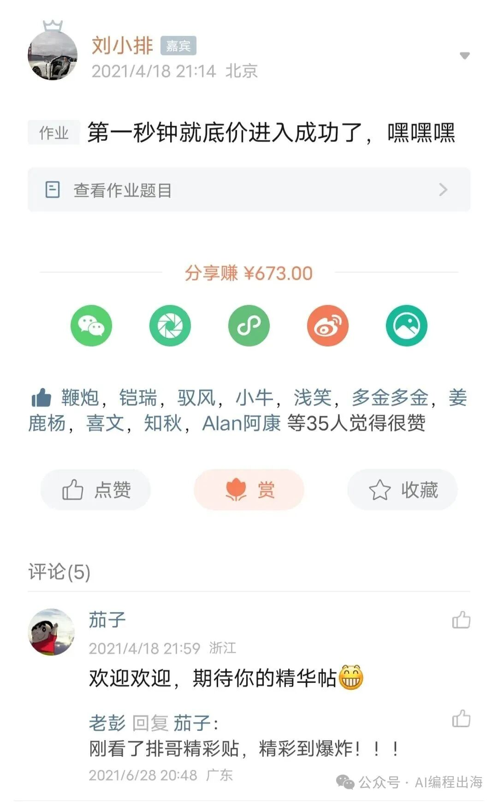

# 出海工具站高手做产品的“不传”心法

前面的文章：

出海工具站高手是怎样挖掘产品需求的？

我通过总结生财有术的精华文章和哥飞社群的所见所闻，给大家整理了挖掘出海产品需求的7种方法。在文末，我还附上刘小排老师做产品的终极秘密：做一个产品之前，先问清楚自己：什么人？在什么场景下？愿意花多少钱？解决什么问题？

本文我们就从这个终极秘密开始，给大家讲讲出海高手做产品的心法。

以下内容部分节选自生财有术的精华文章，大家有兴趣请到生财有术查看原文：

> 刘小排：洞察创业机会，从“寻找哈尔滨程序员”开始链接：https://t.zsxq.com/KeonA

刘小排：洞察创业机会，从“寻找哈尔滨程序员”开始

链接：https://t.zsxq.com/KeonA

> 刘小排：什么产品好做？三个—链接：https://t.zsxq.com/13yN8

刘小排：什么产品好做？三个—

链接：https://t.zsxq.com/13yN8

> 子木：独立开发如何赚得比工资多：从选品到营销，干就完了！链接：https://t.zsxq.com/q6VGt

子木：独立开发如何赚得比工资多：从选品到营销，干就完了！

链接：https://t.zsxq.com/q6VGt

> 子木：6个步骤：做niche海外软件工具正确的方法链接：https://t.zsxq.com/pjSZY

子木：6个步骤：做niche海外软件工具正确的方法

链接：https://t.zsxq.com/pjSZY

1、想清楚是想“做个产品”还是“赚到钱”

所有参加过刘小排老师的深海圈的生财圈友对这个表情包一定不会陌生，这是小排老师结合自己在产品领域的经验总结出来的产品方法论：

当我们找到一个需求，先别着急开发产品，而是要先问问自己：“什么人？在什么场景下？愿意花多少钱？解决什么问题？”这将有助于我们想清楚用户的实际痛点、细分场景和付费意愿。

圈友子木在他的文章中也提到类似的思考：

> 先想清楚：你到底是想“做个产品”还是“赚到钱”？很多开发者上来就拍脑袋：“我有个好想法！”但真相是，好想法≠能赚钱。所以，别自己闭门造车，先搞清楚：- 谁愿意为你的产品掏钱？（目标用户是谁？）- 别人现在用什么解决方案？（有没有竞品？用户为啥要换你的？）- 有没有足够大的市场？刚不刚需，高不高频（别做太冷门的东西，赚不到钱）

先想清楚：你到底是想“做个产品”还是“赚到钱”？

很多开发者上来就拍脑袋：“我有个好想法！”但真相是，好想法≠能赚钱。所以，别自己闭门造车，先搞清楚：

- 谁愿意为你的产品掏钱？（目标用户是谁？）

- 别人现在用什么解决方案？（有没有竞品？用户为啥要换你的？）

- 有没有足够大的市场？刚不刚需，高不高频（别做太冷门的东西，赚不到钱）

2、寻找你的“哈尔滨程序员”

刘小排老师是在2021年4月18日加入了生财有术：

他早期发布的文章中提到的“蓝海选品”和“烤红薯”理论影响了我们许多圈友在各行各业的选品思路，尤其是其在航海中给我们讲述的“哈尔滨程序员”的故事更是深深地给我们许多圈友种下“蓝海思维”的种子。

故事要回到2011年的小排老师所在的公司金山网络（节选自刘小排老师的文章）：

一天，傅盛的“侦察兵”团队发现，在美国谷歌安卓市场的排行榜前三，有一款叫做“*** Task Killer”的工具型App（全名隐去）。它的功能非常简单，点一下按钮，就能杀死手机多余的任务进程。就这？对！就这！ 谷歌官方手机应用排行榜前三！这有什么用呢？有用。它解决了当时安卓手机最大的痛点——卡！

如此小型的App、如此简单的功能，竟然能排到美国谷歌市场总榜前三的位置！不可思议。进一步调研，发现还有更不可思议的事情——这款App，是中国哈尔滨的一个程序员，用自己的业余时间做的！

据说，金山网络对其提出了收购邀约，不过后来没有谈成。于是，一个史诗级的重大决策呼之欲出：某哈尔滨程序员能做到安卓手机App排行榜前三，那该领域的数百人专家团队、举全公司之力，岂不是能做到更大？

后来的事大家都知道了。金山网络做出了著名的Clean Master，巅峰时期日活超过亿（那时全世界一共只有十亿台安卓手机）；由于Clean Master是移动端产品，再结合当时自己有口碑有用户量的成功产品“猎豹浏览器”，“金山网络”改名叫“猎豹移动”，在很短的时间内完成了纳斯达克上市。

我们创业，不管是做出海产品，还是做电商卖货，都应该先选择我们的“哈尔滨程序员”。

小排老师在文中有进一步说明：时常拷问自己，在这个领域内，有没有人小米加步枪、产品特别简单、营销特别简单、能力特别普通，当然竟然能够赚到钱的？如果有，那么，它就是蓝海。如果它还碰巧是你的专业领域，你能够在各方面碾压这位“哈尔滨程序员”，那它就是你的专属机会。

类似的思路在生财有术的许多项目中都得到了验证，比如寻找“低粉爆款”视频，寻找“低粉爆款”文章等等。子木也提到：去AppStore、GooglePlay、Product Hunt、Reddit、Toolify收入榜单这些地方，看别人对竞品的差评，看看他们骂得最多的点，就是你优化的方向。

3、做垂直细分而不是大而全

“垂直细分”是目前很多领域都被提及的巨大机会。无论是哥飞老师所提倡的“举全站之力做一个关键词”，还是跨境电商中经常提及的单品策略，亦或近一年公众号井喷涌现的各个细分领域的优质内容，都是垂直深耕某个细分领域，给某一类特定的人群提供他们最需要的产品、内容和服务。

我们做出海产品也一样，做通用的AI生成图片网站竞争很大，但如果进一步细分：生成吉卜力图片、生成头像、老照片修复、模特换妆、装修效果图等等，只要进入更细分的领域，也许会豁然开朗。

小排老师在文中提及：在一个针尖大的领域，做到天下第一。是的，想做Number One非常难。对于草根创业者来说，这条路径相对容易的操作方法是：针尖上跳舞。和普罗大众的思路正好相反，要成为Number One，我们要的不是多，而是少，舍九取一。只在针尖上跳舞，在针尖大的领域内，做到天下第一。

4、依托大平台做其周边

每个时代都有每个时代的各大平台，这些平台在占据用户市场的同时也溢出了许多平台周边的机会。淘宝做大了，出现了店铺装修市场、模特市场、返利网站等；微信做大了，出现了公众号、视频号以及相关服务市场等；Shopify做大了，出现了Shopify模板市场和店铺服务等等。

子木在文中提及：只要你找到Top200个大平台x每个平台不会做、但用户很想要的东西，你就赢一半了！那起码有1万个需求！但记住顺着平台做周边，长期主义！比如：微信不做多开？立刻有人做了“多开工具”；Notion功能不够强？各种Notion插件出来了；ChatGPT不能自动整理摘要？立刻就有人做AI摘要工具。

以上是我阅读生财有术中小排老师和子木圈友的文章后整理的高手做出海产品的心法。如果你还有其它做出海产品的心得，欢迎补充！
